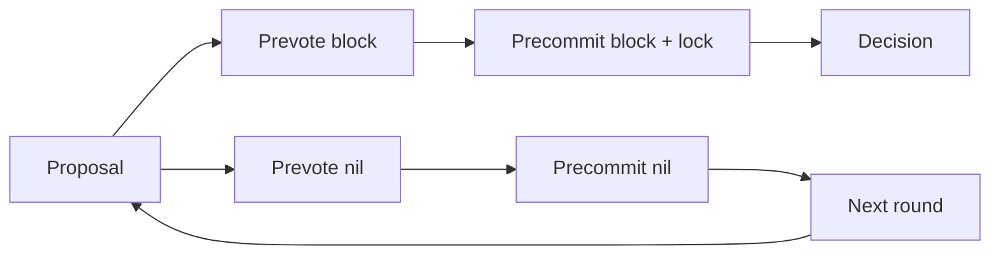

# Myelin consensus completeness

## Scope

Myelin exposes two finite-session, closed-validator engines:

```text
ConsensusKind::StaticClosedCommittee
ConsensusKind::Tendermint
```

Neither is a permissionless consensus claim. CKB remains the L1 custody,
publication and court layer.

## Static closed committee

`StaticClosedCommittee` verifies a block-bound set of secp256k1 Schnorr
signatures against configured validator weights. It rejects unknown or
duplicate validators, zero weight, invalid keys/signatures, wrong block hashes,
wrong engine selection, overflow, and sub-quorum certificates.

## Tendermint

The canonical config name is `tendermint`; `weighted-precommit` is accepted as
a migration alias only. A Tendermint quorum must be strictly greater than two
thirds of total voting power.

The deterministic state machine implements:

| Requirement | Implementation evidence |
| --- | --- |
| deterministic weighted proposer | `Tendermint::proposer_id(height, round)` |
| signed proposal | proposal domain binds height, round, block, valid round and proposer |
| signed prevote and precommit | vote domain binds height, round, step, block-or-nil and validator |
| nil votes | `block_hash: Option<Hash32>` |
| lock rule | `locked_value` and `locked_round` persist across round changes |
| valid-round unlock | proposal `valid_round` requires retained greater-than-two-thirds prevotes |
| round change | `advance_round` retains lock and valid value |
| equivocation rejection | conflicting proposal/vote by one validator at one round/step returns `Equivocation` |
| crash recovery shape | `TendermintRoundState` serializes and round-trips as a WAL record |
| decision | greater-than-two-thirds precommits for one block produce `TendermintDecision` |
| finalisation | `finalise_block_with_decision` rechecks height, block hash, vote signatures and power |



The final portable certificate carries signed precommits. Proposal and prevote
transitions are runtime/WAL evidence; they do not need to be duplicated in the
final decision certificate.

## Configuration

```toml
kind = "tendermint"

[tendermint]
quorum_power = 3

[[tendermint.validators]]
id = "validator-0"
public_key = "79be667ef9dcbbac55a06295ce870b07029bfcdb2dce28d959f2815b16f81798"
weight = 1

# Three more equal-power validators omitted here; 3 of 4 reaches >2/3.
```

## Validation

```bash
cargo test --locked -p myelin-consensus
cargo test --locked -p myelin-cli
```

The focused Tendermint suite covers a successful full round, nil quorum and
round advance, lock retention, equivocation, invalid proposer/signature,
serializable state recovery, unsafe quorum rejection, and exact decision
finalisation. CLI session and runtime tests execute the full round path and
assert consensus-independent CellTx/state roots.

## Remaining network/runtime work

The deterministic protocol core does not itself provide networking, peer
authentication, timeout scheduling, durable filesystem/database WAL I/O,
validator-set updates, evidence gossip/slashing, or permissionless membership.
Those are explicit runtime/operations layers, not silently claimed features.
