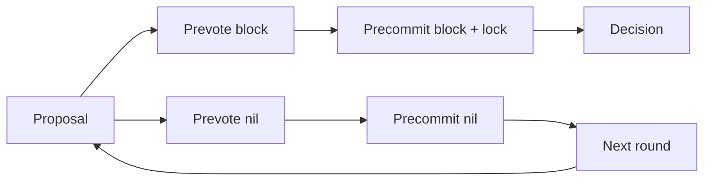

# Myelin consensus completeness

## Scope

Myelin exposes three finite-session, closed-validator/authority engines:

```text
ConsensusKind::StaticClosedCommittee
ConsensusKind::ProofOfAuthority
ConsensusKind::Tendermint
```

Neither is a permissionless consensus claim. CKB remains the L1 custody,
publication and court layer.

## Static closed committee

`StaticClosedCommittee` verifies a block-bound set of secp256k1 Schnorr
signatures against configured validator weights. It rejects unknown or
duplicate validators, zero weight, invalid keys/signatures, wrong block hashes,
wrong engine selection, overflow, and sub-quorum certificates.

## Proof of authority

`ProofOfAuthority` preserves the configured authority order and selects
`authorities[height mod authority_count]`. A typed `ProofOfAuthoritySeal` binds
the canonical block hash, height, authority id, and an independent Schnorr
signature domain. Construction and verification reject empty authority sets,
duplicate ids or public keys, invalid keys, an unscheduled signer, signer/key
mismatch, and height/hash/signature drift.

PoA optimizes operational simplicity, not Byzantine fault tolerance: one
scheduled authority can halt a height, and a compromised scheduled key can
finalise a bad session block unless higher-layer court/custody controls catch
it. It is therefore a closed-authority option, not a security upgrade over the
other engines.

## Tendermint

The canonical config name is `tendermint`; `weighted-precommit` is accepted as
a migration alias only. A Tendermint quorum must be strictly greater than two
thirds of total voting power.

The deterministic state machine implements:

| Requirement | Implementation evidence |
| --- | --- |
| deterministic weighted proposer | `Tendermint::proposer_id(height, round)` |
| signed proposal | proposal domain binds height, round, block, valid round and proposer |
| signed prevote and precommit | vote domain binds height, round, step, block-or-nil and validator |
| nil votes | `block_hash: Option<Hash32>` |
| lock rule | `locked_value` and `locked_round` persist across round changes |
| valid-round unlock | proposal `valid_round` requires retained greater-than-two-thirds prevotes |
| round change | `advance_round` retains lock and valid value |
| equivocation rejection | conflicting proposal/vote by one validator at one round/step returns `Equivocation` |
| crash recovery shape | `TendermintRoundState` serializes and round-trips as a WAL record |
| decision | greater-than-two-thirds precommits for one block produce `TendermintDecision` |
| finalisation | `finalise_block_with_decision` rechecks height, block hash, vote signatures and power |



The final portable certificate carries signed precommits. Proposal and prevote
transitions are runtime/WAL evidence; they do not need to be duplicated in the
final decision certificate.

## Configuration

PoA:

```toml
kind = "proof-of-authority"

[proof_of_authority]

[[proof_of_authority.authorities]]
id = "validator-0"
public_key = "79be667ef9dcbbac55a06295ce870b07029bfcdb2dce28d959f2815b16f81798"
```

Tendermint:

```toml
kind = "tendermint"

[tendermint]
quorum_power = 3

[[tendermint.validators]]
id = "validator-0"
public_key = "79be667ef9dcbbac55a06295ce870b07029bfcdb2dce28d959f2815b16f81798"
weight = 1

# Three more equal-power validators omitted here; 3 of 4 reaches >2/3.
```

## Validation

```bash
cargo test --locked -p myelin-consensus
cargo test --locked -p myelin-cli
```

The PoA suite covers rotation, config validation, signer schedule and key
matching, typed dispatch, and tampered height/hash/signature rejection. The
focused Tendermint suite covers a successful full round, nil quorum and
round advance, lock retention, equivocation, invalid proposer/signature,
serializable state recovery, unsafe quorum rejection, and exact decision
finalisation. CLI Session and runtime tests exercise all three engines and
assert consensus-independent CellTx/state roots.

## Remaining network/runtime work

The deterministic protocol core does not itself provide networking, peer
authentication, timeout scheduling, durable filesystem/database WAL I/O,
validator-set updates, evidence gossip/slashing, or permissionless membership.
Those are explicit runtime/operations layers, not silently claimed features.
