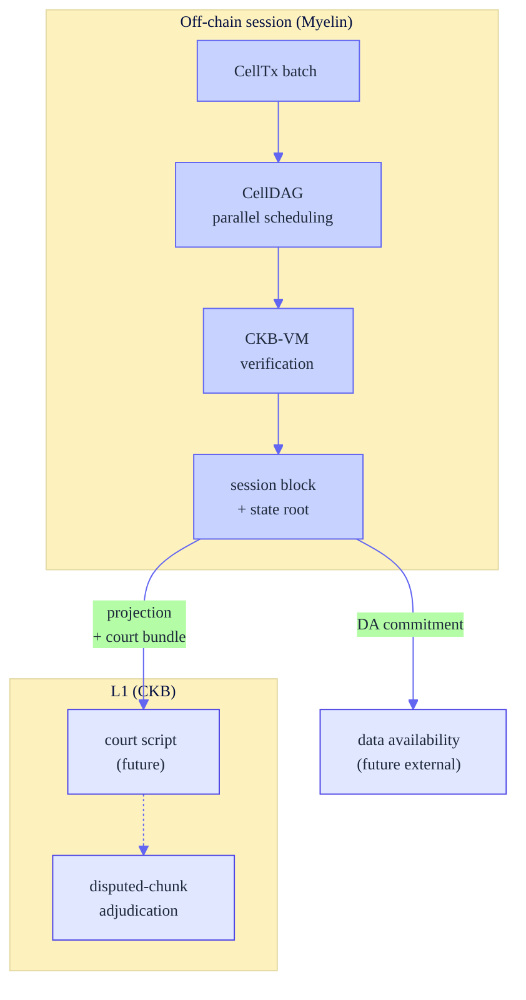
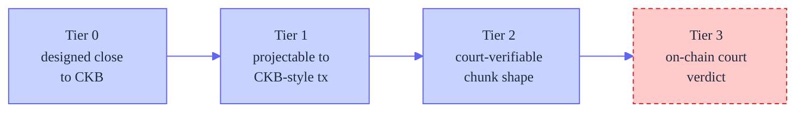

# Myelin

<p align="center">
  <strong>A CKB-aligned off-chain session runtime for finite Cell execution.</strong>
</p>

<p align="center">
  Run high-throughput Cell transitions off-chain, keep them finite and typed,
  and emit evidence that can be inspected and projected toward CKB-style
  transaction contexts.
</p>

<p align="center">
  <em>not a CKB full node · not a new L1 · not a finished permissionless L2</em>
</p>

---

## What problem does Myelin solve?

CKB-VM is now powerful enough to run complex, real-time logic — [xxuejie's
*Teeworlds on CKB* experiment](https://xuejie.space/2026_06_16_teeworlds_on_ckb/)
proved a full multiplayer game can execute inside the VM as a single chunk.
But proving *one chunk executes* is not the same as running *a session*:
you still need to schedule many chunks, finalise them into a block, dispute
a bad chunk, and project the result back to L1. That session-and-evidence
layer is what xuejie explicitly deferred, and it is what Myelin builds.

Myelin is the off-chain runtime that sits **above** a single verified chunk:

```mermaid
%%{init: {
  "theme": "base",
  "themeVariables": {
    "primaryColor": "#A5B4FC",
    "primaryTextColor": "#1E293B",
    "primaryBorderColor": "#4F46E5",
    "lineColor": "#6366F1",
    "secondaryColor": "#C7D2FE",
    "tertiaryColor": "#C7D2FE",
    "fontFamily": "Inter, system-ui, sans-serif",
    "fontSize": "14px"
  },
  "flowchart": { "curve": "basis", "padding": 12 }
}}%%
flowchart LR
    A["CellScript source"]:::source
    B["typed-cell metadata<br/>+ VM artefact"]:::artefact
    C["CellTx<br/>(Myelin)"]:::tx
    D["CellDAG<br/>scheduler"]:::sched
    E["Deterministic<br/>VM verification"]:::vm
    F["Session Cell<br/>state root"]:::state
    G["Evidence bundle<br/>(projection · DA ·<br/>court · settle)"]:::evidence

    A --> B --> C --> D --> E --> F --> G
    F --> C

    classDef source   fill:#A5B4FC,stroke:#4F46E5,color:#1E293B;
    classDef artefact fill:#C7D2FE,stroke:#6366F1,color:#1E293B;
    classDef tx       fill:#C7D2FE,stroke:#4F46E5,color:#1E293B;
    classDef sched    fill:#C7D2FE,stroke:#6366F1,color:#1E293B;
    classDef vm       fill:#A5B4FC,stroke:#4F46E5,color:#1E293B;
    classDef state    fill:#C7D2FE,stroke:#6366F1,color:#1E293B;
    classDef evidence fill:#C7D2FE,stroke:#7C3AED,color:#1E293B;
```



Every box on that spine is a real crate in this workspace.

## How it stays close to CKB

CKB uses the **Cell Model**, not an account model: a transaction consumes live
Cells and creates new Cells; state changes happen through Cell replacement.
Cells carry data, a lock script, and an optional type script, and scripts run
in CKB-VM. Myelin follows that mental model — it does not hide session state
inside an account-style contract. Instead it treats off-chain execution as a
**finite Cell session** that can always report:

- what Cells were consumed or created,
- which lock/type-script-like rules were checked,
- which VM/profile assumptions were used,
- whether the transition can be projected into a CKB-style context,
- and which evidence would be relevant during a dispute.



Official CKB references:
[docs map](https://docs.nervos.org/llms.txt) ·
[Cell Model](https://docs.nervos.org/docs/ckb-fundamentals/cell-model) ·
[CKB-VM](https://docs.nervos.org/docs/ckb-fundamentals/ckb-vm)

## Demo

Two runnable demos, from zero-dependency to the full reference workload:

| | Demo | What it shows | Needs |
| --- | --- | --- | --- |
| ① | **[First run](docs/getting-started/first-run.md)** | CellTx → session open → commit → court bundle → DA manifest, all local | Rust only |
| ② | **[Teeworlds end-to-end](docs/tutorials/teeworlds-end-to-end.md)** (flagship) | xxuejie's CKB-VM replayer through Myelin's verifier, chunked, projected to CKB, court bundle (22 checks) | teeworlds fork + built replayer |

To see the **CellDAG + parallel VM verification** path, run
`session commit-multi` after the first-run demo (see the
[concurrency plan](docs/operations/concurrency-optimization-plan.md)).

## Quick Start

Prerequisites: a Rust toolchain (1.85+), Python 3, and optionally Node.js/npm
for the website.

```bash
# verify the workspace builds and tests pass
cargo check --locked --workspace --all-targets
cargo test --locked --workspace
cargo clippy --locked --workspace --all-targets -- -D warnings

# generate a simple CellTx report
cargo run -p myelin-cli -- celltx simple-report

# open a deterministic session, commit a chunk, build + verify a court bundle
cargo run -p myelin-cli -- session open-fixture --consensus static-closed-committee --out /tmp/open.json
cargo run -p myelin-cli -- session commit-fixture --session /tmp/open.json --out /tmp/commit.json
cargo run -p myelin-cli -- session court-bundle --commit /tmp/commit.json --chunk-index 0 --out /tmp/court.json
cargo run -p myelin-cli -- session verify-court-bundle --bundle /tmp/court.json --out /tmp/court-verify.json
```

The full local production gate (broad; includes the Teeworlds acceptance gate
when the teeworlds checkout is present):

```bash
scripts/myelin_production_gate.sh
```

## What is in this repository

| Path | Role |
| --- | --- |
| `exec/` | Cell transactions, script verification, VM/syscall glue, scheduler witnesses, and **CellDAG** conflict scheduling. |
| `state/` | Live Cell state roots (incremental MuHash) and data-availability proof primitives. |
| `mempool/` | Cell transaction pool and deterministic conflict scoring. |
| `consensus/` | Static closed committee and Tendermint-style weighted precommit finality. |
| `cli/` | Command-line fixtures and report generation for CellTx, session, DA, settlement, and submission flows. |
| `cellscript/` | CellScript compiler, vendored in sync with upstream (0.21.1). Myelin's typed-cell model lives in `exec/`, not in a compiler fork. |
| `docs/` and `MYELIN_*.md` | Architecture notes, evidence reports, positioning, and rehearsal records. |
| `website/` | Myelin marketing/docs landing site (Astro). |

Support crates live under `core-utils/`, `crypto/`, and `math/`.

## Security boundary (read before relying on this)

Myelin's current fast paths use **closed-validator finality** — useful for
benchmarking and pressure testing, **not** a permissionless security claim.



Today Myelin sits at **Tier 2**. See the
[claim ladder](docs/security/claim-ladder.md) for the full boundary, and
[Continuing the Teeworlds-on-CKB line](docs/releases/teeworlds-lineage.md)
for how this relates to xuejie's work.

## Where Myelin fits in the research line

[xxuejie proved](https://xuejie.space/2026_06_16_teeworlds_on_ckb/) complex
real-time logic runs inside CKB-VM and explicitly deferred the
session/trust/dispute layer. Myelin builds exactly that layer — the off-chain
runtime above a verified chunk. We do **not** improve on the in-VM work; we
reuse the replayer binary unchanged. See
[Continuing the Teeworlds-on-CKB line](docs/releases/teeworlds-lineage.md)
for the full positioning, and
[*Teeworlds reproducibility*](MYELIN_TEEWORLDS_REPRODUCIBILITY.md) for the
measured values (`tape_bytes: 2162`, `vm_cycles: 15,139,695`,
`court_checks: 22`).

## Evidence & reports

Start with these documents when reviewing the protocol state:

- `MYELIN_PRODUCTION_GATE.md` · `MYELIN_PRODUCTION_REHEARSAL_REPORT.md`
- `MYELIN_TEEWORLDS_REPRODUCIBILITY.md` · `MYELIN_USE_CASE_POSITIONING.md`
- `docs/MYELIN_ARCHITECTURE.md` · `docs/TEEWORLDS_FIXTURE.md`
- [`docs/releases/nervos-talk-introducing-myelin.md`](docs/releases/nervos-talk-introducing-myelin.md) — the canonical public introduction (Nervos Talk draft)

For CellScript upstream parity:

```bash
scripts/check_cellscript_parent_parity.py
```

## Development notes

- Keep CKB-related claims aligned with the [official CKB docs](https://docs.nervos.org/llms.txt).
- Prefer `ckb-compatible` evidence for public demos.
- Do **not** describe closed-validator fast paths as permissionless L2 security.
- Keep generated reports out of commits unless they are intentional evidence
  artefacts.
- Keep `cellscript/` changes auditable against the parent checkout.

## Licence

MIT. See `LICENSE`.
