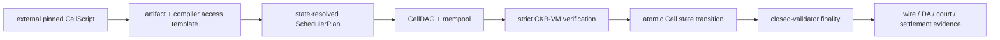

# Myelin

Myelin is an off-chain finite-Cell session runtime that keeps its transaction and VM boundary close to CKB. It is not a CKB full node, a new L1, or a finished permissionless L2.

The retained execution spine is:


```mermaid
flowchart LR
    A["external pinned CellScript"] --> B["artifact + compiler access template"]
    B --> C["state-resolved SchedulerPlan"]
    C --> D["CellDAG + mempool"]
    D --> E["strict CKB-VM verification"]
    E --> F["atomic Cell state transition"]
    F --> G["closed-validator finality"]
    G --> H["wire / DA / court / settlement evidence"]
```

## Current security and compatibility boundary

Myelin currently proves these things locally:

- a `CellTx` uses CKB transaction version `0`, raw-tx identity, CKB Molecule transaction encoding, CKB DepGroup encoding, and CKB-style input/output/dependency shapes;
- every script group can be resolved and executed in an independent CKB-VM instance under one shared transaction cycle budget;
- an admitted state transition was VM-verified and applied atomically from the exact pre-state root;
- the scheduler rejects physical double spends and orders logical read/write conflicts;
- static-committee or weighted-precommit signatures finalise the same canonical session block;
- local DA, court-input, settlement, and RPC-request evidence is hash-bound and reproducible.

The generic `myelin-ckb-adapter` now also produces a fail-closed receipt chain for an exact transaction against an authoritative CKB node. It resolves every input, code/DepGroup dependency, and header dependency under one stable tip; binds the node, chain, genesis, and consensus-rule context; requires `test_tx_pool_accept`; reruns strict local CKB-VM over the same resolved Cells; requires exact-hash submission and observation; verifies the CKB transaction Merkle proof locally; detects canonical-chain replacement; and can advance to a configured confirmation depth.

This path has been exercised against the parent CKB 0.207.0 integration devnet. The production gate also compiles four verifier programs with the exact attested upstream CellScript v0.22.0 compiler, deploys them, accepts valid DA/settlement transitions, rejects tampered payloads and a competing settlement, and checks inclusion, stability, and finality. This is devnet evidence, not a public-testnet deployment or a finished permissionless court. `court_verifiable`, production-readiness, real-DA, threshold-lock, and full court-economics claims remain false where their evidence is absent.

The claim ladder is deliberately monotonic:

```text
rejected
  -> wire-encoded                           (implemented)
  -> context-resolved                       (implemented by CKB adapter)
  -> consensus-validated                    (implemented by CKB node receipt)
  -> scripts-verified in exact CKB context  (implemented by CKB adapter)
  -> node-accepted                          (implemented)
  -> committed                              (implemented with local Merkle-proof verification)
  -> finalized                              (implemented with depth + reorg checks)
  -> exercised public-testnet court verdict (not implemented)
```

`project_cell_tx_to_ckb` itself intentionally stops at `wire-encoded`; higher stages exist only in `CkbEvidenceProjection`, whose linked receipts are recomputed and mutation-checked. No public boolean can raise a stage.

## Scheduler model

`CellDAG` is a transaction scheduler, not part of CKB-VM. It combines two independent hazards:

- physical conflict: two transactions consume the same `OutPoint`; both cannot be admitted;
- logical conflict: different Cells represent the same application object, such as one session or pool.

Logical domains are computed from a validated typed-cell declaration and concrete Cell state:

```text
conflict_hash = BLAKE3(type-script identity || canonical conflict-key value)
```

The conflict key can be a Cell ID, one schema field, or a canonical composite of fields. Source-language binding names are diagnostics only and are never conflict keys. The resulting access matrix is:

| Same conflict hash | Result |
| --- | --- |
| READ + READ | may run in parallel |
| READ + WRITE | ordered |
| WRITE + WRITE | ordered, or one package is removed by admission/RBF |

If all session state is stored in one consumed Cell, the physical `OutPoint` conflict already serialises updates. Logical conflict hashes are valuable when the same object is sharded across different Cells, when reads must coordinate with writes, or when several receipt Cells update one logical session.

## CellScript boundary

CellScript is no longer vendored. `myelin-cellscript-adapter` pins an upstream repository revision and compiler version, verifies a local compiler binary against an attestation, invokes it as a process, and hashes the source, artifact, and metadata.

The compiler supplies an access **template**: operation, CKB source class, source index, and diagnostics. Myelin resolves every access against authenticated live/output Cell state and a registered schema-aware `ConflictKeySpec`. Unresolved, untyped, out-of-bounds, zero-hash, or unexpanded-DepGroup access fails closed.

The current lock is in `cellscript-adapter/cellscript-toolchain.lock.json`. Root development uses the repository toolchain in `rust-toolchain.toml`; rebuilding the independently versioned compiler uses the toolchain named by that lock.

## Repository map

| Path | Role |
| --- | --- |
| `exec/` | `CellTx`, CKB Molecule compatibility, CellDAG, CKB-VM script verification, projection reports |
| `state/` | live Cell state, atomic verified transitions, conflict-domain resolution, DA primitives |
| `mempool/` | atomic admission/RBF with raw-tx identity and pre/post-state proof binding |
| `consensus/` | static closed committee and weighted-precommit finality |
| `cellscript-adapter/` | pinned, attested process boundary to upstream CellScript |
| `ckb-adapter/` | immutable CKB context, validation, VM, acceptance, inclusion, and finality receipts |
| `fixtures/cellscript/` | Myelin-owned CellScript integration fixtures |
| `cli/` | runtime, session, court, DA, settlement, and submission evidence workflows |
| `docs/` and `MYELIN_*.md` | architecture, semantic-deviation register, projection audit, operations |

## Quick start

The repository pins Rust 1.92.0 and tracks the root `Cargo.lock`. Keep dependency updates intentional and use `--locked` for validation:

```bash
cargo check --locked --workspace --all-targets
cargo test --locked --workspace
cargo clippy --locked --workspace --all-targets -- -D warnings
```

Run the local session spine:

```bash
cargo run -p myelin-cli -- session open-fixture \
  --consensus static-closed-committee --out /tmp/open.json
cargo run -p myelin-cli -- session commit-fixture \
  --session /tmp/open.json --out /tmp/commit.json
cargo run -p myelin-cli -- session court-bundle \
  --commit /tmp/commit.json --chunk-index 0 --out /tmp/court.json
cargo run -p myelin-cli -- session verify-court-bundle \
  --bundle /tmp/court.json --out /tmp/court-verify.json
```

Run the merge-readiness gate without the external Teeworlds checkout:

```bash
RUN_TEEWORLDS=0 scripts/myelin_production_gate.sh
```

The gate builds and verifies the exact external compiler installation, then runs the parent-CKB devnet smoke by default. Set `RUN_CKB_DEVNET=0` only when that external checkout is intentionally unavailable.

## Design documents

- `CHANGELOG.md` — version history, shipped capabilities, and known production blockers
- `docs/MYELIN_ARCHITECTURE.md` — current model and trust boundaries
- `MYELIN_CKB_SEMANTIC_DEVIATIONS.md` — deliberate divergence register
- `MYELIN_CKB_PROJECTION_AUDIT.md` — evidence stages, receipt invariants, and current deployment boundary
- `docs/operations/concurrency-optimization-plan.md` — scheduler/concurrency work

## Licence

MIT. See `LICENSE`.
