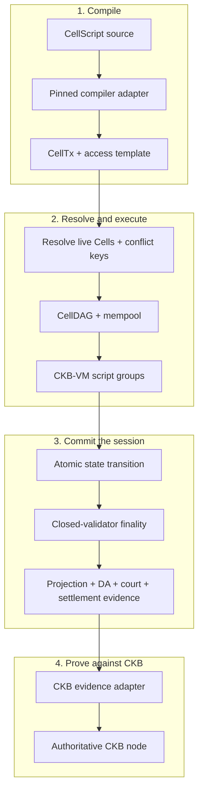
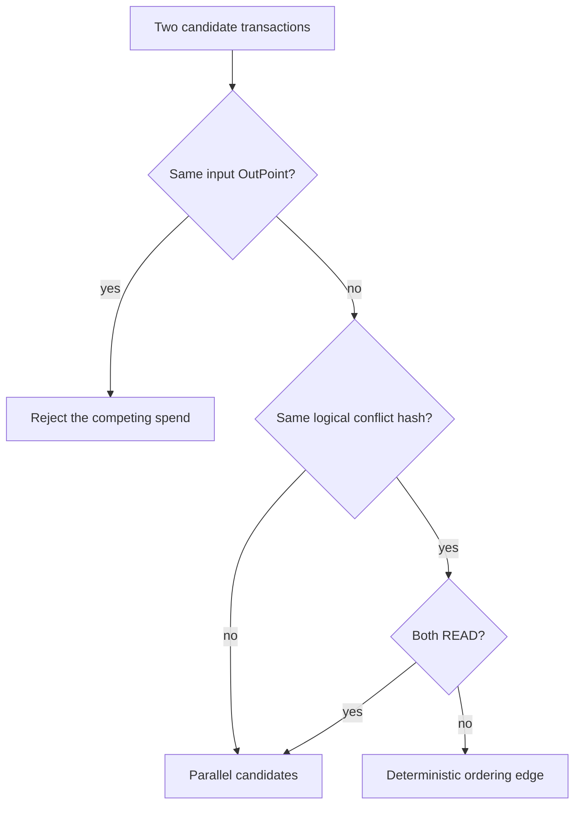
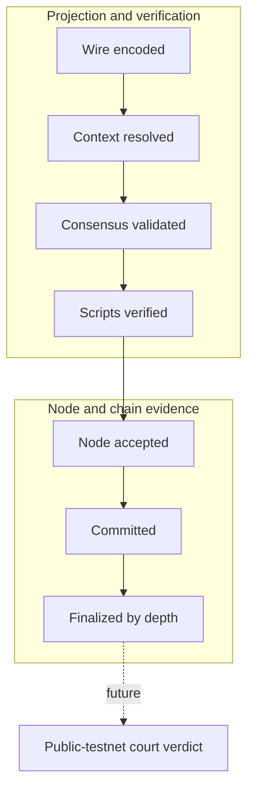

<div align="center">

<h1>Myelin</h1>

<p><strong>An evidence-bound finite-Cell session runtime for CKB</strong></p>

<p>Execute typed Cell transitions off-chain, schedule independent work in parallel, verify every script group in CKB-VM, and produce evidence that can be checked against CKB.</p>

<p><a href="https://github.com/Myelin-Labs/Myelin/releases/tag/v0.10.0">v0.10.0</a> · <a href="#quick-start">Quick start</a> · <a href="docs/MYELIN_ARCHITECTURE.md">Architecture</a> · <a href="CHANGELOG.md">Changelog</a></p>

</div>

> [!IMPORTANT]
> Myelin is a research preview. Its full path has been exercised on a parent CKB 0.207.0 integration devnet, but it is not a CKB full node, a new L1, a public-testnet deployment, or a finished permissionless L2.

## Why Myelin?

CKB already gives applications deterministic Cell transitions and script verification. A long-running off-chain session needs another layer: it must order many transitions, run independent work concurrently, preserve an auditable state lineage, and carry a disputed result back toward L1.

| CKB primitive | Session-level problem | What Myelin adds |
| --- | --- | --- |
| One transaction consumes and creates Cells | A session contains many dependent transitions | Finite `CellTx` blocks with exact pre/post state roots |
| An OutPoint can be consumed only once | Different Cells may still represent one logical object | State-resolved logical conflict keys |
| Lock and type script groups run in CKB-VM | Independent transactions should not all be serialized | CellDAG scheduling with READ/WRITE awareness |
| A node accepts and commits a transaction | Off-chain claims need inspectable provenance | A monotonic CKB evidence receipt chain |

## Architecture at a glance


```mermaid
flowchart TB
    subgraph BUILD["1. Compile"]
        direction LR
        CS["CellScript source"] --> CA["Pinned compiler adapter"] --> TX["CellTx + access template"]
    end

    subgraph EXECUTE["2. Resolve and execute"]
        direction LR
        R["Resolve live Cells + conflict keys"] --> D["CellDAG + mempool"] --> VM["CKB-VM script groups"]
    end

    subgraph COMMIT["3. Commit the session"]
        direction LR
        ST["Atomic state transition"] --> CO["Closed-validator finality"] --> EV["Projection + DA + court + settlement evidence"]
    end

    subgraph PROVE["4. Prove against CKB"]
        direction LR
        AD["CKB evidence adapter"] --> CKB["Authoritative CKB node"]
    end

    TX --> R
    VM --> ST
    EV --> AD
```

The boundaries are intentional:

- **CellScript describes access; Myelin resolves identity.** Compiler metadata is an access template, never a trusted final conflict key.
- **CellDAG schedules transactions; CKB-VM verifies scripts.** Scheduling is outside the VM and does not change script semantics.
- **Consensus finalizes a session result; it does not make execution valid.** VM verification and state transition are consensus-independent.
- **Evidence stages are earned from receipts.** A caller cannot promote a projection with a boolean flag.

## Quick start

The repository pins its Rust toolchain and tracks `Cargo.lock`.

### 1. Check the workspace

```bash
cargo check --locked --workspace --all-targets
cargo test --locked --workspace
```

### 2. Run a complete local session

```bash
cargo run --locked -p myelin-cli -- session open-fixture \
  --consensus static-closed-committee \
  --out /tmp/myelin-open.json

cargo run --locked -p myelin-cli -- session commit-fixture \
  --session /tmp/myelin-open.json \
  --out /tmp/myelin-commit.json

cargo run --locked -p myelin-cli -- session court-bundle \
  --commit /tmp/myelin-commit.json \
  --chunk-index 0 \
  --out /tmp/myelin-court.json

cargo run --locked -p myelin-cli -- session verify-court-bundle \
  --bundle /tmp/myelin-court.json \
  --out /tmp/myelin-court-verification.json
```

This produces an opened session, a finalized session block, one disputed-chunk input shape, and a verification report. Continue with the [first-run walkthrough](docs/getting-started/first-run.md) for DA and settlement steps, or inspect every command with:

```bash
cargo run --locked -p myelin-cli -- --help
```

## The execution model

### Cells move through an atomic state transition

Myelin consumes live input Cells and creates output Cells. A transition is applied only after every required script group succeeds against the exact resolved context:

```text
S(n+1) = Apply(S(n), verified CellTx)

required pre-state root  = root(S(n))
committed post-state root = root(S(n+1))
```

If verification fails, the state remains `S(n)`.

### Transaction identity separates raw data from witnesses

```text
Myelin CellTx txid = BLAKE3(txid domain || raw transaction fields)
Myelin CellTx wtxid = BLAKE3(wtxid domain || raw fields || witnesses)
Projected CKB hash  = CKB_BLAKE2b(Molecule(raw CKB transaction))
```

Changing a witness changes `wtxid`, but not the raw transaction identity. The projection report records the distinct CKB wire hash instead of pretending the Myelin-native hash is a CKB hash.

### Every CKB script group gets its own VM

For one transaction, Myelin resolves full input Cells, constructs lock and type groups by complete script hash, loads code or dep-group members from `cell_deps`, and executes each group in an independent CKB-VM instance. All groups share one transaction-level cycle budget, and the transaction succeeds only when every group exits with code `0`.

## Conflict scheduling and parallelism

Myelin handles two different hazards:

1. **Physical conflict:** two transactions consume the same `OutPoint`. They are competing spends, so both cannot be admitted.
2. **Logical conflict:** different Cells refer to the same session, pool, order, or other application object. They must be ordered when either access writes.

The logical identity is derived from authenticated Cell state:

```text
conflict_hash = BLAKE3(
  "myelin-typed-cell/conflict-hash/v1"
  || full type-script identity
  || canonical conflict-key value
)
```

| Same `conflict_hash` | Scheduler result |
| --- | --- |
| READ + READ | Run in parallel |
| READ + WRITE | Add an ordering edge |
| WRITE + WRITE | Add an ordering edge, or let admission/RBF keep one package |


```mermaid
flowchart TD
    A["Two candidate transactions"] --> B{"Same input OutPoint?"}
    B -- "yes" --> X["Reject the competing spend"]
    B -- "no" --> C{"Same logical conflict hash?"}
    C -- "no" --> P["Parallel candidates"]
    C -- "yes" --> D{"Both READ?"}
    D -- "yes" --> P
    D -- "no" --> O["Deterministic ordering edge"]
```

When all session state lives in one consumed Cell, the OutPoint rule already serializes writers. Logical conflict keys become important when one object is sharded across Cells or when receipt Cells read and update the same session.

## CKB evidence, not projection-by-assertion

The CKB adapter advances only when the receipt for the next stage can be recomputed and verified:


```mermaid
flowchart TB
    subgraph VERIFY["Projection and verification"]
        direction LR
        W["Wire encoded"] --> R["Context resolved"] --> V["Consensus validated"] --> S["Scripts verified"]
    end

    subgraph CHAIN["Node and chain evidence"]
        direction LR
        N["Node accepted"] --> C["Committed"] --> F["Finalized by depth"]
    end

    S --> N
    F -. "future" .-> P["Public-testnet court verdict"]
```

| Stage | Required evidence |
| --- | --- |
| Wire encoded | Canonical CKB Molecule transaction bytes and raw hash |
| Context resolved | Inputs, code deps, dep-group members, headers, stable tip, chain and consensus identity |
| Consensus validated | Successful authoritative-node `test_tx_pool_accept` receipt |
| Scripts verified | Strict local CKB-VM execution over that exact resolved context |
| Node accepted | Exact-hash submission and observable pool/chain status |
| Committed | Canonical block identity and locally verified CKB transaction Merkle proof |
| Finalized by depth | Canonical re-query, configured confirmations, and reorganization checks |

The pure `project_cell_tx_to_ckb` function intentionally stops at **wire encoded**. Higher claims exist only in `CkbEvidenceProjection` and its linked receipts. Confirmation depth is operational finality evidence, not a claim of absolute CKB irreversibility.

## CellScript is external and reproducible

The compiler is not vendored. Myelin owns its protocol fixtures and connects to one exact upstream compiler through `myelin-cellscript-adapter`.

| Component | Locked version |
| --- | --- |
| CellScript release | `v0.22.0` |
| CellScript peeled commit | `830b5971237401a74dd7848b200f48b4d2ed79f4` |
| Compiler CKB SDK | v5.1.0 at `1fbf3d4c9b35ef90bdb9e6621a8d26edde6325ce` |
| Lock file | [`cellscript-adapter/cellscript-toolchain.lock.json`](cellscript-adapter/cellscript-toolchain.lock.json) |

The adapter verifies compiler identity, source revision, target profile, metadata schema, and source/artifact/metadata digests. Upgrades are explicit lock changes followed by fixture and devnet gates; Myelin never follows a mutable parent branch at runtime.

## What v0.10.0 proves—and what it does not

| Capability | Current status |
| --- | --- |
| Typed Cell execution, state-resolved conflicts, atomic state roots | Implemented and tested |
| Strict local CKB-VM verification with a shared transaction cycle budget | Implemented and tested |
| Static committee, rotating PoA, and full-round Tendermint closed-validator finality | Implemented and tested |
| Exact CellScript v0.22.0 reproduction | Implemented and gated |
| Live CKB admission, commitment, transaction proof, depth, and reorg checks | Exercised on parent CKB 0.207.0 devnet |
| Standard-lock transaction admission and commitment on public CKB testnet | Exercised; full Session/court/DA deployment pending |
| Canonical CKB `secp256k1_blake160_multisig_all` settlement construction and verification | Implemented; public-testnet exercise pending |
| Full disputed-chunk court and economics | Not implemented |
| Provider-neutral DA certificate core | Implemented; real provider/auditor adapters pending |
| Public-testnet deployment | Not exercised |
| Finished trustless or permissionless L2 | **No** |

The main production blockers are a deployed and exercised public-testnet multisig/court path, full court adjudication and economics, real independent DA provider/auditor adapters, public-testnet proof artifacts, unified finalized evidence, broader differential/fuzz/soak testing, safe multi-parent overlays, and production operator key procedures. The DA certificate model is documented in [the DA design](docs/MYELIN_DA_DESIGN.md). See the complete list in the [v0.10.0 changelog](CHANGELOG.md#known-production-blockers).

## Validation

Run the Rust release checks:

```bash
cargo fmt --all --check
cargo check --locked --workspace --all-targets
cargo clippy --locked --workspace --all-targets -- -D warnings
cargo test --locked --workspace
```

Run the comprehensive gate:

```bash
RUN_TEEWORLDS=0 scripts/myelin_production_gate.sh
```

The comprehensive path rebuilds the locked CellScript compiler, compiles all four Myelin fixtures, runs both closed-validator modes, exercises the Session L2 spine, and deploys valid and adversarial DA/settlement transactions to the parent CKB devnet. Set `RUN_CKB_DEVNET=0` only for an explicitly reduced run. The external Teeworlds acceptance requires its separate repository and prebuilt replayer.

## Repository guide

| Path | Start here when you want to… |
| --- | --- |
| [`exec/`](exec) | inspect `CellTx`, CellDAG, CKB-VM execution, or projection reports |
| [`state/`](state) | inspect live Cell state, atomic transitions, conflict resolution, or DA primitives |
| [`mempool/`](mempool) | inspect admission, fee/conflict scoring, or atomic RBF |
| [`consensus/`](consensus) | inspect closed-validator signatures and finality |
| [`ckb-adapter/`](ckb-adapter) | produce or verify authoritative CKB evidence receipts |
| [`cellscript-adapter/`](cellscript-adapter) | inspect the pinned compiler process boundary |
| [`fixtures/cellscript/`](fixtures/cellscript) | inspect Myelin-owned verifier sources |
| [`cli/`](cli) | run session, court, DA, settlement, and CKB evidence workflows |

## Documentation

| Question | Document |
| --- | --- |
| How do I run the whole local flow? | [First-run walkthrough](docs/getting-started/first-run.md) |
| What is the complete data and control model? | [Architecture](docs/MYELIN_ARCHITECTURE.md) |
| Where does Myelin deliberately differ from CKB? | [Semantic deviations](MYELIN_CKB_SEMANTIC_DEVIATIONS.md) |
| How are evidence stages verified? | [CKB projection audit](MYELIN_CKB_PROJECTION_AUDIT.md) |
| How does the compiler boundary work? | [CellScript integration](docs/architecture/cellscript.md) |
| How do I use every CLI command? | [CLI reference](docs/operations/cli.md) |
| What does the merge-readiness gate run? | [Production gate](docs/operations/production-gate.md) |
| What changed in v0.10.0? | [Changelog](CHANGELOG.md) |

## License

MIT. See [LICENSE](LICENSE).
