# Myelin × CellFabric — 架构对位与配合发展文档

> **单一权威来源**。本文合并并取代了原先的
> `audits/cellscript-vs-cellfabric/COMPARISON_AND_COLLABORATION.md`(已删除)。原 COMPARISON
> 的全部事实核 + 技术细节已吸收进 §A,分析框架被本文重写。
>
> 双主角视角。Myelin ↔ CellFabric 正面对位,不把任何一方当 CellScript 桥的附庸。
> 原文档的隐含立场是"CellScript ↔ CellFabric 是主角,Myelin 是来填缝的第三方",本文反过来——
> **Myelin 和 CellFabric 才是要决定怎么相处的两个独立项目,CellScript 是它们共同的上游工具**。
>
> 两份 side report 保留作深度参考(它们是原始材料,不是这份文档的副本):
> - `audits/cellscript-vs-cellfabric/CELLSCRIPT_SIDE.md`(55KB,CellScript 代码级深度)
> - `audits/cellscript-vs-cellfabric/CELLFABRIC_SIDE.md`(46KB,CellFabric 代码级深度)
> - `audits/cellscript-vs-cellfabric/plan.yaml`(本审计的执行计划)
>
> 写给:需要决定两个项目长期关系的架构师。
> 写法:先讲清"是什么 / 为什么不同",再讲"能不能配合 / 怎么配合",最后给路线。
> 所有结构性 claim 带 file:line。术语用中文说人话,代码引用保持英文原样。

---

## 目录

- [§0 先用一段话讲完](#0-先用一段话讲完)
- [§1 两个项目各自是什么(说人话)](#1-两个项目各自是什么说人话)
- [§2 一张图看懂它们在 CKB 栈里的位置](#2-一张图看懂它们在-ckb-栈里的位置)
- [§3 核心区别:六个硬维度](#3-核心区别六个硬维度)
- [§4 最深的张力:最终性到底归谁](#4-最深的张力最终性到底归谁)
- [§5 现状:两边现在是零接触](#5-现状两边现在是零接触)
- [§6 三条可能的配合路径](#6-三条可能的配合路径)
- [§7 推荐路线与决策点](#7-推荐路线与决策点)
- [§8 红线清单(不许碰)](#8-红线清单不许碰)
- [§9 一句话结论](#9-一句话结论)
- [§A CellScript ↔ CellFabric 桥接技术细节](#a-cellscript--cellfabric-桥接技术细节)
- [附录 A 事实核验证](#附录-a-事实核验证)

---

## §0 先用一段话讲完

**CellFabric 是"调度室",Myelin 是"车间"。**

CellFabric 不持有最终性,只负责把用户签的 intent 排成不打架的 bundle,发一张"软确认"排队小票。Myelin 持有(基准级的、委员会的、可被挑战的)链下最终性,在链下用内嵌的真 ckb-vm 高速跑 Cell 转换,产出争议证据。

两者**不是竞争关系**——CellFabric 不跑 VM,Myelin 不做 intent 排序。两者**也不是简单的上下游**——它们各自独立地连到 CKB L1,各自独立地用 CellScript。它们之间的关系是**两个都在 CKB 之上、各自承担不同关注点、最终都把账算回 CKB 的并行子系统**,中间可以选三种方式对接:薄包装、bundle 层对接、或者保持独立只共享 CellScript 上游。

**最关键的判断:它们能不能深度配合,不取决于 compiler 接缝(那个好填),而取决于一个更硬的问题——如果一套交易同时经过 Myelin 的委员会定稿和 CellFabric 的软确认,那么"这笔到底算不算数"的最终权归谁。** 这个问题现有文档没正面回答。本文 §4 专门处理它。

---

## §1 两个项目各自是什么(说人话)

### 1.1 CellFabric — 调度室

**官方定位**:CKB-settled cell-intent ordering layer,crate `cell-fabric 0.1.1`
(`/Users/arthur/RustroverProjects/CellFabric/Cargo.toml:2-3`)。

**它干什么**:用户签一个"我想交易"的 intent(声明要花哪些 Cell、读哪些 Cell、属于哪个 app
namespace)。CellFabric 把所有 intent 扔进一张有向无环图(`IntentDag`),实时记录谁跟谁打架
(同一个 Cell 不能两个人花 = hard conflict;同一个 AMM 池子 = app conflict),然后从图里挑出一
批互不打架的打包成 `Bundle`,给你发一张"软确认"收据(`BundleReceipt`)。最后它把不会变的
bundle 编译成具体的 CKB 交易,发给 CKB。

**它坚决不干什么**(这是它的身份边界):
- 不持有最终性。软确认收据上硬编码 `non_final = true`(`docs/red-lines.md:10-58`)。软确认
  的意思是"我看见你了、排进队了、没人跟你打架",**不是"钱到账了"**。
- 不跑 VM。它只做 intent 排序 + settlement 编译,不执行脚本逻辑。
- 不做共识。Orderer 选 bundle 是确定性纯函数,**不是共识协议**
  (`docs/red-lines.md:155-180`)。多 orderer 也只是出"可比较的收据",不发明新共识。
- 不是 service binary。它是库 crate,gateway / orderer / submitter / proof service 都构建
  在它之上(`README.md:3-5`)。

**一句话**:CellFabric 是 CKB 之上的**预结算 intent 协调层**,让签名的 cell intent 可见、
可排序、可审计、可编译回 CKB 交易,CKB 独占最终性。

#### CellFabric 内部数据流

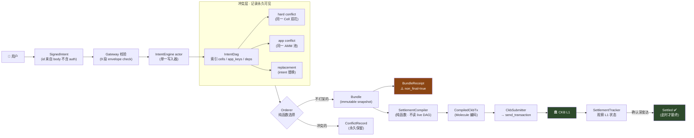

**说人话**:用户签名 → 进调度室 → 排进图里查打架 → 选一批不打架的打包 → 发软确认小票
(⚠️ 不是到账)→ 编译成真 CKB 交易 → 提交 → 等链上确认 → 才算 Settled。整条链路里**只有最后
CKB 确认那一步是真正的最终性**,中间所有"确认"都是进度报告。

### 1.2 Myelin — 车间

**官方定位**:CKB 对齐的 off-chain Cell 会话执行运行时,workspace `myelin-* 0.1.0`
(`/Users/arthur/RustroverProjects/Myelin/Cargo.toml`)。

**它干什么**:在链下高速跑 Cell 状态转换——内嵌了**真正的 ckb-vm**(`Cargo.toml` 依赖
`ckb-vm = 0.24`),能在一秒内跑成千上万次 RISC-V 执行(标志工作负载 Teeworlds 跑了
15,139,695 cycles,见 `MYELIN_PRODUCTION_REHEARSAL_REPORT.md`)。跑完后委员会投票"定稿"
(`StaticClosedCommittee`),产出争议证据包(DA manifest、CKB projection、court bundle)。

**它坚决不干什么**(这也是它的身份边界):
- 不假装是无许可 L2。委员会定稿明确标注是 **benchmarking-only**,不是主网安全
  (`docs/MYELIN_ARCHITECTURE.md:64-71` 的 claim ladder)。
- 不持有 CKB 主网托管。当前是 prototype,`production-evidence-complete prototype /
  public-testnet rehearsal candidate`,不是 `mainnet custody production-ready`。
- 不假装跟 CKB 语义 100% 一致。用 `SemanticProfile` 三值枚举诚实标注每一类转换的偏离程度:
  `myelin-native` / `ckb-compatible` / `ckb-inspired-only`。Teeworlds 工作负载的公开 claim
  是 `ckb-compatible`,不是"完全等价"。

**一句话**:Myelin 是 CKB 对齐的**链下会话执行层**,在链下用真 ckb-vm 高速跑 Cell 转换,
产出可争议裁决的证据,CKB 是最终的托管和裁决层。

#### Myelin 内部数据流

```mermaid
flowchart LR
    SRC[".cell 源码<br/>(Teeworlds / IoT / 流支付)"] --> CS["cellc 编译<br/>(vendored binary)"]
    CS --> ELF["RISC-V ELF<br/>+ metadata sidecar"]
    ELF --> CTX["CellTx<br/>(consume + create cells)"]

    CTX --> POOL["CellPool<br/>准入 + RBF/CPFP<br/>fee_density·α + unlockability·β"]
    POOL --> SCHED["CellDAG scheduler<br/>算并行批次 + 冲突域"]

    subgraph exec["执行层 · 真跑 ckb-vm"]
        SCHED --> VM["ckb-vm 0.24<br/>RISC-V 执行<br/>(Teeworlds: 15M+ cycles)"]
        VM --> REP["ExecutionReport<br/>exit code / cycles / cells"]
    end

    REP --> BLK["MyelinBlock<br/>parent_hash + state_root"]
    BLK --> CON{"ConsensusEngine<br/>(committee 定稿)"}
    CON -->|Static Closed Committee| FIN1["⚠️ 委员会定稿<br/>benchmarking-only"]
    CON -->|Tendermint weighted| FIN2["⚠️ 加权 precommit"]

    FIN1 --> EV["证据包"]
    FIN2 --> EV

    subgraph evidence["证据三件套"]
        EV --> DA["DA manifest<br/>(segment + NMT/KZG 证明)"]
        EV --> PRJ["CkbProjectionReport<br/>(能投影成 CKB tx 吗?)"]
        EV --> CRT["Court bundle<br/>(争议裁决用)"]
    end

    PRJ --> SEM{"SemanticProfile<br/>诚实标注"}
    SEM -->|ckb-compatible| OK1["公开 claim 可以"]
    SEM -->|myelin-native| WARN1["⚠️ 标注偏离"]
    SEM -->|ckb-inspired-only| WARN2["⚠️ 仅供启发"]

    evidence --> CKB["🏛️ CKB L1<br/>(托管 + 裁决)"]

    style FIN1 fill:#8b4513,color:#fff
    style FIN2 fill:#8b4513,color:#fff
    style VM fill:#2d4a2b,color:#fff
    style CKB fill:#2d4a2b,color:#fff
```

**说人话**:源码编译成机器码 → 排进 mempool → scheduler 算怎么并行 → 真跑 ckb-VM → 委员会投票
定稿(⚠️ 只是基准级,可被挑战)→ 产出三件套证据(DA / 投影 / court)→ 诚实标注语义偏离程度 →
最终上 CKB。**委员会定稿不是终点,CKB 裁决才是。** `SemanticProfile` 三值枚举是 Myelin 的诚实
招牌——不把"启发级"的东西当"完全兼容"卖。

### 1.3 一句话对比

### 1.3 一句话对比

| | CellFabric | Myelin |
|---|---|---|
| 干什么 | 排 intent 进 bundle | 跑 Cell 转换 |
| 核心动作 | 冲突检测 + 排序 + 编译 | ckb-vm 执行 + 状态根 + 争议证据 |
| 持有最终性 | ❌ | ⚠️ 基准级委员会 |
| 跑 VM | ❌ | ✅ 真 ckb-vm |
| 链上距离 | 2 跳(intent → bundle → tx) | 1 跳(CellTx → 投影成 CKB tx) |

---

## §2 一张图看懂它们在 CKB 栈里的位置

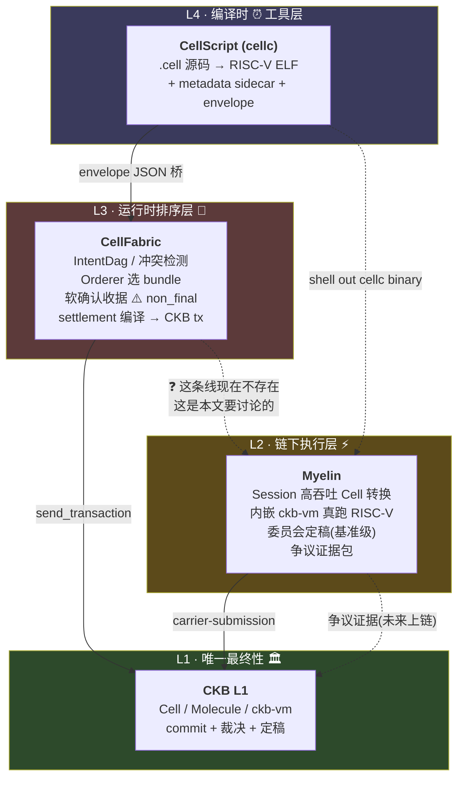

**说人话——把这棵树想象成一栋楼:**

- **L4 CellScript 是图纸设计院**。用户用 `.cell` 语言写"我想让链上发生什么",它编译成
  CKB-VM 能跑的机器码 + 一份说明书(metadata)。它只出图纸,不动工,不管钱。**两个项目
  都用这个设计院,但用法不同**——CellFabric 走 JSON envelope 桥接,Myelin 直接 shell out
  调 `cellc` binary。

- **L3 CellFabric 是工地调度室**。它接收所有用户签的 intent,排成队、查谁跟谁打架、
  挑出一批不打架的打包成 bundle。发一张软确认收据——**别被名字骗了,软确认不是到账**。

- **L2 Myelin 是高速流水线车间**。这里是真正离线高速干活的地方,内嵌真 ckb-vm,能跑
  游戏帧、IoT 计量、流支付。它有自己一套委员会投票定稿,但目前只是基准级。

- **L1 CKB 是唯一真金库 + 法院**。前面三层发的所有"收据""定稿""软确认",在 CKB 真正
  打包确认之前,**都只是承诺,不是事实**。

> **注意图上那条虚线 `CF -.-> MY`(标 ❓)**——这是本文要讨论的核心:**两个项目目前没有
> 任何直接连接**。这条线现在不存在,要不要建、怎么建,是后面所有讨论的主题。

---

## §3 核心区别:六个硬维度

不是"谁更好",是"它们本来就解决不同问题"。

### 六维对位全景图

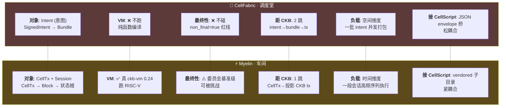

**说人话**:把两个项目沿六个轴对齐,每一对都是**互补不冲突**——CellFabric 不跑 VM 正好让
Myelin 跑,CellFabric 不碰最终性正好让 Myelin 碰(基准级),CellFabric 处理空间并发正好让
Myelin 处理时间序列。这不是"凑合能配合",是"天然分工"。

### 维度 1:处理的"对象"不同

- **CellFabric 处理 intent(意图)**。核心对象:`SignedIntent` → `IntentDag` → `Bundle` →
  `SettlementPlan` → CKB tx。一个 intent 是"用户声明想花哪些 Cell、做哪种 action"。
  (`src/types.rs:552-666`)
- **Myelin 处理 CellTx(Cell 交易)+ Session(会话)**。核心对象:`CellTx` → `MyelinBlock` →
  `MyelinCellState` + `state_root` → 争议证据包。一个 CellTx 是"消耗若干 Cell、创建若干
  Cell"的实际状态转换。(`exec/src/celltx/types.rs`,核心类型)

**说人话**:CellFabric 管"谁想干什么"(意图排序),Myelin 管"真的干了一遍,跑出什么结果"
(执行 + 状态)。

### 维度 2:是否跑 VM

- **CellFabric 不跑 VM**。它的 settlement 编译是**纯函数**(红线 `docs/red-lines.md:122-148`
  强制),输入 immutable bundle snapshot,输出 CKB tx bytes。不执行脚本逻辑。
- **Myelin 内嵌真 ckb-vm**。`ckb-vm = 0.24` 是硬依赖,真正执行 RISC-V 指令(Teeworlds
  跑了 15M+ cycles)。这是 Myelin 最不可替代的能力。

**说人话**:调度室不盖房,只排队;车间真的把砖砌上了墙。

### 维度 3:最终性归属

这是**最硬的区别**,§4 专门展开。先把事实摆出来:

- **CellFabric 不持有任何最终性**。软确认 `non_final = true` 是硬编码红线
  (`docs/red-lines.md:10-58`)。Orderer 选 bundle 是纯函数,不是共识(`red-lines.md:155-180`)。
  多 orderer 也只出"可比较的收据",不发明共识。
- **Myelin 持有基准级委员会最终性**。`StaticClosedCommittee` + Tendermint-style 加权
  precommit(`consensus/src/lib.rs:5-9`),但**明确标注是 benchmarking-only**,不是无许可
  L2 安全(`docs/MYELIN_ARCHITECTURE.md:64-71`)。

**说人话**:CellFabric 连"算不算数"都不碰,它只说"我看见了"。Myelin 碰了"算不算数",
但诚实地告诉你"我现在只是几个委员点头,不是真正不可逆,可以被挑战"。

### 维度 4:跟 CKB 的距离

- **CellFabric 离 CKB 2 跳**:intent → bundle → CKB tx。中间隔一层 settlement 编译。
- **Myelin 离 CKB 1 跳**:CellTx 直接投影成 CKB-style tx(`exec/src/projection.rs`)。

**说人话**:CellFabric 的产物要再编译一次才到 CKB;Myelin 的 CellTx 本身就是 CKB-shape。

### 维度 5:核心工作负载

- **CellFabric 标志工作负载**:转账、launchpad 分配、**AMM 批处理**(`AmmPoolBatchCompiler`
  完整闭环,`src/amm.rs:430-523`)、RFQ。这些都是"一堆 intent 打包成一笔 CKB 交易"。
- **Myelin 标志工作负载**:**Teeworlds 游戏会话**(链下跑 RISC-V 游戏回放验证器)、IoT 计量、
  流支付、AI agent 服务回执(`docs/MYELIN_USE_CASE_POSITIONING.md:76-103`)。这些都是
  "一段时间内连续高速跑很多次状态转换"。

**说人话**:CellFabric 适合"一批金融 intent 批量结算",Myelin 适合"一段会话高频执行"。
工作负载形态根本不同——一个是空间维度(并发打包),一个是时间维度(序列执行)。

### 维度 6:对 CellScript 的接法

两个项目都连 CellScript,但接法完全不同:

| | CellFabric | Myelin |
|---|---|---|
| 接法 | **JSON envelope schema 桥** | **vendored 子目录 + shell out** |
| CellScript 在哪 | 不在仓里,只接 schema | `Myelin/cellscript/` 完整 vendored |
| 版本 | 跟 parent envelope schema 对齐 | `0.20.0-rc.2`,落后 parent 一个 RC |
| 调用方式 | `import_cellscript_intent_envelope` | `cargo run --bin cellc` |
| 是否引 crate | ❌ 严格不引(双向政策) | ❌ 主 workspace 不引(只用 binary) |

**说人话**:CellFabric 跟 CellScript 是"信件往来"(JSON schema),Myelin 跟 CellScript 是
"把整个设计院搬进自己院子"(vendored)。两种接法各有代价——CellFabric 的方式松耦合但表达
力弱,Myelin 的方式紧耦合但能拿到完整编译能力。

---

## §4 最深的张力:最终性到底归谁

**这是现有 `cellscript-vs-cellfabric` 文档没正面回答的问题,也是 Myelin ↔ CellFabric 配合
最大的概念障碍。比 compiler 接缝硬得多。**

### 4.1 张力在哪

#### 张力场景:一笔交易同时经过两个系统

```mermaid
sequenceDiagram
    autonum
    actor U as 👤 用户
    participant CF as CellFabric<br/>(调度室)
    participant MY as Myelin<br/>(车间)
    participant CKB as 🏛️ CKB L1

    U->>CF: 签 intent
    CF->>CF: IntentDag 索引
    CF->>CF: Orderer 选 bundle
    CF-->>U: 软确认 ⚠️ "排进队了"

    CF->>MY: 交付 bundle (假设集成)

    rect rgb(255, 230, 200)
    Note over MY: 委员会跑执行 + 定稿
    MY->>MY: 内嵌 ckb-vm 执行
    MY->>MY: StaticClosedCommittee 投票
    MY-->>MY: ⚠️ "我们定稿了"
    end

    Note over CF,MY: 🚨 谁说了算?<br/>CF 说软确认≠最终性<br/>MY 说委员会定稿了<br/>两者语义层不同!

    MY->>CKB: 提交 + 证据包
    Note over CKB: 只有这里 = 真最终性 ✅
    CKB-->>U: 确认(不可逆)

    Note over U: 用户视角:<br/>CF 软确认(毫秒)→<br/>MY 定稿(秒)→<br/>CKB 确认(分钟)<br/>三个"承诺"强度递增
```

设想一个场景:一套交易同时经过两个系统——

1. 用户签 intent,CellFabric 排进 bundle,发软确认
2. 这个 bundle 的执行被交给 Myelin,Myelin 在链下跑完,委员会定稿
3. CKB 最终确认

**问题**:在第 2 步,Myelin 说"我们委员会定稿了,算数";但 CellFabric 红线说"软确认不是
最终性,orderer 不是共识 actor"。**这两个说法矛盾吗?谁说了算?**

这不是文字游戏,是真实的架构冲突点:

- 如果**最终性归 Myelin 委员会**,那么 CellFabric 的软确认就是多余的安全戏,而且违反
  CellFabric "orderer ≠ consensus" 的红线——因为这时候真正"算数"的是 Myelin 委员会,
  CellFabric 的 bundle 选择只是个排序建议。
- 如果**最终性归 CKB L1**(两边都这么说),那么 Myelin 委员会定稿**也只是建议**,不是
  真正的最终性——这跟 Myelin 当前的 `StaticClosedCommittee` 定位是吻合的(它本来就自陈
  benchmarking-only),但意味着**两个系统的"中间态承诺"都不是真最终性**,真正的最终性
  永远只在 CKB。

### 4.2 诚实的答案:它们不矛盾,但需要明确分层

好消息是,**两个项目的红线其实已经把答案写好了**——只是需要明确"承诺强度阶梯":


**关键洞察:Myelin 委员会定稿和 CellFabric 软确认不在同一个语义层,它们不竞争"算不算数"。**

- CellFabric 软确认是**关于 intent 的**——"这个 intent 进了 bundle,没跟人冲突"。
  它对"这笔交易最终会不会成功"不做承诺。
- Myelin 委员会定稿是**关于执行的**——"这段会话执行完毕,状态根是 X,我们几个委员同意"。
  它对"链下执行结果对不对"做承诺(但承诺本身可被挑战)。

**所以正确的分层是**:CellFabric 管"intent 排序的可见性",Myelin 管"执行结果的对错"。
两者都在 CKB 之上做中间态承诺,但**承诺的对象不同**,所以不矛盾。**真正的最终性永远只在
CKB**,两个项目在这点上是一致的(都是红线)。

### 4.3 但有一条隐患:orderer 不能变成共识代理

#### 正确 vs 错误的集成姿势

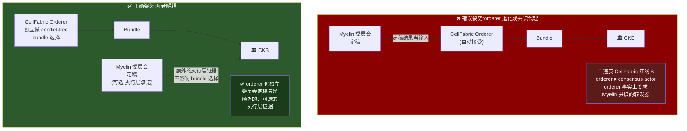

**说人话**:左边是陷阱——如果实现成"Myelin 定稿的 bundle 自动被 CellFabric 接受",那调度室就
变成了车间的传声筒,违反 CellFabric 红线。右边是正确做法——调度室独立排队,车间定稿只是
**额外证据**,不影响排队结果。**两者解耦,各干各的,最后都交给 CKB。**

如果两者深度集成,出现一个陷阱:**别让 CellFabric 的 orderer 退化成 Myelin 委员会的"前置
共识代理"**。

具体说,如果实现成"Myelin 委员会定稿的 bundle 自动被 CellFabric orderer 接受",那
CellFabric 的 orderer 事实上变成了 Myelin 共识的转发器——这违反 CellFabric 红线 6
"orderer 不能成为 consensus actor"(`docs/red-lines.md:155-180`)。

**正确的做法**:即使集成,CellFabric orderer 仍然独立做 conflict-free bundle 选择,Myelin
的委员会定稿是**额外的、可选的执行层承诺**,不是 bundle 选择的输入。两者解耦。

> **小结**:最终性张力是真实存在的,但两个项目的红线已经隐含了正确答案——**承诺强度阶梯
> 分层,CellFabric 管 intent 可见性,Myelin 管执行正确性,两者都不碰 CKB 的最终性**。集成时
> 唯一要守的纪律是:别让 orderer 变成共识代理。

---

## §5 现状:两边现在是零接触

#### 当前依赖拓扑(已验证)

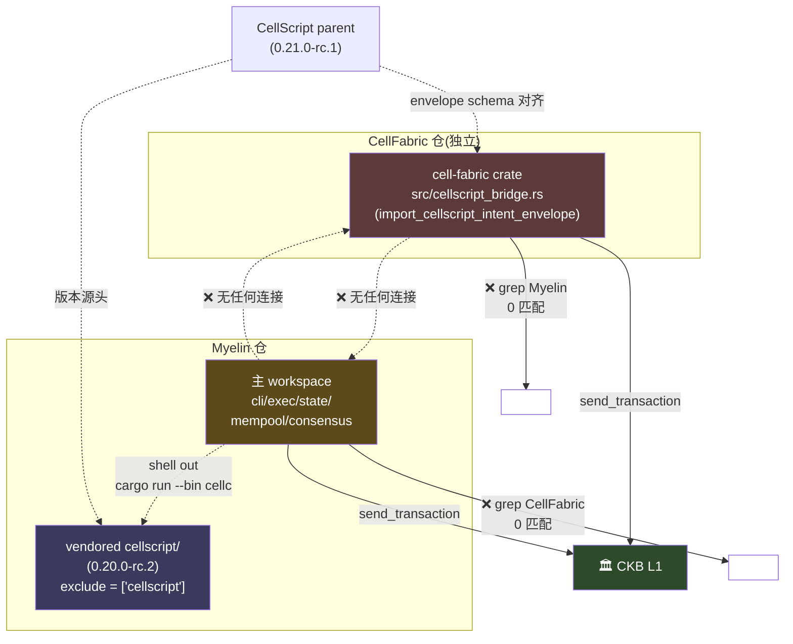

**说人话**:两个项目**各自独立地连到 CKB**,各自独立地用 CellScript(但方式不同),**互相之间
没有任何直接技术连接**。验证过的零接触:主 workspace grep 0 匹配、`MYELIN_*.md` 0 匹配、
CellFabric 全 repo grep Myelin 也是 0 匹配、两边 Cargo.toml 都不引对方的 crate。它们的交集只
在"都用 CKB"和"都用 CellScript(不同方式)"。

事实核(全部已验证,见附录 A):

- **Myelin 主 workspace(cli/exec/state/mempool/consensus)grep `CellFabric | cellfabric` 全部
  0 匹配。**
- **`MYELIN_*.md` 所有文档 grep 同样 0 匹配。**
- **CellFabric 全 repo(所有扩展名、所有分支)grep `Myelin` 也是 0 匹配。**
- **`exec/Cargo.toml` 不依赖 `cell-fabric`、不依赖 `cellscript-ckb-adapter`、不依赖任何
  CellScript crate。**
- **CellFabric `Cargo.toml:26-38` 不引任何 `cellscript-*` / `cell-script-*` crate。**

唯一的间接交叉:**Myelin 仓内 vendored 的 `cellscript/` 子目录里有大量提到 CellFabric 的
内容**(`Myelin/cellscript/docs/CELLSCRIPT_CELLFABRIC_BRIDGE.md` 等)——但这是 CellScript
项目自己对 CellFabric 的引用,**不是** Myelin ↔ CellFabric 的直接连线。

**结论**:Myelin 跟 CellFabric 当前没有任何直接技术集成。它们的交集只在"都用 CKB"和
"都用 CellScript(方式不同)"这两点。

---

## §6 三条可能的配合路径

现有 `cellscript-vs-cellfabric` 文档只认真探索了一条(Myelin 做 `CellScriptRuntimeBuilderCompiler`),
而且那条路径有个被忽视的问题。本文给出三条,标清楚各自的代价。

### 路径 A:薄包装路径 — Myelin 当 CellFabric 的 compiler

**这是现有文档推荐的路径**。具体形状:

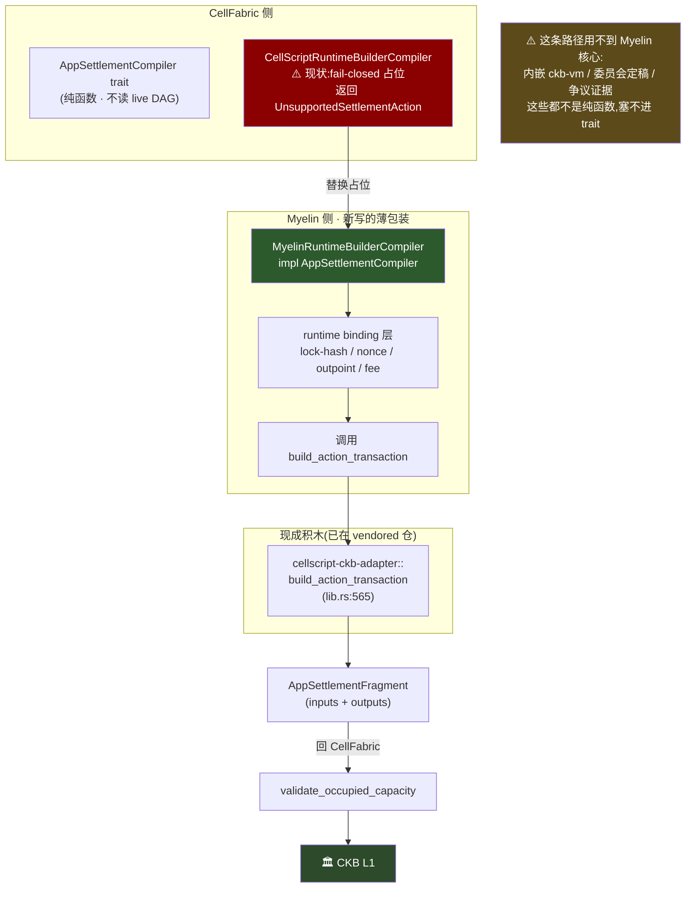

**技术上成立吗?** 成立。`AppSettlementCompiler::compile_intent` 要求纯函数、不读 live DAG、
对同一 bundle 可复现(`docs/red-lines.md:122-148`)。`build_action_transaction` 输入
`ResolvedActionTx` 输出 `(TransactionView, ResolvedActionEvidence)`,套一层 capacity 校验
就能塞进去。接口形状照抄 `AmmPoolBatchCompiler`(`src/amm.rs:430-523`)。

**但这条路径有个被忽视的问题**:**它用不到 Myelin 的核心能力**。

Myelin 真正不可替代的是"链下高速跑 ckb-vm + 委员会定稿 + 争议证据"。而
`AppSettlementCompiler` 槽位是个**纯函数**,不能有状态、不能有时间、不能有委员会投票。
Myelin 内嵌 ckb-vm 的优势在这条路径上**完全发挥不出来**——任何会调
`build_action_transaction` 的人都能写这个薄包装,不需要 Myelin。

**诚实的评价**:
- ✅ 技术上最具体、最容易落地(几周工作量)
- ✅ 能让 CellFabric 通用 CellScript 路径走通(填上那个 fail-closed 占位)
- ⚠️ **战略上平庸**:让 Myelin 当一个谁都能替代的薄包装,而不是发挥它真正不可替代的会话
  执行能力
- ⚠️ 现有文档用 Myelin 的资产清单(`build_action_transaction` 存在、carrier-submission 存在)
  来论证可行性,但这些资产在纯函数路径上**根本用不上** Myelin 的杀手锏

**适用场景**:如果你只想快速让 CellFabric 的通用 CellScript 路径走通,不在意 Myelin 的核心
价值是否发挥,选 A。

### 路径 B:bundle 层对接 — 这是现有文档完全没探索的路径

**核心想法**:不在 settlement compiler 层(纯函数)对接,而在**更高一层**——bundle 层对接。
让 CellFabric 负责 intent 排序进 bundle,Myelin 负责把 bundle 拿去链下高速执行 + 出争议证据。

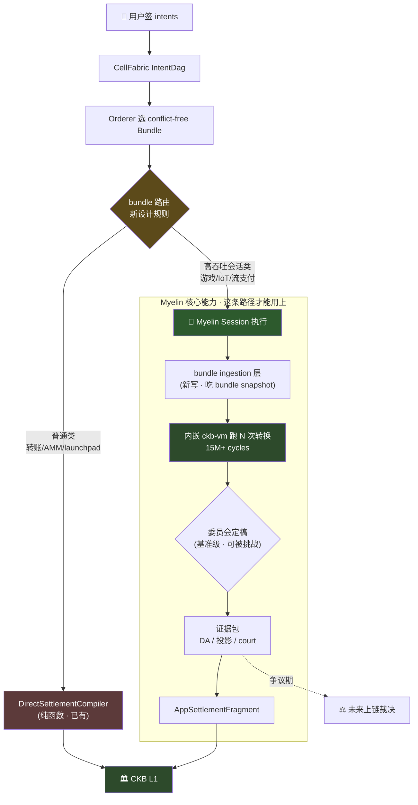

**为什么这条路径更能发挥 Myelin**:

1. **Myelin 的会话执行能力正好用上**。bundle 里的 intents 如果是"一段时间内连续高频执行"
   类(游戏会话、IoT 计量、流支付),交给 Myelin 跑比直接一笔笔结算到 CKB 高效得多。
2. **Myelin 的争议证据能力正好用上**。Myelin 跑完产出 DA manifest + CKB projection + court
   bundle,这些正好可以作为 CellFabric settlement 的"证据增强"——目前 CellFabric 的
   proof skeleton 明确不是 on-chain enforceable(`docs/red-lines.md:181-223`),Myelin 的
   证据包不直接解决这个,但提供了未来上链裁决的原材料。
3. **最终性分层清晰**(呼应 §4):CellFabric 管 bundle 可见性,Myelin 管执行正确性,两者
   都不碰 CKB 最终性。

**但这条路径的代价**:

- ⚠️ **需要协议设计**。bundle → Myelin session 的转换接口目前不存在,要定义:一个 bundle
  什么时候走普通 path(直接编译成 CKB tx),什么时候走 session path(交给 Myelin 链下执行)?
  这个路由规则是新设计。
- ⚠️ **要解决 §4.3 的 orderer 隐患**。Myelin 委员会定稿不能变成 CellFabric orderer 的输入。
- ⚠️ **跨项目协调成本高**。需要 CellFabric 暴露 bundle snapshot 的稳定接口,需要 Myelin 实现
  bundle → session 的 ingestion 层。

**适用场景**:如果你想让两个项目**真正发挥各自的核心能力**(CellFabric 排序 + Myelin 执行),
选 B。这是长期最有想象空间的配合,但工作量是季度级。

### 路径 C:保持独立,只共享 CellScript 上游

**核心想法**:两个项目不直接集成,各自独立连到 CKB,只在 CellScript 上游共享。

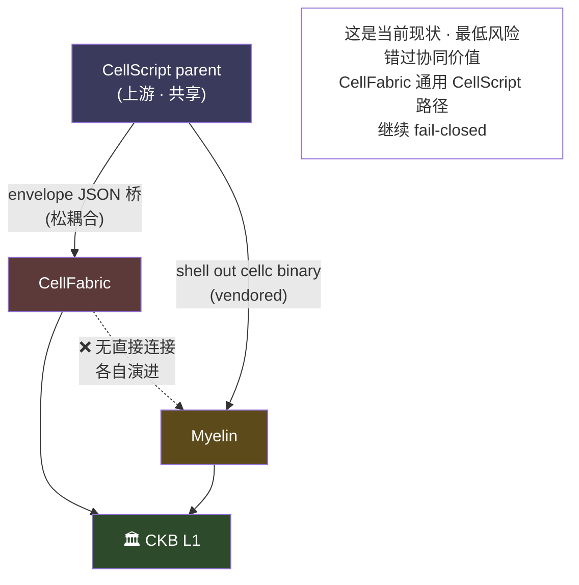

**好处**:
- ✅ 零集成成本,零红线风险
- ✅ 两个项目各自演进,互不拖累
- ✅ CellScript 上游对齐是唯一共享点,这个已经事实存在

**代价**:
- ⚠️ 错过路径 B 的协同价值
- ⚠️ CellFabric 通用 CellScript 路径的 fail-closed 占位依然没人填
- ⚠️ 两个项目各自重复解决一些相同问题(比如 CKB 提交、fee 管理)

**适用场景**:如果两个项目的目标用户、工作负载、发布节奏差异大到集成成本超过收益,选 C。
这其实是当前现状,也是最低风险选项。

### 三条路径对比

| | 路径 A(薄包装) | 路径 B(bundle 对接) | 路径 C(独立) |
|---|---|---|---|
| 工作量 | 几周 | 季度级 | 零 |
| 发挥 Myelin 核心 | ❌ 用不上 | ✅ 正好用上 | — |
| 解决 CellFabric 接缝 | ✅ | ✅ | ❌ |
| 红线风险 | 低 | 中(要守 §4.3) | 零 |
| 协议设计需求 | 无 | 有(路由规则) | 无 |
| 战略价值 | 平庸 | 高 | 低 |

---

## §7 推荐路线与决策点

### 7.1 分阶段路线

#### 路线时间线


**说人话**:四个阶段是**递进**关系,不是并列。阶段 0 不管走哪条路都要做(修 drift)。阶段 1
是"建立接触点"——承认它战略上平庸,但它是阶段 2 的前提。阶段 2 才是真正发挥 Myelin 核心能力
的地方(bundle 对接)。阶段 3 是协议级变化,需要跨项目协调。

**阶段 0(立即,不依赖任何新代码)**

先把现状的 drift 修掉,不管后面选哪条路都要做:

1. **修 vendored CellScript 的两个 drift**:
   - `cellscript/examples/myelin/*.cell` 在 vendored 仓不存在(`ls` 验证),但
     `scripts/myelin_ckb_devnet_smoke.sh:113-200` 会 cp 这些文件。补回这 4 个 `.cell` 源。
   - `--target-profile typed-cell` 不被 CellScript 接受(只认 `"ckb"`,
     `CellScript/src/lib.rs:246-251`)。但 `MYELIN_PRODUCTION_GATE.md:306-312` 把它描述为
     已支持。这是 Myelin-side 文档与 vendored 编译器实际接口的 drift,要么改文档,要么
     上游给 CellScript 提 PR 加 `typed-cell` profile(后者是上游决定,不是 Myelin 能单方面
     改的)。
2. **把 vendored CellScript 升到 `0.21.0-rc.1`**(现在是 `0.20.0-rc.2`,落后一个 RC)。
3. **把 CellFabric 的 `CellScriptRuntimeBuilderCompiler` fail-closed 注释抄进 Myelin 内部
   design note**——后续如果要填这个缝,注释里的合约(纯函数、不读 live DAG、复现性)是硬约束。

**阶段 1(短期,几周,对应路径 A)**

如果决定推进配合,先做路径 A 作为最小可行集成:

1. 在 Myelin 里写 `MyelinRuntimeBuilderCompiler: impl AppSettlementCompiler`,套调
   `build_action_transaction`。
2. namespace 用 `myelin-runtime`(或 owner 选个 Myelin-side 固定 namespace),policy 走
   `CellScriptAppConflictPolicy::with_import`(`src/cellscript_bridge.rs:362-448`)。
3. 把 CellFabric 的 `examples/cellscript_flow.rs` 改成接通版本(现在停在
   `requires_external_cellscript_runtime_builder: true`)。

**明确承认**:这一步只是"让通用 CellScript 路径走通",**不发挥 Myelin 核心能力**。它的价值
是建立两个项目之间的第一个技术接触点,为路径 B 铺路。

**阶段 2(中期,季度级,对应路径 B)**

这才是真正发挥两个项目协同价值的阶段:

1. 设计 bundle → session 的路由规则:什么样的 bundle 走普通 path,什么样的走 Myelin session。
2. 在 Myelin 实现 bundle ingestion 层:吃 CellFabric 的 immutable bundle snapshot,转成
   Myelin session 输入。
3. 在 CellFabric 暴露 bundle snapshot 的稳定接口(可能需要新 feature flag 或 trait)。
4. **严守 §4.3**:Myelin 委员会定稿不能作为 CellFabric orderer 的输入。

**阶段 3(长期,涉及协议变化)**

1. CellScript 上游对齐 `typed-cell` profile(如果 Myelin 真的需要这个语义)。
2. CellFabric 暴露 `AppSettlementCompiler` 的可注册 hook(目前是 fail-closed 占位)。
3. 争议裁决上链(两个项目都明确标注当前 proof skeleton 不是 on-chain enforceable)。

### 7.2 决策点

在投入阶段 1/2 之前,需要 owner 决定:

#### 决策树

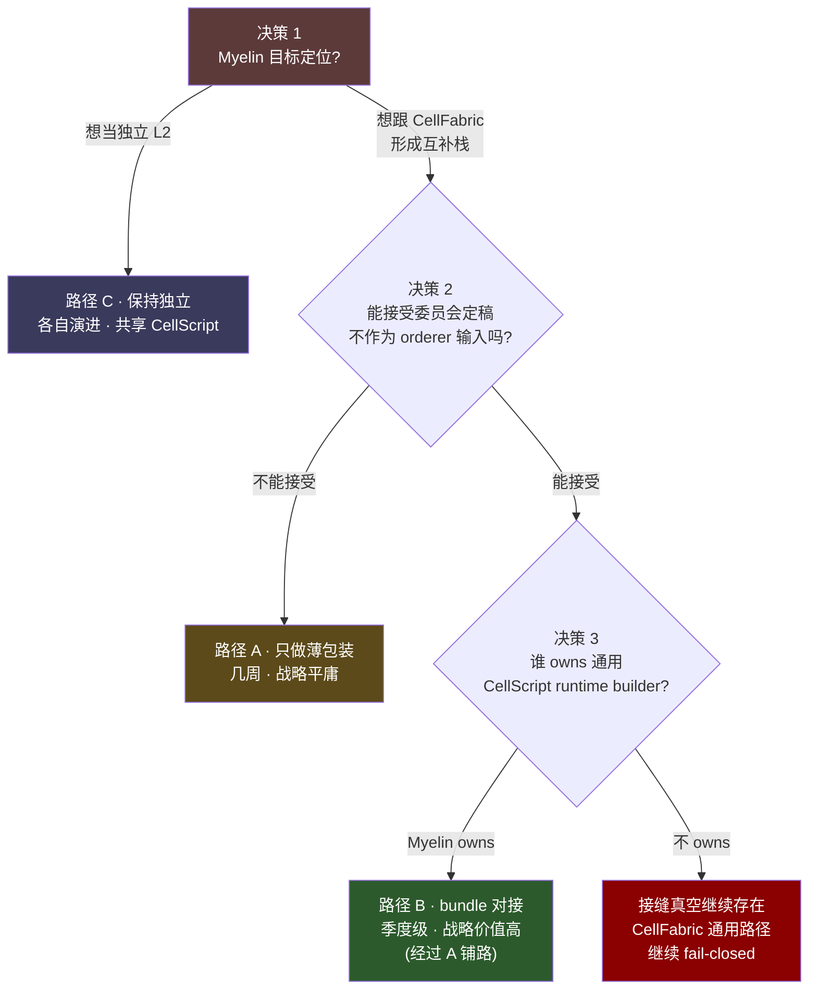

**说人话**:三个决策是**串联**的——先决定 Myelin 想不想配合(决策 1),再决定能不能接受解耦
纪律(决策 2),最后决定谁填那条缝(决策 3)。任何一个"否"都会把路线锁死在更低价值的路径上。
最值得做的是路径 B,但它要求三个决策都是"是"。

**决策 1:Myelin 的目标定位是不是"配合 CellFabric"?**
- 如果 Myelin 想当独立的 CKB L2,选路径 C,不跟 CellFabric 集成。
- 如果 Myelin 想成为 CKB 生态的"执行层"跟 CellFabric 的"排序层"配合,选路径 B(经过 A)。

**决策 2:能不能接受"Myelin 委员会定稿不作为 CellFabric orderer 输入"这条纪律?**
- 这条是路径 B 的硬前提。如果 Myelin 要求委员会定稿能影响 bundle 选择,那路径 B 走不通,
  只能选 A 或 C。

**决策 3:谁 owns 通用 CellScript runtime builder?**
- 如果 Myelin owns,走路径 A/B。
- 如果不 owns,这个真空地带依然存在,CellFabric 通用 CellScript 路径继续 fail-closed。

---

## §8 红线清单(不许碰)

集成时这些边界不能跨:

### CellFabric 红线(`docs/red-lines.md:1-223`)

1. **软确认 ≠ 最终性**。`BundleReceipt.non_final = true` 硬编码(`red-lines.md:10-58`)。
2. **Auth binding ≠ 生产签名验证**。`NoopAuthVerifier` 不是生产安全件(`README.md:372-378`)。
3. **Conflict 必须在 signed `IntentBody` 显式存在**,不允许 post-hoc patch
   (`red-lines.md:99-104`)。
4. **编译器不读 live mutable DAG**。`AppSettlementCompiler` 是 immutable bundle snapshot 上的
   纯函数(`red-lines.md:122-148`)。
5. **Proof skeleton 不是 on-chain enforceability**(`red-lines.md:181-223`)。
6. **Orderer 不能成为 consensus actor**(`red-lines.md:155-180`)。多 orderer 只出"可比较的
   收据",不发明新共识。

### CellScript 红线(影响配合)

7. **`cellscript_core_dependency = "no-cell-fabric-rust-crate"`**(`src/cli/commands.rs:10155`)。
   CellScript 编译器核心不绑 CellFabric Rust 版本。
8. **`compiler_core_dependency = "no-ckb-sdk-rust"`**(`cellscript-ckb-adapter/src/lib.rs:433-435`)。
   编译器核心不引 ckb-sdk-rust。
9. **`target_profile = "ckb"` 唯一允许**(`CellScript/src/lib.rs:246-251`)。其它 profile 名
   fail closed。`typed-cell` 要落地必须上游同意。

### Myelin 红线(按现状摆)

10. **主 workspace `exclude = ["cellscript"]`**(`Cargo.toml:3`)。`cellscript/` 是 vendored
    不是 dep。
11. **`exec/Cargo.toml` 当前不引 `cellscript-ckb-adapter`、不引 `cell-fabric`**。若引,必须按
    "接 CellFabric `AppSettlementCompiler` trait"的方向做(路径 A),或者按 bundle ingestion
    层做(路径 B),不能把它当内部 helper 调。
12. **17 条 CKB semantic deviation(D-01~D-17)**(`MYELIN_CKB_SEMANTIC_DEVIATIONS.md`)。
    配合时 CellFabric 的 bundle 编译不能踩这些 projection 警告边界。
13. **`SemanticProfile` 三值枚举必须诚实标注**。不能把 `myelin-native` 或
    `ckb-inspired-only` 的转换当 `ckb-compatible` 卖。

### 集成时新增的纪律(本文贡献)

14. **Myelin 委员会定稿 ≠ CellFabric orderer 输入**(§4.3)。两者解耦。
15. **不引对方 Rust crate 是现状政策**。任何配合都先从 schema/adapter 层开始,不是 crate
    互导。如果未来要引,必须明文更新两边的 `Cargo.toml` 政策。

---

## §9 一句话结论

**Myelin 和 CellFabric 是 CKB 之上两个互补但不重叠的子系统**:CellFabric 管 intent 排序的
可见性,Myelin 管 Cell 执行的正确性,两者都把最终性留给 CKB。

它们能不能深度配合,**不取决于 compiler 接缝好不好填**(那个好填,路径 A 几周搞定),**而
取决于一个战略选择**:Myelin 想当独立 L2(选路径 C),还是想跟 CellFabric 形成"排序层 +
执行层"的互补栈(选路径 B)?

- 如果选 C,两个项目各自演进,共享 CellScript 上游,互不拖累——这是当前现状,最低风险。
- 如果选 B,先走路径 A 建立第一个技术接触点(几周),再设计 bundle 层对接(季度级),这才能
  让 Myelin 真正不可替代的会话执行能力发挥出来,而不是当个谁都能写的薄包装。

现有 `cellscript-vs-cellfabric` 文档把"Myelin 做 compiler"当旗舰建议,**本文认为那条是技术上
成立但战略上平庸的路径**——它让 Myelin 当 CellScript ↔ CellFabric 那条缝的填缝剂,而 Myelin
真正值钱的能力(链下高速 ckb-vm 执行 + 争议证据)在那条纯函数路径上根本用不上。真正值得
思考的是路径 B:bundle 层对接,让两个项目在各自的核心能力上互补。

---

## §A CellScript ↔ CellFabric 桥接技术细节

> 本节吸收(并取代)了原 `COMPARISON_AND_COLLABORATION.md` §1-§3 的全部技术细节。
> 主角是 CellScript 和 CellFabric 之间的桥——它是 Myelin 配合两者的物理接口,
> §6 的三条路径都建立在这条桥的形状之上。
> 深度代码级遍历见两份 side report(`CELLSCRIPT_SIDE.md`、`CELLFABRIC_SIDE.md`)。

### A.1 CellScript 是什么(精简版)

CellScript 是 CKB 的 Cell 模型 DSL + 编译器(workspace `0.21.0-rc.1`,4 个 member crate)。
它把 `.cell` 源码 lower 成 ckb-vm RISC-V 汇编或 ELF artifact,并把 Cell 效果、调度提示、
schema、source-hash、verifier obligation 作为机器可读的 metadata sidecar 一并发出
(`CellScript/README.md:25-29`、`:457-516`)。

**五段流水线**(`src/lib.rs:6-40` 与 `README.md:457-516` 一致):


每段都同时发射 metadata。`ArtifactFormat` 只有 `RiscvAssembly` (`.s`) 和 `RiscvElf` (`.elf`);
`TargetProfile::Ckb` 是**唯一**实现的 profile(`src/lib.rs:241-251`)。

**CellScript 自陈不是什么**(`README.md:25-29`、`docs/releases/CELLSCRIPT_0_14_RELEASE_NOTES.md:181-184`):
不是 VM、不是 wallet、不是 orderer、不是 Action Builder。

**四件值得点名的边界**:

- **metadata 是单一 JSON sidecar**(`README.md:519-531`)—— `*.elf.meta.json` / `*.s.meta.json`,
  schema 版本 `metadata_schema_version = 44`、三子版本都是 `1`(`src/lib.rs:214-217`)。
- **CKB profile ABI contract 显式结构化**——`witness_abi`、`lock_args_abi`、`source_encoding`、
  `spawn_ipc_abi`、`since_abi`、`cell_dep_abi`、`script_ref_abi`、`output_data_abi`、
  `capacity_floor_abi`、`type_id_abi`、`hash_type_policy`、`dep_group_manifest` 都是字面量字符串
  (`src/lib.rs:276-303`)。
- **`metadata.runtime.vm_abi` 硬约束**——`format = "molecule"` 且 `version = 0x8001`
  (`src/lib.rs:949-960`)。
- **CKB transaction 打包在 `cellscript-ckb-adapter`**(不是编译器的活)——编译器连
  `ckb-sdk-rust` 都不引(`docs/CELLSCRIPT_CKB_ADAPTER.md:28-32`、adapter强制
  `compiler_core_dependency = "no-ckb-sdk-rust"`,`crates/cellscript-ckb-adapter/src/lib.rs:433-435`)。

### A.2 桥的形状 — 单向 JSON envelope

桥是**单向 JSON envelope**,不是 crate 级别的桥。

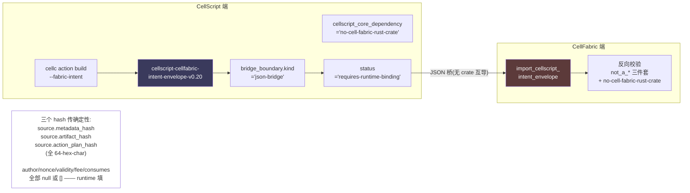

**两边都明文写"不通过 cargo crate 互导"**:
- CellScript 端 `bridge_boundary.cellscript_core_dependency = "no-cell-fabric-rust-crate"`
  (`src/cli/commands.rs:10155`,`docs/CELLSCRIPT_CELLFABRIC_BRIDGE.md:5-7`)
- CellFabric 端 `src/cellscript_bridge.rs:495-499` 把这条字段当 entry guard 反向校验

**桥的设计意图**:`status = "requires-runtime-binding"`(`src/cli/commands.rs:10152`)——
CellScript 编译器**不做** runtime binding 是 design intent,不是偷懒。三个 hash
(`source.metadata_hash` / `source.artifact_hash` / `source.action_plan_hash`,
`src/cli/commands.rs:10162-10171`,`tests/cli.rs:7261` 断言三者是 64-hex-char)把"编译器侧
已经是 deterministic"的事实交给 CellFabric 端验证。`author.lock_script_hash`、`nonce`、
`validity.*`、`fee.*`、`consumes`、`reads` 等都设为 `null` 或 `[]`——runtime binding 由
CellFabric 端填。

### A.3 已经走通的部分

**CellScript 端 — emit envelope**:`cellc action build --fabric-intent` 跑通 schema 校验与
envelope 生成(`src/cli/commands.rs:444-453` 注册 flag、`:12394-12397` clap 声明、
`:13415-13426` 解析、`:2898-2930` 调 `cellfabric_intent_envelope_json` 替换输出;
envelope 生成器 `:10140-10272`)。

**CellFabric 端 — import envelope 成 `IntentBody`**:
`import_cellscript_intent_envelope`(`src/cellscript_bridge.rs:478-634`)跑 **9 段校验**:

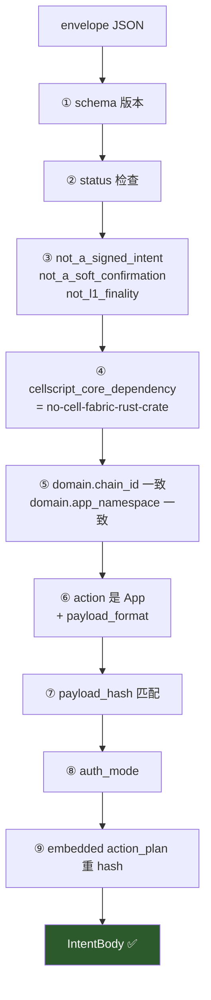

**CellFabric 端 — conflict policy 注册**:`CellScriptAppConflictPolicy`
(`cellscript_bridge.rs:362-448`)以 namespace-scoped 注册(`with_import` / `register_import`),
要求 `app_keys` 跟 envelope 声明一致(`cellscript_bridge.rs:554-562` + `:950-966`)。

**CellFabric 端 — HTTP**:`/cellscript/import`(`http.rs:202, 265-269`)与
`/cellscript/import/amm-swap`(`http.rs:204-206, 271-275`)两个 endpoint 都接受 typed 与 hex
两种 envelope wire 形态(`cellscript_bridge.rs:82-122, 206-236`)。

**CellFabric 端 — AMM 完整闭环** ✅:三件套实跑——
- `import_cellscript_amm_swap_request`(`cellscript_bridge.rs:643-729`)
- `AmmSwapPolicy`(`src/amm.rs:532-590`)
- `AmmPoolBatchCompiler`(`src/amm.rs:328-523`)

import 时 `template_keys == expected_app_keys` 严格相等;compile 时按 pool cell 分组、
`quote_exact_in`、累计 reserve、过 `min_receive`、生成 receipt outputs、
`validate_occupied_capacity`、`output capacity ≤ pool.input_capacity_shannons`。
Smoke 跑通:`examples/cellscript_amm_flow.rs`、`scripts/cellscript_amm_flow_smoke.sh`。

**CellFabric 端 — boundary smoke**:`examples/cellscript_flow.rs:50-150` 跑 import + dummy sign +
gateway + orderer + 命中 `UnsupportedSettlementAction`,把"卡在 boundary"这个状态演示出来。

### A.4 桥的接缝 — 通用路径没人填

通用 CellScript 路径(就是 `namespace != "amm"`、不是 launchpad、不是其他已实现特殊协议的
所有其他 CellScript action)的 settlement compiler **仍是 fail-closed 占位**。具体形状
(`src/cellscript_bridge.rs:385-398`):

```rust
impl AppSettlementCompiler for CellScriptRuntimeBuilderCompiler {
    fn compile_intent(&self, intent: &SignedIntent) -> Result<AppSettlementFragment> {
        let action_plan_hash = validate_cellscript_intent_payload(intent)?;
        Err(IntentError::UnsupportedSettlementAction(format!(
            "CellScript intent {} action_plan_hash 0x{} requires an external \
             CellScript runtime builder or adapter; CellFabric core does not \
             materialize CellScript action plans into CKB transactions",
             intent.id, hex::encode(action_plan_hash)
        )))
    }
}
```

**后果链**(按 CellFabric 自陈的"必要条件"):

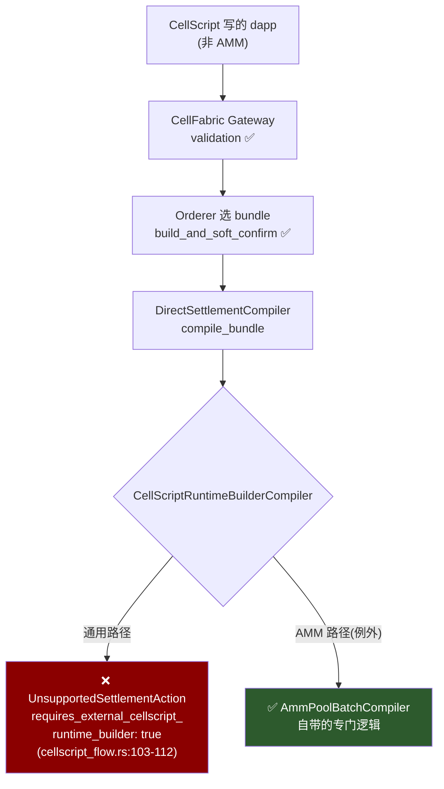

`docs/principles-tutorial.md:259-271` 与 `README.md:249-254` 都明说 Swap 和 App actions 需要
(a) 注册的 app conflict policy,(b) 注册的 app settlement compiler——**缺一不可**。
通用 CellScript 路径**已**解决 (a)(`CellScriptAppConflictPolicy`),**不**解决 (b)。
所以一个 CellScript 写的、AMM 之外的 dapp,进了 gateway、过了 validation、被 orderer 选中,
最后会卡在 `requires_external_cellscript_runtime_builder: true`。

**这条缺口的直接原因**:CellScript 编译器把"具体怎么把 action plan 转成 CKB 交易"明确拒绝
进编译期(`docs/CELLSCRIPT_CKB_ADAPTER.md:28-32` + adapter 的
`compiler_core_dependency = "no-ckb-sdk-rust"` 强制);CellFabric core 把"具体怎么把
`cellscript-action-plan-json-v1` bytes 编译成 `Transaction`"明确不进 core
(`docs/cellscript-bridge.md:111-119`)。两者之间的
`cellscript-ckb-adapter::build_action_transaction`
(`crates/cellscript-ckb-adapter/src/lib.rs:565`)**存在**,但**没有被 CellFabric 通过 crate /
service / hook 任一形式消费**。

**AMM 路径怎么绕过这条缝**:`AmmPoolBatchCompiler` 自带 AMM-specific 编译逻辑
(`src/amm.rs:328-523`),**不**用 `cellscript-ckb-adapter`;它从 `AmmSwapRequest` bytes 自己
算出 outputs,再过 `validate_occupied_capacity` + 容量守恒(`src/amm.rs:507-514, 716`)。
这是一条"绕开 adapter 的本地实现",不是"对接 adapter 的 hook"。**AMM 是 self-contained;
通用路径的缺口不是 AMM 已经填了,只是不在 AMM 的 surface 上。**

### A.5 谁负责 runtime builder — 接缝没有 owner

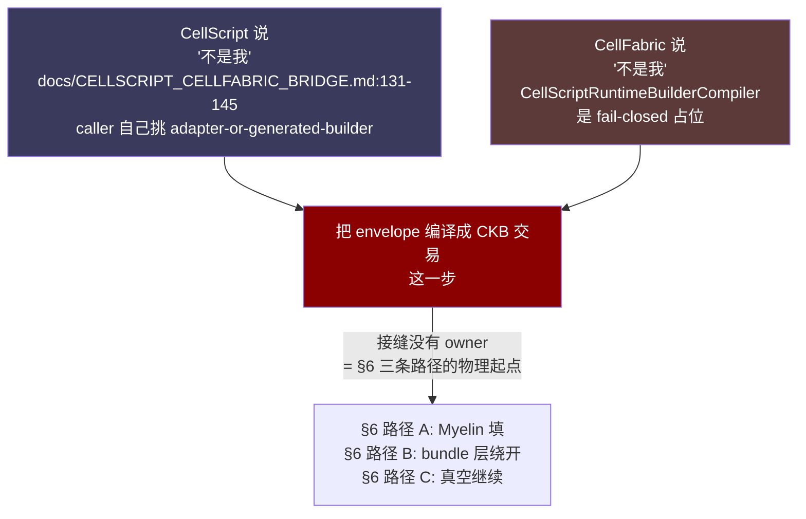

- CellScript:"settlement compiler 不是 CellScript 的责任"
  (`docs/CELLSCRIPT_CELLFABRIC_BRIDGE.md:131-145` 的 `Recommended Execution Path`,caller 自己
  挑 "cellscript-ckb-adapter-or-generated-builder",`src/cli/commands.rs:10179`)。
- CellFabric:`CellScriptRuntimeBuilderCompiler` 是 fail-closed 占位
  (`src/cellscript_bridge.rs:385-398`),不实现;core 不做(`docs/cellscript-bridge.md:113-119`)。

**这条接缝在现状里没有 owner**。这就是本文 §6 三条路径讨论的物理起点——要不要填这条缝、
谁来填、用什么姿势填,是 Myelin ↔ CellFabric 配合的核心决策。

### A.6 Myelin 现成的积木(对照路径 A 的可行性)

如果走 §6 路径 A(Myelin 做 `CellScriptRuntimeBuilderCompiler`),Myelin 这边有现成积木:

1. `cellscript-ckb-adapter::build_action_transaction` 在 vendored 仓内已存在
   (`Myelin/cellscript/crates/cellscript-ckb-adapter/src/lib.rs:565`),已经能从
   `ResolvedActionTx` 输出 `(TransactionView, ResolvedActionEvidence)`。
2. `cellscript_cellfabric_bridge_smoke.sh`(vendored 仓内)已经能跑 CellScript → envelope →
   CellFabric import 的 cross-repo smoke。
3. Myelin main workspace 的 `myelin session carrier-submission` 已经在做自己的 CKB 交易提交
   (用 `send_transaction` 走 RPC),跑 `submit --require-accepted` 路径
   (`MYELIN_PRODUCTION_GATE.md:296-305`)。

**但要注意(呼应 §6 路径 A 的批判性评估)**:这些积木在纯函数 `AppSettlementCompiler`
路径上**只能用第 1 个**(`build_action_transaction`)。Myelin 真正不可替代的资产——内嵌
ckb-vm、委员会定稿、争议证据——在纯函数槽位里**完全用不上**。要发挥这些,得走路径 B
(bundle 层对接)。这是本文跟原 COMPARISON 文档的核心分歧。

### A.7 Myelin ↔ CellScript 的两个 drift(必须先修)

不管走哪条路径,这两个 drift 都得修(本文 §7.1 阶段 0 已列):

1. **`cellscript/examples/myelin/*.cell` 不存在**。`ls Myelin/cellscript/examples/` 验证无
   `myelin/` 子目录,parent 仓同样没有。但 `scripts/myelin_ckb_devnet_smoke.sh:113-200` 会
   cp 这些文件。`MYELIN_*.md` 与 `MYELIN_SWARM_AUDIT_WHOLEREPO.md` 多处引用的
   `cellscript/examples/myelin/*.cell:1-56` 找不到落点。
2. **`--target-profile typed-cell` 不被 CellScript 接受**。`TargetProfile::from_name` 只识别
   `"ckb"`(`CellScript/src/lib.rs:246-251`):其它一律
   `Err("unsupported target profile '{}'; supported profile: ckb")`。Myelin vendored 仓
   (`Myelin/cellscript/src/lib.rs`)同形。`tests/cli.rs:7263` 也断言
   `envelope["source"]["target_profile"] == "ckb"`。但 `MYELIN_PRODUCTION_GATE.md:310` 与
   `MYELIN_SWARM_AUDIT_WHOLEREPO.md:437` 把 `typed-cell profile` 描述为已支持的——这是
   Myelin-side 文档与 vendored 编译器实际接口的 drift。Myelin 的
   `cellscript_compiled_scheduler_witness`(`exec/src/celltx/types.rs:1112-1145`)是 Myelin
   自己的 scheduler witness 层语义,**不**是 CellScript 编译器的输出,**也**不是 CellFabric
   `AppSettlementCompiler`。

**drift 1 是漏文件,drift 2 是地基级概念缺口**——Myelin 的 typed-cell 类型化承诺是它自己造的
语义,CellScript 的 `target_profile` 是另一套语义,两套从来没对齐过。后者要落地必须上游给
CellScript 提 PR 加 `typed-cell` profile(上游决定,不是 Myelin 单方面能改的)。

---

## 附录 A 事实核验证

`audits/cellscript-vs-cellfabric/COMPARISON_AND_COLLABORATION.md` 的所有 load-bearing 事实
claim 已逐条核对:

| 文档 claim | 验证方式 | 结果 |
|---|---|---|
| `CellScriptRuntimeBuilderCompiler` 是 fail-closed 占位 (`cellscript_bridge.rs:385-398`) | 读源码 | ✅ 一字不差,返回 `UnsupportedSettlementAction` |
| `TargetProfile::from_name` 只认 `"ckb"` (`CellScript/src/lib.rs:246-251`) | 读源码 | ✅ 其它 profile 直接 `Err` |
| `cellscript/examples/myelin/*.cell` 不存在 | ls 两边 | ✅ vendored 和 parent 都没有 `myelin/` 子目录 |
| vendored 版本 `0.20.0-rc.2` 落后 parent `0.21.0-rc.1` 一个 RC | 读两份 Cargo.toml | ✅ 完全一致 |
| Myelin ↔ CellFabric 双向零交叉引用 | grep 三方向 | ✅ 主 workspace / `MYELIN_*.md` / CellFabric 全 repo 都是 0 匹配 |
| CellFabric Cargo.toml 不引 cellscript 任何 crate | 读 deps | ✅ 只有 ckb-types/crypto/hash + axum/reqwest 可选 |
| `AmmPoolBatchCompiler` 是完整 `impl AppSettlementCompiler` | grep | ✅ `amm.rs:430`,带 `compile_intent` + `compile_intents` |
| `build_action_transaction` 在 vendored Myelin 仓存在 | grep | ✅ `cellscript-ckb-adapter/src/lib.rs:565` |

**事实层:原 COMPARISON 文档是审计级严谨,没有一个硬 claim 是错的。** file:line 引用都能对上。
全部技术细节已吸收进本文 §A。

---

## 附录 B 文档变更记录

**已合并/删除**:`audits/cellscript-vs-cellfabric/COMPARISON_AND_COLLABORATION.md` 已删除,
其全部事实核(附录 A 验证通过)+ 技术细节已合并进本文:
- §1-§3(CellScript/CellFabric 是什么、核心区别、现有配合面)→ 本文 **§A.1-A.5**
- §4(Myelin 跟两者关系)→ 本文 **§5 + §A.6-A.7**
- §5(配合下一步)→ 本文 **§7**
- §6(红线与不变项)→ 本文 **§8**
- 原"旗舰建议"(Myelin 做 compiler)→ 本文 **§6 路径 A + 批判性评估**

**保留**(原始材料,非重复):
- `audits/cellscript-vs-cellfabric/CELLSCRIPT_SIDE.md`(55KB,CellScript 代码级深度遍历)
- `audits/cellscript-vs-cellfabric/CELLFABRIC_SIDE.md`(46KB,CellFabric 代码级深度遍历)
- `audits/cellscript-vs-cellfabric/plan.yaml`(本审计的执行计划)

**改写立场**:原 COMPARISON 的隐含立场是"CellScript ↔ CellFabric 主角,Myelin 填缝"。本文
反过来——Myelin 和 CellFabric 才是要决定怎么相处的两个独立项目,CellScript 是共同上游工具。
原"旗舰建议"(Myelin 做 `CellScriptRuntimeBuilderCompiler`)被本文评为**技术上成立但战略上
平庸的路径**,因为它让 Myelin 当谁都能替代的薄包装,用不上 Myelin 真正不可替代的会话执行
能力。本文推荐路径 B(bundle 层对接)作为长期战略。

**两份 side report 的定位**:它们是 §A 的深度参考,不是这份文档的副本。本文给出框架和判断,
side reports 给出函数签名、envelope schema 字段级遍历、file:line 密集的代码级走查。需要
落地实现时,以 side reports 为权威。
