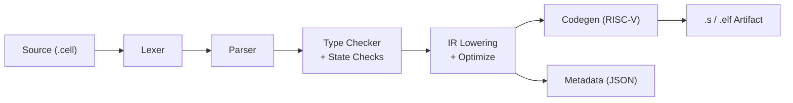
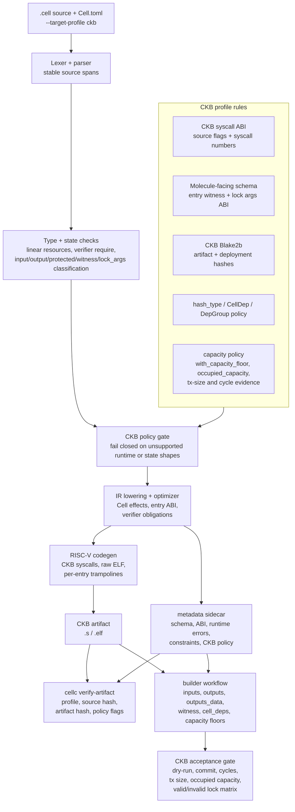

<p align="center">
  
</p>

[](https://github.com/CellScript-Labs/CellScript/actions/workflows/ci.yml)
[](LICENSE-MIT)
[](Cargo.toml)
[](#target-profiles)
[](#package-workflow)
[](#editor-support)
[](https://github.com/CellScript-Labs/CellScript/wiki)

**Write Cell contracts the way you think about them — not the way the wire format does.**

CellScript is a domain-specific language for Cell-based smart contracts on
CKB. It compiles `.cell` source into ckb-vm RISC-V assembly or ELF
artifacts, together with typed metadata for auditing, policy checks, schema
binding, and scheduler-aware execution.

In this README, metadata means machine-readable semantic facts emitted by the
compiler: schema layout, Cell effects, access summaries, source hashes,
verifier obligations, runtime requirements, and target-profile policy flags.

The language is intentionally narrow: it is not a new VM, and it is not an
account-storage contract language. CellScript gives protocol authors a typed
way to describe assets, shared Cell state, receipts, explicit state transitions,
locks, and transaction-shaped effects — while still mapping directly to the
Cell model used by CKB.

---

## Why CellScript

CKB exposes powerful Cell-oriented execution, but hand-written
scripts force authors to work close to the wire format:

- parse witness bytes manually
- track inputs, CellDeps, outputs, and output data by index
- encode typed state into raw byte arrays
- write RISC-V C or assembly against syscall numbers
- preserve linear asset semantics by convention rather than by the compiler

CellScript raises that programming model to explicit language constructs:
`resource`, `shared`, `receipt`, `action`, `lock`, source qualifiers such as
`read`, `protected`, `witness`, and `lock_args`, and Cell effects such as
`consume`, `create`, and `destroy`. Higher-level lifecycle patterns such as
`std::lifecycle::transfer`, `std::receipt::claim`, and
`std::lifecycle::settle` expand into those explicit effects instead of living
as compiler-core verbs.

## Current Status

CellScript is currently in a CKB-focused alpha / stabilisation phase.

It is suitable for:
- experimenting with CKB Cell-contract authoring;
- compiling and inspecting the bundled examples;
- exploring schema-backed CKB Cell effects, metadata, constraints, and CKB target-profile
  checks;
- trying the local VS Code extension and LSP tooling.

It is not yet recommended for unaudited mainnet deployment without manual
review. The current focus is developer-readiness, diagnostics, ProofPlan /
metadata assurance, and CKB target-profile stability.

## Quick Start

Install a published release (one line, four platform binaries):

```bash
curl -fsSL https://raw.githubusercontent.com/CellScript-Labs/CellScript/main/scripts/install.sh | sh
```

Or pin a specific version:

```bash
CELLSCRIPT_VERSION=0.21.1 curl -fsSL https://raw.githubusercontent.com/CellScript-Labs/CellScript/main/scripts/install.sh | sh
```

Build from this repository instead (tracks `main`):

```bash
git clone https://github.com/CellScript-Labs/CellScript.git
cd CellScript
cargo install --path .
```

Compile your first contract:

```bash
# Just type-check
cellc examples/token.cell

# Emit a RISC-V ELF for CKB
cellc examples/nft.cell --target riscv64-elf --target-profile ckb --primitive-strict 0.16

# Emit a RISC-V ELF for CKB, with a specific entry action
cellc examples/nft.cell --target riscv64-elf --target-profile ckb --primitive-strict 0.16 --entry-action transfer
```

Start a package:

```bash
cellc init token-package
cd token-package
cellc add shared-types --path ../shared-types
cellc build --target riscv64-elf --target-profile ckb
```

Run a CKB profile check:

```bash
cellc examples/nft.cell --target-profile ckb
```

Inspect what the compiler can explain about the NFT example:

```bash
cellc metadata examples/nft.cell --target-profile ckb
cellc constraints examples/nft.cell --target-profile ckb
cellc scheduler-plan examples/nft.cell --target-profile ckb
cellc explain assumptions examples/nft.cell --target-profile ckb --json
cellc tx solve examples/nft.cell --target-profile ckb --json
cellc deploy plan examples/nft.cell --target-profile ckb --json
cellc profile examples/nft.cell --target-profile ckb --json
cellc audit-bundle examples/nft.cell --target-profile ckb --json
```

These commands show what the compiler believes the protocol reads, writes,
creates, consumes, assumes, and exposes to CKB-facing policy tooling.

> **Next:** Read on for the [language model](#core-model), [full examples](#example),
> or dive into the [architecture](#architecture).

---

## Target Profiles

CellScript now supports CKB as its only target profile:

| Profile | When to use | What you get |
|---|---|---|
| `ckb` | CKB ckb-vm RISC-V artifacts | BLAKE2b/Molecule conventions, CKB syscall profile |

> The `ckb` profile is production-gated for the bundled CellScript suite. It
> emits raw CKB ckb-vm artifacts, uses CKB syscall
> and Molecule/BLAKE2b conventions, and rejects unsupported shapes through
> normal target-profile policy.

```bash
cellc examples/nft.cell --target riscv64-elf --target-profile ckb --primitive-strict 0.16
cellc examples/nft.cell --target-profile ckb
```

The current assurance gate is `--primitive-strict 0.16`. It includes the earlier
kernel-effect migration checks and adds mandatory ProofPlan soundness checks.

## Core Model

CellScript programs are written as verifier constraints over proposed Cell
transformations:

| Concept | What it compiles to |
|---|---|
| `resource T { ... }` | A linear Cell-backed asset (`CellOutput` + `outputs_data[i]`) |
| `shared T { ... }` | Shared state Cell, read via `CellDep` or updated by consume + create |
| `receipt T { ... }` | A single-use proof Cell (deposits, vesting, votes, liquidity) |
| `consume value` | Spend a transaction input |
| `create output = T { ... }` | Constrain a named proposed output Cell with typed data |
| `read param: T` / `read_ref<T>()` | Load a read-only CellDep-backed value |
| `action` | Type-script transition logic → compiled to RISC-V |
| `lock` | Lock-script authorization logic → compiled to RISC-V |
| Local `let` values | Transaction-local computation; never persistent storage |

> **Key rule:** only `create` materializes persistent state. Ordinary local
> values do not become Cells unless explicitly created as `resource`,
> `shared`, or `receipt`.

## Language Features

- **Cell-native resources** — `resource` values are linear. They cannot be
  copied, silently dropped, or hidden inside ordinary values. Every resource
  must reach an explicit lifecycle or output-binding role: for example
  `consume`, `destroy`, a declared successor output, or a compiler-recognized
  stdlib lifecycle pattern that expands to `consume` plus output constraints.
- **Explicit shared state** — `shared` marks contention-sensitive protocol
  state (pools, registries, configuration Cells). Reads and writes stay
  visible to metadata and tooling.
- **Receipts as stateful proofs** — `receipt` is a single-use Cell that proves
  an operation happened and can later be consumed directly or through an explicit
  stdlib claim/settlement pattern.
- **Capability gates** — `has store, create, consume, replace, burn, relock`
  makes asset permissions explicit in kernel-effect terms instead of protocol
  verbs.
- **Declarative flows** — state remains explicit schema data, while
  `flow Name for Type.field { A -> B by action; }` or compact
  `flow Type.field { A -> B; }` declares allowed edges. The canonical verifier
  shape separates topology, state edge, and proof obligations:
  `action(old: T) -> new: T { transition old -> new; verification ... }`.
  Field-level edges such as `transition old.field: A -> new.field: B` remain
  available when a declared flow graph needs explicit state values. Explicit
  `output` parameters and `consume`/`create` actions remain accepted, but the
  signature direction is the normal input-to-output surface. Multiple state
  edges are written as repeated action-level `transition` lines.
  Each state field has exactly one flow declaration; split/partial flow merging
  is not supported.
- **Scoped verification sections** — action and lock proof logic lives under
  `verification`. `transition` is an action-level Cell lifecycle declaration
  before `verification`, not a statement inside conditional proof logic. The
  type checker rejects asymmetric branch constraints when an output field is
  required in one proof branch but not its siblings.
- **Effect inference** — `action` bodies are classified as `Pure`, `ReadOnly`,
  `Mutating`, `Creating`, or `Destroying` based on their Cell operations.
- **Scheduler-aware metadata** — CKB-targeted builds expose access summaries
  and shared touch domains so block builders can reason about independent work.
- **Typed schema metadata** — Cell data layout, type identity, source hashes,
  runtime accesses, TemplateLayout records, and verifier obligations are emitted
  as machine-readable metadata.
- **RISC-V output** — the executable target is ckb-vm-compatible RISC-V
  assembly or ELF. CellScript does not introduce a separate VM.
- **Package-aware compilation** — packages use `Cell.toml`, local modules,
  source roots, and local path dependencies.
- **Policy gates** — build, check, metadata, and artifact verification can
  reject outputs that violate the selected target or deployment policy.

## Example

A module contains schema declarations and executable entries. Persistent values
are declared as `resource`, `shared`, or `receipt`; executable logic as `action`
or `lock`; effects are written with explicit Cell operations and state
transition clauses.

**Declarations:**

```cellscript
module ckb::example

struct Config {
    threshold: u64
}

resource Token has store, create, consume, replace, burn, relock {
    amount: u64
    symbol: [u8; 8]
}

shared Pool has store {
    token_reserve: u64
    ckb_reserve: u64
}

receipt VestingGrant has store, create, consume {
    beneficiary: Address
    amount: u64
    unlock_epoch: u64
}

struct Wallet {
    owner: Address
}

lock owner_only(protected wallet: Wallet, witness claimed_owner: Address) -> bool {
    verification
        require wallet.owner == claimed_owner
}
```

**Effects:**

```cellscript
action transfer_token(token: Token, to: Address) -> next_token: Token {
    verification
        require token.amount > 0, "empty token"

        consume token

        create next_token = Token {
            amount: token.amount,
            symbol: token.symbol
        } with_lock(to)
}
```

The compiler treats `consume`, `create`, `destroy`, action-boundary source
parameters, expression-level `read_ref<T>()`, and compiler-recognized stdlib
lifecycle patterns as **Cell effects**, not ordinary opaque function calls.
Those effects are reflected in metadata so CKB admission policy, schema
decoding, and artifact verification can audit the generated script.

**Scoped invariants and ProofPlan metadata:**

```cellscript
invariant token_conservation {
    trigger: type_group
    scope: group
    reads: group_inputs<Token>.amount, group_outputs<Token>.amount

    assert_conserved(Token.amount, scope = group)
}
```

Declared invariants must state their CKB trigger and scope explicitly. They are
emitted into Covenant ProofPlan metadata with trigger/scope/read coverage and
aggregate primitive relation checks. Most aggregate declarations remain
`gap:metadata-only` or `gap:runtime-helper-required` until executable verifier
lowering is available; recognised xUDT group amount conservation equality is
auto-lowered into action-prelude runtime helper calls only for matching
one-input/one-output amount-preserving actions, while xUDT `assert_delta`
records are marked `covered` only when generated action code emits the matching
runtime helper and the corresponding ProofPlan record is rebuilt with generated
helper coverage. ProofPlan records also carry macro expansion provenance for
selected protocol flows and warnings for risky coverage assumptions such as
`lock_group` verifiers that scan transaction-wide views.

**Complete fungible-token example:**

```cellscript
module ckb::fungible_token

resource Token has store, create, consume, replace, burn, relock {
    amount: u64
    symbol: [u8; 8]
}

resource MintAuthority has store, create, replace {
    token_symbol: [u8; 8]
    max_supply: u64
    minted: u64
}

action mint_with_authority(auth_before: MintAuthority, to: Address, amount: u64) -> (auth_after: MintAuthority, token: Token) {
    transition auth_before -> auth_after

    verification
        require auth_before.minted + amount <= auth_before.max_supply, "exceeds max supply"
        require auth_after.token_symbol == auth_before.token_symbol
        require auth_after.max_supply == auth_before.max_supply
        require auth_after.minted == auth_before.minted + amount

        create token = Token {
            amount: amount,
            symbol: auth_before.token_symbol
        } with_lock(to)
}

action transfer_token(token: Token, to: Address) -> next_token: Token {
    verification
        consume token

        create next_token = Token {
            amount: token.amount,
            symbol: token.symbol
        } with_lock(to)
}

action burn(token: Token) {
    verification
        require token.amount > 0, "cannot burn zero"
        destroy token
}
```

**Bundled protocol examples:**

| Example | What it shows |
|---|---|
| `examples/token.cell` | Mint, transfer, burn, guarded same-symbol merge |
| `examples/timelock.cell` | Time-gated release checks, delayed claim paths |
| `examples/multisig.cell` | Authorization thresholds, signature-oriented locks |
| `examples/nft.cell` | Unique assets, metadata, ownership transfer |
| `examples/vesting.cell` | Receipt-style grants and explicit claim state transitions |
| `examples/amm_pool.cell` | Shared pool state, swap/liquidity effects |
| `examples/launch.cell` | Mint-authority bootstrap and launch/pool composition patterns |

Non-production language examples live under `examples/language/`. They compile
and exercise compiler/tooling surfaces, but they are not part of the seven-file
CKB production acceptance matrix. `registry.cell` covers bounded local
`Vec<Address>` / `Vec<Hash>` helpers; `examples/registry.cell` keeps that
surface available from the top-level examples directory. `examples/language/order_book.cell` is a
local stack-backed order-vector sketch and does not claim persistent order-book
semantics. The v0.14 language examples cover CKB source/witness, capacity/time,
TYPE_ID, Spawn/IPC, and dynamic BLAKE2b surfaces as compiler/tooling examples.

## Comparison

Why CellScript is shaped around schema-backed CKB Cell state, linear resources, explicit
transaction effects, and ckb-vm artifacts — instead of account storage or a
chain-specific VM:

| Dimension | CellScript | Solidity | Move | Sway |
|---|---|---|---|---|
| Execution target | RISC-V ELF / asm on ckb-vm | EVM bytecode | Move bytecode | FuelVM bytecode |
| State model | Schema-backed views over CKB Cells, explicit inputs/deps/outputs | Account storage slots | Resources in global storage | UTXO + native assets |
| Asset model | Native `resource`, state transitions, receipts, shared Cells | Manual token contracts | Native resources | Native assets |
| Linear ownership | Compiler-enforced | No | Yes (abilities) | No general user-defined |
| Shared state | Explicit `shared` Cells | Implicit contract storage | Shared objects (some chains) | No shared Cell analogue |
| Reentrancy | No callback-style reentrancy | Common risk surface | Lower by design | Lower predicate risk |
| Scheduler metadata | Native for CKB | None | Not GhostDAG-oriented | Predicate-level |
| CKB compatibility | Production-gated CKB ckb-vm artifact profile for the bundled Cell suite | Requires different VM | Requires different VM | Requires FuelVM |

Compared with hand-written CKB scripts, CellScript keeps the same
runtime substrate but replaces raw byte and syscall programming with schema-backed CKB Cell
operations, linear checking, schema metadata, and policy-verifiable artifacts.

---

## Editor Support

CellScript includes production-style local language tooling for early users:

- **In-process LSP** — diagnostics, completions, hover, go-to-definition,
  references, formatting, and metadata-oriented code actions. The
  compiler crate exposes an `LspServer`; `cellc --lsp` provides a full
  `tower-lsp` JSON-RPC transport over stdio. Completions include flow
  states after `Type::`.
- **VS Code extension** — syntax highlighting, snippets, on-save diagnostics,
  compiler-backed formatting, scratch compilation, metadata/constraints/production
  reports, entry-witness ABI selection, action build plans, TypeScript builder
  generation, package/registry verification, active-file builder assumptions,
  transaction template, deploy plan, profile, audit-bundle reports,
  CKB target-profile arguments, and
  status-bar feedback. It shells out to `cellc` (or a `cargo run` fallback), so
  behavior stays identical to CLI and CI gates.

The 0.19 ecosystem-reuse work adds a formal headless
`cellscript-ckb-adapter` crate. The compiler emits semantic action plans and
ABI evidence; the adapter uses `ckb-sdk-rust` to materialize CKB transaction
shape and local-node acceptance evidence. It is not a wallet UI, frontend kit,
or CellFabric intent engine.

- [VS Code extension](editors/vscode-cellscript)
- [Runtime error codes](docs/CELLSCRIPT_RUNTIME_ERROR_CODES.md)
- [Entry witness ABI](docs/CELLSCRIPT_ENTRY_WITNESS_ABI.md)
- [Collections support matrix](docs/CELLSCRIPT_COLLECTIONS_SUPPORT_MATRIX.md)
- [Output bindings](docs/CELLSCRIPT_OUTPUT_BINDINGS.md)
- [Historical signature-direction execution plan](docs/archive/0.13/CELLSCRIPT_SIGNATURE_DIRECTION_EXECUTION_PLAN.md)
- [CKB target profile tutorial](docs/wiki/Tutorial-05-CKB-Target-Profiles.md)
- [CKB deployment manifest](docs/CELLSCRIPT_CKB_DEPLOYMENT_MANIFEST.md)
- [Capacity and builder contract](docs/CELLSCRIPT_CAPACITY_AND_BUILDER_CONTRACT.md)
- [CKB adapter boundary](docs/CELLSCRIPT_CKB_ADAPTER.md)
- [ckb-std compatibility](docs/CELLSCRIPT_CKB_STD_COMPAT.md)
- [Token and AMM bootstrap builder path](docs/examples/token_amm_bootstrap.md)
- [Linear ownership](docs/CELLSCRIPT_LINEAR_OWNERSHIP.md)
- [Scheduler hints](docs/CELLSCRIPT_SCHEDULER_HINTS.md)
- [Metadata verification and production gates](docs/wiki/Tutorial-06-Metadata-Verification-and-Production-Gates.md)
- [Unified gate policy](docs/CELLSCRIPT_GATE_POLICY.md)
- [Standard library](docs/wiki/Tutorial-10-Standard-Library.md)
- [Operational semantics](docs/spec/CELLSCRIPT_OPERATIONAL_SEMANTICS.md)
- [CKB hashing workflow example](docs/examples/ckb_hashing.md)
- [Collections matrix example](docs/examples/collections_matrix.md)
- [Deployment manifest example](docs/examples/deployment_manifest.md)
- [Output append example](docs/examples/output_append.md)
- [0.20 generated builder roadmap](docs/archive/0.20/CELLSCRIPT_0_20_ROADMAP.md)
- [Roadmap overview](roadmap/CELLSCRIPT_ROADMAP.md)
- [0.13 release scope](docs/releases/CELLSCRIPT_0_13_RELEASE_SCOPE.md)
- [0.14 roadmap](roadmap/CELLSCRIPT_0_14_ROADMAP.md)
- [0.14 release notes](docs/releases/CELLSCRIPT_0_14_RELEASE_NOTES.md)
- [0.15 roadmap](roadmap/CELLSCRIPT_0_15_ROADMAP.md)
- [0.15 release notes](docs/releases/CELLSCRIPT_0_15_RELEASE_NOTES.md)
- [0.16 roadmap](roadmap/CELLSCRIPT_0_16_ROADMAP.md)
- [0.16 release notes](docs/releases/CELLSCRIPT_0_16_RELEASE_NOTES.md)
- [0.17 roadmap](docs/archive/0.17/CELLSCRIPT_0_17_ROADMAP.md)
- [0.18 roadmap](docs/archive/0.18/CELLSCRIPT_0_18_ROADMAP.md)
- [0.19 roadmap](docs/archive/0.19/CELLSCRIPT_0_19_ROADMAP.md)
- [0.20 release notes](docs/releases/CELLSCRIPT_0_20_RELEASE_NOTES.md)
- [0.21 release notes](docs/releases/CELLSCRIPT_0_21_RELEASE_NOTES.md)
- [Agentic Loops and cellscript-mcp tutorial](docs/wiki/Tutorial-13-Agentic-Loops-and-cellscript-mcp.md)

---

## Architecture

CellScript is a multi-pass compiler that lowers `.cell` source through five
well-defined stages, then emits RISC-V artifacts, typed metadata, and
profile-aware policy checks. Every module listed below lives in a single Rust
crate (`cellscript`) with its own `mod.rs` entry point under `src/`.



### Compilation Pipeline

**1. Lexical analysis** (`lexer/`)
Scans `.cell` source into a typed token stream. Handles CellScript keywords,
operators, literals, and string interpolation. Every token carries a
line/column span for diagnostics.

**2. Parsing** (`parser/`)
Builds an AST from the token stream. The AST models the full surface:
`resource`, `shared`, `receipt`, `struct`, `enum`, `action`, `lock`,
`function`, `use`, `const`, capability gates, declarative flows,
action `transition` clauses, and all statement/expression forms.

**3. Semantic analysis** (`types/` + state-transition checks)
- *Type checking* — enforces linear resource semantics: every
  `resource`/`receipt` value must reach an explicit lifecycle or
  output-binding role before the action body exits. Also validates shared-state
  mutability rules, capability gates, effect classification (`Pure` /
  `ReadOnly` / `Mutating` / `Creating` / `Destroying`), and call signatures.
- *State transition checking* — validates explicit state fields,
  `flow` transition graphs, action `transition` clauses, legal state
  transitions, and static create-site checks.

**4. IR lowering** (`ir/` + `optimize/` + `resolve/`)
- *`resolve/`* — builds per-module symbol tables and resolves `use` imports
  across packages.
- *`ir/`* — lowers the typed AST into a flat, RISC-V-oriented intermediate
  representation (`IrAction`, `IrLock`, `IrPureFn`, `IrTypeDef`) with explicit
  Cell-effect instructions (`IrConsume`, `IrCreate`, `IrReadRef`,
  `IrDestroy`), cell-metadata equality checks, witness/layout slot assignments,
  and verifier obligations.
- *`optimize/`* — syntax-local constant folding and dead-branch pruning when
  `-O1+` is set. Intentionally conservative to preserve resource semantics.

**5. Code generation** (`codegen/`)
Emits ckb-vm-compatible RISC-V assembly (`.s`) or ELF (`.elf`):
- Syscall wrappers: `ckb_load_cell_data`, `ckb_load_witness`,
  `ckb_load_header_by_field`, `ckb_load_input_by_field`, and CKB extension
  syscalls (`secp256k1_verify`, `load_ecdsa_signature_hash`).
- Cell input/output/dep index mapping, witness ABI frames, runtime scratch
  buffers, and per-entrypoint trampolines.
- CKB syscall ABI with proper syscall number tables and source-flag conventions.

### Metadata & Policy

The compiler emits a single JSON metadata sidecar (`.elf.meta.json` /
`.s.meta.json`) that captures everything the chain scheduler, audit tools, and
policy gates need — without re-parsing source:

| What | Produced by | Consumed by |
|---|---|---|
| Schema layout, type IDs, field offsets | `ir/` | Schema decoder, indexer |
| Effect classification, resource summaries | `types/` | Scheduler, audit tools |
| Scheduler witness ABI & access domains | `codegen/` | CKB block builder, parallel scheduler |
| Source hashes, artifact CKB Blake2b | `lib.rs` | `cellc verify-artifact`, CI gates |
| Verifier obligations, pool invariants | `ir/` | On-chain verifier, policy checker |
| Covenant ProofPlan trigger/scope/read coverage, risk diagnostics, macro provenance | `proof_plan/` | `cellc explain proof`, auditors |
| Target-profile policy violations | `lib.rs` | `cellc check`, CI gates |

`cellc constraints` produces a human-readable subset focused on production
readiness: ABI slot usage, register/stack-spill placement, witness byte bounds,
CKB cycle/capacity estimates.

### Runtime & Stdlib

| Module | What it does |
|---|---|
| **Stdlib** (`stdlib/`) | Built-in functions and compiler-recognized patterns that lower to explicit verifier effects: lifecycle helpers such as `std::lifecycle::transfer`, `std::receipt::claim`, and `std::lifecycle::settle`; cell metadata helpers such as `std::cell::preserve_type`, `std::cell::preserve_lock`, and `std::cell::preserve_capacity`; plus ckb-vm syscall/runtime helpers. Module-injected, not linked separately. |
| **Collections** (`stdlib/collections.rs`) | Compiler-recognized stack-backed `Vec<T: FixedWidth>` lowering remains supported for verifier-local values, including `new`, `with_capacity`, `capacity`, `push`, `extend_from_slice`, `len`, `is_empty`, indexing, `first`, `last`, `contains`, `set`, `remove`, `pop`, `insert`, `reverse`, `truncate`, `swap`, and `clear`. Generated allocation-backed collection symbols are fail-closed and are not a production allocator ABI. Cell-backed collection ownership remains unsupported. |

### Tooling Surface

| Tool | Module | How it works |
|---|---|---|
| **CLI** | `cli/` + `main.rs` | `cellc` binary with all subcommands |
| **LSP** | `lsp/` + `lsp/server.rs` | In-process `LspServer` + `tower-lsp` JSON-RPC over stdio (`cellc --lsp`) |
| **VS Code** | `editors/vscode-cellscript/` | Shells out to `cellc` for LSP startup, reports, action-builder generation, and package/registry verification |
| **MCP server** | `cellscript-mcp` (separate bin) | Read-only Model Context Protocol JSON-RPC server that exposes compiler reports and explain commands to MCP-aware agents (Claude Code, Cursor, Aider, Codex, etc.) |
| **Formatter** | `fmt/` | Idempotent formatter for `cellc fmt` and LSP |
| **Doc generator** | `docgen/` | HTML/Markdown/JSON docs from AST + metadata |
| **Simulator** | `simulate.rs` | Simulated evaluator — emits `TraceEvent` logs without ckb-vm |
| **REPL** | `repl.rs` | Interactive read-eval-print loop |
| **Generated builder package** | `cellc gen-builder --target typescript` | Emits a registry-bound TypeScript action-builder package with runtime adapter contracts and self-tests |

### Package & Build System

| Module | What it does |
|---|---|
| **Package workflow** (`package/`) | `Cell.toml` parsing, path/git/registry source-package dependency resolution, transitive `Cell.lock` reproducibility, `cellc init`/`add`/`remove`/`install --path`/`install namespace/pkg@version`/`update`/`info`. Registry source packages are resolved through discovery, tag-pinned Git provenance, `registry.json`, and verified `source_hash`; non-CellScript registry artifact profiles remain fail-closed. |
| **Incremental compiler** (`incremental/`) | Dependency-graph-aware build cache — skips recompilation when inputs are unchanged. |
| **Build integration** (`lib.rs`) | Resolves `Cell.toml` → `CellBuildConfig`, merges CLI + manifest options, selects entry scope, runs policy gates, writes artifacts + metadata. |

### CKB Target Profile

The CKB profile is not a final packaging switch. It is a policy layer that runs
from semantic analysis through code generation, metadata emission, and release
evidence. The goal is to make CKB assumptions visible before an artifact is
treated as deployable.



This separates three boundaries:

- **compiler boundary** — parse, type/state checks, CKB policy rejection, IR,
  codegen, and metadata;
- **artifact boundary** — `cellc verify-artifact` proves the artifact, sidecar,
  source hash, target profile, and selected policy flags agree;
- **chain-evidence boundary** — builders and acceptance scripts prove concrete
  CKB transaction shape, capacity, cycles, tx size, and lock/action behavior.

Capacity in this profile has two layers. `with_capacity_floor(shannons)`
declares a type-level output floor that is visible in metadata and constraints.
`occupied_capacity("TypeName")` keeps runtime-visible capacity checks available.
Neither replaces builder evidence: the final transaction still has to measure
occupied capacity, provide enough output capacity, and record tx-size evidence.

### Wasm Gate

`wasm/` is a **fail-closed** audit scaffold: it compiles and is tested, but
explicitly rejects executable CellScript entries because CellScript has no
production Wasm backend. Type-only IR modules emit an audit report; all other
entries return `WasmSupportStatus::UnsupportedProgram`. The module exists to
prevent a hidden, stale backend from drifting away from the current IR.

---

## Reference

### Manifest

`Cell.toml` sets the package entry point, source roots, target profile, and
policy defaults:

```toml
[package]
name = "token"
version = "0.21.1"
entry = "src/main.cell"
source_roots = ["src"]

[build]
target = "riscv64-elf"
target_profile = "ckb"

[policy]
production = true
deny_fail_closed = true
deny_ckb_runtime = false
deny_runtime_obligations = false
```

Command-line flags can tighten policy checks for a build or CI job.

### Package Workflow

CellScript ships a local-first package workflow in `cellc`. Local packages,
source roots, path/git/registry source-package dependencies, lockfile refresh,
and package build/check/doc/fmt flows are production-style. Registry resolution
is deliberately narrow: `cellc install`, `cellc build`, and `cellc update`
accept CellScript source packages with `Cell.toml`, `registry.json`, tag-pinned
Git provenance, and verified `source_hash`; non-CellScript artifact profiles
still fail closed.

**Supported today:**

- `cellc init` — create an application or library package with `Cell.toml`
- `cellc build` / `check` / `doc` / `fmt` — operate on the current package
- top-level `cellc <input>` and report commands accept `.cell` files, package
  directories, or `Cell.toml` manifests where the command supports an input
- `cellc add --path` — records local path dependencies in `Cell.toml`
- `cellc install --path` and `cellc update` — resolve local path dependency
  graphs and refresh `Cell.lock`
- `cellc install cellscript/pkg@1.2.0` — resolve a registry source-package
  dependency through discovery, tag checkout, `registry.json`, and
  `source_hash` verification
- Local path dependencies are resolved recursively and included in module
  loading, source hashing, and metadata
- `Cell.lock` — captures direct and transitive resolved dependency identity
  for reproducible checks
- `cellc info --json` — exposes package metadata for CI and tooling
- `cellc package verify --json` — fails closed when `Cell.toml`, source hash,
  dependency resolution, or build identity disagree with `Cell.lock`
- `cellc registry verify --json` — checks off-chain deployment facts against
  `Cell.lock` and `Deployed.toml`
- `cellc registry verify --live --rpc-url ... --json` — adds CKB RPC live-cell
  checks for deployment records when RPC evidence is available
- `cellc publish` — public registry publish path; `cellc publish --offline`
  computes the package source hash and mirrors the version entry into
  `registry.json` for local fixtures, audit, and offline fallback
- `cellc registry add` — write a discovery-index entry into the local/offline
  cloned discovery repository
- `cellc registry edit --yank <version>` — mark an existing package version as
  yanked, with optional reason and replacement metadata

**Public registry boundary / fail-closed:**

- Public registry publishing is designed around JoyID-rooted publisher
  identity: CCC is the connection layer, JoyID is the accepted publisher root,
  and delegated publisher credentials are stored in the OS keychain for daily
  `cellc publish`; see
  [`docs/CELLSCRIPT_REGISTRY_PRODUCTION_BOUNDARY_ADR.md`](docs/CELLSCRIPT_REGISTRY_PRODUCTION_BOUNDARY_ADR.md)
- `cellc auth capability create --principal-id <principal_id> --scope
  publish:<namespace>/<package> --expires 90d --json >
  capability-payload.json` creates the local P-256 capability key when
  `--capability-pubkey` is not supplied, stores the private key in the OS
  keychain, and prints the JoyID-bound authorisation payload. The
  `principal_id` is the normalized JoyID/CKB identity binding derived by the
  CCC-backed JoyID submit flow, not the display address.
  After the same payload is signed through JoyID/CCC, `cellc auth capability
  submit --payload capability-payload.json --joyid-signature
  joyid-signature.json` registers the delegated key with the write API. Bare
  `cellc publish` then signs the concrete publish payload and submits the
  source snapshot to the public registry.
- `cellc auth capability revoke --principal-id <principal_id>
  --capability-key-id <capability_key_id> --json > revoke-payload.json`
  generates a JoyID-bound revocation challenge; after signing that challenge,
  `cellc auth capability revoke --payload revoke-payload.json
  --joyid-signature joyid-signature.json` revokes the delegated key without
  creating a separate registry account.
- CI can avoid interactive keychain access by using
  `cellc publish --print-payload --json`, signing the `canonical_payload`
  externally, then submitting with `--payload <file> --capability-signature
  <signature>`, or by setting `CELLSCRIPT_CAPABILITY_PRIVATE_KEY_PKCS8_B64`.
- The first write API implementation lives under
  [`services/registry-api`](services/registry-api/README.md): Cloudflare
  Workers, R2 source snapshots, Neon Postgres through Hyperdrive, JoyID
  capability authorisation, namespace ACL checks, quota hooks, and audit events.
- Non-CellScript registry artifact profiles remain future-facing or fail-closed
- Git dependencies are explicit remote source fetches; treat them as
  review-required inputs, not the registry production path

**Registry resolver boundary:**

- Registry discovery may grow to include CellScript packages, verifier
  artifacts, deployed artifact records, reproducible artifacts, and external
  CKB tooling artifacts. Dependency resolution stays narrower than discovery.
- Anything reachable by `cellc add` must be safe to participate in the build,
  verification, deployment, or declared TCB identity chain.
- Source libraries, runtime verifier packages, deployable script packages, and
  deployed or reproducible artifact records may become resolver-safe only when
  their source, build, ABI, artifact, and deployment identities can be checked
  fail-closed.
- Templates, cookbook examples, protocol skeletons, and scaffold-only projects
  are copy-only material for `cellc new --template` or cookbook tooling; they
  must not be dependency-resolved through `cellc add`.
- Runtime verifier packages are allowed to have no business parameters, but
  production use must still pin `verifier_id`, `ipc_abi`, artifact identity,
  build profile, TCB/security status, and deployment CellDep facts.

### CLI Commands

| Command | Purpose |
|---|---|
| `cellc <input>` | Compile a `.cell` file, package directory, or `Cell.toml` |
| `cellc build` | Compile the package, write artifacts + metadata |
| `cellc check` | Type-check and lower without writing artifacts |
| `cellc metadata` | Emit lowering, runtime, scheduler, source, and schema metadata |
| `cellc constraints` | Emit profile-aware production constraints |
| `cellc abi` | Explain `_cellscript_entry` witness ABI layout for an action or lock |
| `cellc entry-witness` | Encode `_cellscript_entry` witness bytes |
| `cellc action build` | Emit a semantic action-builder contract, transaction draft, and compile-only action scan selectors |
| `cellc gen-builder --target typescript` | Generate a TypeScript action-builder package from metadata, lockfile, and optional deployment facts |
| `cellc scheduler-plan` | Consume scheduler hints and report serial/conflict policy |
| `cellc ckb-hash` | Compute CKB default Blake2b-256 hashes for builders and release evidence |
| `cellc explain assumptions` | Emit v0.16 builder-assumption evidence from ProofPlan metadata |
| `cellc explain graph` | Derive a cyclic ProtocolGraph audit view from compile metadata |
| `cellc tx validate` | Validate transaction JSON shape against builder assumptions before signing |
| `cellc tx solve` | Emit a deterministic transaction template from metadata |
| `cellc deploy plan` | Emit a reproducible deployment plan |
| `cellc deploy verify` / `deploy diff` / `deploy lock-deps` | Verify, compare, and lock deployment metadata |
| `cellc proof-diff` / `profile` / `tx trace` / `audit-bundle` | Emit v0.16 audit and debug reports |
| `cellc opt-report` | Compare O0..O3 artifact size and constraints status |
| `cellc receipt` / `sign-receipt` / `verify-receipt` | Emit, sign, and verify compile receipts over metadata/artifact hashes |
| `cellc verify-artifact` | Verify an artifact against its metadata sidecar, with optional receipt binding |
| `cellc test` | Run compiler and policy tests (no trusted runtime execution) |
| `cellc doc` | Generate API and audit documentation |
| `cellc fmt` | Format `.cell` sources or check formatting |
| `cellc init` | Create a package skeleton |
| `cellc add` / `remove` | Mutate local package dependencies |
| `cellc install --path` / `install namespace/pkg@version` / `update` | Resolve local, git, or registry CellScript source-package dependencies and refresh `Cell.lock` |
| `cellc info` | Print manifest and package information |
| `cellc package verify` | Verify package/source/build identity against `Cell.lock` |
| `cellc registry verify` | Verify deployment identity against `Cell.lock` and `Deployed.toml`; `--live` adds CKB RPC evidence |
| `cellc certify --plugin novaseal-profile-v0` | Run the deterministic compiler-hosted NovaSeal profile certification (consumes `target/novaseal-*.json` and the local certifier source) |
| `cellc repl` | Start the interactive REPL |
| `cellc run` | Run ELF entrypoints via VM runner or simulator |
| `cellc publish` / `cellc publish --offline` / `cellc registry add` / `cellc registry edit --yank` | Public publish plus explicit local/offline registry metadata flow; public registry policy makes bare `cellc publish` an authenticated registry write, with Git/static metadata retained for audit and fallback |
| `cellc auth capability create/submit/revoke` / public registry write API / non-CellScript artifact install | JoyID-rooted publication policy and future-facing artifact profiles; fail-closed where unsupported |

### CLI Options

| Option | Purpose |
|---|---|
| `--target riscv64-asm` | Emit RISC-V assembly |
| `--target riscv64-elf` | Emit a RISC-V ELF artifact |
| `--target-profile ckb` | Use the CKB profile |
| `--entry-action <ACTION>` | Compile a single action as the artifact entrypoint |
| `--entry-lock <LOCK>` | Compile a single lock as the artifact entrypoint |
| `--json` | Emit machine-readable summaries where supported (successful payloads) |
| `--message-format=json` | Emit diagnostics as structured JSON (CI / agent loops). Plain output otherwise. |
| `--color=auto\|always\|never` | Control ANSI colour output. `auto` is the default; `NO_COLOR=1` forces `never` |
| `--production` | Apply production-oriented metadata policy checks |
| `--deny-fail-closed` | Reject fail-closed runtime features or obligations |
| `--deny-ckb-runtime` | Reject CKB transaction/syscall runtime requirements |
| `--deny-runtime-obligations` | Reject runtime-required verifier obligations |

---

## Project Layout

```text
cellscript/
├── src/                 # compiler, parser, type checker, lowering, codegen, CLI
├── examples/            # example contracts and protocol patterns
├── tests/               # compiler and CLI tests
└── editors/
    └── vscode-cellscript/
```

Development style and backend/codegen rules are tracked in
[`CODING_STYLE.md`](CODING_STYLE.md).

## License

License metadata is declared in [`Cargo.toml`](Cargo.toml). The repository
includes [`LICENSE-MIT`](LICENSE-MIT).
