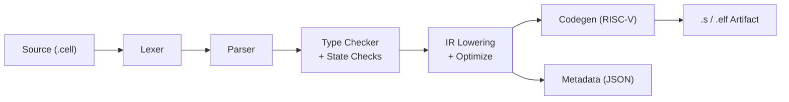
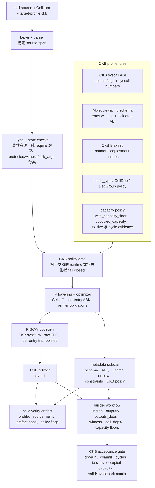

# CellScript

<p align="center">
  
</p>

[](https://github.com/tsukifune-kosei/CellScript/actions/workflows/ci.yml)
[](LICENSE-MIT)
[](Cargo.toml)
[](#target-profiles)
[](#包工作流)
[](#编辑器支持)
[](https://github.com/tsukifune-kosei/CellScript/wiki)

[English](README.md) | [中文](README_CH.md)

**用你思考 Cell 合约的方式来写 Cell 合约——而不是按线格式的方式来写。**

CellScript 是面向 CKB 的 Cell 模型智能合约 DSL。它把 `.cell`
源码编译为 ckb-vm RISC-V assembly 或 ELF 产物，并同时输出可用于审计、
策略检查、schema 绑定和调度感知执行的类型化 metadata。

在这份 README 中，metadata 指编译器输出的机器可读语义事实：schema layout、
Cell effects、access summaries、source hashes、verifier obligations、
runtime requirements 和 target-profile policy flags。

CellScript 是刻意收窄的语言：它不是新的 VM，也不是账户存储合约语言。
它为协议作者提供一种类型化方式来描述资产、共享 Cell 状态、receipt、
生命周期转换、lock 和交易形状的效果——同时仍然直接映射到 CKB
使用的 Cell 模型。

---

## 为什么需要 CellScript

CKB 暴露了强大的 Cell 执行模型，但手写脚本会迫使作者靠近线
格式工作：

- 手动解析 witness bytes
- 按 index 跟踪 inputs、CellDeps、outputs 和 output data
- 把类型化状态编码进原始 byte arrays
- 用 RISC-V C 或汇编直接调用 syscall 编号
- 依靠约定而不是编译器维护线性资产语义

CellScript 把这些工作提升为显式语言构造：`resource`、`shared`、
`receipt`、`action`、`lock`，`read`、`protected`、`witness`、
`lock_args` 等来源限定符，以及 `consume`、`create`、`destroy` 等
Cell effect。`std::lifecycle::transfer`、`std::receipt::claim` 和
`std::lifecycle::settle` 这样的高阶生命周期模式会展开成这些显式
effect，而不是作为 compiler-core verb 存在。

## 当前状态

CellScript 目前处于 CKB-focused alpha / stabilization 阶段。

它适合用于：
- 试验 CKB Cell-contract authoring；
- 编译并检查内置示例；
- 探索类型化 Cell effects、metadata、constraints 和 CKB target-profile
  checks；
- 试用本地 VS Code 扩展和 LSP tooling。

它尚不建议在没有人工审查和审计的情况下直接用于 mainnet 部署。当前重点是
developer-readiness、diagnostics、ProofPlan / metadata assurance，以及
CKB target-profile stability。

## 快速开始

从仓库安装：

```bash
cd cellscript
cargo install --path .
```

编译你的第一个合约：

```bash
# 仅做类型检查
cellc examples/token.cell

# 输出 CKB 的 RISC-V ELF
cellc examples/token.cell --target riscv64-elf --target-profile ckb --primitive-strict 0.16

# 输出 CKB 的 RISC-V ELF，指定入口 action
cellc examples/nft.cell --target riscv64-elf --target-profile ckb --primitive-strict 0.16 --entry-action transfer
```

创建包：

```bash
cellc init token-package
cd token-package
cellc add shared-types --path ../shared-types
cellc build --target riscv64-elf --target-profile ckb
```

运行 CKB profile 检查：

```bash
cellc check --target-profile ckb
```

检查编译器能解释的 token 示例信息：

```bash
cellc metadata examples/token.cell --target-profile ckb --json
cellc constraints examples/token.cell --target-profile ckb
cellc scheduler-plan examples/token.cell --target-profile ckb
```

这些命令展示编译器认为协议会 read、write、create、consume、assume 什么，
以及它向 CKB-facing policy tooling 暴露了什么。

> **下一步：** 阅读[语言模型](#核心模型)、[完整示例](#示例)，或深入了解[架构](#架构)。

---

## 示例

一个 module 包含 schema 声明和可执行入口。持久值用 `resource`、`shared`
或 `receipt` 声明；可执行逻辑用 `action` 或 `lock` 声明；效果用显式生命
周期操作表达。

**声明：**

```cellscript
module cellscript::example

struct Config {
    threshold: u64
}

resource Token has store, create, consume, replace, burn, relock {
    amount: u64
    symbol: [u8; 8]
}

shared Pool has store {
    token_reserve: u64
    ckb_reserve: u64
}

receipt VestingGrant has store, create, consume {
    beneficiary: Address
    amount: u64
    unlock_epoch: u64
}

struct Wallet {
    owner: Address
}

lock owner_only(protected wallet: Wallet, witness claimed_owner: Address) -> bool {
    verification
        require wallet.owner == claimed_owner
}
```

**效果：**

```cellscript
action transfer_token(token: Token, to: Address) -> next_token: Token {
    verification
        require token.amount > 0, "empty token"

        consume token

        create next_token = Token {
            amount: token.amount,
            symbol: token.symbol
        } with_lock(to)
}
```

编译器把 `consume`、`create`、`destroy`、action 边界的来源参数、
表达式层的 `read_ref<T>()`，以及 compiler-recognized stdlib lifecycle
patterns 当作 **Cell effect**，而不是普通 opaque function call。这些
effect 会反映到 metadata 中，使 CKB admission policy、schema decoding
和 artifact verification 都能审计生成脚本。

**完整的 fungible-token 示例：**

```cellscript
module cellscript::fungible_token

resource Token has store, create, consume, replace, burn, relock {
    amount: u64
    symbol: [u8; 8]
}

resource MintAuthority has store {
    token_symbol: [u8; 8]
    max_supply: u64
    minted: u64
}

action mint(auth_before: MintAuthority, to: Address, amount: u64) -> (auth_after: MintAuthority, token: Token) {
    transition auth_before -> auth_after

    verification
        require auth_before.minted + amount <= auth_before.max_supply, "exceeds max supply"
        require auth_after.token_symbol == auth_before.token_symbol
        require auth_after.max_supply == auth_before.max_supply
        require auth_after.minted == auth_before.minted + amount

        create token = Token {
            amount: amount,
            symbol: auth_before.token_symbol
        } with_lock(to)
}

action transfer_token(token: Token, to: Address) -> next_token: Token {
    verification
        consume token

        create next_token = Token {
            amount: token.amount,
            symbol: token.symbol
        } with_lock(to)
}

action burn(token: Token) {
    verification
        require token.amount > 0, "cannot burn zero"
        destroy token
}
```

**内置协议示例：**

| 示例 | 展示内容 |
|---|---|
| `examples/token.cell` | Mint、transfer、burn，带同 symbol guard 的 token merge |
| `examples/timelock.cell` | 时间门控状态转换、延迟 claim 路径 |
| `examples/multisig.cell` | 授权阈值、签名导向的 lock 逻辑 |
| `examples/nft.cell` | 唯一资产、metadata、所有权转移 |
| `examples/vesting.cell` | Receipt-style grants 和显式 claim 状态转换 |
| `examples/amm_pool.cell` | Shared pool state、swap/liquidity effects |
| `examples/launch.cell` | Launch/pool composition patterns |

非生产语言示例位于 `examples/language/`。这些文件用于验证编译器和工具面，
不属于七个文件的 CKB production acceptance matrix。`registry.cell` 覆盖
bounded local `Vec<Address>` / `Vec<Hash>` helper；顶层
`examples/registry.cell` 是这个语言示例的兼容镜像。`order_book.cell` 是
local stack-backed order vector 草图，不宣称持久化 order-book 语义。v0.14
language examples 覆盖 CKB source/witness、capacity/time、TYPE_ID、Spawn/IPC
和 dynamic BLAKE2b 等编译器/工具面。

## 对比

CellScript 为什么围绕 typed Cells、线性资源、显式交易 effect 和 ckb-vm
artifact 设计——而不是围绕账户存储或单链专用 VM：

| 维度 | CellScript | Solidity | Move | Sway |
|---|---|---|---|---|
| 执行目标 | ckb-vm 上 RISC-V ELF/asm | EVM bytecode | Move bytecode | FuelVM bytecode |
| 状态模型 | 类型化 Cells，显式 inputs/deps/outputs | 账户存储槽 | 全局存储中的 resources | UTXO + 原生资产 |
| 资产模型 | 原生 `resource`、生命周期、receipt、shared Cells | 手写 token contracts | 原生 resources | 原生资产 |
| 线性所有权 | 编译器强制 | 无 | 通过 abilities | 无通用用户定义 |
| 共享状态 | 显式 `shared` Cells | 隐式 contract storage | 部分 Move 链的 shared objects | 无 shared Cell 对应物 |
| 重入 | 无 callback 风格重入 | 常见风险面 | 设计上较低 | predicate 风险较低 |
| 调度 metadata | CKB 原生支持 | 无 | 非 GhostDAG 导向 | predicate 级 |
| CKB 兼容性 | 面向 bundled Cell suite 的 production-gated CKB ckb-vm artifact profile | 需要不同 VM | 需要不同 VM | 需要 FuelVM |

与手写 CKB 脚本相比，CellScript 保留同一个 runtime substrate，
但用类型化 Cell 操作、线性检查、schema metadata 和可被策略验证的产物取代
原始 byte/syscall 编程。

---

## 编辑器支持

CellScript 为早期用户提供 production-style 的本地语言工具：

- **In-process LSP** — 诊断、补全、hover、go-to-definition、引用、重命名、
  格式化和 metadata-oriented code actions。编译器 crate 暴露 `LspServer`；
  `cellc --lsp` 提供完整的 `tower-lsp` JSON-RPC stdio 传输。
- **VS Code 扩展** — 语法高亮、snippets、on-save 诊断、compiler-backed
  格式化、scratch compile、metadata/constraints/production report、
  CKB target-profile 参数和状态栏反馈。它调用 `cellc`（或 `cargo run` 回退），
  所以编辑器行为和 CLI/CI 保持一致。

0.19 的 ecosystem reuse 工作加入了正式的 headless
`cellscript-ckb-adapter` crate。编译器输出语义 action plan 和 ABI evidence；
adapter 用 `ckb-sdk-rust` 物化 CKB transaction shape，并记录本地节点验收证据。
它不是钱包 UI、前端组件包，也不是 CellFabric intent engine。

- [VS Code 扩展](https://github.com/tsukifune-kosei/CellScript/tree/main/editors/vscode-cellscript)
- [运行时错误码](https://github.com/tsukifune-kosei/CellScript/blob/main/docs/CELLSCRIPT_RUNTIME_ERROR_CODES.md)
- [Entry witness ABI](https://github.com/tsukifune-kosei/CellScript/blob/main/docs/CELLSCRIPT_ENTRY_WITNESS_ABI.md)
- [Collections 支持矩阵](https://github.com/tsukifune-kosei/CellScript/blob/main/docs/CELLSCRIPT_COLLECTIONS_SUPPORT_MATRIX.md)
- [Output binding](https://github.com/tsukifune-kosei/CellScript/blob/main/docs/CELLSCRIPT_OUTPUT_BINDINGS.md)
- [历史 Signature-direction 执行计划](https://github.com/tsukifune-kosei/CellScript/blob/main/docs/archive/0.13/CELLSCRIPT_SIGNATURE_DIRECTION_EXECUTION_PLAN.md)
- [CKB target profile tutorial](https://github.com/tsukifune-kosei/CellScript/blob/main/docs/wiki/Tutorial-05-CKB-Target-Profiles.md)
- [CKB deployment manifest](https://github.com/tsukifune-kosei/CellScript/blob/main/docs/CELLSCRIPT_CKB_DEPLOYMENT_MANIFEST.md)
- [Capacity 与 builder contract](https://github.com/tsukifune-kosei/CellScript/blob/main/docs/CELLSCRIPT_CAPACITY_AND_BUILDER_CONTRACT.md)
- [CKB adapter boundary](https://github.com/tsukifune-kosei/CellScript/blob/main/docs/CELLSCRIPT_CKB_ADAPTER.md)
- [CKB ecosystem reuse audit](https://github.com/tsukifune-kosei/CellScript/blob/main/docs/CELLSCRIPT_CKB_ECOSYSTEM_REUSE_AUDIT.md)
- [ckb-std compatibility](https://github.com/tsukifune-kosei/CellScript/blob/main/docs/CELLSCRIPT_CKB_STD_COMPAT.md)
- [线性所有权](https://github.com/tsukifune-kosei/CellScript/blob/main/docs/CELLSCRIPT_LINEAR_OWNERSHIP.md)
- [Scheduler hints](https://github.com/tsukifune-kosei/CellScript/blob/main/docs/CELLSCRIPT_SCHEDULER_HINTS.md)
- [Metadata verification and production gates](https://github.com/tsukifune-kosei/CellScript/blob/main/docs/wiki/Tutorial-06-Metadata-Verification-and-Production-Gates.md)
- [标准库](https://github.com/tsukifune-kosei/CellScript/blob/main/docs/wiki/Tutorial-10-Standard-Library.md)
- [Operational semantics](https://github.com/tsukifune-kosei/CellScript/blob/main/docs/spec/CELLSCRIPT_OPERATIONAL_SEMANTICS.md)
- [CKB hashing workflow 示例](https://github.com/tsukifune-kosei/CellScript/blob/main/docs/examples/ckb_hashing.md)
- [Collections matrix 示例](https://github.com/tsukifune-kosei/CellScript/blob/main/docs/examples/collections_matrix.md)
- [Deployment manifest 示例](https://github.com/tsukifune-kosei/CellScript/blob/main/docs/examples/deployment_manifest.md)
- [Output append 示例](https://github.com/tsukifune-kosei/CellScript/blob/main/docs/examples/output_append.md)
- [路线图 overview](https://github.com/tsukifune-kosei/CellScript/blob/main/roadmap/CELLSCRIPT_ROADMAP.md)
- [0.13 release scope](https://github.com/tsukifune-kosei/CellScript/blob/main/docs/releases/CELLSCRIPT_0_13_RELEASE_SCOPE.md)
- [0.14 roadmap](https://github.com/tsukifune-kosei/CellScript/blob/main/roadmap/CELLSCRIPT_0_14_ROADMAP.md)
- [0.14 release notes draft](https://github.com/tsukifune-kosei/CellScript/blob/main/docs/releases/CELLSCRIPT_0_14_RELEASE_NOTES_DRAFT.md)
- [0.15 roadmap](https://github.com/tsukifune-kosei/CellScript/blob/main/roadmap/CELLSCRIPT_0_15_ROADMAP.md)
- [0.16 roadmap](https://github.com/tsukifune-kosei/CellScript/blob/main/roadmap/CELLSCRIPT_0_16_ROADMAP.md)
- [0.16 release notes draft](https://github.com/tsukifune-kosei/CellScript/blob/main/docs/CELLSCRIPT_0_16_RELEASE_NOTES_DRAFT.md)
- [0.17 roadmap](https://github.com/tsukifune-kosei/CellScript/blob/main/docs/0.17/CELLSCRIPT_0_17_ROADMAP.md)
- [0.18 roadmap](https://github.com/tsukifune-kosei/CellScript/blob/main/docs/CELLSCRIPT_0_18_ROADMAP.md)
- [0.19 roadmap](https://github.com/tsukifune-kosei/CellScript/blob/main/docs/CELLSCRIPT_0_19_ROADMAP.md)

---

## 架构

CellScript 是一个多遍编译器，把 `.cell` 源码通过五个定义明确的阶段 lower，
然后输出 RISC-V 产物、类型化 metadata 和 profile 感知策略检查。下面列出的
每个模块都位于单一 Rust crate（`cellscript`）中，在 `src/` 下有自己的
`mod.rs` 入口。



### 编译流水线

**1. 词法分析**（`lexer/`）
扫描 `.cell` 源码生成类型化 token 流。处理 CellScript 关键字、运算符、
字面量和字符串插值。每个 token 携带行/列 span 用于诊断。

**2. 语法解析**（`parser/`）
从 token 流构建 AST。AST 建模完整 CellScript 表面语法：`resource`、
`shared`、`receipt`、`struct`、`enum`、`action`、`lock`、`function`、
`use`、`const`、capability gates、声明式 flow、action `transition`
子句、`verification` proof section，以及所有语句/表达式形式。

**3. 语义分析**（`types/` + `flow/`）
- *类型检查* — 强制线性资源语义：每个 `resource`/`receipt` 值在 action
  体退出前必须进入显式 lifecycle 或 output-binding 角色。同时验证
  shared-state 可变性规则、capability gates、effect 分类（`Pure` /
  `ReadOnly` / `Mutating` / `Creating` / `Destroying`）和调用签名。
- *状态转换检查* — 验证显式 state 字段、`flow` 转换图、action
  `transition` 子句、合法状态转换、静态 create-site 检查，以及
  `verification` section 中的分支输出字段约束一致性。

**4. IR 降低**（`ir/` + `optimize/` + `resolve/`）
- *`resolve/`* — 构建每模块符号表，解析跨包 `use` 导入。
- *`ir/`* — 将类型化 AST 降低为扁平的、面向 RISC-V 的中间表示
  （`IrAction`、`IrLock`、`IrPureFn`、`IrTypeDef`），带显式 Cell-effect
  指令（`IrConsume`、`IrCreate`、`IrReadRef`、`IrDestroy`）、
  cell-metadata equality checks、witness/layout 槽位分配和 verifier
  obligations。
- *`optimize/`* — 在 `-O1+` 时做语法局部常量折叠和死分支裁剪。刻意保守
  以保留资源语义。

**5. 代码生成**（`codegen/`）
输出 ckb-vm 兼容 RISC-V assembly（`.s`）或 ELF（`.elf`）：
- Syscall wrapper：`ckb_load_cell_data`、`ckb_load_witness`、
  `ckb_load_header_by_field`、`ckb_load_input_by_field`。
- Cell input/output/dep 索引映射、witness ABI 帧、运行时 scratch buffer
  和每入口点 trampoline。
- Profile 切换的 syscall ABI — CKB 使用特定的 syscall 编号表和
  source-flag 约定。

### Metadata 与策略

编译器输出单个 JSON metadata sidecar（`.elf.meta.json` / `.s.meta.json`），
涵盖链调度器、审计工具和策略门禁所需的一切——无需重新解析源码：

| 内容 | 产生者 | 消费者 |
|---|---|---|
| Schema 布局、type ID、字段偏移 | `ir/` | Schema 解码器、索引器 |
| Effect 分类、资源摘要 | `types/` | 调度器、审计工具 |
| Scheduler witness ABI 与访问域 | `codegen/`（CKB） | CKB 区块构建器、并行调度器 |
| 源码哈希、artifact CKB Blake2b | `lib.rs` | `cellc verify-artifact`、CI |
| Verifier obligations、pool invariants | `ir/` | 链上 verifier、策略检查器 |
| Target-profile 策略违规 | `lib.rs` | `cellc check`、CI |

`cellc constraints` 输出关注生产就绪性的可读子集：ABI slot 用量、寄存器/
stack-spill 布局、witness byte bounds、CKB cycle/capacity 估算。

### 运行时与标准库

| 模块 | 作用 |
|---|---|
| **Stdlib**（`stdlib/`） | 降低到显式 verifier effect 的内置函数和 compiler-recognized patterns：`std::lifecycle::transfer`、`std::receipt::claim`、`std::lifecycle::settle` 等 lifecycle helpers，`std::cell::preserve_type`、`std::cell::preserve_lock`、`std::cell::preserve_capacity` 等 cell metadata helpers，以及 ckb-vm syscall/runtime helpers。模块注入，不单独链接。 |
| **Collections**（`stdlib/collections.rs`） | bounded stack-backed `Vec<T: FixedWidth>` helpers，用于 verifier-local value：`new`、`with_capacity`、`capacity`、`push`、`extend_from_slice`、`len`、`is_empty`、indexing、`first`、`last`、`contains`、`set`、`remove`、`pop`、`insert`、`reverse`、`truncate`、`swap`、`clear`。Cell-backed collection ownership 仍不支持。 |

### 工具面

| 工具 | 模块 | 工作方式 |
|---|---|---|
| **CLI** | `cli/` + `main.rs` | `cellc` 二进制，包含所有子命令 |
| **LSP** | `lsp/` + `lsp/server.rs` | In-process `LspServer` + `tower-lsp` JSON-RPC over stdio（`cellc --lsp`） |
| **VS Code** | `editors/vscode-cellscript/` | 调用 `cellc` 实现高亮、诊断、报告 |
| **Formatter** | `fmt/` | 幂等格式化器，服务于 `cellc fmt` 和 LSP |
| **Doc 生成器** | `docgen/` | 从 AST + metadata 生成 HTML/Markdown/JSON 文档 |
| **模拟器** | `simulate.rs` | 符号求值器——输出 `TraceEvent` 日志，无需 ckb-vm |
| **REPL** | `repl.rs` | 交互式 read-eval-print loop |

### 包与构建系统

| 模块 | 作用 |
|---|---|
| **包工作流**（`package/`） | `Cell.toml` 解析、本地 path 依赖解析、传递 `Cell.lock` 可复现性、`cellc init`/`add`/`remove`/`install --path`/`update`/`info`。Registry publish 与 registry 依赖解析已具形状但 fail-closed。 |
| **增量编译器**（`incremental/`） | 依赖图感知构建缓存——输入未变时跳过重编译。 |
| **构建集成**（`lib.rs`） | 解析 `Cell.toml` → `CellBuildConfig`，合并 CLI + manifest 选项，选择入口 scope，运行策略门禁，写入 artifact + metadata。 |

### CKB Target Profile

CKB profile 不是最后一步的打包开关。它是一层贯穿语义分析、代码生成、
metadata 输出和发布证据的策略层。目标是在 artifact 被认为可部署之前，把
CKB 假设暴露出来。



这里分成三条边界：

- **编译器边界** — parse、type/state checks、CKB policy rejection、IR、
  codegen 和 metadata；
- **artifact 边界** — `cellc verify-artifact` 证明 artifact、sidecar、源码
  hash、target profile 和选定 policy flags 一致；
- **链上证据边界** — builder 和 acceptance 脚本证明具体 CKB 交易形状、
  capacity、cycles、tx size，以及 lock/action 行为。

这个 profile 里的 capacity 分成两层：`with_capacity_floor(shannons)` 声明
某个类型输出的最低容量，并进入 metadata 和 constraints；
`occupied_capacity("TypeName")` 继续提供运行时可见的 capacity 检查。二者都
不替代 builder 证据：最终交易仍然要测量 occupied capacity，确保 output
capacity 足够，并保留 tx-size evidence。

### Wasm 门禁

`wasm/` 是一个 **fail-closed** 审计脚手架：它参与编译和测试，但显式拒绝
可执行 CellScript 入口，因为 CellScript 没有生产级 Wasm 后端。仅类型的
IR 模块输出审计报告；其他入口返回
`WasmSupportStatus::UnsupportedProgram`。该模块的存在是为了防止隐藏的
过时后端偏离当前 IR。

---

## 参考

### Manifest

`Cell.toml` 设置包入口、source roots、target profile 和策略默认值：

```toml
[package]
name = "token"
version = "0.17.0"
entry = "src/main.cell"
source_roots = ["src"]

[build]
target = "riscv64-elf"
target_profile = "ckb"

[policy]
production = true
deny_fail_closed = true
deny_ckb_runtime = false
deny_runtime_obligations = false
```

命令行 flags 可以在构建或 CI 中进一步收紧策略检查。

### 包工作流

CellScript 在 `cellc` 中提供本地优先的包工作流。本地包、source roots、
path dependencies、lockfile 刷新，以及 package build/check/doc/fmt 流程
已经按生产式工作流收口。Registry publish 和 registry 依赖解析仍是实验性
能力，并保持 fail-closed。

**当前支持：**

- `cellc init` — 创建带 `Cell.toml` 的应用包或 library package
- `cellc build` / `check` / `doc` / `fmt` — 操作当前 package
- 顶层 `cellc <input>` 和报告类命令在支持输入参数时接受 `.cell` 文件、
  package 目录或 `Cell.toml` manifest
- `cellc add --path` — 把本地 path 依赖写入 `Cell.toml`
- `cellc install --path` 与 `cellc update` — 解析本地 path 依赖图并刷新
  `Cell.lock`
- 本地 path dependencies 会递归解析，参与 module loading、source hashing
  和 metadata
- `Cell.lock` — 记录直接和传递依赖的解析身份，用于可复现检查
- `cellc info --json` — 为 CI 和工具输出 package metadata

**实验性 / fail-closed：**

- Registry `publish`、registry package install/resolution 和 `login` 已有命令
  形状，但在 registry backend 和 trust model 定稿前会 fail closed
- Git dependencies 是显式 remote source fetch；应当作为需要审查的输入，
  而不是 registry 生产路径

### CLI 命令

| 命令 | 用途 |
|---|---|
| `cellc <input>` | 编译 `.cell` 文件、包目录或 `Cell.toml` |
| `cellc build` | 编译包，写入 artifact + metadata |
| `cellc check` | 类型检查和 lowering，不写入 artifact |
| `cellc metadata` | 输出 lowering、runtime、scheduler、source 和 schema metadata |
| `cellc constraints` | 输出 profile-aware 生产约束 |
| `cellc abi` | 说明 action 或 lock 的 `_cellscript_entry` witness ABI 布局 |
| `cellc entry-witness` | 编码 `_cellscript_entry` witness 字节 |
| `cellc scheduler-plan` | 消费 scheduler hints，输出串行/冲突策略报告 |
| `cellc ckb-hash` | 为 builder 和 release evidence 计算 CKB 默认 Blake2b-256 hash |
| `cellc opt-report` | 对比 O0..O3 的 artifact size 和 constraints status |
| `cellc verify-artifact` | 用 metadata sidecar 校验 artifact |
| `cellc test` | 运行编译器/policy 测试（非可信 runtime 执行） |
| `cellc doc` | 生成 API 和审计文档 |
| `cellc fmt` | 格式化 `.cell` 源码或检查格式 |
| `cellc init` | 创建 package skeleton |
| `cellc add` / `remove` | 修改本地包依赖 |
| `cellc install --path` / `update` | 解析本地 path 依赖并刷新 `Cell.lock` |
| `cellc info` | 输出 manifest 和 package 信息 |
| `cellc repl` | 启动交互式 REPL |
| `cellc run` | 通过 VM runner 或 simulator 运行 ELF 入口 |
| `cellc publish` / registry `install` / registry-backed `update` / `login` | 实验性 registry 流程，fail-closed |

### CLI 选项

| 选项 | 用途 |
|---|---|
| `--target riscv64-asm` | 输出 RISC-V assembly |
| `--target riscv64-elf` | 输出 RISC-V ELF artifact |
| `--target-profile ckb` | 使用 CKB profile |
| `--entry-action <ACTION>` | 将单个 action 编译为 artifact entrypoint |
| `--entry-lock <LOCK>` | 将单个 lock 编译为 artifact entrypoint |
| `--json` | 在支持的命令中输出机器可读 summary |
| `--production` | 启用 production-oriented metadata policy checks |
| `--deny-fail-closed` | 拒绝 fail-closed runtime features 或 obligations |
| `--deny-ckb-runtime` | 拒绝 CKB transaction/syscall runtime requirements |
| `--deny-runtime-obligations` | 拒绝 runtime-required verifier obligations |

---

## 项目结构

```text
cellscript/
├── src/                 # compiler, parser, type checker, lowering, codegen, CLI
├── examples/            # example contracts and protocol patterns
├── tests/               # compiler and CLI tests
└── editors/
    └── vscode-cellscript/
```

## License

License metadata 在 [`Cargo.toml`](Cargo.toml) 中声明。仓库包含
[`LICENSE-MIT`](LICENSE-MIT)。
