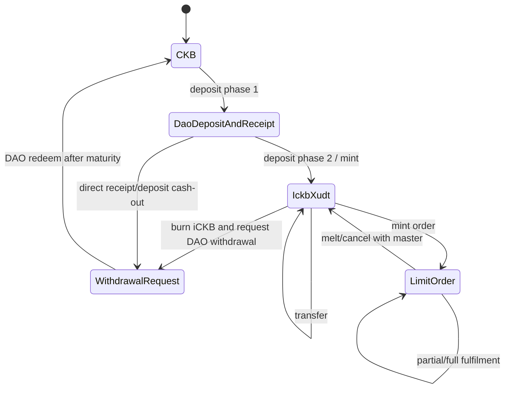

# iCKB Protocol Semantics Extracted For CellScript Benchmark

This document extracts the subset of iCKB semantics used by the CellScript
benchmark. Source references point to iCKB v1-core commit
`f7bbf7fe691d449a68a4b973d3102b7af28b2c9b` and proposal commit
`055f0cb2c44b2988531c241a6f7167397bbe42c7`.

## State Machine

## Cell And Action Table

| Item | Semantics | Original references |
|---|---|---|
| DAO deposit controlled by iCKB Logic | DAO deposit data must be 8 zero bytes, type is DAO, lock is iCKB Logic. | Proposal `README.md:206-215`; `ickb_logic/src/celltype.rs:68-72`; `utils/src/dao.rs:17-23` |
| iCKB receipt | Type is iCKB Logic; data has quantity and unoccupied capacity. | Proposal `README.md:201-214`; `ickb_logic/src/utils.rs:18-40` |
| iCKB xUDT | xUDT args bind iCKB Logic script hash plus owner-mode input-type flags `0x80000000`. | Proposal `README.md:283-286`; `ickb_logic/src/constants.rs:1-3`; `ickb_logic/src/celltype.rs:116-124` |
| Deposit phase 1 | Output DAO deposits must be matched by receipts grouped by same unoccupied capacity; min/max unoccupied capacity enforced. | Proposal `README.md:182-215`; `ickb_logic/src/entry.rs:86-139` |
| Deposit phase 2 | Input receipts plus input iCKB tokens must equal output iCKB tokens. Header dep must supply the receipt block accumulated rate. | Proposal `README.md:265-286`; `ickb_logic/src/entry.rs:21-36`, `39-83`; `utils/src/utils.rs:54-61` |
| Withdrawal request | Burn iCKB/receipts against input deposits, using accumulated rate from deposit/receipt headers. Proposal says greater-than-or-equal; Rust script enforces exact equality globally. | Proposal `README.md:316-362`; `ickb_logic/src/entry.rs:31-33` |
| Redeem after maturity | DAO second withdrawal is governed by NervosDAO since/header rules; iCKB helper Owned-Owner handles restricted lock shape. | Proposal `README.md:318-334`, `438-505`; `owned_owner/src/entry.rs:41-47` |
| Owned-Owner mint/melt | Every owned withdrawal cell must pair with exactly one owner cell by relative index/metapoint. Script must not be both lock and type in same cell. | Proposal `README.md:450-505`; `owned_owner/src/entry.rs:15-66`, `76-90` |
| Limit Order mint | Output order cell is locked by Limit Order and has UDT type; output master cell has Limit Order as type. | Proposal `README.md:592-637`; `limit_order/src/entry.rs:34-57`, `163-263` |
| Limit Order match | Input and output order info must match; value must not decrease; partial fill must satisfy min match; order cannot mutate after fulfilled; Match outputs carry the absolute master OutPoint while existing input orders may still carry Mint-relative master distance. | Proposal `README.md:639-655`; `limit_order/src/entry.rs:86-133`, `163-263` |
| Limit Order melt/cancel | Input order and master must both be consumed and refer to same implicit master metapoint. | Proposal `README.md:685-688`; `limit_order/src/entry.rs:62-80`, `163-207` |

## Critical Invariants

| Invariant | Source logic | Benchmark coverage |
|---|---|---|
| Empty script args for iCKB/Owned-Owner/Limit Order script uses | `has_empty_args` checks current script args and output lock args. `utils/src/utils.rs:14-35` | v0.17 CellScript lowers `ckb::require_current_script_args_empty()` to an executable `LOAD_SCRIPT` Molecule Script empty-args check and mirrors iCKB's output-lock scan: Output locks with the same code hash/hash type as the executing script must also have empty args. `ckb::require_cell_lock_args_empty(source_view)` / `ckb::require_cell_type_args_empty(source_view)` remain available for SourceView lock/type empty-args checks. The selected matrix includes non-empty script-args reject evidence; broader args scan ergonomics remain separate work. |
| Script code_hash/hash_type binding | iCKB-style integrations must bind referenced lock/type Scripts to the expected deployed code identity, not only to token data fields. | v0.17 CellScript lowers `ckb::require_cell_lock_script_hash_type(source_view, expected_code_hash, expected_hash_type)` and `ckb::require_cell_type_script_hash_type(...)` to executable Molecule Script prefix checks. `ickb_logic.cell::mint_from_receipt` uses the type-script variant to bind xUDT Type Script identity before owner-mode args checks. The 0.18 research line adds `Hash::from_bytes`, `script::new`, and exact lock/type Script matching used by Owned-Owner related-script rows. |
| 32-byte Script args owner/type binding | Owner/TYPE_ID-style CKB scripts commonly bind authority or identity through 32-byte `Script.args`. Owned-Owner also depends on lock/type relation shape. | v0.17 CellScript lowers `ckb::require_cell_lock_args_hash(source_view, expected_hash)` and `ckb::require_cell_type_args_hash(source_view, expected_hash)` to executable Molecule Script args checks. `owned_owner.cell::owned_unlock` binds a lock-args `Hash`; 0.18 adds first-class fixed-byte Script construction, while broader group scans remain open. |
| DAO deposit receipt matching | Output deposits counted by unoccupied capacity must equal output receipt quantities. `ickb_logic/src/entry.rs:86-139` | Selected deposit phase-1 pass/reject rows now have original-vs-CellScript CKB VM differential evidence. No protocol-specific receipt pairing helper is exposed from the generic compiler surface. |
| Deposit size bounds | `DepositTooSmall` and `DepositTooBig` at `ickb_logic/src/entry.rs:99-105` | Selected deposit too-small and too-big rows have original-vs-CellScript CKB VM differential evidence. Generic output-cell occupied/unoccupied capacity pairing remains outside the public helper surface. |
| DAO type and deposit/withdrawal data shape | iCKB `utils::dao::has_dao_type` compares the cell type hash to the DAO hash constant; `is_deposit_data` accepts only exact 8 zero bytes, and `is_withdrawal_request_data` accepts only exact 8 non-zero bytes. `utils/src/dao.rs:12-31` | v0.17 CellScript lowers `dao::has_dao_type(source_view)` to a full 32-byte TypeHash comparison against the iCKB DAO hash, and lowers `dao::is_deposit_data(source_view)` / `dao::is_withdrawal_request_data(source_view)` to executable `LOAD_CELL_DATA` classifiers with the same 8-byte zero/non-zero rule |
| Receipt cannot be empty | `EmptyReceipt` at `ickb_logic/src/entry.rs:111-116` | Model code supports this failure class |
| No unauthorized mint/burn | Exact equation `in_udt + in_receipts == out_udt + in_deposits`. `ickb_logic/src/entry.rs:31-33` | Selected mint, quantity-two mint, mixed receipt-group, amount inflation, amount deflation, and withdrawal token-burn rows have differential VM evidence. v0.17 has executable xUDT group delta helpers and strict declared `assert_delta` bridges; 0.18 receipt rows decode executable quantity/amount bytes before recomputing xUDT output amounts. Generic full-equation lowering remains open. |
| Correct accumulated rate and 10% oversized discount | `deposit_to_ickb` loads header DAO AR via `extract_accumulated_rate`, which reads 8 bytes at full header offset `160 + 8` (`utils/src/utils.rs:51-57`), computes raw iCKB value, and discounts capacity above the soft cap by 10%. `ickb_logic/src/entry.rs:71-83` | `ickb_logic.cell::discounted_ickb_value` expresses the arithmetic formula; `dao::accumulated_rate` reads HeaderDep DAO field offset `8`, `dao::input_accumulated_rate` reads input committed header offset `160 + 8` via `LOAD_HEADER` and fail-closes on helper status, and `dao::require_header_dep_for_input` adds an executable DAO-field lineage bridge. Selected wrong-rate and mint-rate rows now have CKB VM differential evidence; generic full receipt/deposit aggregate lowering remains open. |
| Header dep required | `load_header` fails if header for input/source is absent. `utils/src/utils.rs:54-61` | Selected missing-header and wrong-header rows have CKB VM differential evidence; v0.17 generated code has helpers that fail closed when the supplied HeaderDep/source view cannot be loaded. |
| DAO relative epoch since maturity | DAO redeem paths must only proceed after the consumed DAO input reaches the required since/maturity threshold. CKB RFC0017 encodes epoch locks as `number | index<<24 | length<<40` plus epoch/relative flags. | `ickb_logic.cell::redeem_mature` now calls `ckb::since_epoch_relative(request.maturity_epoch, 0, 1)`, `dao::require_input_since_at_least`, and `dao::require_input_relative_epoch_since_at_least`. The generated helper loads input `since`, validates relative epoch flags and epoch fraction shape, and compares epoch fractions. Selected mature/immature DAO withdrawal rows have original-vs-CellScript CKB VM differential evidence. |
| xUDT args binding | Script hash computed from xUDT code hash and iCKB Logic hash plus flags. `ickb_logic/src/celltype.rs:116-124` | Positive `valid_ickb_transfer`; negative `wrong_xudt_binding`; v0.17 CellScript has executable owner-mode Type args verifiers for both explicit `[logic_hash, 0x80000000]` checks and `LOAD_SCRIPT_HASH(current script)` binding. `ckb::current_script_hash() -> Hash` also exposes the current hash as a generic 32-byte operand for xUDT and lock/type helpers. The 0.18 research line adds first-class fixed-byte `Script` construction and exact lock/type Script matching. |
| xUDT transfer/delta conservation | Current type-group input/output token amount sums must be equal for ordinary transfer paths; mint/burn paths must match the exact computed delta. | Positive `valid_ickb_transfer`; v0.17 CellScript now has `xudt::require_group_amount_conserved()` for exact u128 group amount equality and `xudt::require_group_amount_minted/burned(delta)` for exact token-side deltas. Strict mode can bind declared conservation and mint/burn `assert_delta` aggregates to the matching helper. Delta operands may be local `u128` add/sub/mul/div/function-return values. Mint-side receipt/deposit/DAO aggregation and full redeem accounting still need executable generic aggregate lowering and VM differential evidence. |
| Script role confusion | iCKB rejects invalid lock/type combinations; Limit Order and Owned-Owner reject cells where script is both lock and type. | Selected Owned-Owner script-role misuse rows have differential VM evidence. CellScript also exposes `ckb::current_role()` and full lock/type script checks; generic role-group scans remain future work. |
| Owned-Owner pair cardinality | For each metapoint, owned and owner counts must both be 1. Lock-only owned cells must also be DAO withdrawal request cells. `owned_owner/src/entry.rs:28-62`; pairwise owner metapoint is `extract_metapoint(owner) + owned_distance` at `owned_owner/src/entry.rs:76-89` | Selected valid, relative mismatch, missing/duplicate owner, missing owned, script misuse, non-withdrawal, owner-data length, related type, and related data-rule rows have differential VM evidence. CellScript supports signed `i32` distance bytes, combined input OutPoint binding, 32-byte owner lock args, pairwise `ckb::require_metapoint_relative`, fixed-distance current-script pair scans, i32-data-driven pair scans, and first-class Script matching for related Script rows. The remaining gap is first-class BTreeMap-style MetaPoint values and broader owner-auth semantics if promoted. |
| Limit Order value conservation | `i.ckb * ckb_mul + i.udt * udt_mul <= o.ckb * ckb_mul + o.udt * udt_mul`. `limit_order/src/entry.rs:102-105` | Positive `valid_limit_order_fulfillment`; negative `limit_order_underpayment`; CellScript benchmark now uses executable `c256::require_sum2_products_lte` for the core product-sum comparison |
| Limit Order master binding | Mint paths derive the master metapoint from signed `i32` distance and zero tx-hash padding; Match paths compare absolute master OutPoints. `limit_order/src/entry.rs:163-263` | `ckb::require_lock_type_metapoint_pairs_from_i32_data(source::output(0), 52)` covers mint-style distance scans. `ckb::require_lock_match_master_out_point_pairs_from_data(source::input(0), source::output(0), 16, 20, 52)` covers the Match bridge by accepting Mint-relative input encoding and requiring Match absolute-output encoding. Selected Limit Order rows have differential VM evidence; native first-class MetaPoint/OutPoint maps remain open. |
| Limit Order asset binding | UDT type hash is part of `Info`; input and output info must match. `limit_order/src/entry.rs:86-89`, `244-259` | Selected wrong-asset and UDT continuity rows have differential VM evidence, and CellScript checks full 32-byte type hash continuity through `ckb::cell_type_hash`. |
| Limit Order min partial fill | `InsufficientMatch` checks at `limit_order/src/entry.rs:115-128` | Selected exact min-match and insufficient-match rows have differential VM evidence. |

## Attack Classes

| Attack | Expected original behaviour | Benchmark fixture |
|---|---|---|
| Duplicate receipt / double mint | CKB input uniqueness plus exact accounting should fail duplicate spend attempts. | `duplicate_receipt_double_mint.json` |
| Forged receipt | Output receipt/deposit accounting mismatch fails. | `forged_receipt.json` |
| Wrong owner | Owned-Owner pairing/owner check fails. | `wrong_owner.json` |
| Owned-Owner relative-distance mismatch | Signed i32 MetaPoint relation must not be forged independently of the owner/owned pair. | `owned_owner_relative_distance_mismatch.json` |
| Owned-Owner related filter mismatch | Related-role current-script cells must match the expected TypeHash and generic data rule used by the filtered MetaPoint aggregate. | `owned_owner_related_type_hash_mismatch.json`, `owned_owner_related_data_rule_mismatch.json` |
| Wrong xUDT type args | iCKB xUDT hash classification fails. | `wrong_xudt_binding.json` |
| Wrong accumulated rate | Header-derived AR mismatch causes amount mismatch/fail. | `wrong_accumulated_rate.json` |
| Redeem before maturity | DAO/Owned-Owner flow must not redeem immature request. | `redeem_before_maturity.json`; selected DAO immature withdrawal rows now have original-vs-CellScript CKB VM differential evidence, and v0.17 also compiles generated raw and RFC0017 relative epoch-since checks in the redeem spec. |
| Amount inflation | Exact accounting fails. | `amount_inflation.json` |
| Amount deflation when exact equality required | Rust script rejects even if proposal withdrawal text suggests `>=`. | `amount_deflation_exact_equality.json` |
| Capacity violation | Deposit bounds fail. | `capacity_violation.json` |
| Script role confusion | Script misuse fails. | `script_role_confusion.json` |
| Limit order underpayment | Value conservation fails. | `limit_order_underpayment.json` |
| Limit order wrong asset | `Info` differs and fails. | `limit_order_wrong_asset.json` |
| Witness malformation | WitnessArgs `input_type` must be present, correctly shaped, and point to the intended deposit header when DAO withdrawal refers to a deposit header index. | Selected single-input and two-input malformed `input_type` rows have original-vs-CellScript CKB VM differential evidence for missing, empty, short, long, wrong-header-index, and out-of-bounds-index payloads. |
| Cell dep substitution | Expected script/cell dep set must be exact. | `cell_dep_substitution.json` |

## Ambiguities

- Proposal withdrawal accounting says input tokens/receipts must be greater than
  or equal to output tokens plus withdrawn deposits, but the Rust iCKB Logic
  script uses exact equality. The benchmark follows the Rust source and records
  this discrepancy as a semantic finding.
- iCKB maturity is mostly delegated to NervosDAO since/header rules and
  Owned-Owner lock shape. CellScript now has generated RFC0017 epoch-since
  constructors and a relative epoch maturity bridge for the selected input
  since field, but it still does not prove the full request/deposit/header
  lineage used by the deployed scripts.
- Limit Order front-end confusion heuristics described in the proposal are
  off-chain; they are out of scope for executable script equivalence.
