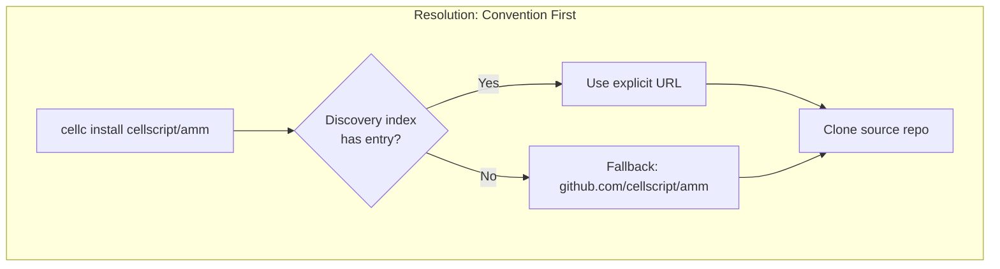
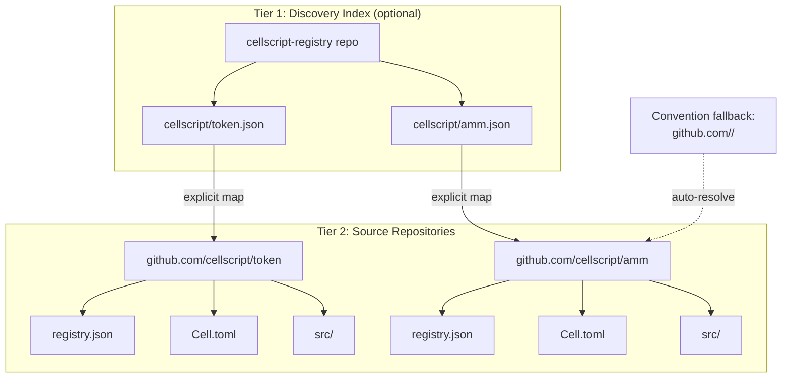
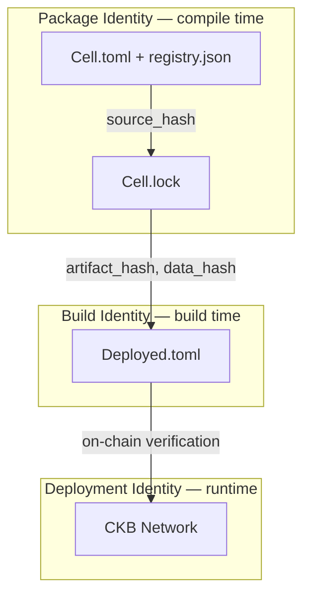
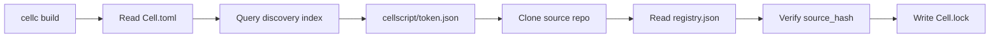
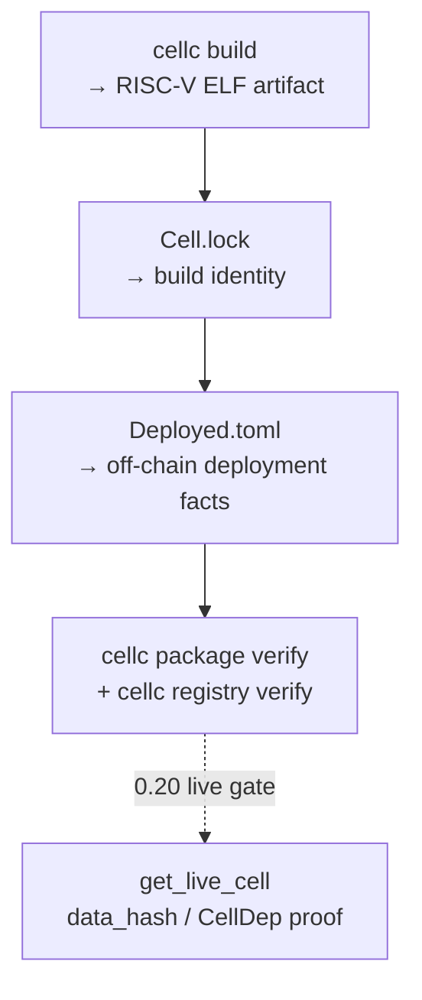

# CellScript Registry Phase 1: JoyID-Rooted Package Publishing for CKB Smart Contracts

**Status**: public walkthrough of the Phase 1 registry contract for the current
CellScript CKB profile. Policy decisions defer to
[`CELLSCRIPT_REGISTRY_PRODUCTION_BOUNDARY_ADR.md`](CELLSCRIPT_REGISTRY_PRODUCTION_BOUNDARY_ADR.md).

Publishing and consuming smart contract libraries should feel like a normal
package workflow: `cellc publish` publishes a package, and the registry shows
the new entry. The CellScript public registry policy therefore treats publish
as a real registry write, while keeping the trust model hash-first and the read
path static, cacheable, and independently verifiable. The chain only records
what actually matters at runtime.

This post walks through the design, explains why we chose this model, and shows how to use it end to end.

The production boundary for the public registry is recorded in
[`CELLSCRIPT_REGISTRY_PRODUCTION_BOUNDARY_ADR.md`](CELLSCRIPT_REGISTRY_PRODUCTION_BOUNDARY_ADR.md).

## The Problem

Most package registries you've used — crates.io, npm, PyPI — follow a central-server model. You publish to a server, the server stores your package, and consumers download from the server. That works great for application development. Smart contracts are different.

A CKB smart contract dependency isn't just source code you download and compile. In production, a builder or wallet needs to know concrete on-chain facts: which CellDep to reference, what the data_hash is, which OutPoint to point to, whether the deployment is active or deprecated. Source packages answer "what code was written." Production deployment answers "which cell on which chain should you actually use." Both layers matter, and they're bound together by cryptographic hashes, not by naming conventions.

At the same time, a smart-contract registry must not confuse package publishing
with deployment trust. A new package entry can appear quickly, but it should not
become a recommended or production-trusted dependency until source, build,
deployment, and optional chain attestation checks pass.

## The Core Idea: Publish Once, Verify in Layers

The public registry policy has two operational paths:

1. **Write path** — `cellc publish` authenticates the publisher, checks
   namespace/package permissions, validates metadata and hashes, admits the
   package into the registry, and returns a canonical registry URL. The entry is
   immediately addressable, usually as `source_published` or `indexed_pending`.
2. **Read path** — the public website, JSON index, source mirrors, and package
   metadata are served through static/CDN-friendly files. Consumers still verify
   source hashes, build hashes, and deployment facts instead of trusting the
   transport.

The registry data model still has two tiers:

The first tier is a **discovery index** — a lightweight map from
`namespace/name` to a source repository URL. Think of it as a phone book with
overrides. It only changes when a package is first claimed or when ownership /
source-location metadata changes.

The second tier is a **per-package version index** called `registry.json`. The
registry service stores and mirrors the canonical entry, and the same shape can
be checked into the source repository for auditability, local mirrors, and
offline fixtures. When you run `cellc publish`, it computes a source hash,
reads build artifacts, signs the publish payload with a delegated publisher
credential, and submits the version entry to the registry write API.

The Go-style convention still matters for resolution: if no explicit discovery
entry exists, `cellscript/amm` may resolve to the conventional source location.
But the public registry's write authority is not "who can push to Git"; it is
the namespace/package ACL enforced by registry credentials.

Offline and bootstrap environments may still use the Git-only fixture path:
generate `registry.json`, commit/tag/push the source, and resolve directly from
Git. That path is a mirror and fallback, not the authority for the public
registry service.

Compatibility note: Phase 1 is the **CellScript source-package profile** of a
broader registry architecture. The naming convention `namespace/name/version`
can later be reused for other CKB artifacts, but `cellc install` and
`Cell.toml [dependencies]` currently mean "resolve a CellScript package that
has `Cell.toml`, `.cell` source, `registry.json`, and CellScript build
identity". A CKB binary, verifier artifact, deployment record, or
`ckb-bootstrapper` reproducible build output must use a future artifact profile
with its own hash and build-recipe contract. Discovery may become broad;
dependency resolution stays profile-specific and fail-closed.





## Why This Works for Smart Contracts

There's a subtlety here that's easy to miss. In a traditional package registry, the package *is* the unit of identity. You install `lodash@4.17.21`, and that's the end of the story. For smart contracts, the package is only the first layer.

CellScript uses what we call a **three-layer identity model**. A package exists in three distinct identity scopes, and each one answers a different question:

**Package Identity** answers "what source code was written?" It's carried by `Cell.toml` and the registry index, verified at compile time. The key fields are namespace, name, version, and source_hash.

**Build Identity** answers "what did the compiler produce?" It's carried by `Cell.lock`, verified at build time. The key fields are compiler_version, artifact_hash, metadata_hash, schema_hash, abi_hash, and constraints_hash.

**Deployment Identity** answers "which cell on which chain?" It's carried by `Deployed.toml`, verified at runtime. The key fields are network, chain_id, tx_hash, output_index, code_hash, hash_type, data_hash, out_point, dep_type, type_id, and script_role.



Each layer is independently meaningful but cryptographically bound to the layers above and below through the lockfile. If someone tampers with the source code after publishing, the source_hash won't match. If someone swaps the artifact, the artifact_hash won't match. If someone points to the wrong on-chain cell, the data_hash won't match the on-chain reality. The system fails closed.

This is why the registry service does not need to become a trust oracle. It is
the publication and discovery authority, while the trust anchors remain the
cryptographic hashes and deployment facts verified independently at each layer.
Once you've found a package, you still verify it.

## The Three Files

CellScript uses three files to separate concerns. This is inspired by Move/Sui's `Move.toml` / `Move.lock` / `Published.toml` split, but adapted for CKB's CellDep and OutPoint model instead of Sui's native package-object model.

### Cell.toml — Deployment Intents

`Cell.toml` is the source package declaration. It describes what the developer *intends* to deploy, not what was actually deployed. The key addition for the registry is the `namespace` field:

```toml
[package]
name = "amm_pool"
version = "1.2.0"
namespace = "cellscript"

[dependencies]
token = { version = "0.3.0", namespace = "cellscript" }

[build]
target_profile = "ckb"
```

Dependencies can be resolved from the registry (by namespace and version), from a local path, or from a git URL. Resolution priority is path > git > registry, which means you can always override a registry dependency with a local checkout for development without changing any configuration.

### Cell.lock — Build Identity

`Cell.lock` is the cryptographic bind point between source and deployment. It records exact dependency versions, git revisions, source hashes, and build hashes. It's self-sufficient for re-verification — the `url` and `revision` fields let you re-clone the exact source commit without re-querying the discovery index.

> **Hash format note**: the `blake2b:0x...` prefix shown in the examples below is
> illustrative naming. The actual `source_hash`, `artifact_hash`, and other
> hash fields are emitted as bare lowercase hex blake2b-256 digests (no prefix),
> so the lockfile compares like-for-like. The `cellc publish` command writes the
> same bare-hex `source_hash` into `registry.json`.

```toml
version = 1

[package]
name = "amm_pool"
version = "1.2.0"
namespace = "cellscript"
source_hash = "blake2b:0xabcd..."

[package.build]
compiler_version = "0.21.0"
target_profile = "ckb"
artifact_hash = "blake2b:0x1234..."

[dependencies.token]
version = "0.3.2"
namespace = "cellscript"
source = { registry = "cellscript/token", url = "https://github.com/cellscript/token", revision = "f7e8d9c0..." }
source_hash = "blake2b:0x2222..."

[deployment.ckb.aggron4]
status = "deployed"
record = "ckb-testnet:0xaaaa..."
```

This is analogous to `go.sum` — it pins exact versions with their hashes, making the build independently reproducible.

### Deployed.toml — Deployment Facts

`Deployed.toml` records immutable deployment facts derived from the chain. It's generated automatically after a deployment transaction is confirmed, and it must not be edited by hand.

```toml
version = 1

[package]
name = "amm_pool"
version = "1.2.0"
source_hash = "blake2b:0xabcd..."

[build]
compiler_version = "0.21.0"
artifact_hash = "blake2b:0x1234..."

[[deployments]]
network = "aggron4"
chain_id = "ckb-testnet"
script_role = "type"
tx_hash = "0xaaaa..."
output_index = 0
code_hash = "0xbbbb..."
hash_type = "data1"
dep_type = "code"
out_point = "0xaaaa...:0"
data_hash = "0xcccc..."
type_id = "0xdddd..."
```

The separation matters. `Cell.toml` says "I want hash_type = data1." `Deployed.toml` says "the cell at 0xaaaa...:0 actually has hash_type = data1, and here's the on-chain proof." One is intent, the other is fact. Confusing the two leads to exactly the kind of supply-chain vulnerabilities that smart contract systems should avoid.

## Compatibility With Non-CellScript Artifacts

The registry service is deliberately shaped so it can grow beyond CellScript
packages without changing the core trust model. The safe extension point is an
explicit profile, not a looser interpretation of the current package format.

| Object | Current Phase 1 handling | Future-compatible handling |
|---|---|---|
| CellScript library package | Resolved through `Cell.toml [dependencies]` | Remains `cellscript_source_package_v1` |
| Deployed CellScript contract | Verified through `Cell.lock` + `Deployed.toml` | May also be indexed by a deployment artifact profile |
| Runtime verifier or helper script Cell | Not a source dependency unless packaged as CellScript source | Verifier/deployable artifact profile with ABI, CellDep, status, and artifact hashes |
| Reproducible CKB binary or `ckb-bootstrapper` output | Not accepted by `cellc install` as a package | Reproducible-binary profile with source hash, build recipe hash, pinned inputs, and output binary hashes |
| Template, skeleton, cookbook example | Copy by hand or through a scaffold command | Still copy/scaffold only; not dependency-safe by default |

Mixed-use rules:

- a `namespace/name` may have more than one profile, but a lockfile must record
  the selected profile;
- a registry proxy may cache multiple profiles, but it must not rewrite
  profile identity or turn one profile into another;
- a CellScript package may reference a generic artifact as deployment evidence
  or a declared TCB input only after that artifact profile defines the fields
  needed for fail-closed verification;
- current `cellc` commands must keep rejecting non-CellScript package shapes
  until profile-specific resolver support exists.

## Publisher Identity and Abuse Boundary

CellScript Registry does not need a separate Web2 registry account. It uses a
**JoyID-rooted publisher identity**:

```text
principal_type = joyid_ckb
principal_id = <normalized JoyID-CKB identity binding>

JoyID
  -> root publisher principal
  -> authorises scoped publisher credentials
  -> credentials sign daily publish payloads
```

The preferred `principal_id` is derived from the JoyID signer key as a
normalized JoyID-CKB identity binding, not from the display address. The
registry verifies that every JoyID-signed capability or revocation payload uses
a `principal_id` that matches the signing key, so namespace ACLs, audit records,
and capability revocation all point at the same principal.

JoyID is not a separate registry account, and ordinary `cellc publish` should not
require an interactive JoyID signing prompt every time. The intended flow is:

```text
cellc auth capability create --principal-id <principal_id> --scope publish:namespace/package --expires 90d --json > capability-payload.json
  -> local registry signing key is generated and stored in the OS keychain
  -> CLI prints an authorize_capability payload with capability_pubkey and requested scopes
  -> browser/CCC/JoyID signs that exact payload
cellc auth capability submit --payload capability-payload.json --joyid-signature joyid-signature.json
  -> signed payload is submitted to the registry write API
  -> registry records the key's scope, expiry, principal_type, and principal_id

cellc publish
  -> CLI signs the publish payload with the local publisher credential
  -> registry verifies the signature, nonce, expiry, and ACL scope
  -> registry accepts the package entry into source_published / indexed_pending
```

The JoyID signature must bind the capability, not a vague login message:

```text
protocol: cellscript-registry-auth-v1
action: authorize_capability
registry_origin: https://api.registry.cellscript.dev
principal_type: joyid_ckb
principal_id: <normalized JoyID-CKB identity binding>
capability_pubkey: ...
requested_scopes: [publish:cellscript/amm_pool]
capability_expires_at: ...
nonce: ...
issued_at: ...
expires_at: ...
cli_version: ...
```

A daily publish signature must bind the concrete publish action:

```text
action: publish
namespace: cellscript
package: amm_pool
version: 1.2.0
source_hash: ...
manifest_hash: ...
registry_origin: https://api.registry.cellscript.dev
nonce: ...
expires_at: ...
```

The ACL core is namespace/package ownership:

```text
namespace -> owner principals
package   -> maintainer principals
credential -> scoped permissions
```

Example scopes:

```text
publish:cellscript/amm_pool
yank:cellscript/amm_pool
attest:cellscript/amm_pool
manage-maintainers:cellscript/*
```

JoyID signatures prove who authorised a publish credential; they do not prove
the package is useful, safe, or non-spam. Abuse resistance belongs to the
registry service:

- read traffic is static/CDN-backed and separated from the authenticated write
  API;
- write requests pass WAF/rate-limit checks before any expensive work;
- synchronous publish checks are limited to authentication, ACL, schema,
  request-size caps, metadata length caps, hash/manifest sanity,
  idempotency, quota, and deduplication;
- signed nonces are one-time use for publish, and replayed publish payloads
  fail before source snapshot or static registry object writes;
- `Idempotency-Key` is the supported retry mechanism for `cellc publish`; a
  matching completed request may replay its response, but the same key with
  different content is rejected;
- `cellc publish` sends an idempotency key by default, and CI can pin it with
  `--idempotency-key` or `CELLSCRIPT_REGISTRY_IDEMPOTENCY_KEY` when retrying the
  same signed publish request;
- if publish admission fails after reserving the retry key but before accepting
  the package version, the registry releases that `processing` reservation; the
  consumed signed nonce still cannot be reused, so retry with a fresh publish
  payload/signature and the same CI retry key;
- build verification, artifact checks, deployment checks, chain RPC reads, and
  search indexing run asynchronously in bounded queues;
- rate limits apply per IP, ASN, JoyID principal, credential, namespace, and
  package;
- principal-scoped quota and namespace-claim cooldown are counted only after
  JoyID signature verification, so forged payloads cannot spend someone else's
  principal budget;
- new namespace claims may require review or cooldown, while fee/bond rules
  remain later policy hooks;
- new or high-risk packages can be direct-URL visible while excluded from
  default search until basic checks pass;
- mirrored `registry.json` entries without an explicit status are treated as
  `source_published`, not as verified;
- suspected typosquatting, repeated source/manifest hashes, and reported
  packages move to quarantine rather than disappearing from history;
- the first production source-package write path does not require an on-chain
  fee or bond, but the schema and policy hooks must allow later fee,
  refundable-deposit, or challengeable-record rules for higher-risk actions.

The capability authorisation endpoint itself must be cheap to serve. Prefer
short-lived stateless signed nonces, small request bodies, and fail-fast parsing
so attackers cannot exhaust Redis, database, or chain RPC resources by hitting
login.

## Tutorial: End to End

Let's walk through the complete lifecycle of a package, from authoring to verified on-chain deployment.

### Step 1: Create a Package

```bash
cellc init amm_pool --namespace cellscript
```

This generates a `Cell.toml` with `namespace = "cellscript"` and a starter source file. At this point, there's no `Cell.lock`, no `registry.json`, no `Deployed.toml`. The package is purely local.

### Step 2: Add Dependencies

Edit `Cell.toml` to add a registry dependency:

```toml
[dependencies]
token = { version = "0.3.0", namespace = "cellscript" }
```

When you build, the resolver kicks in:



The discovery index tells the resolver where to find the source. The `registry.json` inside the source repo provides version metadata. The `source_hash` in that metadata is verified against the actual source tree. If anything has been tampered with, the build fails.

### Step 3: Publish

```bash
cellc auth capability create --principal-id <principal_id> --scope publish:cellscript/amm_pool --expires 90d --json > capability-payload.json
cellc auth capability submit --payload capability-payload.json --joyid-signature joyid-signature.json
cellc publish
```

If `--capability-pubkey` is omitted, `cellc auth capability create` generates a
local P-256 capability key and stores the private key in the OS keychain. The
printed payload is the exact JoyID challenge to sign and submit to the registry
write API through `cellc auth capability submit`. Once the capability is
registered, `cellc publish` computes a source hash from the current source tree,
reads build artifacts for their hashes, signs the concrete publish payload with
the capability key, uploads an immutable source snapshot, and submits the
version entry to the registry. A successful publish returns the canonical
package URL and creates an entry that is immediately addressable, usually with
`source_published` or `indexed_pending` visibility.

Revocation uses the same challenge/submit boundary:

```bash
cellc auth capability revoke --principal-id <principal_id> --capability-key-id <capability_key_id> --json > revoke-payload.json
cellc auth capability revoke --payload revoke-payload.json --joyid-signature joyid-signature.json --reason "rotate delegated key"
```

For CI or external signers, the publish payload can be made explicit:

```bash
cellc publish --print-payload --json > publish-payload.json
# sign .canonical_payload with the authorised capability private key
cellc publish --payload publish-payload.json --capability-signature <signature>
```

For CI retry safety, pin the publish retry key:

```bash
cellc publish --payload publish-payload.json \
  --capability-signature <signature> \
  --idempotency-key ci-cellscript-amm-pool-1.2.0
```

For auditability and offline mirrors, the same version entry can also be written
to `registry.json` and checked into the source repository:

```bash
cellc publish --offline
git add registry.json
git commit -m "publish v1.2.0"
git tag v1.2.0
git push --tags
```

Notice the distinction: public registry publication is authenticated by
namespace/package permission and publisher credentials; Git metadata is the
audit/mirror path. A new package may still need a namespace/package claim or
discovery entry before the first publish. Version updates do not require a PR to
someone else's source repository, but they do require the publisher credential
to carry the correct scope.

### Step 4: Build and Record Deployment Identity

0.19 Phase 1 closes the local identity loop before live-chain verification. The
build writes artifact and metadata identity into `Cell.lock`; deployment facts
are recorded in `Deployed.toml`; `cellc registry verify` checks that the
off-chain deployment record matches the locked build/package identity.



Headless deploy planning and adapter transaction construction can exist as
supporting evidence, but 0.19 does not require live RPC reads or committed
chain cells for the registry acceptance gate. Live `get_live_cell` verification
is the 0.20 handoff.

### Step 5: Cross-Verify All Three Layers

After build/deployment recording, you can verify the Phase 1 identity chain:

```bash
cellc package verify   # source_hash matches
cellc registry verify  # build/deployment facts match Cell.lock
cellc registry edit --yank 1.2.0 --replaced-by 1.2.1
```

Or programmatically:

```rust
// Package Identity: source_hash
let computed = compute_source_hash(&pkg_dir).unwrap();
assert_eq!(computed, read_lock.package.source_hash.as_deref().unwrap());

// Build Identity: artifact_hash
let lock_artifact = read_lock.package_build.as_ref().unwrap().artifact_hash.as_ref().unwrap();
let deployed_artifact = read_deployed.build.as_ref().unwrap().artifact_hash.as_ref().unwrap();
assert_eq!(lock_artifact, deployed_artifact);
```

These assertions verify that the source has not changed since publishing and
that the deployment record still names the build artifact that was compiled.
0.20 adds the live-chain assertion that the on-chain cell contains the exact
binary named by the deployment record.

## Design Rationale: Why Git, Why GitHub, Why Now

A few design decisions deserve more explanation.

**Why a registry write API at all?** Because `cellc publish` must mean
"publish to the registry". If publish only writes a local file and asks the user
to push Git manually, package authors cannot tell whether the package exists in
the public registry. The write API gives us one authoritative admission point
for namespace ownership, scoped credentials, quotas, yanking, quarantine, and
abuse handling.

**Why keep Git/static metadata?** Because Git still solves distribution,
auditing, mirroring, offline resolution, and historical inspection well. The
public registry service is the write authority; static indexes, `registry.json`,
source tags, and mirrors are the read/audit surface that clients can cache and
verify. A monorepo index should not become a bottleneck for every version
publish.

**Why GitHub examples?** We're not locked into GitHub. Discovery maps to source
URLs, and those URLs can point to any Git host. GitHub appears in examples
because much of the CKB ecosystem already develops there. Self-hosted sources
remain valid when the registry entry carries a cloneable URL and verifiable
hashes.

**Why off-chain deployment records instead of on-chain?** CKB capacity costs make on-chain source-package storage unattractive. A 5KB RISC-V ELF binary requires about 541 CKB of capacity just for the code cell. Storing version metadata, schema manifests, and ABI indices on-chain would multiply that cost for no consensus benefit — these are developer artifacts, not runtime state. The chain should record compact deployment facts (CellDep, OutPoint, data_hash), not replace the entire source distribution system.

**What about the proxy?** The public registry read path should already behave
like a proxy: static JSON, immutable artifact URLs, CDN caching, and fallbacks to
source Git when cache entries are unavailable. The proxy/cache must not rewrite
identity or bypass source/build/deployment verification.

## The Test Suite

Phase 1 acceptance is covered by always-on CLI and registry tests:

**Offline Git registry**: local publish/resolve, namespace isolation, tag-pinned
source resolution, registry dependency loading, source-root hashing, and
source-hash mismatch rejection.

**Package/build identity**: namespace initialization, build lockfile identity,
package verification, artifact/metadata/schema/ABI/constraints hash recording,
and fail-closed mismatch cases.

**Off-chain deployment identity**: `cellc registry verify` compares deployment
facts with `Cell.lock` and fails closed in both text and JSON modes.

`tests/e2e_registry_devnet.rs` also contains broader headless and ignored live
devnet scenarios. Those are valuable 0.20 candidates, but live RPC /
`get_live_cell` proof is not required for the closed 0.19 Phase 1 gate.

## What Comes Next

Phase 1 is deliberately minimal. The public registry policy has a JoyID-rooted
publish write path, a static/cacheable source metadata read path, the
three-file separation, and the three-layer identity model. The current
local/offline fixture exercises the same metadata shape through `registry.json`
and Git tags as a mirror, audit trail, and fallback.

The write service is the public admission authority for `cellc publish`,
namespace/package claims, yanking, maintainer management, and entry quarantine.
It stays separated from the static/CDN read path and is protected by scoped
publisher credentials, queues, quotas, and fail-fast validation.

Publisher identity is JoyID-rooted: CCC is the connection layer for interactive
login, JoyID is the accepted publisher root identity, and daily publish
operations use delegated publisher credentials stored in the OS keychain. Audit
signatures and deployment attestations remain separate trust layers; a JoyID
signature says who published or attested, not that the contract is safe.

Here's what still remains optional or policy-driven, and why:

**On-chain type script index** (0.20+): An on-chain script that indexes deployments by code_hash or TYPE_ID. Useful for wallets and builders that want to discover deployments without reading off-chain files. But the CKB ecosystem hasn't demonstrated demand for this yet, and the capacity costs are real. We'll build it when it's needed.

**Yanking and supersession**: The resolver skips `registry.json` versions marked
`yanked` when satisfying a normal version requirement, and version entries carry
`yanked_at` / `yanked_reason` / `replaced_by` metadata. When a yanked version is
reached through an exact `=x.y.z` pin, the resolver warns and suggests the
declared replacement. Remaining future work is policy and UX: who may yank, how
caches retain already-locked versions for reproducible builds, and allowing
yanked versions to resolve from a `Cell.lock` pin without re-resolution.

The important thing is that none of these additions change the hash-bound trust
model. Adding a write service does not make transport trusted. Adding a proxy
does not change package identity. Adding on-chain indexing does not change how
`Deployed.toml` is generated. The registry's authority is admission and
discovery; verification remains hash-first and fail-closed.

---

*CellScript is a domain-specific language for Nervos CKB smart contracts. The registry implementation lives in `src/package/registry.rs` and the deployment adapter in `crates/cellscript-ckb-adapter/`. The full design document is at `docs/CELLSCRIPT_PACKAGE_PROVENANCE_AND_DEPLOYMENT_IDENTITY.md`.*
