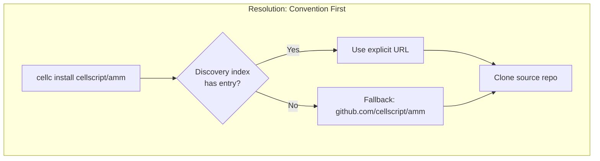
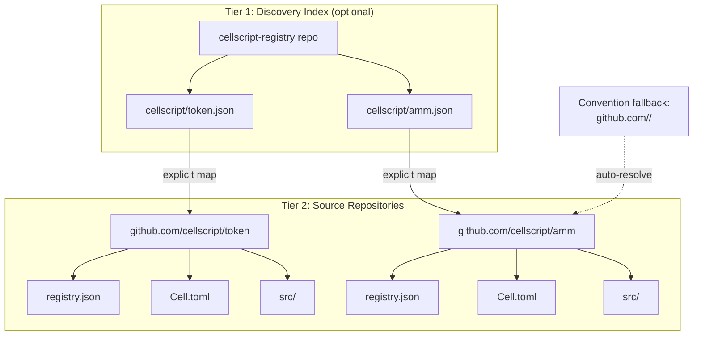
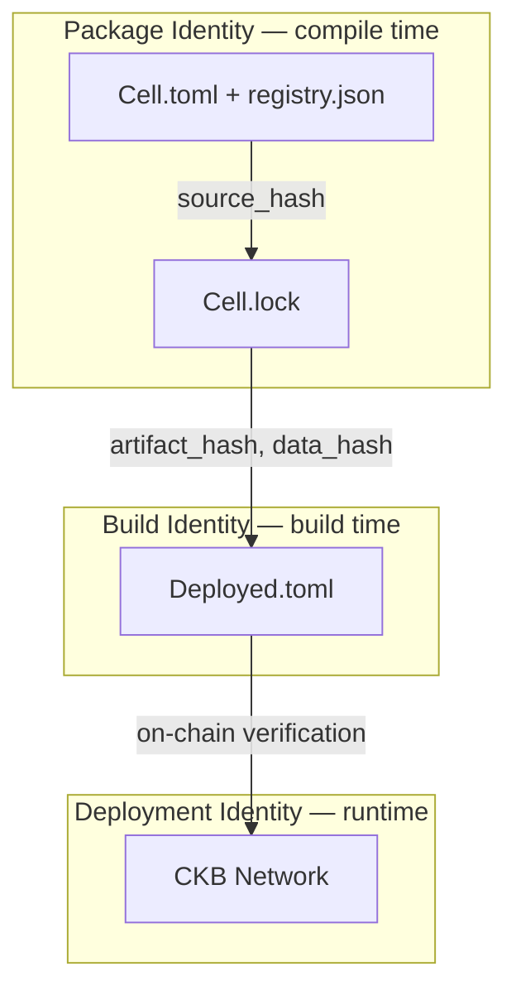
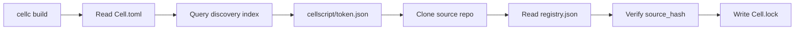
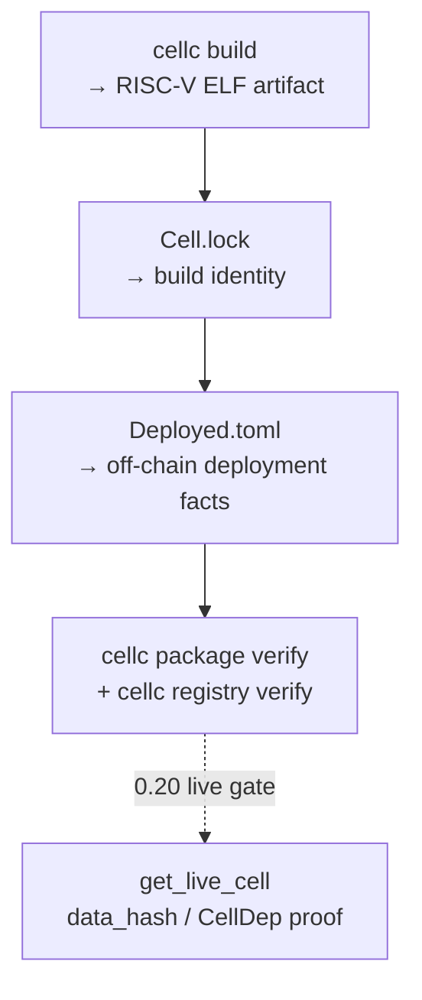

# CellScript Registry Phase 1: A Go-Style, GitHub-Based Package Registry for CKB Smart Contracts

Publishing and consuming smart contract libraries shouldn't require standing up a custom API server, maintaining a specialized database, or paying on-chain storage costs for source code that only developers need. CellScript's Phase 1 registry takes a deliberately minimalist approach: everything is Git, everything is on GitHub, and the chain only records what actually matters at runtime.

This post walks through the design, explains why we chose this model, and shows how to use it end to end.

## The Problem

Most package registries you've used — crates.io, npm, PyPI — follow a central-server model. You publish to a server, the server stores your package, and consumers download from the server. That works great for application development. Smart contracts are different.

A CKB smart contract dependency isn't just source code you download and compile. In production, a builder or wallet needs to know concrete on-chain facts: which CellDep to reference, what the data_hash is, which OutPoint to point to, whether the deployment is active or deprecated. Source packages answer "what code was written." Production deployment answers "which cell on which chain should you actually use." Both layers matter, and they're bound together by cryptographic hashes, not by naming conventions.

At the same time, the CKB ecosystem is still small. Running a dedicated registry service — with API endpoints, storage backends, uptime guarantees, and authentication — would be over-engineering at this stage. We needed something that works today with zero infrastructure, but can grow into something more rigorous as the ecosystem demands it.

## The Core Idea: Convention Over Configuration

Our registry has two tiers, both backed by Git repositories on GitHub — but the discovery tier is optional, not mandatory.

The first tier is a **discovery index** — a lightweight Git repo that maps `namespace/name` to a source repository URL. Think of it as a phone book with overrides. It only gets updated when a package's source location doesn't follow the standard convention.

The second tier is a **per-package version index** called `registry.json`, which lives inside each source repository right next to `Cell.toml`. When you run `cellc publish`, it computes a source hash, reads your build artifacts, and appends a new version entry to this file. Then you commit, tag, and push. That's it. No PR to any external index, no API call, no server to maintain.

The key insight is the **Go-style convention**: if no explicit discovery entry exists, `cellscript/amm` automatically resolves to `github.com/cellscript/amm`. You don't need to register anything. You just push your repo to the conventional location, and it works. The discovery index only exists for packages that break the convention — repos hosted elsewhere, or where the repo name doesn't match the package name.

This is exactly how Go modules work. `go get github.com/cellscript/amm` doesn't need any index — it just clones that URL. The discovery index is our equivalent of `GONOSUMCHECK` or a `GOPRIVATE` override: a way to handle exceptions, not a mandatory gate.





## Why This Works for Smart Contracts

There's a subtlety here that's easy to miss. In a traditional package registry, the package *is* the unit of identity. You install `lodash@4.17.21`, and that's the end of the story. For smart contracts, the package is only the first layer.

CellScript uses what we call a **three-layer identity model**. A package exists in three distinct identity scopes, and each one answers a different question:

**Package Identity** answers "what source code was written?" It's carried by `Cell.toml` and the registry index, verified at compile time. The key fields are namespace, name, version, and source_hash.

**Build Identity** answers "what did the compiler produce?" It's carried by `Cell.lock`, verified at build time. The key fields are compiler_version, artifact_hash, metadata_hash, schema_hash, abi_hash, and constraints_hash.

**Deployment Identity** answers "which cell on which chain?" It's carried by `Deployed.toml`, verified at runtime. The key fields are network, chain_id, tx_hash, output_index, code_hash, hash_type, data_hash, out_point, dep_type, type_id, and script_role.



Each layer is independently meaningful but cryptographically bound to the layers above and below through the lockfile. If someone tampers with the source code after publishing, the source_hash won't match. If someone swaps the artifact, the artifact_hash won't match. If someone points to the wrong on-chain cell, the data_hash won't match the on-chain reality. The system fails closed.

This is why we can get away with a Git-based registry. The registry doesn't need to be a trust anchor. The trust anchors are the cryptographic hashes, and they're verified independently at each layer. The registry is just a discovery mechanism — a way to find the source code. Once you've found it, you verify it.

## The Three Files

CellScript uses three files to separate concerns. This is inspired by Move/Sui's `Move.toml` / `Move.lock` / `Published.toml` split, but adapted for CKB's CellDep and OutPoint model instead of Sui's native package-object model.

### Cell.toml — Deployment Intents

`Cell.toml` is the source package declaration. It describes what the developer *intends* to deploy, not what was actually deployed. The key addition for the registry is the `namespace` field:

```toml
[package]
name = "amm_pool"
version = "1.2.0"
namespace = "cellscript"

[dependencies]
token = { version = "0.3.0", namespace = "cellscript" }

[build]
target_profile = "ckb"
```

Dependencies can be resolved from the registry (by namespace and version), from a local path, or from a git URL. Resolution priority is path > git > registry, which means you can always override a registry dependency with a local checkout for development without changing any configuration.

### Cell.lock — Build Identity

`Cell.lock` is the cryptographic bind point between source and deployment. It records exact dependency versions, git revisions, source hashes, and build hashes. It's self-sufficient for re-verification — the `url` and `revision` fields let you re-clone the exact source commit without re-querying the discovery index.

```toml
version = 1

[package]
name = "amm_pool"
version = "1.2.0"
namespace = "cellscript"
source_hash = "blake2b:0xabcd..."

[package.build]
compiler_version = "0.19.0"
target_profile = "ckb"
artifact_hash = "blake2b:0x1234..."

[dependencies.token]
version = "0.3.2"
namespace = "cellscript"
source = { registry = "cellscript/token", url = "https://github.com/cellscript/token", revision = "f7e8d9c0..." }
source_hash = "blake2b:0x2222..."

[deployment.ckb.aggron4]
status = "deployed"
record = "ckb-testnet:0xaaaa..."
```

This is analogous to `go.sum` — it pins exact versions with their hashes, making the build independently reproducible.

### Deployed.toml — Deployment Facts

`Deployed.toml` records immutable deployment facts derived from the chain. It's generated automatically after a deployment transaction is confirmed, and it must not be edited by hand.

```toml
version = 1

[package]
name = "amm_pool"
version = "1.2.0"
source_hash = "blake2b:0xabcd..."

[build]
compiler_version = "0.19.0"
artifact_hash = "blake2b:0x1234..."

[[deployments]]
network = "aggron4"
chain_id = "ckb-testnet"
script_role = "type"
tx_hash = "0xaaaa..."
output_index = 0
code_hash = "0xbbbb..."
hash_type = "data1"
dep_type = "code"
out_point = "0xaaaa...:0"
data_hash = "0xcccc..."
type_id = "0xdddd..."
```

The separation matters. `Cell.toml` says "I want hash_type = data1." `Deployed.toml` says "the cell at 0xaaaa...:0 actually has hash_type = data1, and here's the on-chain proof." One is intent, the other is fact. Confusing the two leads to exactly the kind of supply-chain vulnerabilities that smart contract systems should avoid.

## Tutorial: End to End

Let's walk through the complete lifecycle of a package, from authoring to verified on-chain deployment.

### Step 1: Create a Package

```bash
cellc init amm_pool --namespace cellscript
```

This generates a `Cell.toml` with `namespace = "cellscript"` and a starter source file. At this point, there's no `Cell.lock`, no `registry.json`, no `Deployed.toml`. The package is purely local.

### Step 2: Add Dependencies

Edit `Cell.toml` to add a registry dependency:

```toml
[dependencies]
token = { version = "0.3.0", namespace = "cellscript" }
```

When you build, the resolver kicks in:



The discovery index tells the resolver where to find the source. The `registry.json` inside the source repo provides version metadata. The `source_hash` in that metadata is verified against the actual source tree. If anything has been tampered with, the build fails.

### Step 3: Publish

```bash
cellc publish
```

This computes a source hash from your current source tree, reads build artifacts for their hashes, and appends a new version entry to `registry.json`. Then you commit and push:

```bash
git add registry.json
git commit -m "publish v1.2.0"
git tag v1.2.0
git push --tags
```

Notice what didn't happen: you didn't open a PR against any discovery index, you didn't call an API, and you didn't upload anything to a server. The version metadata lives in your source repo. And since `cellscript/amm_pool` automatically resolves to `github.com/cellscript/amm_pool` via convention, you didn't even need to register with the discovery index. The index is only for packages that break the convention — hosted on a different platform, or where the repo name doesn't match the package name.

### Step 4: Build and Record Deployment Identity

0.19 Phase 1 closes the local identity loop before live-chain verification. The
build writes artifact and metadata identity into `Cell.lock`; deployment facts
are recorded in `Deployed.toml`; `cellc registry verify` checks that the
off-chain deployment record matches the locked build/package identity.



Headless deploy planning and adapter transaction construction can exist as
supporting evidence, but 0.19 does not require live RPC reads or committed
chain cells for the registry acceptance gate. Live `get_live_cell` verification
is the 0.20 handoff.

### Step 5: Cross-Verify All Three Layers

After build/deployment recording, you can verify the Phase 1 identity chain:

```bash
cellc package verify   # source_hash matches
cellc registry verify  # build/deployment facts match Cell.lock
```

Or programmatically:

```rust
// Package Identity: source_hash
let computed = compute_source_hash(&pkg_dir).unwrap();
assert_eq!(computed, read_lock.package.source_hash.as_deref().unwrap());

// Build Identity: artifact_hash
let lock_artifact = read_lock.package_build.as_ref().unwrap().artifact_hash.as_ref().unwrap();
let deployed_artifact = read_deployed.build.as_ref().unwrap().artifact_hash.as_ref().unwrap();
assert_eq!(lock_artifact, deployed_artifact);
```

These assertions verify that the source has not changed since publishing and
that the deployment record still names the build artifact that was compiled.
0.20 adds the live-chain assertion that the on-chain cell contains the exact
binary named by the deployment record.

## Design Rationale: Why Git, Why GitHub, Why Now

A few design decisions deserve more explanation.

**Why Git, not a custom API?** Because Git already solves the problems we need solved: content-addressed storage, cryptographic integrity via commit hashes, offline caching via local clones, and a workflow that every developer already knows. Building a custom API server would solve the same problems but add operational burden, authentication complexity, and a single point of failure — all for a registry that currently serves a small ecosystem.

**Why a two-tier model instead of a single monorepo index?** Because publishing a new version should be a `git push` to your own repo, not a PR to someone else's. A monorepo index (like crates.io's index repo) requires every version publish to update a shared repository. That creates friction: CI conflicts, merge races, permission management. Our model lets version metadata travel with the source, like Go's `go.mod`. And thanks to the Go-style convention fallback (`github.com/<namespace>/<name>`), the discovery index doesn't even need to be updated when registering a new package — only when a package's source location doesn't follow the convention. For the majority of packages, the discovery index is never consulted at all.

**Why GitHub specifically?** We're not locked into GitHub. The discovery index maps to source URLs, and those URLs can point to any Git host. But GitHub is where CKB ecosystem development already happens, and it provides free repository hosting, reliable availability, and a familiar workflow. If someone wants to self-host their source, they can — the discovery index just needs a URL that `git clone` can reach.

**Why off-chain deployment records instead of on-chain?** CKB capacity costs make on-chain source-package storage unattractive. A 5KB RISC-V ELF binary requires about 541 CKB of capacity just for the code cell. Storing version metadata, schema manifests, and ABI indices on-chain would multiply that cost for no consensus benefit — these are developer artifacts, not runtime state. The chain should record compact deployment facts (CellDep, OutPoint, data_hash), not replace the entire source distribution system.

**What about the proxy?** Phase 3 can add an optional caching layer like `proxy.golang.org`, but the Git-based path is the permanent canonical mechanism, not a temporary placeholder. A proxy would be a transparent cache for faster installs and availability guarantees, not a replacement. If the proxy is down, `cellc install` falls back to direct Git cloning.

## The Test Suite

Phase 1 acceptance is covered by always-on CLI and registry tests:

**Offline Git registry**: local publish/resolve, namespace isolation, tag-pinned
source resolution, registry dependency loading, source-root hashing, and
source-hash mismatch rejection.

**Package/build identity**: namespace initialization, build lockfile identity,
package verification, artifact/metadata/schema/ABI/constraints hash recording,
and fail-closed mismatch cases.

**Off-chain deployment identity**: `cellc registry verify` compares deployment
facts with `Cell.lock` and fails closed in both text and JSON modes.

`tests/e2e_registry_devnet.rs` also contains broader headless and ignored live
devnet scenarios. Those are valuable 0.20 candidates, but live RPC /
`get_live_cell` proof is not required for the closed 0.19 Phase 1 gate.

## What Comes Next

Phase 1 is deliberately minimal. We're shipping the two-tier Git registry, the three-file separation, and the three-layer identity model. Here's what we're not shipping yet, and why:

**On-chain type script index** (0.20+): An on-chain script that indexes deployments by code_hash or TYPE_ID. Useful for wallets and builders that want to discover deployments without reading off-chain files. But the CKB ecosystem hasn't demonstrated demand for this yet, and the capacity costs are real. We'll build it when it's needed.

**Registry proxy** (0.20+): A caching layer like `proxy.golang.org` for faster installs and guaranteed availability. The Git-based path always remains the primary resolution mechanism. The proxy is a transparent cache, not a replacement.

**Audit signatures and publisher identity** (0.20 trust hardening): Packages can currently carry optional audit report hashes and acceptance gate status. Requiring cryptographic signatures from auditors before marking a deployment as production-ready is a natural extension, but it needs a key management story first.

**Yanking and supersession**: The `yanked` flag is already in the `registry.json` schema. Phase 1 records it; 0.20 can enforce it at the resolver level.

The important thing is that none of these future additions require changing the fundamental architecture. Adding a proxy doesn't change the discovery index schema. Adding on-chain indexing doesn't change how `Deployed.toml` is generated. The two-tier Git model is the permanent canonical path, and everything else layers on top of it.

---

*CellScript is a domain-specific language for Nervos CKB smart contracts. The registry implementation lives in `src/package/registry.rs` and the deployment adapter in `crates/cellscript-ckb-adapter/`. The full design document is at `docs/CELLSCRIPT_PACKAGE_PROVENANCE_AND_DEPLOYMENT_IDENTITY.md`.*
