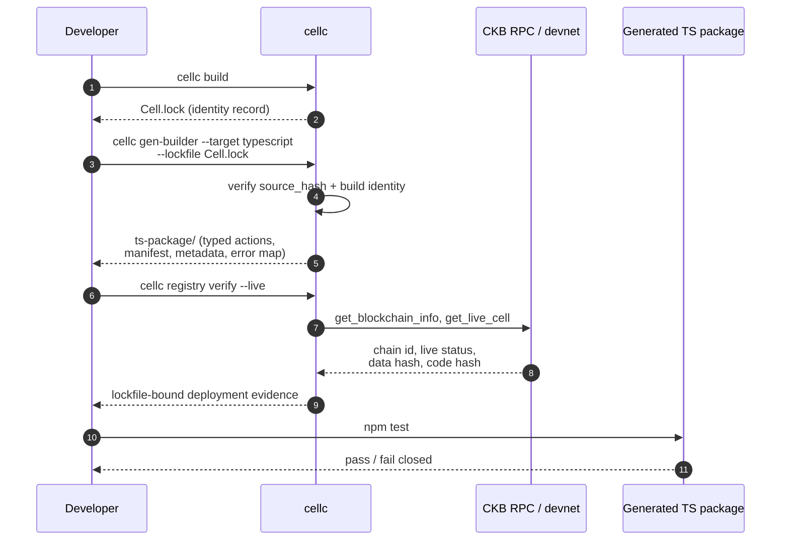
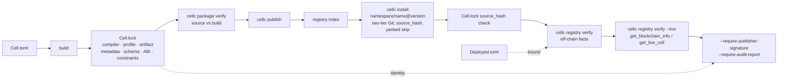

# CellScript 0.16 → 0.20 Release Notes

Status: Covers every shipping change from `v0.16.0` to `v0.20.0-rc.2`.
Audience: CellScript contract authors, transaction builder integrators,
and CKB tool consumers.

Per-version notes for `0.16.1` and `0.16.2` (small patch releases on
the 0.16 line) are linked from the index; they ship as their own
files. The `0.17`, `0.18`, and `0.19` drafts remain in this directory
as `.internal.md` for me.

## Why 0.17, 0.18, and 0.19 Are Folded Into This Document

I am not publishing `0.17`, `0.18`, or `0.19` as separate release
notes, and that is a deliberate call, not an oversight. That window
was when the iCKB protocol-equivalence research surface and the
registry / package identity design were both being shaped; the
architecture-level decisions — first-class `Script` construction,
the strict CKB protocol helper surface, `SourceView`, the
`Cell.lock` and `Deployed.toml` identity pair, the generated
TypeScript builder scaffold, `registry verify --live`, the
cell-data codec manifest, the metadata schema partition, and the
package-graph incremental cache — landed across all three versions
rather than in any one. None of `0.17`, `0.18`, or `0.19` is a
useful anchor in isolation: the boundary was moving inside each
of them, and reading the three versions separately would be reading
a moving design. The per-version drafts in `.internal.md` still
carry the day-by-day detail for me, but they are not the public
record of the user-facing surface.

This line is the move from "the compiler produces a binary and a
metadata sidecar" to "the compiler is a source / build / deployment
identity layer that builders and registries can trust". The CLI
remains the front door, but `cellc gen-builder --target typescript`
and `cellc registry verify --live` are now first-class, and the
generated TypeScript package is what most external builders will
actually consume.

## What Users Will Notice

### Numeric Width Is Now Type-Strict

`u32` and `u64` are no longer interchangeable. Non-literal numeric
expressions require exact type equality, and declared integer literal
widths propagate through constants, returns, assignments, calls,
arrays, and braced `if` branches. IR lowering preserves the widths.
`cellc opt-report` reports backend shape counters and
estimated-cycle deltas across optimisation levels so the cost of any
width change is visible.

`--primitive-strict=0.16` is the strict pre-production mode. It
catches ProofPlan gaps that 0.15 left as audit notes; the
syntax-combo runner is an executable release preflight, and the
quick release gate wires it in before builder-backed CKB
acceptance. The legacy `transfer` capability is gone from code,
syntax-combo seeds, the matrix, and the example tests.

### Packages, Not Files

A CellScript project is now a source graph that the parser, type
checker, flow checker, IR, and incremental cache all see in one
piece. `use` imports are exact-path and fail closed when missing.
Package compilation loads the entry package and local path-dependency
`.cell` files before frontend checks. Incremental cache identity
includes dependency `.cell` files, `Cell.toml`, and `Cell.lock`.
File-backed LSP diagnostics use the package graph.

Cross-file function-call linking is still deferred and fail-closed.
The supported reuse pattern is shared schema / type imports that
compile into each entry artifact; cross-file helpers are inlined
into the entry artifact with stable internal labels. There is no
ELF linker and no cross-script runtime linkage. The NovaSeal
`fungible-xudt-profile-v0` package demonstrates the pattern; iCKB
and DobEvo are held back from this refactor because their sources do
not expose a natural shared-schema boundary right now.

### Generated Builders

`cellc gen-builder --target typescript` emits a compiling
TypeScript scaffold from compile metadata, with typed action
parameters, action-plan functions, runtime adapter contracts,
builder manifest, embedded metadata, and explicit non-claims for
live-chain availability, signing, submission, and CKB VM acceptance.
The package is bound to `Cell.lock` and to `Deployed.toml`; action
planning fails closed when either is mismatched.

Generated builders expose `build`, `dry-run`, and `submit` modes.
`submit` forces a dry-run first; runtime adapter delegation is the
boundary, not a parallel implementation. The package ships with its
own `npm test` covering plan generation, runtime adapter
delegation, fail-closed lockfile and deployment mismatch cases, and
trust-policy rejection even when no deployment binding is embedded.
The acceptance tooling gate runs the generated package through
`check_action_builder_toolchain`, which builds it from
`examples/token`, installs its local dependencies, and runs the
generated `npm test`.



### Registry With Deployment Identity

In 0.16 the package model was "a `Cell.toml` plus a single source
file". In 0.20 it is a Git-backed namespace, a manifest, a lockfile,
a deployment record, and a trust policy.



`cellc install namespace/name@version` resolves through a two-tier
Git path, verifies `registry.json`, skips yanked versions, and
checks `source_hash` against the lockfile before writing anything.
`cellc package verify` and `cellc registry verify` fail closed on
any mismatch; `--live` adds CKB RPC-backed checks for chain id, live
status, data hash, code hash, and Type ID args. The
`--require-publisher-signature` and `--require-audit-report` flags
are an opt-in trust policy: missing trust metadata fails closed.

The cell-data codec manifest is the new identity wall for cell data.
Molecule-native contracts declare `abi = "molecule"`; contracts that
use raw `LOAD_CELL_DATA` declare `abi = "molecule+raw-bytes-v1"` and
list the raw accesses that require external codec materialisation.
`cell_data_codec_manifest_hash` travels with `Cell.lock`,
`Deployed.toml`, the deployment record, and the generated-builder
ABI hash.

Metadata schema is partitioned: the top-level
`metadata_schema_version` is the envelope compatibility wall; three
new component versions — `source_metadata_schema_version`,
`artifact_metadata_schema_version`,
`constraints_metadata_schema_version` — expose the actual surface
that changed.

### ELF Entry ABI Gate

A compiled ELF must prove it is a CKB script before any on-chain
evidence is collected. The gate runs before any dry-run, tx-pool, or
submit evidence is accepted. It fails closed unless the executable
`PT_LOAD` segment is RX-only, has `filesz == memsz`, the entry
trampoline calls the real entry point, and the trampoline preserves
the CKB-VM-provided `sp` instead of initialising a private stack.
The CKB acceptance report now includes a `cellscript_build_reports`
index that binds every compiled CKB-deployable RISC-V ELF to its
CKB blake2b deployable hash, host SHA-256 hash, `cellc
verify-artifact` status, ELF entry ABI gate status, ABI-trailer
stripped status, and live code-cell data hash when a devnet
deployment is executed. A live deployment whose code-cell data hash
does not match the compiled deployable ELF hash fails the production
evidence validator.

### Standard CKB Protocol Helpers And Witness Parsing

`SourceView` is the typed view of a transaction's inputs, outputs,
and cell-deps. DAO accumulated-rate and maturity checks, xUDT
group amount helpers, Script args / hash guards, `MetaPoint` and
`OutPoint` relation scans, and C256 product requirements are all
protocol helpers, not verifier-only magic. A CKB `Script` is a
typed CellScript value: `ScriptRef` property reads, `ScriptRef`
args helpers, and a typed `Script` constructor usable inside a
witness plan, a cell dependency, or a constraint check.
`with_capacity_floor(...)` and `occupied_capacity(...)` are the
declarative capacity contract.

On the witness side, `witness::size` returns a `U64`; `ckb::
require_witness_size_at_least(threshold)` is a typed fail-closed
check; raw witness loading and `WitnessArgs` Molecule field
extraction (`lock`, `input_type`, `output_type`) work with proper
bounds checking. New runtime errors: `WitnessMalformed(42)` and
`WitnessFieldTruncated(43)`. The witness Molecule auth parser
milestone is closed (`parse` → `extract` → `bind`).

### CLI, LSP, And Diagnostics

`cellc --list` enumerates the top-level commands; `cellc --help`
shows the full package command set plus direct compile mode.
Unknown bare commands get a nearest-command suggestion. Direct
parse, lex, and compile errors print `file:line:column` source
snippets. The top-level `cellc --explain <CODE>` alias mirrors
`cellc explain`. Multi-diagnostic package checks render each
frontend error with its own source context; the recovery semantics
group errors by file when one error hides another. Compile
diagnostics carry typed severity (`error` or `warning`); only
error severity is release-blocking.

### CKB Adapter And Deployment Toolchain

`CellScriptAdapter` is the facade that wallets, relayers, and CI
scripts use to drive CellScript deployment. `cellscript-deploy`
is the CLI on top of the facade. `ManifestCellDepResolver` resolves
manifest-declared CellDeps. `TransactionSubmitter`,
`SigningAdapter`, and `CapacityBridge` are the typed entry points
the compiler cannot reach. `TransactionLifecycleEvidence` is the
structured record a deploy leaves behind. A headless deploy probe
runs a devnet validation pass so a CI job can verify "the
deployment actually committed" before declaring evidence ready.
`scripts/cellscript_ckb_adapter_acceptance.sh` exercises the
bridge end-to-end with devnet commit evidence. The CI workflow
checks out sibling `ckb-sdk-rust` at tag `v5.1.0`.

### Live Compile Playground

The compiler builds to `wasm32-unknown-unknown` via `wasm-pack`.
The prebuilt bundle is committed to `website/public/wasm/` and
`website/scripts/build-wasm.sh` rebuilds it and enforces the
600 KB gzip budget. The `cellscript-wasm` crate gates out `cli`
and `lsp` features so the browser build cannot accidentally pull
native I/O dependencies. The playground exposes a virtual file
tree over `.cell` paths, an explicit entry file, file-aware
diagnostics, local import / export, and a downloadable workspace
JSON generated in the browser. Source-count and total-byte caps
keep browser CPU and memory bounded. There is no server compile
API, no server-owned project state, no uploaded source archive;
compile work runs in a Web Worker over the existing WASM compiler
path. The website polish around the playground — live compile at
`/playground`, scroll-driven pipeline trace with real artifacts,
copy-to-clipboard, WCAG AA contrast, NavRail moved from right to
left, syntax highlighting audit for code / syntax / docs pages —
carries its own Playwright smoke evidence.

### Proposals: NovaSeal And Evolving DOB

Both are proposal-local evidence, not general CellScript
guarantees.

`cellc certify --plugin novaseal-profile-v0` runs the profile
certification across the v0 skeleton, Agreement, fungible xUDT,
RWA receipt, BTC transaction commitment, BTC UTXO seal, dual
seal, and Fiber candidate profiles. Local / devnet evidence
covers live devnet stateful reports for the core and Agreement
flows, planned-profile live devnet reports for the BTC, dual-seal,
Fiber, fungible-xUDT, and RWA surfaces, BIP340 verifier IPC /
vector / shell evidence, CKB VM parent and child harnesses,
wallet signing vectors, and profile-operator, service-builder, BTC
SPV adapter, external-attestation adapter, and external-evidence
handoff reports. The 0.20 line closed several proposal gates:
NovaSeal devnet readiness, the BTC verifier pinning check, the
Molecule IFRN design space, the Fungible xUDT multi-file refactor,
and the certifier restore. Public production status for NovaSeal
remains blocked until external BIP340 TCB, public BTC SPV, public
and shared CellDep, and RWA legal and registry attestations are
real and current; that is not a 0.20 release obligation.

Evolving DOB profile v1 lands as a proposal-evidence surface. It
carries `Cell.toml`, `Cell.lock`, `Deployed.toml`, registry
metadata, schemas, fixtures, ProofPlan and invariant records, a
devnet workflow script, and a registry-pressure script. The DOB-EVO
audit records the profile as structurally coherent for its
state-transition specification after the genesis owner-lock check
and tooling fixes. Unresolved items: missing negative coverage for
many guards, invariant matrix references, `released_at`
regeneration, action-salt hardening, and minimum CKB version
policy for `data1`.

iCKB is in `tests/benchmarks`. The committed differential matrix
has 75 original-vs-CellScript executed rows, 14 CellScript-only VM
rows, and 8 original-side VM rows. I added an iCKB receipt group
missing-input diff capability, a DAO witness `input_type` parity
test row, and closed the witness Molecule auth parser milestone.
Production equivalence is still unproven; I am not claiming
byte-accurate receipt decoding of owner-auth witness fixtures, full
DAO redeem accounting closure, generic aggregate invariant
lowering, or production manifest closure for the iCKB family. Any
iCKB benchmark source refactor in a later release must regenerate
the relevant CKB VM differential matrix rows and keep the result
labelled as benchmark / differential evidence.

### What Got Removed

The legacy `transfer` capability is gone from code, syntax-combo
seeds, the matrix, the example tests, and the docs; the removal is
fail-closed. The Molecule IFRN design-space audit collapsed into a
single English improvement report; raw cell-data access is
expressible and must be declared through
`cell_data_codec_manifest`, and public raw-layout production claims
still need external codec adapters, roundtrip vectors, builder
and indexer support, multi-ABI registry support, and parity
matrices. Stale investigation and audit files were removed or
archived so old notes do not look like current status.

## Verification

Full 0.20 gate:

```bash
cargo fmt --all
cargo check --locked -p cellscript --all-targets
cargo test --locked -p cellscript
cargo clippy --locked -p cellscript --all-targets -- -D warnings
git diff --check
```

CKB production acceptance:

```bash
./scripts/ckb_cellscript_acceptance.sh --production --stateful-scenarios
python3 scripts/validate_ckb_cellscript_production_evidence.py <report.json>
```

Bounded local preflight without a CKB node:

```bash
./scripts/ckb_cellscript_acceptance.sh --compile-only --production
```

Website and playground:

```bash
website/scripts/build-wasm.sh
(cd website && npm run build)
```

## What's Next

0.20 closes the source / build / deployment identity loop and the
generated-builder boundary. 0.21 starts from there and pushes on
five things at once, with the rest of the deferred list still
tracked. The full direction is in `docs/CELLSCRIPT_0_21_ROADMAP.md`;
this section is the headline of what I am signalling to users
right now.

**Auditability is the centre of gravity.** The 0.20 metadata stream
is already rich — `CompileMetadata`, `ProofPlan`, audit bundles,
build reports, cell-data codec manifests — but right now anyone who
wants to verify what a builder actually consumed has to thread the
artifacts together by hand. 0.21 introduces an authenticated
`CompileReceipt` over canonical metadata (compiler version, rust
toolchain, target, target profile, source hash, normalised AST /
IR hashes, ProofPlan hash, artifact hash, metadata hash), with
Ed25519 signatures for the compiler and publisher roles. Receipt
verification, `cellc sign-receipt`, and `cellc verify-receipt`
become first-class. On top of the receipt, 0.21 derives a cyclic
`ProtocolGraph` from existing IR and metadata — not a new core graph
IR — and exposes it through `cellc explain-graph`, including a
Mermaid output mode for review threads. AMM-style `Pool -> Pool`
self-loops show up; acyclic factory / launch flows are labelled
acyclic only after graph analysis, not by assumption. A
`TemplateLayout` metadata layer describes physical commitment shape
so an auditor can tell the difference between a flat token receipt
and a Merkle-candidate channel-factory root before the backend
commits to either.

**Ecosystem tooling follows the same shape.** The 0.20 line stopped
at "the generated TypeScript builder plans an action". 0.21 picks up
at "the adapter resolves a typed action plan into a live
transaction candidate without manual `ResolvedActionTx`
construction": action-aware CKB Script scans, variable-length
`ScriptArgs` construction and checking, and a single
resolved-action contract shared between the generated builder and
the Rust adapter. `cellc registry verify` trust-policy flags are
still a metadata-presence gate; cryptographic publisher-signature
verification and trust-anchor management move onto the same
authenticated-receipt surface so an external tool can verify
publisher identity without bolting on a parallel crypto path. CKB
stdlib protocol modules (sUDT, xUDT, TYPE_ID, HTLC, Cheque, ACP,
DAO) are still schema stubs; 0.21 promotes the aggregate cases
covered by the iCKB benchmark into executable verifier lowering so
the iCKB matrix can stop shadowing them by hand.

**Fiber contract compatibility is the first big
compatibility-surface bet.** NovaSeal shipped Fiber as a candidate
profile on the 0.20 line, with devnet-node experiments and a
certifier path. 0.21 takes that as a starting point and aims for
full Fiber-contract compatibility — meaning the canonical Fiber
UDT, channel, and HTLC surface becomes a compatibility target in
the same way iCKB has been on the 0.17 / 0.18 line. The acceptance
is honest: full compatibility means the CellScript port produces
artifact, metadata, and devnet evidence that match the reference
Fiber contract family under the same differential-evidence rules
iCKB already follows, including owner-auth witness fixtures,
byte-accurate receipt decoding, and the full redeem / settle
accounting. It does not mean I am claiming Fiber mainnet
production certification; that still needs the public Fiber testnet
evidence the rest of the CKB ecosystem has to produce. I will
flag the boundary the same way I flag iCKB: benchmark and
differential evidence, not production equivalence, until the matrix
rows pass under the same gates.

**Registry hardening is the Phase 2 surface.** I outlined the
go-style GitHub-based registry on the public RFC thread
[Package Management for CellScript: A Go-style, GitHub-based Package
Management Registry for CKB Contracts](https://talk.nervos.org/t/rfc-cellscript-go-github-ckb/10238).
0.20 closed Phase 1 — namespace / `registry.json` resolution,
two-tier Git path, yanked-version skip at install time, `source_hash`
check against `Cell.lock`, and the `Cell.lock` / `Deployed.toml`
identity pair. 0.21 takes Phase 2 seriously. That means audit
signatures and publisher identity moving from a metadata-presence
gate to cryptographic verification on the same authenticated-receipt
surface, a transparent proxy layer in the same shape as
`proxy.golang.org` (always behind the canonical Git path, never
replacing it), and yanking enforced at the resolver level instead
of just recorded in `registry.json`. None of these change the
fundamental two-tier Git model; they layer on top of it. The same
identity framework that binds a CellScript source package to its
`Cell.lock` and its deployed Cell gets extended so the resolver
can prove the publisher signed what it is about to download, and
so a yanked version cannot enter the build even if the build is
run against a stale index.

**Non-CellScript package support follows the two-category rule.**
A related question came up on the same RFC thread: whether
`package.namespace` should also host artifacts outside CellScript
— runtime verifiers (a BTC-style BIP340 verifier was the working
example), `ckb-bootstrapper`-style reproducible build recipes, or
other reproducible CKB-side binaries. The honest answer is that
the architecture has room for it, but the resolver has to learn a
stricter shape first. 0.21 lands this in two halves. TCB-bound
dependencies — runtime verifiers, deployable contracts, deployed
artifact records, resolver-safe profile libraries — go through
the same identity framework (`source_hash` → `artifact_hash` →
`ABI hash` → `data_hash` → `OutPoint` / `CellDep`) with an
explicit `verifier_id`, a declared build profile, and a declared
security / audit status, but with a different artifact profile so
they are not mixed into the CellScript-package resolver.
Scaffold-only material — starter examples, cookbook recipes,
contract scaffolds, protocol skeletons — does not get resolved as
a dependency at all; it is copied into a local project via
`cellc new --template <name>` or `cellc cookbook copy <name>
./my-project`, and once copied it is the project's own material,
not a resolver dependency. The rule compressed is: anything
resolved as a dependency must be dependency-safe, artifact-safe,
deployment-fact-safe, or declared-TCB-safe; anything
scaffold-only should be copied, not resolved as a dependency.
That keeps high-value CKB artifacts verifiable on the chain
without turning the chain itself into a package database, and it
matches the on-chain / off-chain split the RFC thread already
landed on — compact commitment and discovery / index facts on
chain, full source, manifests, build logs, schemas, proofs, and
larger metadata off chain.

Everything else deferred from 0.20 — full on-chain registry index
beyond the compact commitment / discovery facts, stateful flow
runner, full transaction solver, CellFabric intent-DAG composition
beyond the bounded bridge envelope, source maps, production-ready
CKB stdlib protocol implementations beyond the aggregate-lowering
slice, iCKB production equivalence with the original iCKB family
— is still on the open list and is not silently closed by 0.21.

## Cross-References

- Open direction: `docs/CELLSCRIPT_0_20_ROADMAP.md` and the
  planning draft for the next line at `docs/CELLSCRIPT_0_21_ROADMAP.md`.
- Public registry RFC thread:
  [Package Management for CellScript: A Go-style, GitHub-based
  Package Management Registry for CKB Contracts](https://talk.nervos.org/t/rfc-cellscript-go-github-ckb/10238).
- Historical per-version drafts (project-internal):
  `docs/releases/CELLSCRIPT_0_19_RELEASE_NOTES.internal.md` and
  `docs/releases/CELLSCRIPT_0_20_RELEASE_NOTES.internal.md`.
- Per-version patch notes that are published on their own:
  `docs/releases/CELLSCRIPT_0_16_1_RELEASE_NOTES.md` and
  `docs/releases/CELLSCRIPT_0_16_2_RELEASE_NOTES.md`.
- Compile-history reference: `git log v0.16.0..v0.20.0-rc.2`.

## Where I Stand

A short, honest snapshot of the workspace, so the cross-version
narrative above lands in something concrete:

- **Compiler core (`src/`).** 43 files, ~114 k LoC. Front end, IR,
  codegen, RISC-V assembler, opt-report, the runtime metadata
  stream, and the proof / diff / audit-bundle tooling all live
  here.
- **Workspace crates.** `cellscript-ckb-adapter` (the Rust
  deployment facade, ~2.5 k LoC), `cellscript-wasm` (the browser
  compile target, ~234 LoC, gated so the wasm32 build cannot
  pull native I/O), and `examples/ckb-sdk-builder` (the scaffold
  for the generated TypeScript builder workflow).
- **Tests (`tests/`).** 19 test files, ~40 k LoC. The
  per-version suite (`v0_14` through `v0_18`), the CLI surface
  (`cli.rs`), the CKB compat suite, the iCKB differential
  matrix (`ickb_diff.rs` and the 75-row committed matrix), and
  the registry / deployment acceptance flows.
- **Scripts (`scripts/`).** ~24 k LoC across the unified
  `cellscript_gate.sh` modes (`dev` / `ci` / `backend` /
  `release` / `release-quick`), the CKB acceptance harness
  (`ckb_cellscript_acceptance.sh`), the NovaSeal devnet runners,
  the registry validators, the syntax-combo audit, the
  CellFabric smoke check, and the tooling release validator.
- **Bundled examples.** 29 `.cell` files across 10 directories
  covering the canonical CKB business flows: `amm_pool`,
  `launch`, `multisig`, `nft`, `registry`, `timelock`, `token`,
  `vesting`, plus a `language/` set for non-production syntax
  drills and a `ckb-sdk-builder` workflow example.
- **Submodules.** `proposals/novaseal/` (Bitcoin-authorised
  Cell framework: v0-mvp-skeleton, agreement-profile-v0, BTC
  verifier RISC-V), `proposals/evolving-dob/` (DOB evolution
  profile v1), `website/` (Astro public site + the 461 KB gzip
  WASM playground).
- **Docs.** 87 markdown files, ~23 k LoC. The wiki tutorials,
  the per-area design docs, the gate policy, the runtime error
  registry, the registry phase 1 doc, the CellFabric bridge
  contract, the output bindings, the production-evidence
  validator, and the 0.20 / 0.21 roadmaps.

The compiler is the centre, but the workspace around it is no
longer "just a compiler". For a specific shape of contract, an
external team can now source a package from the registry, identify
it through `Cell.lock` and `Deployed.toml`, compile it through the
compiler, generate a typed TypeScript builder from the metadata,
run the builder's `npm test` as part of their CI, verify the
deployment against CKB RPC through `cellc registry verify --live`,
audit it through the `cellscript-compile-receipt` envelope and the
derived `ProtocolGraph` view, and ship the result — all without
re-implementing any of the moving parts. The generated TypeScript
builder is the surface most consumers will touch; the registry
and deployment identity loop is what makes that builder safe to
trust; the cell-data codec manifest is what lets Molecule-native
and raw-layout contracts share one identity wall; the WASM
playground is what lets a new user try the language without
installing anything; the NovaSeal and Evolving DOB proposals show
the system handling real protocol families; the iCKB benchmark is
what keeps the differential-evidence claim honest.

This is the part where I say it plainly: I want to see what
fellow CKB developers build with this. The system is at the point
where another team can pick it up and ship a non-trivial CKB
application with the compiler doing the compiler work, the
builder doing the builder work, the registry doing the registry
work, and the proposal packages doing the protocol-shape work.
A token with a typed mint / transfer / burn, an AMM with the
stateful flow runner, a vesting grant, a multisig wallet, an NFT
collection, a NovaSeal-style Bitcoin-authorised cell, an
evolving-dob profile that fits your application, a custom
TypeScript builder on top of the generated one, a third-party
playground theme, a new CKB stdlib protocol module, a sidecar
that consumes the `cellscript-compile-receipt` envelope for
your audit pipeline — any of those is a real project that lands
inside the system as it stands. If you ship one, send a note
through the project channel and I will fold the reference into
the docs map; if you find a place where the system does not yet
match your protocol, file the gap and I will treat the gap as
a 0.21 candidate. The system gets more honest every time someone
outside the project core uses it to ship something the project
core did not predict.
