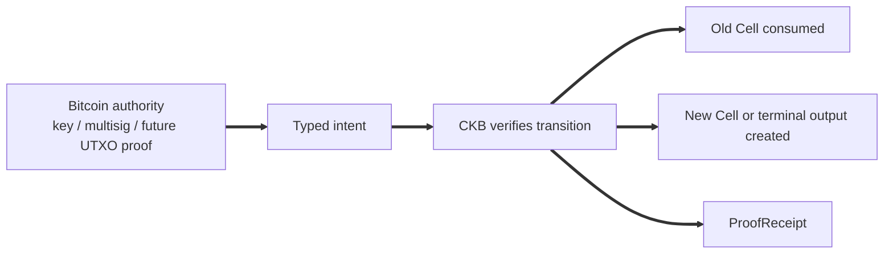
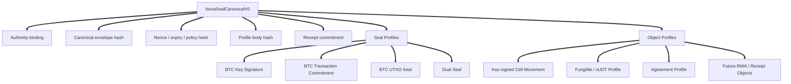
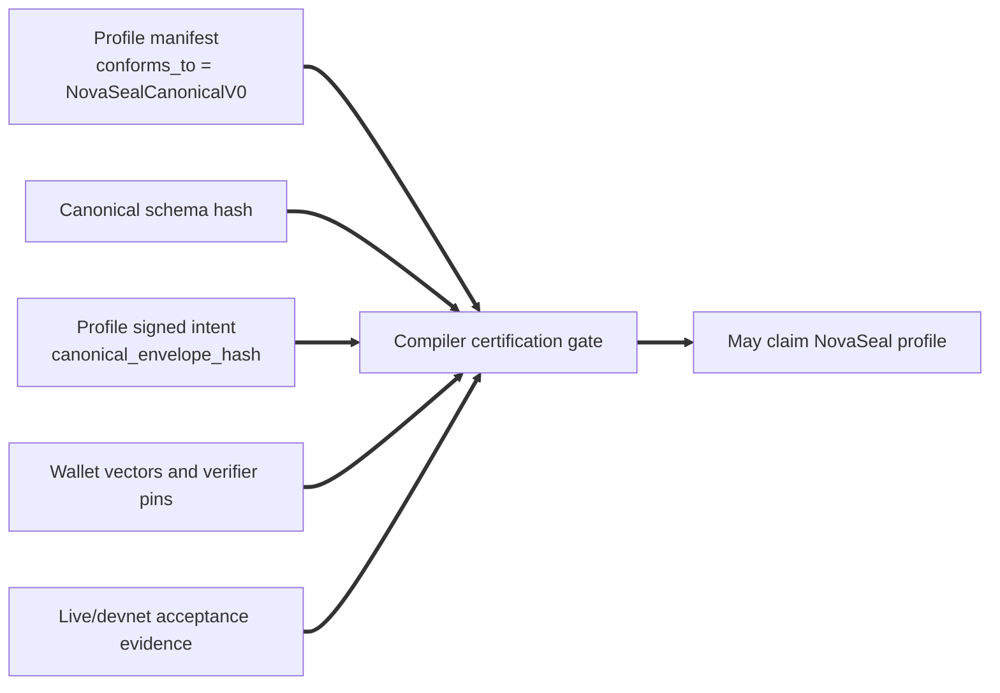
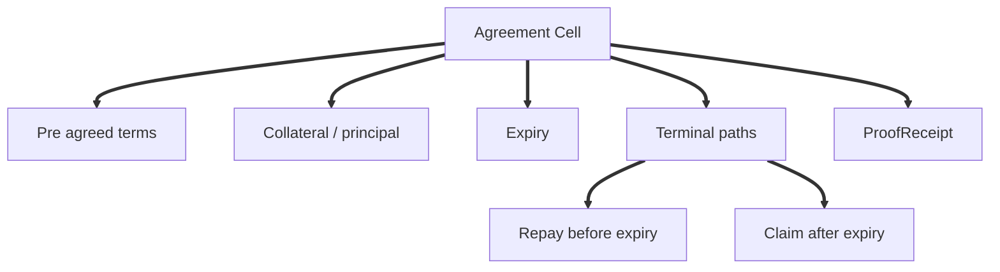
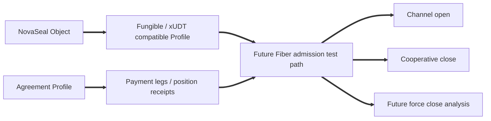

# NovaSeal: A Bitcoin-Authorised Cell Framework for CKB

NovaSeal starts from a narrower observation: Bitcoin keys and UTXOs provide widely understood authority, while CKB's Cell model is well suited to explicit state, deterministic transitions and auditable terminal outcomes.

The working split is that Bitcoin-side authority signs the intent, CKB enforces Cell state, and CellScript packages the evidence.

Rather than acting as an asset issuance protocol, trustless bridge, or RGB++ replacement, NovaSeal is designed to be a **Bitcoin-authorised CKB object framework written in CellScript**. In plain terms, it lets Bitcoin-side approval control a CKB Cell transition.

### Glossary:

Some terms below are NovaSeal-specific. We use them in this narrow sense:

| Term              | Plain meaning in this post                                                                                                                                                          |
| ----------------- | ----------------------------------------------------------------------------------------------------------------------------------------------------------------------------------- |
| Bitcoin authority | A BTC key, multisig, transaction commitment, or later UTXO proof that can approve a CKB transition                                                                                  |
| Typed intent      | The exact structured and formatted message that a signer approves, saying exactly what transition is authorised                                                                     |
| ProofReceipt      | The receipt written into the contract source as an **explicit receipt output**. `cellc` produces the checks that make the transaction include that receipt in the right output slot |
| Canonical schema  | The shared NovaSeal envelope, encoding rule and schema hash that every profile must commit to                                                                                       |
| Profile           | An upper level package layer that gives the canonical NovaSeal rules a concrete meaning, such as an agreement                                                                       |
| Certification gate | The deterministic compiler check that decides whether a package may claim to be a NovaSeal profile                                                                                  |
| Certification module | The Rust implementation inside `cellc` that evaluates NovaSeal manifest, schema, source and evidence files for a profile                                                          |
| Terminal path     | One of the agreed ending branches of a contract, such as repay or claim                                                                                                             |
| Proof plan        | A CellScript package's list of assumptions, checks and evidence obligations, emitted by `cellc`                                                                                     |
| Audit bundle      | The generated review file that collects the package facts and evidence, emitted by `cellc`                                                                                          |

## 1. Problem Statement

As mentioned above, many Bitcoin adjacent/attached systems begin from issuance, bridging or layer two execution. NovaSeal starts with a narrower question: how can Bitcoin side authority, such as a BTC key, multisig, transaction commitment or eventually a proved UTXO spend, authorise or condition a CKB native state transition?

CKB's Cell model natively supports explicit objects. A Cell can be consumed once, replaced, split into terminal outputs, or checked by separate lock and type logic. That provides a strict vocabulary for financial agreements, receipts, policy hashes, expiry rules and composable assets.

Instead of copying oracle-heavy DeFi designs into a Bitcoin wrapper, NovaSeal intends to build Cell-native financial objects with explicit authority, terminal paths and audit records. Contracts settled by pre-agreed terms fit CKB's object model more directly than account-based lending pools.

## 2. Core Flow

The minimal NovaSeal flow is straightforward. A CKB object always exists as a Cell. A Bitcoin authority signs, or later seals, a typed intent. Then CKB verifies that the requested transition is allowed. The old Cell is consumed. A new Cell, a terminal output or both are created. A ProofReceipt records the outcome for builders, wallets, indexers and auditors.



In v0, Bitcoin authority means key or multisig authorisation. It lets a BTC key holder move or condition CKB state. Stronger Bitcoin sealing profiles can come later, but currently they are not smuggled into the v0 claim. ;)

## 3. NovaSeal Canonical

NovaSeal should be treated as a protocol family, not as a monolithic runtime core contract. The shared anchor is `NovaSealCanonicalV0`: a canonical schema, encoding rule and certification target. Its job is to define the common envelope that every NovaSeal profile must commit to: authority, action, subject, nonce, expiry, policy hash, state commitment, profile body hash and payout commitment.

Canonical should not know what a borrower or lender is. It should not carry interest rate logic, liquidation rules, collateral ratios, repayment schedules or product names. Once those ideas enter the canonical layer, NovaSeal becomes a lending protocol by accident. Canonical stays focused on the common signed envelope and evidence obligations; profiles describe the object being moved.

| Canonical concept | Meaning |
| --- | --- |
| Bitcoin authority | The party or Bitcoin side condition allowed to authorise a Cell transition |
| Typed intent | The profile message whose signed object commits to the canonical envelope |
| State commitment | The profile's old and new state commitments |
| Policy hash | The package or ruleset that defines the valid transition |
| Nonce and expiry | Replay and validity boundaries |
| Receipt commitment | The typed commitment to the transition outcome |
| Seal mode | The strength and form of the Bitcoin side linkage |

Package boundaries matter. NovaSeal should be inspectable as a package, not only as a compiled contract. A reviewer should be able to see the schemas, fixtures, receipts, proof plan and assumptions that make the object meaningful.

The current v0 skeleton declares this boundary in its manifest as `canonical_schema = "NovaSealCanonicalV0"` and pins the schema hash of `schemas/nova_seal_canonical_envelope_v0.schema`. That package is a canonical example and fixture baseline. It is not a runtime boss contract that Agreement must call.

This is an intentional naming choice. `Canonical` is the shared rule anchor; it is not a monolithic `Core` contract. If the base package became a runtime supervisor that every profile had to call, NovaSeal would inherit unnecessary chain machinery and the first profile would start dictating the shape of later ones. The canonical layer stays as schema, envelope and evidence discipline. Profiles stay responsible for their own runtime state machines.

## 4. Seal and Authority Modes

NovaSeal separates authority from sealing. A Bitcoin signature proves that a key or multisig authorised an intent. It does not prove that a particular Bitcoin UTXO was spent. A consumed CKB Cell already gives CKB native linearity, because the old Cell cannot be consumed twice. A spent Bitcoin UTXO can later become a Bitcoin side single use seal, but that is a stronger claim and needs a different verifier and evidence package.

**A BTC signature is not a single use seal. It is an authority proof. A true Bitcoin seal requires a Bitcoin UTXO spend to be committed and proven.**

| Mode | Meaning | What it proves | What it does not prove | Stage |
| --- | --- | --- | --- | --- |
| CKB Linear | The old CKB Cell is consumed once | CKB native single use property | Bitcoin finality | v0 |
| BTC Key Signature | BTC key or multisig signs a typed intent | Bitcoin side authority | BTC UTXO was spent | v0 |
| BTC Transaction Commitment | BTC transaction commits to a transition | Public Bitcoin commitment | Deep finality by itself | later |
| BTC UTXO Seal | A BTC UTXO spend is proven | Bitcoin single use seal | CKB finality by itself | later |
| Dual Seal | BTC UTXO closure and CKB transition both mature | Stronger cross chain finality | Absolute finality under deep reorg | future |
| Future Fiber Test Path | Object or balance enters a Fiber-compatible path | Candidate channel-local settlement path | Arbitrary state channel execution | future profile |

This separation prevents scope creep. v0 remains useful without claiming Bitcoin finality. Later profiles can add stronger Bitcoin commitments without forcing every early NovaSeal object to carry that cost.

## 5. Canonical vs Profiles

Business meaning lives in profiles. `NovaSealCanonicalV0` defines the shared envelope and evidence obligations. A profile defines what the object means and enforces its own state machine on-chain.

| Layer | Name | Role |
| --- | --- | --- |
| Canonical | NovaSealCanonicalV0 | Schema hash, typed envelope, replay boundary and receipt commitment |
| Seal profiles | Key signature, transaction commitment, UTXO seal | Different strengths of Bitcoin linkage |
| Object profiles | Fungible, Receipt, Agreement | Different kinds of CKB objects |
| Application packages | MVB, RWA, stable receipt, position contract | Concrete use cases built on profiles |



This prevents scope creep into specific verticals such as lending, RWA or Bitcoin assets, keeping the framework auditable and composable.

Profiles do not call a separate NovaSeal Core runtime action. The constraint is schema and package level: a profile must declare `conforms_to = "NovaSealCanonicalV0"`, pin `canonical_schema_hash`, commit its signed intent to `NovaSealCanonicalEnvelopeV0`, and pass the deterministic compiler gate `cellc certify --plugin novaseal-profile-v0`. The compiler owns the certification entry and report verification; NovaSeal-specific policy is implemented by the built-in Rust certification module behind that entry. The gate checks the manifest, schema hash, required source surface, wallet signing vectors, wallet/lock digest alignment, invariant matrix, runtime verifier pinning and live/devnet evidence. If that check fails, the package may be NovaSeal-inspired, but it is not a NovaSeal profile.



This is close in spirit to RGB's strict-encoding discipline: do not trust a compiler label when a schema hash, canonical preimage and recomputable digest can be checked. NovaSeal keeps CKB runtime enforcement, but borrows the habit of making type commitments explicit.

NovaSeal does not copy RGB's schema implementation. The current gate uses a smaller CellScript-native rule: hash the normalised canonical schema lines, require exact canonical field order, bind that hash in both manifests, and require the Agreement signed intent to carry a runtime-checked `canonical_envelope_hash`. This is deliberately less general than RGB Strict Types, but it removes the weak "manifest string only" attack. The compiler gate adds no chain-facing runtime machinery; it is a deterministic certification surface for public profile claims.

### Compiler Certification Module

`--plugin novaseal-profile-v0` is the public selector for the certification policy. It does not mean that `cellc` shells out to a Python plugin or loads arbitrary external code. The current implementation is compiled into the CellScript CLI as `src/cli/novaseal_certification.rs`.

The certification module writes and verifies three report layers:

| Report | Purpose |
| --- | --- |
| `target/novaseal-production-gates.json` | NovaSeal local production-prep gate, profile certification result, public BTC SPV evidence state, and external-attestation blockers |
| `target/novaseal-devnet-stateful-acceptance.json` | Aggregated core plus Agreement live/devnet stateful acceptance evidence |
| `target/cellscript-certification/novaseal-profile-v0.json` | Public `cellc certify` summary, plugin implementation hash, report hash, checks and status |

This gives profile certification production-grade local meaning without making a production-mainnet claim by accident. A package can pass public ecosystem profile certification while still failing `--require-production` until public/shared CellDep pinning, public BTC SPV evidence for BTC-facing profiles, RWA legal/registry review evidence, and external verifier TCB attestation are supplied. It is a rather British distinction: admitted to the club, but still waiting for the paperwork before touching the silver.

The v0 skeleton is also a deliberate stress test of CellScript as a package-first contract system. It exercises typed schemas, signed intents, generated receipts, proof plans, audit bundles, devnet acceptance evidence and deterministic certification in one coherent workflow. The result is not a production-mainnet claim, but it is stronger than a toy demo: it demonstrates quasi-production local readiness and a proof-plan discipline that external builders can inspect, reproduce and challenge.

### Profile Freedom

Canonical conformance is a narrow obligation, not a full product template. A profile must bind itself to the canonical envelope and pass the certification gate, but it is free to define its own:

| Free profile surface | Required NovaSeal boundary |
| --- | --- |
| State machine and terminal paths | Signed intent commits to `NovaSealCanonicalEnvelopeV0` |
| Profile body schema | Body hash is included in the canonical envelope |
| Payout model | Payout commitment hash is included in the canonical envelope |
| Runtime checks | Manifest, source and live/devnet evidence pass certification |
| Wallet display | Signing vectors expose the canonical envelope hash and profile fields |

This keeps Agreement from becoming the hidden default for all future profiles. A future fungible, receipt, RWA, Fiber-facing or BTC-commitment profile can carry different business meaning while still sharing the NovaSeal certification boundary.

For NovaSeal v0, authority identifiers are not payout script identifiers. The
legacy-named `btc_authority_hash` is the BIP340 x-only public key in the
current key-signature profile, while payout routing remains profile-defined and
is committed through `payout_commitment_hash` plus typed payout outputs.

### Compiler-Attack Boundary

The certification gate cannot make `cellc` magically incorruptible; no serious architecture document should make that sort of claim before lunch. It reduces the specific profile-claim attack surface by making the certification output reproducible from checked-in inputs:

- the canonical schema hash is recomputed from normalised schema lines,
- the expected canonical field order is checked,
- the profile manifest must pin the same schema hash and certification command,
- required source patterns and fixture sets are checked,
- wallet vectors, invariant matrix, live/devnet reports and verifier pins are checked,
- the invariant matrix records authority binding and checked `u64` arithmetic as runtime obligations,
- the summary report records the Rust implementation path and implementation hash,
- the gate avoids external Python adapter execution for the production-prep decision.

The remaining trust boundary is explicit: users still trust the `cellc` binary, the reviewed Rust certification module, and the evidence files being certified. That is a smaller and more reviewable surface than a manifest string plus an external script, but it is not a claim that compilers have become saints.

## 6. Agreement Profile: Terminal Paths

Agreement Profile is the first concrete NovaSeal profile. It models a bilateral
CKB/CKB agreement with fixed terms, fixed terminal paths and materialised
receipts. It is deliberately not a lending pool, oracle market, CDP, bridge, or
BTC-collateral protocol.

The profile keeps the part of the MVB discussion that fits CKB well: two parties
commit to terms, CKB enforces one live Cell lifecycle, and the terminal output is
checked directly instead of inferred from off-chain accounting.



| Path | Authority | Time rule | Required output evidence |
| --- | --- | --- | --- |
| Originate | borrower and lender | `now <= expiry` | active agreement, principal payout, receipt |
| Repay | borrower | `now <= expiry` | closed agreement, lender repayment, borrower collateral return, receipt |
| Claim | lender | `now > expiry` | closed agreement, lender default claim, receipt |

Certification evidence is machine checked through
`cellc certify --plugin novaseal-profile-v0`, which verifies the Rust-generated
certification report containing
`agreement_profile_public_ecosystem_certification_v0`. The gate requires
canonical conformance, exact profile schema and fixture sets, wallet signing
vectors for originate/repay/claim, invariant matrix coverage, fresh live-devnet
provenance, negative dry-run rejects, runtime verifier pinning and local BIP340
TCB review.

Out of scope for Agreement v0:

| Excluded claim | Reason |
| --- | --- |
| BTC collateral or Bitcoin finality | Requires a BTC transaction or UTXO-seal profile |
| Dynamic liquidation or margin calls | Requires oracle and market machinery |
| iCKB/xUDT/Fiber execution | Requires separate balance-bearing profile |
| Production mainnet claim by local files alone | Requires public CellDep pinning, public BTC SPV evidence for BTC-facing profiles, RWA legal/registry review evidence, and external verifier TCB attestation |

## 7. Relationship to RGB++

RGB++ and NovaSeal sit in the same broad design space because both care about Bitcoin authority and CKB execution. The difference is where the abstraction begins.

Doitian's 2024 note on [1-on-1 binding between a Bitcoin UTXO and a CKB SUDT Cell](https://talk.nervos.org/t/1-on-1-binding-between-bitcoin-utxo-and-ckb-sudt-cell/7836) is a useful earlier reference here. It frames the problem as uniqueness and liveness for a canonical matching CKB Cell, then explores where the binding validation can live when the SUDT type script is already occupied. NovaSeal shares that concern for explicit one-to-one state objects and for making the relevant validation path actually run. It does not inherit the SUDT binding construction: v0 starts with a CKB-native Cell lifecycle plus BTC key authority, while proved Bitcoin UTXO sealing remains a later seal profile.

| Dimension | RGB++ | NovaSeal |
| --- | --- | --- |
| Starting point | Bitcoin UTXO bound into CKB execution | Native CKB objects authorised by Bitcoin |
| First principle | BTC UTXO ownership and commitment | CKB object transitions with pluggable Bitcoin authority |
| Engineering style | Protocol, service and SDK oriented | Package first, receipt first and audit first |
| Bitcoin linkage | UTXO binding and SPV oriented | Staged, with key authorisation first and stronger seals later |
| CKB role | Execution layer for bound assets | Native object and terminal path executor |
| Fiber relation | Plausible through xUDT style assets | Considered from profile design |

NovaSeal should not be presented as a replacement for RGB++. It is a clean room exploration of the same broader design space from a more CKB native, package first angle. This keeps the scope distinct, allowing NovaSeal to build alongside existing protocols without overlapping unnecessarily.

Reference boundary:

| Source inspected | What NovaSeal borrows | What NovaSeal does not borrow |
| --- | --- | --- |
| RGB Core `doc/Commitments.md` and `rgb-core` strict-encoding usage | Schema IDs, domain-separated commitment discipline, recomputable type-bound hashes | RGB client-side validation architecture, operation/bundle commitment algorithms, RGB contract model |
| Strict Types / Strict Encoding libraries | Schema-based semantic typing, deterministic encoding, type library identity as a security boundary | Rust derive macros, Vesper/STL implementation, category-theory type system internals |
| Doitian, `1-on-1 Binding Between Bitcoin UTXO and CKB SUDT Cell` | Uniqueness/liveness framing for canonical UTXO-bound CKB Cells, and the practical lockscript placement problem | The SUDT-specific BBCC lock construction, issuer-lock workaround, or a v0 claim of Bitcoin UTXO sealing |
| RGB++ design documents | Isomorphic binding and CKB lockscript/security-boundary context | A schema library; RGB++ was not used as the source for NovaSeal canonical schema design |

The reference is conceptual and architectural. No RGB, Strict Types, or RGB++ code is vendored into this package, and the NovaSeal schema gate is intentionally CellScript-native and compiler-hosted through `src/cli/novaseal_certification.rs`.

## 8. Fiber

NovaSeal considers Fiber in its design direction, but it does not integrate with Fiber yet. Because Fiber is CKB-native, it is the channel system to test once a future NovaSeal object has a balance-bearing or xUDT-compatible profile. A future profile could move payment legs, position receipts or liquidity paths towards shapes that Fiber can evaluate for admission, provided the object model is kept simple enough for channel use.

**Description boundary: Fiber considered; no Fiber integration yet.**



NovaSeal should design balance-bearing profiles so later Fiber admission testing has concrete layouts to evaluate. Arbitrary NovaSeal state should not be described as channel-ready.

## 9. ProofReceipt and Auditability

ProofReceipt records which object moved, which state changed, what intent authorised it, which policy applied, which terminal path was used and what the final outcome was.

Receipts are not magic logs. A receipt is runtime enforced only if the contract checks it or materialises it as an output Cell. Otherwise it is audit metadata. Metadata can still be valuable, especially for wallets, indexers and review tools, but the distinction should stay visible.

**Receipts must not be treated as magic logs. They are valuable because they are explicit, typed and checkable.**

A typed receipt exposes more than an end state: what happened, who authorised it, which policy applied, and which assumptions remain outside the contract.

## 10. Developer Experience

We want the developer experience to be package first. We should not overclaim the CLI or pretend all tooling already exists. The narrower goal is to shape a NovaSeal package so a builder can inspect it without reading compiler internals.

```text
novaseal/
  Cell.toml
  src/
    canonical/
    profiles/
  schemas/
  fixtures/
  proofs/
  docs/
  adapters/
```

The exact directory tree is flexible; the requirement is that a developer can locate the typed intent, receipt meaning, fixture set, proof plan, audit bundle and remaining assumptions. If a wallet is expected to show a signing preimage, that preimage should be clear. If a builder is expected to preserve a payout mapping, that assumption should be named. If a profile is only source-package ready and still needs public/mainnet evidence, the package should say so plainly.

CellScript fits this project because the package is not just a pile of scripts. It can carry schemas, fixtures, receipts and audit evidence beside the contract logic, which makes the work more reviewable.

For the Agreement profile, devnet acceptance now includes conformance evidence. A release gate can therefore be deterministic for local readiness: it returns the same answer from the same manifest, source tree, pinned artefacts and evidence files. Production readiness remains a stronger claim because public/shared CellDep availability, public BTC SPV evidence for BTC-facing profiles, RWA legal/registry review evidence, and external verifier TCB attestation must be supplied outside the local repository.

## 11. Security Boundaries

NovaSeal v0 should claim only what the current evidence supports. It can say that BTC key or multisig authority can authorise CKB Cell transitions, that CKB can enforce deterministic state movement, that receipts can record outcomes, and that profiles can express specific financial objects.

It should not claim Bitcoin finality, BTC collateral seizure, trustless bridge semantics, oracle free lending solved, or production mainnet readiness. Those are separate claims, and each needs evidence.

| Risk | Boundary |
| --- | --- |
| BTC key compromise | User custody and multisig policy |
| Wrong intent signing | Canonical typed intent and clear wallet display are needed |
| Replay | Nonce, expiry and old Cell binding |
| Fake verifier | Verifier namespace and artefact pinning are required |
| Fake profile claim | `conforms_to = "NovaSealCanonicalV0"`, `canonical_schema_hash`, signed canonical envelope commitment and the compiler certification gate are required |
| BTC reorg | Not relevant until BTC commitment or SPV profiles |
| CKB reorg | Wait for CKB maturity |
| Receipt mismatch | Receipt must be checked or clearly audit only |
| Fiber overclaim | Balance-bearing profiles should come first |

Defining these boundaries early prevents over-claiming and keeps the v0 implementation strictly verifiable.

## 12. Roadmap

| Stage | Focus | Progress | Status | Plain meaning |
| --- | --- | --- | --- | --- |
| v0 | Key-signed Cell Movement | `[##########] 100%` | complete in local/devnet evidence | BTC key or multisig authorises a CKB Cell transition |
| v0.1 | Receipt Output | `[##########] 100%` | complete in local/devnet evidence | ProofReceipt becomes a checked output Cell |
| v0.2 | Agreement Profile | `[##########] 100%` | complete in local/devnet evidence | Pre agreed terminal financial contracts |
| v0.3 | Fungible Profile for Fiber Testing | `[----------] 0%` | separate planning needed | Balance-bearing objects prepared for later Fiber admission testing |
| v0.4 | BTC Commitment Profile | `[----------] 0%` | separate planning needed | A Bitcoin transaction commits to a NovaSeal transition |
| v1 | BTC UTXO Seal and Dual Seal Profile | `[----------] 0%` | separate planning needed | Proved Bitcoin UTXO closure and stronger cross chain finality |

The roadmap should be read as a staged research and package plan. The first three stages are marked complete for the current NovaSeal package and the local/devnet evidence we have today, not as production or mainnet claims. That pace was possible because CellScript has recently become a steadier DSL to build on.
