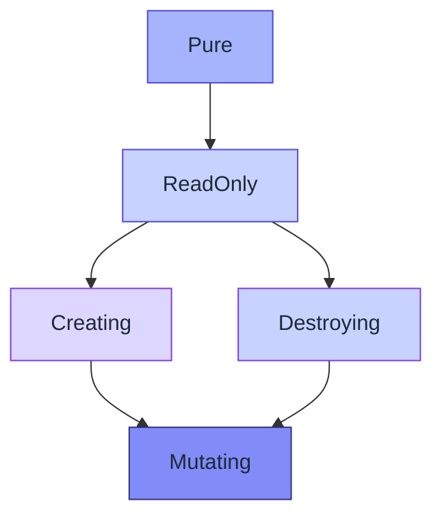

# CellScript 0.22 Type Theory And Set Theory Roadmap

**Status**: Draft, pending Nervos Talk Discussion before adoption
**Scope**: typed effects, terminal flow metadata, typed transaction-view
handles, bounded invariant quantification, validity predicates, explicit borrow
regions, syntax integrity baseline, capability algebra, concrete payload ADTs,
bounded cell-collection design, and protocol-graph audit UX
**Depends on**: 0.21 aggregate helper coverage, flow-edge membership,
authenticated compiler evidence, TemplateLayout metadata, ProtocolGraph, and
structured diagnostic transport

## Goal

This document is a proposal draft. It must go through Nervos Talk Discussion
before it is treated as an accepted CellScript 0.22 roadmap or implementation
commitment.

CellScript 0.22 should use type theory and set theory to sharpen the existing
action-centred CKB DSL, not to replace it.

The centre stays:

```text
action + transition + verification + typed cell effects
```

The 0.22 goal is to make protocol law easier to state, cheaper to audit, and
harder to overclaim. The language should still read like a CKB Cell
transformation transcript:

- `action` states the proposed transaction shape;
- `transition` states which Cell state continues;
- `verification` states why that transformation is valid;
- `invariant` states scoped protocol law and its evidence tier;
- metadata and ProofPlan state exactly what is static, runtime-checked,
  builder-required, metadata-only, or chain-evidence-dependent.

0.22 should not chase generic mathematical elegance. It should choose the
smallest syntax that gives the compiler, LSP, formatter, ProtocolGraph,
ProofPlan, and release gates a precise contract.

## Pre-Talk Required Fixes

This draft should not be posted as a final 0.22 roadmap until the following
soundness and documentation gaps are fixed in the proposal text. These are
discussion-readiness requirements, not implementation claims.

1. The callable-effect design must state that the checker walks the call graph
   transitively across package boundaries. Imported helpers, imported actions,
   and package summaries cannot be trusted as bare declarations without
   verification evidence.
2. Borrow-region semantics must distinguish source `borrow` blocks from the
   compiler's flow-sensitive regions. A borrowed `View<T>` must be non-storing,
   non-escaping, non-serializable, and invalidated on every branch that
   consumes, destroys, transfers, settles, or claims the linear root.
3. Terminal-flow metadata must define the 0.22 first cut precisely: exactly one
   initial state, no `initial` / `terminal` overlap, no outgoing terminal
   edges, and terminal-by-output-state only. Terminal-by-destruction and
   terminal-by-absence remain deferred until their evidence model is explicit.
4. Validity predicates must enumerate the approved `env::*` reads and assign an
   evidence tier to each one. Unknown environment reads must fail closed in
   production-facing modes.
5. The roadmap must use future-tense acceptance criteria and point gate claims
   back to `docs/CELLSCRIPT_GATE_POLICY.md`. It must not imply that parser,
   type checker, lowering, metadata, LSP, tests, or gates already implement a
   0.22 feature.
6. Syntax integrity issues that can invalidate the 0.22 design must be closed
   before new surface area is treated as adoptable: unchecked casts, stdlib
   fail-open lowering, capability registry drift, untyped flow state fields,
   and stringly-typed aggregate targets.

## Non-Goals

- Do not turn CellScript into a theorem prover.
- Do not hide the CKB Cell model behind account-style state mutation.
- Do not add unbounded chain-wide quantification.
- Do not add object-oriented resource inheritance.
- Do not add generic `Option<T>` / `Result<T, E>` before concrete payload enum
  lowering is stable.
- Do not accept dynamic enum payloads before ABI, layout, and Molecule
  serialization rules are explicit.
- Do not add core `channel` or session-type syntax in 0.22.
- Do not treat ProtocolGraph roles as authorization evidence.
- Do not allow local references rooted in linear Cells to escape.
- Do not allow `as` casts to erase cell identity, linearity, or capability
  boundaries.
- Do not introduce capability aliases that hide authority at the action site;
  any accepted alias must expand in formatter output, metadata, and diagnostics.
- Do not treat compiler evidence as CKB dry-run, tx-pool, commit, capacity, or
  cycle evidence.
- Do not treat action source qualifiers, `with_type(...)`, default lock
  bindings, or block-scoped lock providers as committed 0.22 syntax without a
  separate Nervos Talk decision.
- Do not add a whole `env::tx()` / `TxView` object before narrow typed
  transaction-view handles exist.
- Do not represent transaction-backed cell collections as generic
  `Vec<Resource>` values.
- Do not let `assert_*` or `enforce_*` names describe declarations that are
  only `metadata-only`.
- Do not allow effectful action-to-action calls as ordinary helper calls.
- Do not document a syntax feature as implemented unless parser, formatter,
  type checking, lowering, metadata, LSP/editor behaviour, examples, tests, and
  gates agree.

## Design Thesis

Type theory gives CellScript a way to make ownership, authority, effects,
borrows, and valid values explicit.

Set theory gives CellScript a way to model finite transaction views, source
sets, flow relations, identity equivalence, cardinality, and bounded
quantification.

The useful theory is the theory that compiles into one of:

1. an earlier rejection of unsafe source;
2. a generated verifier check;
3. a structured ProofPlan obligation;
4. a builder evidence requirement;
5. an honest metadata-only blocker;
6. a better ProtocolGraph or LSP explanation.

If a feature cannot be classified into one of those outputs, it is not ready for
the 0.22 language surface.

## Baseline From 0.21

0.21 already provides the foundation that 0.22 should build on:

- linear ownership for cell-backed `resource`, `shared`, and `receipt` values;
- capability declarations using kernel-effect vocabulary;
- first-class identity policies such as `ckb_type_id`, `field(...)`,
  `script_args`, and `singleton_type`;
- action-level `#[effect(...)]` declarations plus inferred effect classes;
- explicit `transition` declarations;
- static flow-edge membership validation;
- scoped aggregate invariant declarations and ProofPlan records;
- partial executable lowering for recognised xUDT group amount aggregate
  shapes;
- TemplateLayout metadata;
- derived ProtocolGraph audit views;
- authenticated compile receipts;
- structured diagnostic transport.

0.22 should close the next layer of semantic precision. It should not reopen
0.21's action core.

## Canonical Syntax Decisions

The most important 0.22 design decision is choosing canonical syntax that
stays readable, efficient, and audit-friendly.

| Area | Canonical 0.22 direction | Deferred or rejected direction |
|---|---|---|
| Callable effects | `#[effect(Pure)] fn ...` | new keyword forms such as `pure fn` in 0.22 |
| Flow terminality | `initial ...; terminal ...; A -> B;` inside `flow` | inline-only `A -> terminal B` as the sole canonical form |
| Flow state typing | enum-backed state fields for flow-managed state | untyped `state: u8` as the canonical flow surface |
| Quantifiers | `forall output x in group_outputs<T> { ... }` plus `count(...)` | unbounded `forall x: T`; `exists` in the first 0.22 surface |
| Aggregate targets | typed source-view / field target AST | stringly `Vec<String>` target parsing as the permanent model |
| Type validity | `validity` block inside persistent type definitions | field-level `where` as the first canonical surface |
| Borrowing | explicit `borrow root as view { ... }` block | first-class local `let view = &root` aliases before borrow regions exist |
| Casts | closed, checked cast kinds with cell-identity preservation | arbitrary structural `expr as Ty` rewrites |
| Stdlib helpers | signature-table validation and fail-closed lowering | lowering-time arity errors that become `true` obligations |
| Capabilities | no new inheritance syntax; stronger diagnostics and metadata | `resource T extends Burnable` or broad implicit inheritance |
| Error values | fixed-width concrete payload enum lowering first | dynamic payloads; generic `Option<T>` / `Result<T, E>` first |
| Multi-party protocol shape | ProtocolGraph roles and linting as metadata only | core `channel` / session syntax in 0.22 |

The common rule is: make the source slightly more explicit when that buys better
auditability and lower implementation risk.

## UI And UX Goals

0.22 should make the source and tool surfaces feel more protocol-aware without
making authors memorize formal methods vocabulary.

### Source UX

Authors should be able to read a file top-down and see:

- which callable is pure, read-only, creating, destroying, or mutating;
- where a state machine starts and terminates;
- which finite CKB source view an invariant ranges over;
- which values make a Cell type valid;
- where a read-only borrow region begins and ends;
- why a capability is or is not enough for an operation.

### LSP UX

The editor should show compact semantic badges:

| Function | Effect class |
|---|---|
| `check_owner(...)` | `Pure` |
| `load_config(...)` | `ReadOnly` |
| `issue(...)` | `Creating` |
| `burn(...)` | `Destroying` |
| `transfer(...)` | `Mutating` |

For flows:

| Element | Kind | Note |
|---|---|---|
| `Pending` | initial state | entry point |
| `Claimed` | terminal state (flow-local) | success exit for this declared flow |
| `Refunded` | terminal state (flow-local) | timeout exit for this declared flow |
| `Pending -> Claimed` | declared edge | used by `claim_with_preimage` |

For invariants:

| Field | Value |
|---|---|
| name | `token_outputs_positive` |
| range | `group_outputs<Token>` |
| evidence | `checked-runtime` |
| cost | one `GroupOutput` scan |

### ProofPlan UX

ProofPlan should not merely list obligations. It should classify their evidence
tier:

| Tier | Discharged by |
|---|---|
| `checked-static` | compiler / static analysis |
| `checked-runtime` | generated verifier code |
| `runtime-helper-required` | known helper contract (no emitted helper for this entry) |
| `builder-evidence-required` | transaction builder or indexer material |
| `metadata-only` | preserved for audit, not enforced |
| `chain-evidence-required` | dry-run, tx-pool, commit, capacity, or cycle evidence |

The user should be able to distinguish "the compiler generated this check" from
"the compiler preserved this claim for audit".

### ProtocolGraph UX

ProtocolGraph should become the main visual explanation for flow and
participant roles, without becoming a new IR:

| From | Edge | Role | To |
|---|---|---|---|
| `Pending` | `claim_with_preimage` | `participant` | `Claimed` |
| `Pending` | `refund_after_timeout` | `initiator` | `Refunded` |

This gives most of the value people expect from session types without adding
channel syntax to the core language.

## P0: Syntax Integrity Baseline Before New Surface

### Problem

The 0.22 type-theory and set-theory surface depends on the current language
being sound at the basic syntax boundary. New effects, validity predicates,
borrow regions, terminal flows, and bounded quantifiers should not be layered
on top of unchecked structural casts, fail-open stdlib lowering, stringly
aggregate targets, or untyped flow-state conventions.

This is not a request to refactor every duplicated compiler path before 0.22.
It is a proposal to close the syntax issues that can make 0.22 claims
misleading.

### Required Baseline

#### Checked Casts

`expr as Ty` must become a closed, checked operation. A cast should be accepted
only when it is one of:

- an explicitly supported primitive cast;
- a transparent representation cast declared by the type definition and checked
  by the compiler; or
- a cell-backed cast that preserves the same identity policy, layout boundary,
  and linear ownership contract.

Any cast that would erase cell identity, turn a linear value into a scalar, or
rewrite a resource into an unrelated type must fail closed.

#### Stdlib Fail-Closed Boundary

Stdlib helpers are part of the public audit grammar. Arity, type, namespace, and
cell-kind validation must happen before lowering relies on the helper. A
mistyped helper call must not lower into a constant-true verifier obligation.

The canonical source should be the stdlib signature table. Lowering may use
specialised expansions, but it should not maintain an independent, weaker
argument contract.

#### Capability Registry

Capability names should come from one canonical registry used by parser,
formatter, type checker, docgen, LSP, and metadata. The registry should make the
closed capability set explicit:

```text
store, create, consume, destroy, replace, burn, relock, retarget_type, read_ref
```

The canonical source form remains the expanded capability list. Shortcuts such
as `has linear` or `has linear_ref` are discussion candidates only; if accepted,
they must be formatter-expanded and metadata-expanded so authority is still
visible in review.

#### Enum-Backed Flow State

A `flow Type.field` declaration should refer to a field whose type describes
the finite state space. The canonical 0.22 form is:

```cellscript
enum SwapState {
    Pending,
    Claimed,
    Refunded,
}

resource SwapLock has store, create, consume {
    state: SwapState
}

flow SwapLock.state {
    initial Pending;
    terminal Claimed, Refunded;

    Pending -> Claimed;
    Pending -> Refunded;
}
```

Untyped `state: u8` plus named flow edges is not the canonical 0.22 surface. If
compatibility requires accepting it temporarily, docs and diagnostics should
mark it as legacy or migration-only before any 0.22 adoption claim.

#### Typed Aggregate Targets

Aggregate invariant reads and 0.22 source-view quantifiers should share a typed
target model. The compiler should not keep parsing targets as loose strings in
one phase and reparsing them differently in another phase.

The intended internal model is a closed representation such as:

```text
SourceView(Input | Output | GroupInput | GroupOutput | CellDep)
AggregateTarget(SourceView, optional type, optional field)
```

This supports bounded quantifiers, source-view cost reporting, ProofPlan
evidence tiers, and xUDT aggregate helper selection without duplicating string
parsers.

#### Typed Transaction-View Handles Before Tx Builder Surface

The cell-model syntax audit shows a real expressiveness gap around first-class
transaction structure. The 0.22 first cut should expose narrow typed
transaction-view handles, not a complete transaction-builder DSL.

Candidate handles:

```text
InputView<T>
OutputView<T>
CellDepView
HeaderDepView
WitnessArgsView
OutPoint
ScriptView
ScriptHash
```

Candidate entry points:

```text
ckb::input<T>(index) -> InputView<T>
ckb::output<T>(index) -> OutputView<T>
ckb::group_input<T>(index) -> InputView<T>
ckb::group_output<T>(index) -> OutputView<T>
ckb::cell_dep(index) -> CellDepView
ckb::header_dep(index) -> HeaderDepView
witness::args(index) -> WitnessArgsView
```

These handles are read-only transaction views. They are not linear resources,
and reading one must not imply consumption, creation, output construction, or
transaction-builder authority. Resource ownership begins only at an explicit
lifecycle operation:

```cellscript
let input = ckb::input<Token>(0);
let token = consume Token from input;
```

This staged approach leaves a future `TxView` possible, but only after the
smaller handle surface has parser, formatter, type-checker, lowering, metadata,
LSP, test, and gate coverage.

### Discussion Candidates, Not Baseline Commitments

The syntax audit also identifies larger surface improvements that are plausible
but should not be silently folded into 0.22:

- action parameter source qualifiers such as `witness`, `protected`, `read`,
  `consume`, and `destroy`;
- `with_type(...)` and `with_type_args(...)` as type-script counterparts to
  `with_lock(...)`;
- pure-helper cleanup that requires pure computation to live in `fn` rather
  than `action`;
- default or block-scoped lock binding sugar to reduce repeated `with_lock`;
- explicit action-composition syntax for merging consumed/created cells,
  witnesses, builder obligations, and ProofPlan records.

These belong in Nervos Talk discussion as separate design choices because they
change how much CKB boundary information is visible at the action site.

### Proposed Acceptance Criteria

- Unsupported casts will fail before IR lowering and cannot erase cell-backed
  identity or linear ownership.
- Mistyped or unknown stdlib helpers will fail closed and will not lower to a
  constant-true verifier obligation.
- Capability parsing, formatting, diagnostics, docgen, and metadata will use
  the same canonical capability registry.
- New 0.22 flow examples will use enum-backed state fields, and any legacy
  numeric flow state support will be explicitly labelled.
- Transaction-view handles will be typed read-only views and will not imply
  resource ownership or builder authority.
- Aggregate reads and bounded quantifier ranges will share one typed
  source-view target model.

## P0: Callable Effect Signatures

### Problem

Actions can already declare effects with `#[effect(...)]`. Ordinary `fn`
helpers infer effects, but they do not expose the same stable declared contract.

That weakens:

- package boundary audits;
- borrow safety;
- refinement predicate purity;
- bounded invariant predicate purity;
- LSP and docgen explanations.

### Canonical Syntax

Use the existing attribute style:

```cellscript
#[effect(Pure)]
fn check_owner(token: &Token, owner: Address) -> bool {
    token.owner == owner
}

#[effect(ReadOnly)]
fn check_config(config: &Config, expected: u64) -> bool {
    config.value == expected
}

#[effect(Creating)]
action issue(amount: u64, owner: Address) -> token: Token {
    verification
        create token = Token { amount, owner } with_lock(owner)
}
```

Do not introduce `pure fn` / `readonly fn` keywords in 0.22. They are shorter,
but they add grammar surface and diverge from the existing action attribute
model.

### Effect Lattice

The effect classes should remain a small lattice:



`Creating` and `Destroying` remain distinct unless both are present. A callable
that both consumes and creates is `Mutating`.

### Compiler Requirements

- Extend `FnDef` with optional declared effect metadata.
- Parse `#[effect(...)]` before `fn` definitions.
- Reject underdeclared function effects with the same rule used for actions.
- Walk callees transitively when checking a declared effect, including imported
  helpers and imported actions.
- Preserve imported function effects across package boundaries only with
  package evidence that identifies the declared effect, inferred effect,
  exported call summary, and source or artifact identity.
- Reject packages that expose a helper whose declared effect is weaker than the
  transitive effect summary required by its body or imported callees.
- Include declared and inferred effects in metadata.
- Show function effects in docgen and LSP hover.
- Add syntax-combo seeds for function effects through direct and imported
  calls.

### Cross-Package Soundness Rule

The checker must not trust `#[effect(Pure)]` on an imported helper as an
unverified promise. At every package boundary, the importer needs either:

- a verified package summary generated by the compiler version that defines the
  effect lattice;
- enough source or authenticated artifact evidence to recompute the exported
  helper's transitive effect; or
- a fail-closed diagnostic that rejects the import for production-facing modes.

This rule is the soundness foundation for `validity`, bounded invariant
predicates, and borrow-region calls. A pure wrapper around a creating,
destroying, or mutating action must be rejected even when the wrapper is defined
in another package.

### Diagnostic Shape

```text
declared effect Pure is too weak for function 'make_token';
inferred effect is Creating
```

### Proposed Acceptance Criteria

- A pure helper that only reads scalar or reference data will compile.
- A `#[effect(Pure)] fn` that calls a creating action will fail.
- A `#[effect(Pure)] fn` imported from another package but wrapping a creating
  action will fail.
- Imported helper effects will be preserved, authenticated, and checked against
  transitive call summaries.
- `cellc doc`, LSP hover, and metadata will expose the same effect.

## P0: Terminal Flow Metadata

### Problem

0.21 validates edge membership:

```text
(from, to) must be in the declared flow relation.
```

It does not yet encode initial states, terminal states, or terminal discharge
policy.

### Canonical Syntax

Prefer separated state attributes:

```cellscript
flow SwapLock.state {
    initial Pending;
    terminal Claimed, Refunded;

    Pending -> Claimed;
    Pending -> Refunded;
}
```

This is clearer than making inline terminal edges the only public form:

```cellscript
Pending -> terminal Claimed;
```

Inline syntax can be considered later as formatter sugar, but the canonical
form should keep state attributes and edges separate. That makes diffs,
metadata, and graph rendering cleaner.

### Compiler Requirements

- Add `initial` and `terminal` declarations to the flow AST.
- Validate that declared initial and terminal states are known states.
- Require exactly one `initial` declaration in the first 0.22 surface.
- Reject a state declared as both `initial` and `terminal`.
- Reject outgoing edges from terminal states.
- Warn on unreachable states before making this a strict-mode error.
- Record terminal coverage in metadata and ProofPlan.
- Record terminal-by-output-state in the first implementation.
- Keep terminal-by-destruction and terminal-by-absence/evidence reserved until
  their evidence and performance model are explicit.

### Terminal Discharge First Cut

0.22 should start with one terminal discharge model:

| Discharge kind | 0.22 status | Evidence |
|---|---|---|
| terminal-by-output-state | canonical | output state is present and matches a declared terminal state |
| terminal-by-destruction | deferred | needs explicit destroy/burn evidence and lifecycle accounting |
| terminal-by-absence/evidence | deferred | needs absence proof, indexer, or builder evidence contract |

This keeps terminal metadata useful for ProtocolGraph and audit bundles without
claiming global liveness or chain-wide eventual termination.

### Important Limitation

The compiler cannot prove that every live on-chain Cell eventually reaches a
terminal state. It can only prove that declared actions respect the declared
flow relation and terminal policy for the transaction being validated.

### Proposed Acceptance Criteria

- ProtocolGraph will mark initial and terminal nodes.
- A flow with zero or multiple initial states will fail in the first 0.22
  surface.
- A state declared as both initial and terminal will fail.
- An action transition to an undeclared terminal state will fail.
- A terminal state with an outgoing edge will fail.
- An initial state with no outgoing edge will emit an audit warning unless a
  future terminal-equivalent policy explicitly allows it.
- Terminal evidence will be visible in audit bundles.

## P0: Evidence Taxonomy In ProofPlan

### Problem

As the language gains stronger declarations, a single "obligation exists" flag
is not enough. Auditors need to know who discharges an obligation.

### Required Evidence Tiers

| Tier | Discharged by |
|---|---|
| `checked-static` | compiler / static analysis |
| `checked-runtime` | generated verifier code |
| `runtime-helper-required` | known helper contract (no emitted helper for this entry) |
| `builder-evidence-required` | transaction builder or indexer material |
| `metadata-only` | preserved for audit, not enforced |
| `chain-evidence-required` | dry-run, tx-pool, commit, capacity, or cycle evidence |

### Rules

- Static facts are facts proven by the compiler from source and constants.
- Runtime facts are backed by generated verifier code.
- Runtime-helper-required facts have a known helper contract but no emitted
  helper for the selected entry.
- Builder-evidence-required facts need transaction-builder or indexer material.
- Metadata-only facts are preserved for audit but not enforced.
- Chain-evidence-required facts need dry-run, tx-pool, commit, capacity, or
  cycle evidence.
- User-facing names must match the tier. `assert_*` and `enforce_*` are only
  acceptable for checked-static, checked-runtime, or explicitly
  helper-backed forms. Metadata-only declarations should use weaker names such
  as `observe`, `declare`, or metadata annotations.

### Proposed Acceptance Criteria

Every new 0.22 feature will record its evidence tier. Gate mode mechanics remain
defined by `docs/CELLSCRIPT_GATE_POLICY.md`; 0.22 adds only feature-specific
evidence requirements. Production-facing gates will reject `metadata-only`
obligations whenever the feature contract claims executable enforcement.

## P1: Bounded Source-View Quantifiers

### Problem

The current aggregate invariant primitives are deliberately narrow:

| Primitive | Asserts |
|---|---|---|
| `assert_sum` | a sum equals an expected total |
| `assert_conserved` | a value is preserved across the transition |
| `assert_delta` | a difference matches an expected delta |
| `assert_distinct` | set members are pairwise distinct |
| `assert_singleton` | the set contains exactly one element |

They are useful, but many protocol rules are naturally quantified over finite
transaction views.

### Canonical Syntax

Use source-view-bounded quantifiers:

```cellscript
invariant token_outputs_positive {
    trigger: type_group
    scope: group
    reads: group_outputs<Token>.amount

    forall output token in group_outputs<Token> {
        require token.amount > 0
    }
}
```

Cardinality:

```cellscript
invariant one_receipt_per_claim {
    trigger: type_group
    scope: transaction
    reads: outputs<Receipt>.claim_id

    count(outputs<Receipt> where claim_id == expected_claim_id) == 1
}
```

`exists` is deferred from the first 0.22 canonical surface. It can be added
later as explicit sugar once `forall` and `count` have shipped with precise
metadata, scan costs, and syntax-combo coverage.

Avoid unbounded syntax:

```cellscript
forall token: Token {
    require token.amount > 0
}
```

That form is elegant mathematically but dishonest for CKB unless it names a
finite source view or an external indexer evidence contract.

### Source Views

0.22 should start with:

| Source view | What it ranges over |
|---|---|
| `inputs<T>` | type-`T` cells in the transaction's input list |
| `outputs<T>` | type-`T` cells in the transaction's output list |
| `group_inputs<T>` | type-`T` cells in the same type-group as an input |
| `group_outputs<T>` | type-`T` cells in the same type-group as an output |
| `selected_cells<T>` | type-`T` cells explicitly carried by a verifier |
| `cell_deps<T>` | type-`T` cells declared as a `cell_dep` reference |

Additional views require explicit metadata and cost modelling.

### Predicate Rules

Quantifier bodies are predicates. They must be pure under the same effect rule
used for `validity` predicates:

- no `create`, `consume`, `destroy`, transfer, claim, settle, or other
  lifecycle operation;
- no helper call unless its transitive effect is accepted for predicate use;
- no source view that lacks metadata, cost, and evidence-tier support.

### Efficiency Contract

Every bounded quantifier must have an obvious scan cost:

```cellscript
forall output token in group_outputs<Token>
=> O(group_outputs)
=> one Source::GroupOutput scan
=> cycle estimate visible in metadata
```

| Property | Value |
|---|---|
| complexity | `O(group_outputs)` |
| scan | one `Source::GroupOutput` |
| metadata | cycle estimate visible |


Nested quantifiers and joins are P2 unless the compiler can emit precise cost
and source-view evidence.

`count(...)` uses a `u64` accumulator in the first 0.22 surface. The emitted
metadata must record the source-view cap, actual scanned cardinality when known,
and overflow policy. A bounded `forall` over an empty source view is vacuously
true, but audit metadata must record `cardinality = 0` and `vacuous = true` so
auditors do not mistake absence of evidence for positive protocol
participation.

### Proposed Acceptance Criteria

- Quantifiers over supported source views will compile.
- Unbounded quantifiers will fail with a diagnostic naming the missing source
  view.
- Quantifier bodies containing lifecycle operations will fail.
- Generated metadata will report range, source, field reads, and estimated scan
  class.
- Empty-source `forall` checks will record vacuous satisfaction metadata.
- `count` checks will record accumulator width and overflow policy.
- ProofPlan will report the evidence tier.

## P1/P2: Bounded Cell Collections

### Problem

The audit correctly identifies a multi-cell DSL gap: authors need to express
batch inputs, batch outputs, and collection-wide resource obligations without
hand-coding fixed arities. The first version must not model transaction-backed
cells as ordinary memory vectors.

Do not start with:

```cellscript
let xs: Vec<Token> = ckb::group_inputs<Token>();
```

`Vec<Token>` suggests a stack/local collection, but CKB cell collections carry
source coverage, membership, cardinality, linear consume/create obligations,
builder evidence, and scan cost.

### Canonical Types

Start with bounded, source-aware types:

```text
BoundedCellSet<T, N>
BoundedList<T, N>
```

`BoundedCellSet<T, N>` is a finite transaction-backed set of typed cells from a
named CKB source view. `BoundedList<T, N>` is a finite witness/static/pure
computation plan that may drive output creation but does not itself prove cell
membership.

### Candidate Syntax

```cellscript
action batch_transfer(
    signer: witness lock Signature,
    inputs: group_input BoundedCellSet<Token, 16>,
    payouts: witness input_type BoundedList<Payout, 16>,
) {
    require nonempty(inputs);
    require sum(inputs.amount) == sum(payouts.amount);

    consume_each token in inputs {
        require token.owner == signer.hash160();
    }

    create_each payout in payouts {
        create Token {
            owner: payout.owner,
            amount: payout.amount,
        }
    }
}
```

This is candidate syntax, not a baseline commitment. The committed design point
is bounded source-aware ownership, not the exact spelling.

### Rules

- `consume_each` only accepts `BoundedCellSet<Resource, N>`.
- `create_each` may accept `BoundedList<Plan, N>` only when output cardinality,
  field writes, capacity obligations, and builder evidence are visible.
- Each bounded set records source view, type selector, maximum cardinality,
  actual scanned cardinality when known, vacuous-satisfaction status, and
  ProofPlan evidence tier.
- A universal predicate over a possibly empty bounded set must either record
  `vacuous = true` or be paired with `nonempty(...)` / `count(...)` when the
  protocol requires participation.
- Generic `Vec<Resource>` remains deferred until membership proofs and linear
  collection ownership are explicit.

### Proposed Acceptance Criteria

- Bounded cell collections will not compile without an explicit source view and
  maximum cardinality.
- `consume_each` will fail if the collection is not a bounded cell set of a
  linear resource.
- `create_each` will emit output cardinality and capacity/builder obligations
  in ProofPlan.
- Empty-source universal checks will be visible as vacuous metadata.
- Syntax-combo coverage will include unbounded collections, duplicated
  consumes, missing cardinality metadata, and `Vec<Resource>` rejection.

## P1: Type Validity Blocks Instead Of First-Class Field `where`

### Problem

Field-level refinement syntax is attractive:

```cellscript
amount: u64 where amount > 0
```

But CellScript already moved action proof syntax away from `where` and toward
`verification`. Reintroducing field `where` as the first canonical form would
make the language look cleaner at the field level but less consistent overall.

### Canonical Syntax

Use a `validity` block inside persistent type declarations:

```cellscript
resource TimeLockedCell has store, create, consume {
    amount: u64
    locktime: u64
    owner: Address

    validity
        require amount > 0
        require owner != Address::zero()
        require locktime > env::block_number()
}
```

This mirrors action `verification`:

| Construct | Plain reading |
|---|---|
| `resource validity` | what makes this Cell data valid |
| `action verification` | why this transaction transformation is valid |

Field-level `where` can be reconsidered later as formatter sugar, but it should
not be the first canonical 0.22 surface.

### Evidence Tiers

Validity predicates have tiers:

| Tier | Example | Compiler responsibility |
|---|---|---|
| static | literal `amount: 10` satisfies `amount > 0` | prove at compile time |
| checked-runtime | `owner != Address::zero()` | generate verifier check |
| builder/environment | `locktime > env::block_number()` | require runtime or builder evidence |
| metadata-only | unsupported predicate | reject in production modes |

### Approved Environment Reads

Environment reads are not compile-time constants. The first 0.22 draft should
keep a narrow allow-list:

| Read | Status | Evidence tier |
|---|---|---|
| `env::block_number()` | allowed only with an explicit transaction/header evidence source | `builder-evidence-required` or `checked-runtime` when lowered |
| any other `env::*` | deferred | fail-closed in production-facing modes |

Additional environment reads require a named CKB evidence source, metadata
shape, ProofPlan tier, and gate coverage before they become accepted syntax.

### Tier Inference

Evidence tier inference is semantic, not lexical:

- a predicate that contains any approved `env::*` read is at least
  `builder-evidence-required` unless the compiler emits a concrete runtime
  check for that read;
- a helper called from `validity` must be checked by the transitive effect
  walker and re-scanned for tier-affecting operations such as `env::*`;
- a predicate cannot be classified as `checked-static` if it depends on witness,
  lock args, transaction header material, or any chain/environment read;
- audit metadata must record which field, parameter, witness, lock arg, or
  environment read forced the selected tier.

### Restrictions

- Predicates must be pure.
- Predicates may refer to fields of the same value, constants, action
  parameters, witness data, lock args, and approved `env::*` reads.
- Predicates must not perform lifecycle operations.
- Predicates must not quantify over transaction views in the first version.
- Unsupported predicates must fail closed or be metadata-only with production
  rejection.

### Proposed Acceptance Criteria

- A `validity` block will emit metadata and ProofPlan entries.
- Create/update-output paths will either check validity or record why they
  cannot.
- Production-facing gates will reject metadata-only validity predicates.
- LSP hover on the type will show validity predicates and evidence tiers.

## P1: Explicit Borrow Regions

### Problem

CellScript currently supports read-only helper references such as:

```cellscript
#[effect(Pure)]
fn verify_amount(token: &Token, expected: u64) -> bool {
    token.amount == expected
}
```

But local aliases rooted in linear values are intentionally rejected because
they can hide use-after-consume or escape a linear root.

### Canonical Syntax

Use explicit borrow regions first:

```cellscript
action transfer(token: Token, expected: u64, to: Address) -> next: Token {
    verification
        borrow token as view {
            require verify_amount(view, expected)
            require view.amount > 0
        }

        consume token
        create next = Token { amount: expected } with_lock(to)
}
```

Do not make `let view = &token` the first canonical surface. It is concise, but
the lifetime is implicit. A `borrow` block is more auditable and easier to
lower into region diagnostics.

### Borrow Rules

- A source `borrow` block creates one or more compiler regions; the compiler
  regions are flow-sensitive and may be shorter than the lexical block.
- `View<T>` is a non-storing, non-copying, non-serializable view rooted in a
  linear value.
- The borrowed view cannot escape the block.
- The borrowed view cannot be returned.
- The borrowed view cannot be stored in a struct, tuple, array, Vec, enum
  payload, closure parameter, generic parameter, trait associated type, or
  future closure-like value.
- The borrowed view cannot cross `consume`, `destroy`, transfer, settle, or
  claim of the root.
- The borrowed view can be passed only to callees whose effects are compatible
  with the borrow.
- Mutable borrows and `&mut` borrow syntax are reserved in the first 0.22
  surface.
- Branch analysis must reject a borrow if any path consumes or destroys the
  root before the last use of the borrowed view.

A `borrow` view is a one-transaction read of the linear root. It does not
persist between transactions, does not mutate chain state, and does not replace
the explicit `consume` plus `create` shape of a CKB state transition.
Here `transfer`, `claim`, and `settle` refer to lifecycle operations or stdlib
helpers that consume, destroy, create, or otherwise discharge the borrowed
root's lifecycle.

### Storage And Escape Detection

The initial implementation should treat a borrowed view as a marker type with
no layout and no ABI representation. The checker should reject every construct
that would require layout, serialization, capture, or generic storage of
`View<T>`. That includes tuple and array literals, Vec elements, enum payloads,
closure-like values, generic function parameters without a dedicated view
bound, trait associated types, return values, and persistent Cell fields.

### Diagnostics

```text
borrow 'view' cannot escape borrow block rooted at linear value 'token'
borrow 'view' cannot cross consume of linear root 'token'
function 'f' has Mutating effect and cannot receive borrowed linear view 'view'
```

### Proposed Acceptance Criteria

- Borrow blocks will support multiple pure/read-only checks.
- Consuming the root inside the borrow block, or on any branch before the last
  view use, will fail.
- Returning or storing the borrow will fail.
- Function effect signatures will be used to validate borrow calls.

## P2: Capability Algebra Without Inheritance Syntax

### Problem

Capabilities are currently explicit but mostly flat. The useful next step is an
operation-specific entailment relation, not broad inheritance.

The syntax integrity baseline also requires capability names to come from one
canonical registry. The registry is the prerequisite; operation-specific
entailment is the next layer.

### No New Source Syntax Required

Keep declarations simple:

```cellscript
resource Token has store, create, consume, burn {
    amount: u64
}
```

Improve diagnostics and metadata:

#### `destroy token accepted`

| Field | Value |
|---|---|
| required | `consume + burn` |
| provided | `consume + burn` |

#### `replace_unique rejected`

| Field | Value |
|---|---|
| required | `replace + identity preservation` |
| missing | `replace` |
| missing | `identity(...)` |

Avoid:

```cellscript
resource Token extends Burnable, Replaceable {
    amount: u64
}
```

That would make CKB authority look like an object hierarchy and risks accidental
privilege expansion.

### Compiler Requirements

- Move capability names, rendering, and parsing into one closed registry shared
  by parser, formatter, type checker, docgen, LSP, and metadata.
- Define a closed versioned entailment relation.
- Treat capabilities as per-resource authority. A container resource's
  capability does not transitively grant lifecycle authority over a distinct
  inner Cell resource.
- Record capability-set version metadata so adding or removing a capability is
  visible in audit bundles and package-boundary diagnostics.
- Explain derived acceptance in diagnostics.
- Emit capability proof metadata for operations that rely on entailment.
- Keep least privilege as the default.
- Treat capability shortcuts as deferred unless Nervos Talk accepts a formatter
  and metadata expansion rule that keeps authority visible.

### Proposed Acceptance Criteria

- Capability parsing, formatting, diagnostics, docgen, and metadata will agree
  on the same closed registry.
- An operation whose required capability is missing will fail with a diagnostic
  naming the exact missing capability or identity condition.
- Capability proof metadata will record required, provided, entailed, missing,
  and capability-set version fields for audited operations.
- Tests will show that capability authority is not transitive across nested or
  container-like resource shapes.

## P2: Concrete Payload ADTs Before Generic `Option<T>`

### Problem

`Option<T>` and `Result<T, E>` are useful, but generic ADTs require payload enum
lowering, pattern destructuring, metadata layout, ABI rules, and
monomorphisation strategy.

### Canonical 0.22 Direction

Start with concrete payload enums:

```cellscript
enum Limit {
    None,
    Some(u64),
}

fn get_limit(enabled: bool) -> Limit {
    if enabled {
        Limit::Some(100)
    } else {
        Limit::None
    }
}

action spend(amount: u64, enabled: bool) {
    verification
        match get_limit(enabled) {
            Limit::Some(value) => require amount <= value,
            Limit::None => require false, "missing limit",
        }
}
```

Defer:

```cellscript
enum Option<T> {
    Some(T),
    None,
}
```

### Payload Rules

The first 0.22 payload surface is fixed-width only. Dynamic payloads such as
`Vec<u8>`, variable-length bytes, maps, or other dynamically sized values are
deferred until the ABI and Molecule layout contract are explicit.

If a payload contains a linear cell-backed value, the match arm that binds the
payload owns that value for that arm. The linear checker must verify
arm-local consumption, borrowing, or preservation; a payload cannot disappear at
the end of an arm by implicit drop.

### Proposed Acceptance Criteria

- Fixed-width payload variants will lower to explicit layouts.
- Match destructuring will be exhaustive, with compile errors naming missing
  variants.
- Variable-width payloads will fail closed or remain explicitly deferred.
- Linear payload values will be tracked per match arm.
- Payload metadata will be visible in ABI/schema reports.
- Generic ADTs will remain rejected or explicitly deferred.

## P2: ProtocolGraph Roles Instead Of Core Session Types

### Problem

Session types are appealing for multi-party protocols, but CKB is not a
synchronous channel system. It is a transaction system where independent
builders consume live Cells and create new Cells over time.

### 0.22 Direction

Do not add:

```cellscript
channel AtomicSwap {
    participant Alice, Bob;
    Alice -> Bob: offer;
}
```

Instead, enrich the existing model:

```cellscript
enum SwapState {
    Pending,
    Claimed,
    Refunded,
}

resource SwapLock has store, create, consume, replace, burn {
    swap_id: Hash
    initiator: Address
    participant: Address
    state: SwapState
}

flow SwapLock.state {
    initial Pending;
    terminal Claimed, Refunded;

    Pending -> Claimed;
    Pending -> Refunded;
}
```

ProtocolGraph should render role annotations derived from explicit predicates,
locks, witnesses, and fields:

| From | Edge | Role | To |
|---|---|---|---|
| `Pending` | `claim_with_preimage` | `participant` | `Claimed` |
| `Pending` | `refund_after_timeout` | `initiator` | `Refunded` |

This gives most of the audit value of session types without adding channel
syntax to the compiler core.

### Role Metadata Rules

ProtocolGraph roles are explanatory metadata and lint inputs. They do not prove
authorization and must not be used as a verifier condition.

When multiple role sources disagree, the renderer should record the source it
used and prefer sources in this order:

1. explicit verification predicate or future explicit role annotation;
2. lock or witness binding;
3. field names.

Field-name role inference is weak metadata. A field named `participant` is not a
signer proof, and renaming such a field should produce a missing-role warning
rather than silently changing the graph's authority story.

### Proposed Acceptance Criteria

- ProtocolGraph role output will include the source used for each role.
- Conflicting role sources will produce deterministic metadata and a warning.
- Missing role inference will degrade to metadata-only warning, not verifier
  failure.
- Role metadata will not be represented as authorization evidence in ProofPlan.

## Performance Model

0.22 features must expose cost early.

| Feature | Expected cost model |
|---|---|
| effect signatures | compile-time only |
| syntax integrity baseline | mostly compile-time; stdlib fail-closed may affect generated verifier shape |
| typed transaction-view handles | direct source read or helper access; no implicit scan unless the handle source is a collection |
| terminal flow metadata | compile-time plus metadata only |
| bounded `forall` | one scan over declared source view |
| `count` | one scan with bounded accumulator |
| bounded cell collections | one bounded source scan plus explicit consume/create obligation accounting |
| validity predicates | static or generated local check |
| borrow blocks | compile-time only |
| capability algebra | compile-time only |
| payload enum matching | local branch lowering; no transaction scan |
| ProtocolGraph roles | metadata/view only |

Any feature that introduces a transaction scan must record:

- source view;
- type selector;
- field reads;
- actual or bounded cardinality where knowable;
- vacuous-satisfaction flag for empty-source universal checks;
- accumulator width;
- overflow policy;
- estimated cycle class;
- ProofPlan evidence tier.

## Syntax Combo And Gate Requirements

Every 0.22 syntax feature must extend the syntax-combination audit matrix.
The matrix authority remains `tests/syntax_combo/matrix.toml`; this roadmap only
pre-registers the bug-class names that the matrix and runner should cover once
0.22 implementation work begins.

Pre-registered 0.22 bug-class slots:

| Bug class | Must catch |
|---|---|
| `SCA-BUG-0.22-EFFECT-TRANSITIVE-IMPORT` | imported `#[effect(Pure)] fn` wraps a creating, destroying, or mutating callee |
| `SCA-BUG-0.22-CAST-ERASES-CELL-IDENTITY` | unchecked cast erases cell-backed identity, linearity, or capability boundary |
| `SCA-BUG-0.22-STDLIB-FAIL-OPEN` | mistyped or unknown stdlib helper lowers to a constant-true obligation |
| `SCA-BUG-0.22-CAPABILITY-REGISTRY-DRIFT` | parser, formatter, type checker, docgen, or metadata disagree on capability names |
| `SCA-BUG-0.22-FLOW-UNTYPED-STATE` | new 0.22 flow syntax accepts untyped numeric state as canonical |
| `SCA-BUG-0.22-TX-VIEW-RESOURCE-CONFLATE` | read-only transaction-view handle is treated as a consumed or created resource without an explicit lifecycle operation |
| `SCA-BUG-0.22-AGGREGATE-TARGET-SCOPE-DRIFT` | parser and type checker infer different source view or field for one aggregate target |
| `SCA-BUG-0.22-BORROW-EFFECT-COMPAT` | borrow block passes a view to an incompatible callee effect |
| `SCA-BUG-0.22-FLOW-TERMINAL-OUTGOING` | terminal state has an outgoing edge |
| `SCA-BUG-0.22-FLOW-INITIAL-INVALID` | zero initial states, multiple initial states, or initial/terminal overlap |
| `SCA-BUG-0.22-QUANTIFIER-UNBOUNDED` | unbounded quantifier is accepted without a finite source view |
| `SCA-BUG-0.22-QUANTIFIER-LIFECYCLE` | quantifier predicate performs a lifecycle operation |
| `SCA-BUG-0.22-QUANTIFIER-VACUOUS-MISSING` | empty-source `forall` omits vacuous satisfaction metadata |
| `SCA-BUG-0.22-QUANTIFIER-COUNT-OVERFLOW` | `count` accumulator width or overflow policy is missing or wraps silently |
| `SCA-BUG-0.22-CELLSET-UNBOUNDED` | transaction-backed cell collection is accepted without a finite bound |
| `SCA-BUG-0.22-CELLSET-VEC-RESOURCE` | generic `Vec<Resource>` is accepted as a transaction-backed cell collection |
| `SCA-BUG-0.22-CONSUME-EACH-DUPLICATE` | `consume_each` allows duplicate or partial consumption without ProofPlan coverage |
| `SCA-BUG-0.22-CREATE-EACH-CARDINALITY-MISSING` | `create_each` omits output cardinality or builder/capacity obligations |
| `SCA-BUG-0.22-VALIDITY-EVIDENCE-MISSING` | validity predicate is accepted without an evidence tier |
| `SCA-BUG-0.22-VALIDITY-ENV-UNKNOWN` | unknown `env::*` read is accepted instead of fail-closed or deferred |
| `SCA-BUG-0.22-BORROW-ESCAPE` | borrowed `View<T>` escapes through return, storage, payload, generic, or closure-like capture |
| `SCA-BUG-0.22-BORROW-CROSSES-CONSUME` | borrowed view remains usable after any path consumes or destroys the root |
| `SCA-BUG-0.22-CAPABILITY-OVERGRANT` | capability entailment grants authority not present in the declared capability set |
| `SCA-BUG-0.22-CAPABILITY-TRANSITIVE-GRANT` | container capability is treated as authority over a distinct inner Cell resource |
| `SCA-BUG-0.22-PAYLOAD-MATCH-NONEXHAUSTIVE` | payload enum match accepts non-exhaustive destructuring |
| `SCA-BUG-0.22-PAYLOAD-DYNAMIC-ACCEPTED` | variable-width payload is accepted before ABI/layout rules are defined |
| `SCA-BUG-0.22-PAYLOAD-LINEAR-DROP` | linear payload value disappears at arm end without explicit handling |
| `SCA-BUG-0.22-PROTOCOLGRAPH-ROLE-OVERCLAIM` | ProtocolGraph role metadata claims authority from field names alone |
| `SCA-BUG-0.22-PROTOCOLGRAPH-ROLE-CONFLICT` | conflicting role sources are rendered without source attribution or warning |

Gate mode semantics are defined only by `docs/CELLSCRIPT_GATE_POLICY.md`. This
roadmap must not maintain a second definition of `dev`, `ci`, `backend`,
`release`, or `release-quick`. For 0.22, the roadmap adds feature-specific
evidence requirements: syntax-combo coverage for every new source surface,
metadata and ProofPlan evidence-tier coverage, and backend-gate coverage when a
feature emits lowered verifier code.

## Documentation Requirements

Until implementation lands, all 0.22 documentation must describe these items as
proposed behaviour. Acceptance criteria are future-tense requirements, not
evidence that the feature has shipped.

0.22 docs should teach the model as:

| Construct | Plain reading |
|---|---|
| `effect` | what this callable may do |
| `flow` | which state relation is allowed |
| `enum-backed flow state` | which finite values a flow-managed field may hold |
| `terminal` | where this local lifecycle branch ends |
| `transaction-view handle` | which CKB transaction surface is read without taking resource ownership |
| `invariant` | which finite transaction view must satisfy protocol law |
| `bounded cell collection` | which finite source-backed cells are scanned, consumed, or created |
| `validity` | what makes one Cell value valid |
| `borrow` | a scoped read-only view of a linear root |
| `capability` | operation authority, explained by exact entailment |

Docs must avoid:

- "proves every Cell eventually terminates";
- "forall Token" without a source view;
- "current height is compile-time known";
- "Address is a signer";
- "metadata-only means enforced";
- "ProtocolGraph role means authorization";
- "transaction view means the input was consumed";
- "cell-backed collection is just `Vec<Resource>`";
- "`assert_*` means executable enforcement when ProofPlan says
  metadata-only";
- "dynamic enum payload is supported" before ABI/layout rules are defined;
- "session type" unless describing research or graph linting;
- present-tense claims that parser, formatter, type checker, lowering,
  metadata, LSP, tests, or gates already implement 0.22 features.

## Priority Summary

### P0

1. syntax integrity baseline: checked casts, stdlib fail-closed validation,
   canonical capability registry, enum-backed flow state, and typed aggregate
   targets;
2. typed transaction-view handles for CKB inputs, outputs, cell deps, header
   deps, witnesses, and out points without a whole `TxView`;
3. cross-package transitive effect checking and callable effect signatures for
   ordinary `fn`;
4. terminal flow metadata with `initial` and `terminal`;
5. explicit ProofPlan evidence taxonomy for new obligations.

### P1

1. bounded source-view quantifiers;
2. bounded cell-collection first cut for finite source-backed sets and plans;
3. `validity` blocks for persistent types;
4. explicit non-escaping `borrow` blocks.

### P2

1. capability algebra diagnostics and metadata;
2. concrete payload enum lowering and destructuring;
3. ProtocolGraph participant-role rendering and session-type-inspired linting.

### P3 / Research

1. field-level `where` sugar;
2. `let view = &token` borrow alias sugar;
3. generic `Option<T>` / `Result<T, E>`;
4. `exists` quantifier sugar;
5. dynamic enum payload ABI/layout support;
6. action source qualifiers and `with_type(...)` syntax;
7. default or block-scoped lock binding sugar;
8. explicit action-composition syntax.
8. core `channel` / session syntax.

## Recommended Implementation Order

1. Close the syntax integrity baseline: checked casts, stdlib fail-closed
   validation, canonical capability registry, enum-backed flow-state examples,
   and typed aggregate targets.
2. Define and test cross-package transitive effect checking, then extend effect
   declarations to ordinary functions.
3. Add flow `initial` / `terminal` parser, AST, formatter, metadata, and graph
   rendering.
4. Add the ProofPlan evidence taxonomy that all later tracks will use.
5. Add bounded quantifiers over one source view at a time.
6. Add `validity` blocks and connect them to create/update-output checks.
7. Add explicit borrow blocks using callable effect signatures.
8. Add capability entailment explanations.
9. Add concrete payload enum lowering.
10. Add ProtocolGraph role rendering and session-inspired lints.

This order keeps the compiler honest. The syntax integrity baseline prevents
existing surface forms from silently erasing Cell identity, failing open, or
disagreeing across compiler phases. Effects make predicates and borrow calls
checkable. Terminal metadata makes lifecycle graphs auditable. Evidence tiers
keep invariant and validity claims from overreaching. Only after that should the
language add richer local ergonomics.
