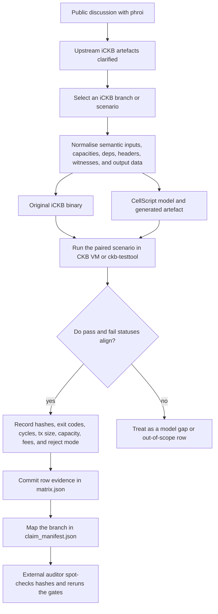

# CellScript iCKB Equivalence

This repository contains the iCKB equivalence evidence used by CellScript.

It is not a marketing benchmark. It is a set of executable specs, fixtures, original binary references, and reports for checking whether CellScript models the intended iCKB behaviour closely enough to support a production-equivalence claim.

## How To Read This Repository

The evidence is organised around behaviour, not speed. A useful row says that an original iCKB binary and a generated CellScript artefact were run against the same normalised CKB VM/testtool scenario, then produced matching accept/reject status with named reject reasons where relevant.

That gives the repository a stricter shape than an ordinary benchmark suite:

- `ickb_specs/` describes the CellScript model surface.
- positive and negative fixtures make accepted and rejected behaviours explicit.
- `ickb_diff/matrix.json` records row-level differential evidence.
- `ickb_diff/claim_manifest.json` declares which rows are allowed to support a production-equivalence claim.
- carried reports explain what is proven, what is supporting evidence, and what remains outside the claim boundary.

Compile success alone is not enough here. A claim row needs executable evidence, original-side evidence, generated-side evidence, matching status, hashes, cycle and transaction measurements, and a clear branch-level manifest entry.

## External Audit Path

This benchmark line grew out of a public Nervos Talk discussion with phroi about using iCKB as a realistic CellScript maturity benchmark. The useful starting point was phroi's cleanup of iCKB artefacts around DAO, header, witness, deployment, replay, and test-suite details:

- [CellScript - A DSL for Cell-Based Contracts, post 18](https://talk.nervos.org/t/cellscript-a-dsl-for-cell-based-contracts/10193/18)
- [iCKB Contracts Revisited: Old Code, New Audit, post 3](https://talk.nervos.org/t/ickb-contracts-revisited-old-code-new-audit/10225/3)

The review flow is:



For an external auditor, the intended review is:

1. Read the public discussion and the carried reports under `docs/` to understand the claim boundary.
2. Inspect `ickb_diff/claim_manifest.json` and confirm that every claimed branch maps to committed differential rows, hardening thresholds, or explicit out-of-scope notes.
3. Inspect `ickb_diff/matrix.json` and check that each selected equivalence row contains original-side execution, CellScript-side execution, matching pass/fail status, hashes, cycle counts, transaction size, occupied capacity, fees, and named reject modes where applicable.
4. Recompute or spot-check the hashes for fixtures, original binaries, generated artefacts, and transaction contexts instead of trusting the JSON by inspection.
5. Confirm that paired scenarios keep semantic inputs, capacities, output data, cell deps, header deps, and witnesses aligned, with only the script-under-test code cell or hash differing where the comparison requires it.
6. Run the manifest checker and the Rust differential test from a CellScript checkout with this repository mounted at `tests/benchmarks`.

```bash
cargo run --locked -p cellscript --bin cellc -- \
  verify-ckb-fixtures tests/benchmarks/ickb_diff/claim_manifest.json --json
cargo test --locked -p cellscript --test ickb_diff
```

The forum discussion is useful provenance for why iCKB was chosen and which upstream artefacts made the comparison practical. It is not a substitute for local verification, and it should not be read as phroi certifying the CellScript evidence.

## Repository Map

| Path | Purpose |
| --- | --- |
| `ickb_specs/` | CellScript benchmark specs for the iCKB model surface. |
| `ickb_diff/claim_manifest.json` | The branch-level claim manifest consumed by `cellc verify-ckb-fixtures`. |
| `ickb_diff/matrix.json` | Differential evidence matrix. |
| `ickb_diff/ckb_vm_fixtures/` | CKB VM fixtures for direct pass/fail checks. |
| `ickb_diff/original_binaries/` | Original binary evidence used for comparison. |
| `ickb_positive/` | Accepted model fixtures. |
| `ickb_negative/` | Rejected model fixtures. |
| `docs/` | Carried reports and branch notes explaining the claim boundary. |

## Quick Check

From a CellScript checkout with this repository mounted at `tests/benchmarks`:

```bash
cargo run --locked -p cellscript --bin cellc -- \
  verify-ckb-fixtures tests/benchmarks/ickb_diff/claim_manifest.json --json
```

From this repository alone, keep a neighbouring or otherwise accessible CellScript checkout and pass the manifest path to `cellc` from there.

## What The Evidence Means

The positive fixtures describe behaviours that should be accepted. The negative fixtures describe behaviours that should be rejected. The matrix and manifest connect those scenarios to the concrete iCKB claim surface.

The useful question is not "does this compile?" The useful question is:

```text
Does the CellScript model accept and reject the same cases that the iCKB claim requires?
```

That is why this repository keeps specs, fixtures, binaries, and reports together.

## Start Here

- `docs/CELLSCRIPT_0_17_ICKB_PRODUCTION_EQUIVALENCE_GATE.md`
- `docs/CELLSCRIPT_0_17_ICKB_FINAL_REPORT.md`
- `ickb_specs/README.md`
