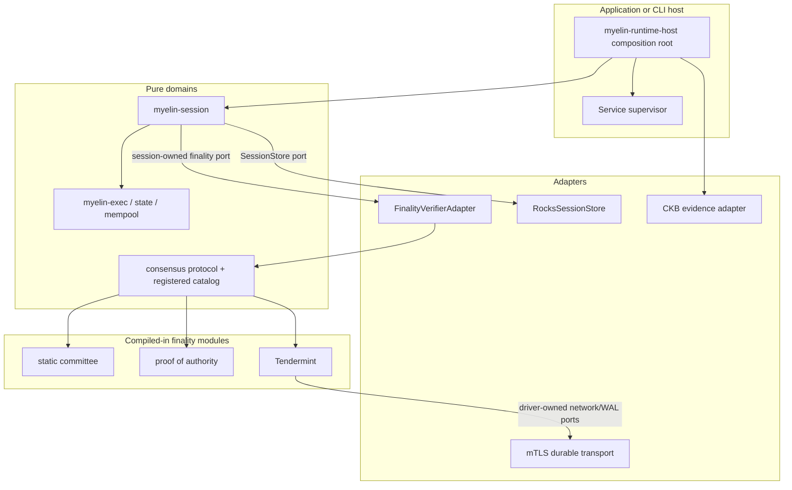

# Fuel Core 链模块化分析与 Myelin 借鉴方案

## 1. 结论摘要

Fuel Core 最值得 Myelin 借鉴的并不是“动态加载共识插件”，而是它用六条工程规则降低链服务之间的耦合：

1. 业务域自己定义其所需的最小 `Port`，而不是共享一个不断膨胀的全局接口。
2. 业务域只依赖稳定类型和端口，不直接依赖其他业务域。
3. 跨域适配器集中在顶层组合根，适配器只做协议转换和调用编排，不拥有业务规则。
4. 所有常驻服务服从同一生命周期协议，顶层统一启动、就绪、停止和故障传播。
5. 可选模块通过 Cargo feature、配置和顶层装配选择；共识关键数据仍使用显式、可验证的类型。
6. 每个端口都能用小型 fake/mock 独立测试，完整装配再由集成测试覆盖。

Fuel Core 当前源码并不支持任意运行时动态加载共识代码。它的 PoA 是编译期静态依赖和顶层显式装配；通用验证器、链配置和共享状态仍直接绑定 PoA，BFT crate 目前只有空壳。因此，Myelin 应借鉴 Ports and Adapters、组合根和服务生命周期，不应照抄 Fuel Core 尚未完成的“通用共识模块”抽象，也不应现在引入 `.so`/`.dll` 或不受信任的运行时代码加载。

实施前的 Myelin 已经具备很好的基础：`TransitionExecutor`、`SessionStore`、`NetworkStore`、`CellScriptVerifier` 都是清晰端口；session genesis 已绑定共识种类和验证者/仲裁配置承诺；`FinalityProof` 会拒绝 proof 形状错配；区块只有在确定性执行和 finality proof 本地复验后才原子提交。当时的主要缺口是：

- `SessionChain` 直接持有 `SelectedConsensus`；
- finality proof 的持久化 wire 映射由 `myelin-session` 重复掌握；
- `myelin-session-network` 直接枚举 Tendermint 消息；
- `ConsensusWal` 的 opaque payload 尚未同时绑定模块 ID、proof/message schema 和配置承诺；
- 缺少一个只负责适配和生命周期的组合根；CLI 仍承载过多装配职责；
- 新增第四个共识引擎会跨越 consensus、session、network 和 CLI 修改。

推荐终态是“静态注册、运行时选择、会话内不可替换”的模块系统：可信构建物包含获准的模块目录；session genesis 锁定精确模块描述符和配置承诺；运行时只能选择已编译、已注册、可本地复验的模块。外部协调器可以产生候选 proof，但不能替代 Myelin 的本地验证，也不能提升任何 CKB 证据阶段。

### 1.1 实施状态（2026-08-23）

本报告的 P0～P4 已落地，P5 按设计继续延期：

- P0：新增 ADR-009，冻结“静态注册、运行时选择、genesis 锁定、禁止热切换/动态库加载”；加入 block、三类 config/module/proof 固定向量和三引擎同工作负载不变量测试；
- P1：`myelin-session` 现在只持有 session-owned `FinalityVerifier`，create、commit、recover、audit 使用同一端口，并二次核对 verifier 返回的 canonical block hash；
- P2：finality proof canonical codec、schema hash 和三引擎 closed catalog 回归 `myelin-consensus`；session 删除逐 variant proof wire 映射；
- P3：网络 envelope 改为 module-neutral class + module commitment/version/type tag/payload hash；Tendermint 自己拥有 phase codec；WAL、outbox、block record 与 RocksDB schema 绑定 module/config/schema；
- P4：新增 `myelin-session-runtime` 组合根、`SelectedConsensus` adapter、显式依赖 supervisor、readiness/criticality、panic/timeout containment、反向 shutdown 和 writer gate；optional 服务可降级，关键依赖失败则拒绝 writer ready；
- P5：没有实现 Rust 动态库或外部 consensus module；仍需真实第三方独立发布需求、威胁模型和供应链协议后再立项。

验证基线已通过 `cargo fmt --all --check`、全工作区 `cargo check --locked --workspace --all-targets`、`cargo clippy --locked --workspace --all-targets -- -D warnings` 和 `cargo test --locked --workspace`。production gate 的锁定 CellScript 复现、父 CKB devnet smoke、三引擎 CLI/runtime/session/court/DA/settlement 流程均通过；完整脚本最后被工作区既有未跟踪 `docs/OPENSTRIKE_MYELIN_SESSION_PLAN.md` 的预发布命名扫描挡住，与本次模块化实现无关。

## 2. 调研范围与证据基线

本报告基于 2026-08-23 的本地源码快照，不依赖宣传材料推断实现状态。

| 仓库 | 源码基线 | 状态 | 重点证据 |
| --- | --- | --- | --- |
| Fuel Core | `b9d4d170da3a31c9ace5f963d633b326348e0d42` | 检查时 worktree 干净 | 架构文档、PoA ports、服务生命周期、顶层装配、共识配置与验证器 |
| Myelin | HEAD `7deb8e90fb470b9ed2e549b10b660632f8e71cab` 加当前未提交工作树 | worktree 有用户正在进行的改动和新增 continuous-session crates | 当前工作树的 consensus、session、network、RocksDB store、架构文档 |

对 Myelin 当前 continuous-session 边界执行了：

```bash
RUSTC_WRAPPER= cargo check --locked \
  -p myelin-consensus \
  -p myelin-session \
  -p myelin-session-network \
  -p myelin-session-store-rocksdb \
  --all-targets
```

结果通过。第一次使用本机默认 `sccache` 时因环境权限失败，禁用编译缓存后源码检查成功。

## 3. 先澄清“可插拔”的三个等级

“可插拔”必须区分三个不同承诺：

| 等级 | 含义 | Fuel Core 当前状态 | Myelin 建议 |
| --- | --- | --- | --- |
| L1：编译期可替换 | 业务域依赖 trait，具体实现由顶层组装 | 大量采用 | 立即采用并强化 |
| L2：运行时可选择 | 一个可信二进制内，从已注册模块中按配置选择 | 可选服务广泛采用；共识目前基本只有 PoA | 对内建共识采用，且由 genesis 锁定 |
| L3：运行时动态加载 | 加载任意外部库/进程提供的新代码或新 proof 协议 | 未实现 | 现在不采用；出现真实第三方模块需求后另立安全设计 |

本方案中的“模块化”默认指 L1 + 受控 L2。它不表示热插拔、不表示会话中途切换共识，也不表示允许第三方代码进入确定性安全内核。

## 4. Fuel Core 中真正可取的设计

### 4.1 消费方拥有端口

[Fuel 架构文档](../../fuel-core/docs/architecture.md)明确要求每个业务域定义自己需要的端口。PoA 域在自己的 [ports.rs](../../fuel-core/crates/services/consensus_module/poa/src/ports.rs) 中定义 `TransactionPool`、`BlockProducer`、`BlockImporter`、`BlockSigner`、`Database`、`P2pPort`、`BlockReconciliationReadPort` 等接口。

这比“全系统一个 Database trait、一个 Network trait、一个 Chain trait”更稳健：

- PoA 只看到它需要的区块生产和导入能力；
- txpool、sync、producer 可以拥有形状不同的同名端口；
- 一个域新增方法只影响该域的端口及对应适配器；
- 测试不需要模拟无关的数据库、网络或执行器行为。

对 Myelin 的直接启示是：端口应由使用它的域拥有。例如 `myelin-session` 应拥有它所需的 finality verification 端口；共识驱动域应拥有 WAL、时钟、网络和候选区块端口；DA 域应拥有 `Put/Get/Head/Receipt` 端口。不要创建一个覆盖执行、存储、网络、DA、CKB 和共识的 `MyelinPlugin` 超级 trait。

### 4.2 业务域不直接依赖其他业务域

Fuel 的 PoA crate 依赖 common services、storage、chain config 和 types，但不依赖 producer、importer、txpool 或 p2p 的具体 crate。PoA 的 `MainTask<B, I, S, ...>` 只约束本域 ports；实际 `BlockProducerAdapter`、`BlockImporterAdapter` 等实现位于顶层 `fuel-core` crate。

这种依赖方向有三项收益：

- 防止业务 crate 之间形成循环依赖；
- 单域单元测试和编译迭代更轻；
- 跨域调用究竟是直接调用、channel、IPC 还是网络，由适配器决定，不污染业务协议。

Myelin 已在 store 和 network 方向部分做到这一点，但 consensus 与 session 仍需进一步分离：session 应依赖稳定的 finality port/协议类型，不应持有具体 `SelectedConsensus`。

### 4.3 顶层组合根集中装配

Fuel 在 [sub_services.rs](../../fuel-core/crates/fuel-core/src/service/sub_services.rs) 中构造数据库、执行器、producer、txpool、network、sync、PoA 和 API，并把具体对象包装成各域需要的 adapter。业务 crate 不知道完整进程拓扑。

组合根的价值不是“把所有代码放在一起”，而是让以下决策只有一个权威位置：

- 哪些模块被编译和启用；
- 每个端口由哪个实现提供；
- 配置如何转换为域配置；
- 服务按什么依赖顺序启动；
- 共享句柄暴露给哪些消费者；
- 哪类服务失败会终止整个运行时。

Myelin 目前没有连续服务 daemon，这一点不需要改变。可以增加一个可嵌入的 `myelin-runtime-host` 库作为组合根，由应用或测试宿主调用；CLI 保持有限输入/输出命令。只有在未来明确决定提供官方节点进程时，才在该库上增加薄二进制。

### 4.4 统一的服务生命周期

Fuel 的 [service.rs](../../fuel-core/crates/services/src/service.rs)定义了：

- 对外 `Service`：start、await ready/start、stop、await stop、state watcher；
- 域服务 `RunnableService`：初始化 task 和共享状态；
- 运行循环 `RunnableTask`：单步执行和 graceful shutdown；
- `ServiceRunner`：统一状态机、panic 捕获、错误记录和停止。

顶层 `FuelService` 启动所有 sub-services，任一 sub-service 停止会触发整体停止。PoA 被显式放到列表最后，避免依赖服务尚未准备好时生产区块。

Myelin 可以借鉴生命周期协议，但应改进两个 Fuel 的局限：

1. 不用 `Vec` 中的隐式顺序表达依赖，而用显式依赖/就绪条件；
2. 停止顺序应按依赖图反向执行，安全关键 store/outbox 最后停止。

域 ports 不应暴露 Tokio channel 等具体同步原语。异步实现细节留在 host/adapter，保持未来切换 runtime 或 IPC 的空间。

### 4.5 编译期可选与运行期配置分开

Fuel 使用 Cargo feature 控制 p2p、relayer、RPC、shared sequencer、parallel executor 等是否进入构建，再用运行配置决定是否实例化部分服务。这让“供应链中包含什么代码”和“本次运行启用什么能力”成为两个独立问题。

Myelin 应采用相同区分：

- Cargo feature/构建 profile 决定获准模块目录；
- session config 只能从已编译目录选择一个模块；
- session genesis 锁定模块身份、协议版本、proof schema、消息 schema 和配置承诺；
- 会话启动后不能用 CLI 参数或环境变量替换模块。

### 4.6 端口级测试和完整装配测试

Fuel 在端口上使用 `mockall::automock`，PoA service tests 提供 fake producer/importer/signer/time/ready signal，顶层还测试任一 sub-service 停止会关闭整个服务。

应借鉴的是测试分层，而非具体 mock 框架：

- 域测试只依赖 fake ports；
- 每个 adapter 运行同一套 contract tests；
- 组合根测试完整启动、就绪、故障和关闭；
- 协议测试固定 canonical bytes/hash/signature vectors；
- 端到端 gate 再检查真实 RocksDB、网络重启和 CKB evidence path。

## 5. Fuel Core 不应照抄的部分

### 5.1 当前并非通用共识插件系统

以下源码证据表明 Fuel 当前共识仍是 PoA 专用装配：

- chain config 的 `ConsensusConfig` 只有 `PoA` 和 `PoAV2`；
- common block verifier 对 `Consensus::PoA` 直接分支，其他类型返回 unsupported；
- 顶层直接调用 `fuel_core_poa::new_service`；
- `SharedState` 暴露的是 `poa_adapter`；
- `fuel-core-bft` 目前只有 crate 声明和空 `lib.rs`。

因此，Fuel 展示的是“可替换模块所需的结构基础”，不是已经验证过的多共识热插拔实现。

### 5.2 顶层适配器可能继续膨胀

Fuel 的 PoA 顶层 adapter 文件已超过 3,600 行。这说明把复杂度移到 adapter 并不会自动消除复杂度。Myelin 需要设立硬规则：

- adapter 只能转换类型、调用和错误；
- quorum、重试安全、时间规则、proof 验证、状态迁移等业务规则必须回到所属域；
- 一个 adapter 同时承担多个独立职责时应拆成小 adapter；
- 对 adapter 也运行独立 contract tests。

### 5.3 泛型参数爆炸不应成为公共 API

Fuel PoA `MainTask<B, I, S, PB, C, RS, RP>` 和 `new_service` 有大量泛型参数，并使用 `too_many_arguments` 例外。域内静态分派有性能和测试优势，但将这种形状扩散到应用 API 会增加认知与编译成本。

Myelin 建议：

- 安全内核和高频路径可使用泛型；
- 组合根使用小型 adapter struct 聚合依赖；
- 生命周期层可以使用受控 trait object；
- 共识关键输出必须回到 canonical value，不依赖 trait object identity 或 Rust 类型名。

### 5.4 列表顺序和宽泛错误不足以表达安全策略

Fuel 依赖“PoA 最后加入 service vector”等约定。很多 ports 返回 `anyhow::Result`。这适合一般服务整合，但不足以承载 Myelin 的 fail-closed 证据边界。

Myelin 应保留结构化错误类别，例如：配置/身份错配、proof 无效、stale head、存储冲突、可重试 transport 错误、不可重试 corrupt record。生命周期 supervisor 必须根据错误类别采取明确策略，不能把所有错误都记录后继续。

## 6. Myelin 实施前模块化评估

### 6.1 已经做得好的部分

| 现有设计 | 评价 | 应保留的不变量 |
| --- | --- | --- |
| `TransitionExecutor` | 清晰的执行插件端口；clone 上隔离执行，持久 CAS 成功后才替换内存状态 | 精确 pre-root、确定性执行、完整 snapshot、原子提交 |
| `SessionStore` | 由 session 消费方定义，RocksDB 是外部实现 | genesis/head/block/snapshot/proof/outbox 原子性，stale CAS 拒绝 |
| `NetworkStore` | transport 与 durable queue 分离 | ACK-after-durability、sequence、retry idempotence、equivocation rejection |
| `CellScriptVerifier` | VM 验证是执行器端口，不由共识决定成功 | session/court 强制 `CkbStrict`，共享 cycle budget，不接受 caller success boolean |
| `ConsensusKind` + `FinalityProof` | proof 形状显式，防止 PoA/committee/Tendermint 错 dispatch | engine kind、block、proof、config commitment 必须一致 |
| session genesis config commitment | 防止恢复时替换 authority/validator/quorum 配置 | 空库和已有库都必须校验精确承诺 |
| recovery audit | 写入前重放并复验完整 finalised chain | 链接、proof、状态根和持久 head 必须一致 |
| CKB adapter receipt ladder | L2 finality 与 CKB evidence 分离 | finality proof 不能声称 node acceptance、commitment 或 configured-depth finality |

这些能力在安全性上比 Fuel 当前 PoA 组合层更完整，重构时不能为了接口整洁而降低。

### 6.2 实施前跨模块修改链

新增第四个内建共识引擎，当前至少会影响：

1. [consensus/src/lib.rs](../consensus/src/lib.rs)：`ConsensusKind`、`FinalityProof`、`SelectedConsensus`、配置解析和 dispatch；
2. [session/src/lib.rs](../session/src/lib.rs)：具体 `SelectedConsensus` 字段、`ProofWire` encode/decode、recovery audit；
3. [session-network/src/lib.rs](../session-network/src/lib.rs)：如果新引擎需要新阶段消息，必须修改全局 `MessageKind`；
4. [cli/src/main.rs](../cli/src/main.rs)：配置选择、sign/collect/finalise、报告映射和 fixture wiring；
5. 文档、fixtures 和 gate。

其中第 1 和第 5 项是合理的可信模块注册成本；第 2～4 项暴露了装配和 wire ownership 泄漏。

### 6.3 实施前最重要的耦合点

- `SessionChain<E, S>` 的字段是具体 `SelectedConsensus`，不是 session 域拥有的 finality port。
- session 自己知道每一种 `FinalityProof` 的持久化字段。proof 类型的 owner 没有独占 canonical codec。
- network 的 transport/authentication 层知道 `TendermintProposal/Prevote/Precommit`，新增引擎会修改 transport crate。
- `ConsensusWal` 注释允许“plugin-owned payload”，但 record 本身仅绑定 session、height、revision 和 payload；模块身份与 schema 绑定应成为一等字段。
- 20,000 行以上的 CLI 同时承担命令解析、fixture、协议校验、装配和报告，组合根职责不够集中。
- 当前没有统一 managed-service 生命周期；这在库 + CLI 模式下不是错误，但 continuous network/driver/store 进入真实宿主后会成为操作风险。

## 7. 借鉴决策矩阵

| Fuel 做法 | 决策 | Myelin 落点 |
| --- | --- | --- |
| 域拥有 ports | 直接采用 | session、consensus driver、DA、sync 各自定义最小端口 |
| 顶层 adapters | 直接采用 | 新增可嵌入 composition root；业务规则不得进入 adapter |
| common service lifecycle | 选择性采用并改进 | 显式依赖、readiness、反向 shutdown、criticality policy |
| Cargo features + config | 采用 | 编译期 module catalog + 运行期选择 + genesis 锁定 |
| mock/fake ports | 采用 | adapter contract suites 与故障注入 |
| generic domain task | 选择性采用 | 域内泛型，宿主边界受控 type erasure |
| service vector 隐式顺序 | 不采用 | 显式服务依赖图 |
| common verifier 直接匹配 PoA | 不采用 | 注册目录 dispatch，不允许 common layer import 某个具体 engine |
| 动态插件宣传 | 不采用 | 明确只承诺静态注册型模块化 |
| 宽泛 `anyhow` 穿越安全边界 | 不采用 | 保留 typed failure taxonomy |

## 8. 推荐目标架构



依赖方向必须满足：

```text
protocol/types <- session ports <- runtime adapters <- concrete modules/services
       ^                  ^
       |                  |
 consensus engines     RocksDB/network/CKB
```

`myelin-exec`、`myelin-state`、`myelin-mempool` 和 `myelin-ckb-adapter` 不得依赖具体共识引擎。共识模块不能决定 VM 是否成功、state root 是什么、CKB node 是否接受或证据处于哪个阶段。

## 9. 核心接口方案

### 9.1 第一阶段：保留 closed enum，先切断具体引擎依赖

当前最小风险改造是在 `myelin-session` 中定义消费方端口，仍复用现有 `ConsensusKind`、`FinalityProof` 和 `MyelinBlock`：

```rust
pub trait FinalityVerifier: Send + Sync + 'static {
    fn kind(&self) -> ConsensusKind;
    fn config_commitment(&self) -> Hash32;
    fn verify(
        &self,
        block: &MyelinBlock,
        proof: &FinalityProof,
    ) -> Result<VerifiedFinality, FinalityError>;
}
```

`SessionChain<E, S, V>` 依赖 `V: FinalityVerifier`，不再存储 `SelectedConsensus`。由于 Rust orphan rule，顶层 composition crate 使用本地 wrapper `RegisteredFinalityAdapter` 实现该 port；session 和具体 engine crate 无需互相依赖。

此阶段不改变 canonical block、proof 结构和持久化内容，优先证明行为等价。

### 9.2 proof wire ownership

`FinalityProof` 的 canonical encode/decode 应由 consensus protocol owner 提供，session record 只存储版本化 proof bytes 和承诺，不再维护每个 proof variant 的字段映射。

最少需要绑定：

```text
consensus_kind
proof_format_version
proof_schema_hash
proof_payload
proof_payload_hash
```

解码必须有尺寸上限、拒绝 unknown fields/尾随字节、重编码一致，并在 dispatch 前验证 kind/schema。这样新增一个内建 engine 只修改 consensus catalog/codec，不修改 session store schema 逻辑。

### 9.3 模块描述符

每个获准模块在构建时提供 canonical descriptor：

```text
module_name
module_protocol_version
consensus_kind
proof_schema_hash
message_schema_hash
config_commitment
capabilities
```

其 canonical hash 为 `consensus_module_commitment`，写入 session genesis。现有 `consensus_config_commitment` 可以成为该描述符的组成部分或迁移为更完整的模块承诺。

恢复时必须同时匹配：

- module identity；
- protocol/proof/message schema；
- validator/authority ordering、weights、quorum；
- session block 中的 consensus kind；
- proof 自身携带的 kind/schema。

任何一项不一致都不可进入 writable 状态。

### 9.4 driver 与 verifier 分离

应把“产生 finality proof”和“验证 finality proof”分成不同角色：

```text
ConsensusDriver: proposer selection, rounds, timeouts, vote collection, WAL, networking
FinalityVerifier: deterministic local verification of exact block + exact proof
```

`SessionChain` 只信任 verifier 的成功结果。driver 可以是同进程服务、应用内协调器或外部进程；其输出都必须经过同一个本地 verifier。driver 崩溃影响 liveness，不得绕过 safety。

这也适合 Myelin 的三种模式：

- PoA 可以由单进程 driver 产生 seal；
- static committee 可以由外部收集器汇总 signatures；
- Tendermint driver 使用 network/WAL ports 推进 round；
- recovery 始终只依赖持久记录和 deterministic verifier。

### 9.5 network 保持模块中立

`myelin-session-network` 应只负责：

- authenticated sender/recipient/session；
- sequence、time bounds、size bounds；
- durable enqueue、ACK、retry 和 equivocation；
- core message class 与 opaque bounded payload。

具体 Tendermint phase 应由 Tendermint 模块的 codec 解释，而不是 transport crate 的顶层 enum。建议 envelope 绑定：

```text
module_commitment
module_message_version
message_type_tag
payload_hash
payload
```

transport 先验证 module commitment 是否等于 session genesis，再交给已注册模块解码。未知模块、未知 version/tag、schema hash 不符或 payload 超限均 fail closed。

### 9.6 WAL 和 outbox 绑定模块身份

`ConsensusWal` 应扩展为至少包含：

```text
session_id
height
module_commitment
wal_schema_hash
consensus_config_commitment
revision
payload_hash
payload
```

store 的 CAS 同时验证当前 head 的 next height 和 genesis 模块承诺。outbox topic 采用模块 namespace 或固定 type tag，避免不同模块相同字符串 topic 被误投递。

### 9.7 可嵌入 service supervisor

只对常驻组件定义最小 managed lifecycle；纯函数执行器和 verifier 不强行包装成服务。建议 supervisor 支持：

- `start`、`await_ready`、`stop`、`await_stopped`、`health`；
- 显式依赖和启动拓扑；
- 反向 graceful shutdown；
- critical、restartable、optional 三类 failure policy；
- 统一 cancellation 和 bounded shutdown deadline；
- panic 被隔离并转换为可审计停止原因。

安全关键 store、session writer、finality verifier 失败时必须停止写入。metrics、只读 API 等可按策略降级。网络临时故障可以重试，但 corrupt record、module mismatch、invalid proof 不能重试为成功。

## 10. 建议的 crate/目录职责

这是目标职责划分，不要求第一步一次性新增所有 crate。

| 建议组件 | 职责 | 允许依赖 | 禁止拥有 |
| --- | --- | --- | --- |
| `myelin-consensus-protocol` | block/finality 公共类型、module descriptor、canonical codec、registered catalog API | crypto/types | driver、网络、存储实现 |
| `myelin-consensus-static` | static committee config、sign/verify | protocol、crypto | session store、CKB receipts |
| `myelin-consensus-poa` | authority schedule、seal sign/verify | protocol、wallet-auth | block execution、node acceptance |
| `myelin-consensus-tendermint` | round state、proposal/vote/decision verify、driver-owned ports | protocol、crypto | transport/RocksDB 具体实现 |
| `myelin-session` | prepare、verify-finality port、atomic commit、recovery audit | protocol、exec/state | concrete consensus selection、network implementation |
| `myelin-runtime-host` | module catalog、adapters、config conversion、service graph | all selected modules/services | quorum/VM/state business rules |
| `myelin-session-network` | authenticated bounded durable transport | network protocol、NetworkStore port | Tendermint/PoA 业务枚举 |
| `myelin-session-store-rocksdb` | SessionStore/NetworkStore/WAL/outbox contract implementation | session/network ports | consensus decisions |

在预发布阶段可以先在现有 `myelin-consensus` 内按 module 子目录完成边界，再根据依赖和编译收益拆 crate。不要只为了目录美观制造 crate；拆分的验收标准是依赖方向和修改爆炸半径真正下降。

## 11. 分阶段实施方案

### P0：冻结不变量并记录架构决策

交付物：

- 新 ADR：明确只承诺“静态注册 + 运行时选择 + genesis 锁定”，不承诺动态加载；
- 记录现有 block/proof/config commitment fixed vectors；
- 建立“新增 engine 允许/禁止修改的 crate”清单；
- 为当前三种 engine 建立相同 workload 的 invariance baseline。

退出条件：现有三种 engine 的 state roots、ordered raw txids、scheduler/data commitments 在相同 workload 下保持相同，只有 consensus-bound block hash 和 finality material 不同。

### P1：引入 session-owned finality port

交付物：

- `FinalityVerifier` 和 typed `VerifiedFinality`；
- `SessionChain` 不再持有具体 `SelectedConsensus`；
- composition adapter 包装现有 `SelectedConsensus`；
- create、recover、commit、audit 全部通过同一 verifier port；
- fake verifier 的负面单元测试。

退出条件：canonical bytes/hash 和持久化记录无变化；wrong kind/config/proof、stale prepared block、recovery mismatch 全部保持拒绝。

### P2：收回 proof codec ownership，建立内建 module catalog

交付物：

- consensus owner 提供版本化 canonical proof codec；
- session 删除逐 variant `ProofWire` 映射；
- module descriptor/commitment 写入 genesis；
- 三个内建 engine 通过 catalog 注册；
- config 采用 strict schema，未知模块/字段拒绝。

退出条件：增加一个测试 engine 只需新增 engine 实现、catalog entry 和 fixtures；无需修改 exec、state、mempool、session store、network transport 或 CKB adapter。

### P3：中立化 network、WAL 和 outbox

交付物：

- transport envelope 绑定 module commitment/version/type tag；
- Tendermint phase codec 移入 Tendermint 模块；
- WAL 绑定 module/config/schema/payload hash；
- store migration 或预发布原子 schema replacement；
- cross-module replay、wrong-schema、old-WAL、equivocation 负面测试。

退出条件：更换已注册 consensus driver 不需要修改 transport/store 实现；恢复时任何 module/schema/config 漂移均拒绝 writable。

### P4：增加可嵌入 runtime composition root 与 supervisor

交付物：

- 集中构造 store、network、driver、session、outbox delivery 和只读 handles；
- 显式服务依赖、readiness 和反向 shutdown；
- criticality/failure policy；
- CLI 只解析输入并调用 application service，不再承载底层 wiring；
- host integration tests 和故障注入。

退出条件：任一安全关键服务异常会停止 session writer；网络重启不丢 durable messages；停止/重启后 recovery audit 通过；现有有限 CLI 工作流保持可用。

### P5：真实需求出现后再评估外部模块边界

只有当第三方团队确实需要独立发布 consensus/DA module 时才进入本阶段。优先使用独立进程，而非 Rust 动态库 ABI，并沿用 CellScript adapter 的经验：

- pin repository、release/revision、toolchain 和 binary digest；
- installation attestation；
- canonical framed protocol、版本和 schema digest；
- 严格超时、资源上限、restart policy 和 fail-closed decode；
- 外部模块只提供候选 proof/receipt，本地重新验证；
- 模块结果永远不能直接提升 CKB evidence stage。

在完成独立 threat model、供应链策略、崩溃隔离和确定性测试前，不实现 L3 动态加载。

## 12. 测试与生产 gate 方案

### 12.1 每个 finality module 的统一 contract suite

正向：

- 正确 module/config/block/proof 可验证；
- canonical encode/decode/re-encode 稳定；
- 同一输入重复验证结果相同；
- recovery verification 与 live commit verification 相同。

负向：

- wrong module kind/commitment/schema/version；
- wrong block hash、height、round、parent 或 signature domain；
- duplicate signer、unknown signer、zero weight、quorum 不足；
- proof payload 截断、尾随字节、超限、非 canonical；
- 配置顺序、validator key、weight/quorum 任一字段变化导致 commitment 变化；
- 会话中途替换 engine/config 被拒绝。

### 12.2 adapter contract suite

- 所有 `SessionStore` 实现通过 atomic CAS、stale head、block/head linkage、outbox 和 WAL contract；
- 所有 `NetworkStore` 实现通过 ACK-after-durability、exact retry、gap、replay、equivocation 和 restart contract；
- finality adapter 不修改 block/proof bytes，不吞掉结构化错误；
- network adapter 不解释 engine 业务，只验证 envelope binding 和资源限制。

### 12.3 supervisor integration suite

- 按依赖启动并等待 ready；
- driver 必须在 store/network/session recovery ready 后开始；
- 任一 critical service 停止会关闭 writer；
- optional service 失败按策略降级；
- shutdown 反向有序且 bounded；
- panic、hung task、repeated transient network failure 都产生明确状态和报告。

### 12.4 协议与证据回归

- mutation 每个 committed field 都改变相应 hash；
- witness-only mutation 只改变 wtxid，不改变 raw txid/producer OutPoint；
- scheduler plan 仍是 sidecar，不进入 witness；
- session/court 仍强制 `CkbStrict`；
- finality module 不能把 `wire-encoded` 描述为 context-valid、scripts-verified、node-accepted、committed 或 finalized；
- `myelin-ckb-adapter` 的 linked receipt chain 是更高 CKB evidence stage 的唯一来源；
- production gate 继续使用 `--locked` 并包含 workspace/all-target checks。

## 13. 风险与控制

| 风险 | 严重度 | 控制 |
| --- | --- | --- |
| 模块 ID 或 schema 漂移造成同 session 不同解释 | 高 | descriptor commitment 进入 genesis、block/proof/WAL/message 全链绑定 |
| opaque proof 失去 typed enum 的错配保护 | 高 | 当前阶段保留 closed enum；若未来使用 envelope，先核对 module/schema 再由唯一注册 verifier strict decode |
| driver 被误当成 verifier | 高 | 接口、crate 和权限分离；session 只接受本地 `VerifiedFinality` |
| 动态插件供应链攻击 | 高 | 暂不支持；未来独立进程 + binary attestation + local reverify |
| adapter 偷渡业务规则 | 高 | adapter 代码审查规则、contract suite、文件/职责拆分 |
| 服务启动竞态产生错误区块/消息 | 高 | 显式 readiness graph，driver 最后 ready，writer fail closed |
| WAL 属于旧 engine/config | 高 | WAL 绑定 module/config/schema；恢复前验证，错误即停止 |
| 网络跨模块重放/类型混淆 | 高 | signed envelope 绑定 module commitment、type tag、payload hash、recipient、sequence |
| trait object 或 async runtime 进入 consensus hash | 高 | canonical outputs 只由值类型编码；Rust 类型名、指针、任务时序不参与承诺 |
| crate/trait 数量过多增加维护成本 | 中 | 先模块内分层，只有依赖/编译/发布边界成立时才拆 crate |
| 误把闭合验证者 finality 描述成 permissionless security | 高 | 保留 scope 文案和 claim ladder；模块化不改变安全模型 |

## 14. 完成度量

借鉴工程完成时应满足可验证的结果，而不仅是新增 trait：

1. 新增一个第四内建 finality engine 时，不修改 `myelin-exec`、`myelin-state`、`myelin-mempool`、`myelin-session-store-rocksdb`、`myelin-session-network` transport 或 `myelin-ckb-adapter`。
2. `myelin-session` 不 import 任何具体 engine 类型，也不维护逐 engine proof wire 字段。
3. session genesis、block、proof、WAL 和 consensus network message 可追溯到同一 module/config commitment。
4. 同一 session 不允许热切换 engine；错误模块恢复不能进入 writable。
5. 所有 concrete adapter 通过消费方提供的 contract suite。
6. supervisor 能证明正确启动、readiness、critical failure propagation 和 graceful shutdown。
7. 当前三种 engine 的固定向量、同 workload 不变量、RocksDB recovery 和 network durability 测试保持通过。
8. CKB evidence claim ladder 完全不受模块化重构影响。

## 15. 最终建议

P0～P4 已按本报告顺序实施；P4 只提供可嵌入 host，没有把 Myelin 改造成官方全节点/daemon；P5 继续明确延期。

实施顺序的核心原则是：先把验证边界抽出来，再拆 crate；先绑定身份和 schema，再让 network/WAL 变得通用；先证明现有三种 engine 行为不变，再允许第四种 engine 进入 catalog。这样可以获得 Fuel Core 的低耦合和服务化收益，同时避免复制它当前 PoA 专用的 common layer，也不会削弱 Myelin 已经建立的原子状态、typed finality、恢复审计和 CKB 证据边界。

## 16. 主要源码索引

Fuel Core：

- [Ports and Adapters 架构说明](../../fuel-core/docs/architecture.md)
- [PoA domain ports](../../fuel-core/crates/services/consensus_module/poa/src/ports.rs)
- [PoA generic service](../../fuel-core/crates/services/consensus_module/poa/src/service.rs)
- [Common service lifecycle](../../fuel-core/crates/services/src/service.rs)
- [Top-level sub-service composition](../../fuel-core/crates/fuel-core/src/service/sub_services.rs)
- [Top-level adapters](../../fuel-core/crates/fuel-core/src/service/adapters.rs)
- [Consensus block verifier](../../fuel-core/crates/services/consensus_module/src/block_verifier.rs)
- [Chain consensus config](../../fuel-core/crates/chain-config/src/config/consensus.rs)
- [BFT placeholder](../../fuel-core/crates/services/consensus_module/bft/src/lib.rs)

Myelin：

- [Consensus types and dispatch](../consensus/src/lib.rs)
- [Continuous session runtime and ports](../session/src/lib.rs)
- [Authenticated durable session network](../session-network/src/lib.rs)
- [Consensus composition root and service supervisor](../session-runtime/src/lib.rs)
- [RocksDB session/network store adapters](../session-store-rocksdb/src/lib.rs)
- [Authoritative architecture](MYELIN_ARCHITECTURE.md)
- [Closed-validator finality](architecture/consensus.md)
- [Architecture decisions](explanation/architecture-decisions.md)
- [CKB semantic deviations](../MYELIN_CKB_SEMANTIC_DEVIATIONS.md)
- [CKB projection audit](../MYELIN_CKB_PROJECTION_AUDIT.md)
