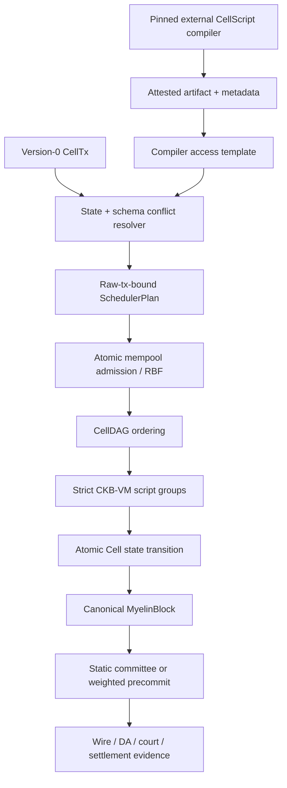

# Myelin architecture

## Scope

Myelin is an off-chain finite-Cell ledger runtime. It reuses CKB-shaped transactions and CKB-VM verification while adding session scheduling, local state roots, closed-validator finality, DA evidence, and dispute/settlement input packages.

It is not a CKB full node, a source-chain fork, a permissionless consensus system, or a deployed L1 court.

## End-to-end model



The compiler never decides a final conflict domain. The state resolver never decides whether VM execution succeeded. The scheduler never mutates Cell state. Finality signs the resulting canonical block and cannot change its transition.

## Transaction identity and wire boundary

`CellTx` is the execution unit. New values use version `0`. The raw transaction hash is the producer identity:

- an output `OutPoint` is `(raw_txid, output_index)`;
- block ordering commits to raw txids;
- scheduler plans bind to the raw txid;
- witnesses affect only the witness-inclusive transaction hash.

Inputs, cell deps, header hashes, outputs, output data, and witnesses serialize through the CKB Molecule compatibility layer. DepGroup data accepts only CKB Molecule `OutPointVec`; no historical Myelin DepGroup decoder remains.

## Typed Cells and conflict domains

A typed-cell declaration separates runtime scheduling semantics from broader semantic metadata. Scheduling uses a validated `ConflictKeySpec`:

```text
CellId                 -> concrete OutPoint key
Field(name)            -> canonical schema-decoded field value
Composite([a, b, ...]) -> length-delimited canonical field tuple
None                   -> logical scheduling disabled; typed resolution rejects it
```

The state registry is keyed by the full type-script identity (`code_hash`, `hash_type`, and args), not just a source binding or code hash. It resolves the exact input, cell dep, or output selected by compiler metadata, loads full data, invokes a schema-aware field reader, and computes:

```text
conflict_hash    = domain_hash(type_script, canonical_key_value)
typed_data_hash  = domain_hash(type_script, complete_cell_data)
```

This distinction is essential. The conflict hash stays stable when one logical session moves from receipt Cell X to receipt Cell Y; the typed-data hash changes when the state bytes change.

Resolution fails closed if the Cell is absent, data or type script is missing, the declaration is unknown, a field cannot be decoded, a source index is invalid, a DepGroup was not expanded, or the result is the zero hash.

## CellScript adapter

CellScript is an independent upstream project connected only through `myelin-cellscript-adapter`.

The adapter lock pins:

- repository;
- package version;
- exact source revision;
- independent Rust toolchain.

An installation attestation binds that lock to a BLAKE3 digest of the executable. A compile result binds source, artifact, metadata, compiler version, and source revision. Production compilation accepts only the `ckb` target profile.

For scheduling, the adapter reads the selected action's compiler metadata and produces an access template. Each access contains operation, syscall diagnostic, source class, and index. `binding` is never hashed into a conflict key. Myelin then resolves every access through authenticated state.

Compiler actions also participate in a global barrier:

- explicitly parallelizable action: barrier READ;
- non-parallelizable action: barrier WRITE.

Thus independent parallelizable actions may proceed, while an action the compiler did not admit as parallelizable is serialized against every compiler-backed action.

## CellDAG

CellDAG combines dependency ordering and conflict ordering. It detects:

1. duplicate raw transactions;
2. physical double spends of one input `OutPoint`;
3. logical conflicts on equal conflict hashes.

Logical access behavior is:

| Pair | Scheduling behavior |
| --- | --- |
| READ / READ | no edge required |
| READ / WRITE | deterministic edge |
| WRITE / READ | deterministic edge |
| WRITE / WRITE | deterministic edge after admission has selected a survivor/package |

Independent ready nodes are executed in parallel. Failure is transitive: descendants of a failed node are marked `DependencyFailed` and are not executed.

This is intentionally outside vanilla CKB-VM. CKB-VM executes one lock/type script group at a time; it does not own a cross-transaction mempool scheduler or know application-level logical domains.

## Mempool

`CellPool` serializes each admission/RBF mutation under one lock. Entries use raw txid identity and carry a verified transition proof:

```text
state_root_before
state_root_after
fee
cycles
```

Root transactions must start from the pool base root. A single-parent child must start from the parent's post-root. Multi-parent admission is rejected until Myelin has a combined-overlay proof that demonstrates one coherent pre-state. RBF removes the selected conflicting package and its descendants atomically; scoring is deterministic over package fee density and unlockability.

## VM verification

For one transaction, the verifier:

1. resolves every input from a trusted live-Cell provider;
2. expands declared DepGroups using CKB Molecule data;
3. constructs lock and type groups by complete script identity;
4. resolves code from `cell_deps` according to `code_hash` and `hash_type` (`Data`, `Type`, `Data1`, `Data2` as supported);
5. creates one independent CKB-VM instance per group;
6. registers the current script and exact group indexes for syscalls;
7. executes the RISC-V ELF and requires exit code zero;
8. charges every group against one shared transaction cycle budget.

Session and court flows force `CkbStrict`. `MyelinExtended` is explicitly a different semantic profile and cannot support a CKB scripts-verified claim.

## Atomic Cell state

`CellStateTree` stores canonical `OutPoint` keys and complete Cell metadata/data required by resolution. `StateTransitionEngine` consumes `VerifiedStateTransaction`, checks the exact pre-root, verifies all consumed Cells are live, applies consumes/creates on an isolated transition, and commits only if the entire transition succeeds.

Multi-transaction session commits apply a verified ordered chain atomically. Reports carry real pre/post roots; execution-report helpers do not fabricate roots from unrelated hashes.

## Finality

`MyelinBlock` commits to:

```text
version, parent_hash, number, timestamp_ms
consensus_kind
state_root_before, state_root_after
ordered raw-tx commitments
data commitments
scheduler commitment
```

Two selectable closed-validator engines exist:

- `static-closed-committee` — quorum by configured weight;
- `weighted-precommit` — height/round/precommit certificate with configured quorum power.

Both use real secp256k1 Schnorr signatures and separate signature domains. For the same workload, transaction identities and state roots must be identical; only certificate material differs. Neither engine is a permissionless-security claim.

## Projection and court evidence

Projection is evidence-staged:

```text
Rejected -> WireEncoded -> ContextResolved -> ConsensusValidated
         -> ScriptsVerified -> NodeAccepted -> Committed -> Finalized
```

The pure `myelin-exec` projector produces only the first two stages. `myelin-ckb-adapter` produces the higher stages from linked receipts: it resolves all referenced Cells/DepGroups/headers under one stable tip, commits node/chain/genesis/consensus context, requires full-node tx-pool validation, runs strict local CKB-VM over the same context, submits and observes the exact hash, locally verifies the CKB transaction Merkle proof against the canonical committed header, and checks confirmation depth plus canonical-chain stability.

Node and local VM cycle counts are both recorded but need not be numerically equal; both verdicts must succeed within the configured budget. `NodeAccepted` is not renamed to publication. `Committed` requires inclusion proof, while `Finalized` means only that the configured depth was reached without an observed reorg.

Court-bundle verification currently checks internal reproducibility: payload and transaction bytes, state/scheduler/data commitments, canonical MyelinBlock hash, finality signatures, strict VM profile, and an honest wire-only projection claim. Therefore a locally `valid` bundle still has `court_verifiable = false`.

DA and settlement workflows distinguish:

- local segment publication and proof verification;
- replicated local attestation;
- dry-run RPC request construction;
- full-node admission plus exact-hash observation;
- canonical commitment and depth-based finality;
- an actual court verdict, which is still absent.

## Current risk register and next steps

The critical model flaws found in the 2026-07 audit were removed: witness-derived producer identity, compiler binding hashes as logical keys, caller-supplied projection booleans, non-atomic state admission, unbounded per-group VM cycles, misleading consensus naming, vendored compiler drift, and historical DepGroup/config aliases.

The remaining work is ordered by security dependency:

1. Exercise the exact adapter and four deployed verifier programs on public CKB testnet, pin deployment OutPoints/code hashes, and preserve committed/finalized evidence artifacts.
2. Replace fixture keys and local DA attestations with signer isolation, threshold-lock enforcement, rotation/recovery policy, and durable externally retrievable DA.
3. Implement and exercise complete court economics and disputed-chunk adjudication, not only compact-payload/finality verifiers.
4. Add independent differential tests against the parent CKB for Molecule encoding, script grouping, hash-type resolution, since/capacity edges, DepGroups, and cycle-limit failure behavior.
5. Expand adversarial/property testing for conflict field codecs, DAG determinism, RBF packages, state atomicity, receipt mutation/replay, Merkle proofs, and reorg sequences.
6. Benchmark real contention distributions and long-running mempool/state behavior. Logical conflict scheduling improves concurrency only when transactions touch different domains or share READ access; it cannot parallelize genuine writes to one logical session.

The generic evidence engine may honestly claim through `Finalized` for an exact exercised transaction. Myelin still must not claim a public-testnet court, production DA, or permissionless L2 security until the corresponding deployment and operational evidence exists.
