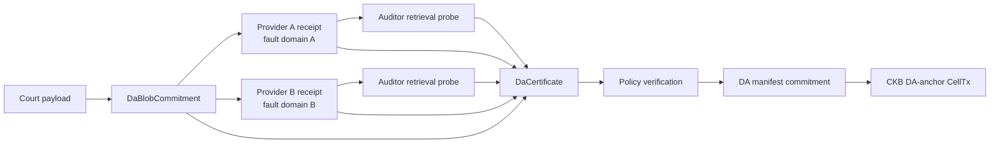

# Myelin data-availability design

## Status and claim boundary

Myelin now has a provider-neutral DA certificate core in `myelin-state`. It
verifies content binding, provider and fault-domain quorum, retention, signed
retrieval probes, probe freshness, and latency policy. This is the protocol
shape needed by provider adapters; it is not evidence that a real provider is
deployed or that public CKB has an anchor.

The older in-process three-key fixture attestations and a single external SLA
receipt remain useful for deterministic rehearsals. They cannot set
`production_ready = true`. Production readiness requires a verified
`DaCertificate` and a sealed local copy.

## Objects

| Object | What it binds |
| --- | --- |
| `DaBlobCommitment` | namespace, session, chunk, payload hash/length, segment root, erasure profile |
| `DaProviderReceipt` | blob id, provider identity, fault domain, retrieval endpoint, storage and expiry epochs |
| `DaRetrievalProbe` | exact provider receipt, sample/proof hash, observation epoch, latency, auditor identity |
| `DaPolicy` | provider/fault-domain quorum, retention, probe quorum/freshness/latency, trusted auditors |
| `DaCertificate` | blob + policy + signed receipts + signed probes |

All signatures use secp256k1 Schnorr keys. The verifier holds public keys only;
provider and auditor private keys never enter the Myelin runtime.



## Verification rules

At a caller-supplied deterministic evaluation epoch, verification requires:

1. the certificate blob id to recompute from the exact session payload;
2. one valid receipt per distinct provider id;
3. the configured number of distinct providers and independent fault domains;
4. every counted receipt to remain valid through
   `evaluation_epoch + min_retention_epochs`;
5. every counted probe to reference the exact signed receipt;
6. the auditor key to be explicitly trusted by policy;
7. probe age and latency to remain within policy;
8. successful-probe and probed-provider quorum.

Receipt and probe ordering does not affect the certificate commitment.
Mutating blob, retention, endpoint, provider, receipt, sample, epoch, latency,
or policy invalidates a signature or commitment.

## Erasure coding

The commitment already records `(data_shards, parity_shards, shard_size,
shard_root)`. `replicated()` is implemented today. Reed–Solomon encoding and
sample Merkle proofs are the next storage-adapter step; the certificate format
does not assume a specific storage vendor.

Recommended initial public-testnet policy:

```text
data shards                 4
parity shards               2
distinct providers          >= 3
distinct fault domains      >= 2
successful recent probes    >= 3
probed providers            >= 2
retention                   challenge window + reorg margin + recovery margin
```

These are deployment recommendations, not hard-coded consensus constants.

## CLI integration

`session da-manifest` accepts:

```bash
cargo run -p myelin-cli -- session da-manifest \
  --bundle reports/session-court-bundle.json \
  --storage-dir reports/session-da-store \
  --da-certificate reports/provider-neutral-da-certificate.json \
  --da-evaluation-epoch 12345 \
  --out reports/session-da-manifest.json
```

The epoch is never inferred from wall-clock time. The CLI verifies the
certificate and also checks its session id, chunk index, payload hash, payload
length, and segment root against the newly built manifest.

## Next implementation slice

1. implement Reed–Solomon shard generation and per-sample Merkle proofs;
2. define a `DaStore` adapter interface for PUT/GET/HEAD and immutable receipt
   retrieval;
3. ship at least two independent provider adapters plus one auditor daemon;
4. persist probe history and rotate trusted auditor keys by versioned policy;
5. batch certificate commitments into a CKB anchor Cell and exercise retrieval
   after node restart and simulated provider loss;
6. add public-testnet inclusion, depth, and reorg evidence before changing any
   `l1_da_published` claim.
