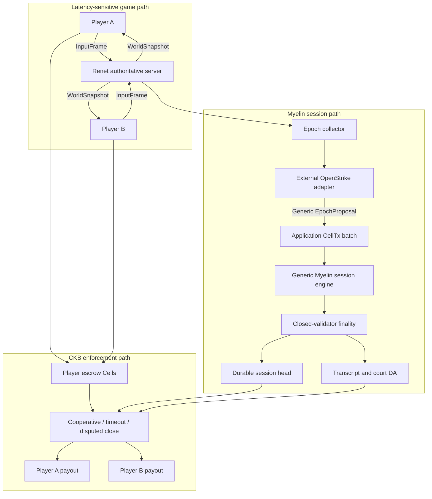
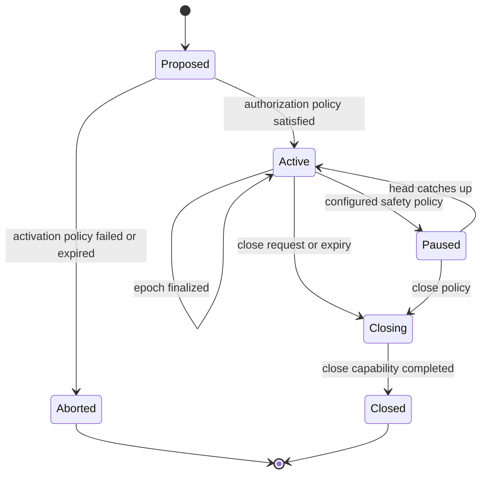

# OpenStrike on Myelin: finite-session integration plan

Status: proposed
Target: prove a 1v1 authoritative-shooter integration without specializing Myelin
Primary settlement: Myelin-native CKB escrow and epoch netting
Compatibility settlement: optional Fiber backend during migration

## 1. Purpose

This document proposes a complete path for running the economic session of an
OpenStrike-style game on Myelin. It is deliberately narrower than “put the game
on chain”:

- Renet remains the latency-sensitive transport for inputs and snapshots.
- The authoritative server remains responsible for the 64 Hz simulation in the
  first profile.
- Myelin turns bounded groups of game events into deterministic Cell state
  transitions, continuous state roots, finality evidence, DA commitments, and
  settlement inputs.
- CKB holds the session escrow and enforces close, timeout, and dispute rules.

The end state is a Myelin-native finite game session. Fiber may remain available
as an optional low-value payment backend, but it is not required by the final
Myelin escrow flow.

OpenStrike is a consumer and conformance workload, not a domain model for
Myelin. No OpenStrike, shooter, hit, tick, Renet, two-player, or server-oracle
concept may enter Myelin's generic execution, state, mempool, consensus,
projection, adapter, or session APIs. Application semantics stay behind a
versioned adapter boundary.

This plan respects the current Myelin boundary: Myelin is an off-chain finite-
Cell session runtime. It is not a CKB full node, a new L1, or a finished
permissionless L2. A local court bundle or a wire-encoded transaction is not an
on-chain court verdict.

## 2. Decision

Do not replace Fiber with one large per-hit Myelin transaction. Implement a
bounded, epoch-netted game session:

```text
Renet 64 Hz simulation
  -> signed/canonical event transcript
  -> 10-30 second or round-boundary epoch
  -> deterministic Myelin CellTx transitions
  -> continuous session checkpoint
  -> normal, timeout, or disputed CKB settlement
```

The migration should use three settlement backends:

| Backend | Funds move through | Purpose |
| --- | --- | --- |
| `fiber` | Existing Fiber hold invoices | Existing baseline and rollback path |
| `myelin-shadow` | Fiber, while Myelin records the same economics | Parity measurement without new custody risk |
| `myelin-escrow` | CKB session escrow controlled by Myelin close rules | Final Myelin-native path |

No funded deployment should move directly from `fiber` to `myelin-escrow`
without a shadow phase and a CKB devnet rehearsal.

### 2.1 Non-negotiable generality boundary

The integration is acceptable only if deleting the OpenStrike adapter and all
OpenStrike fixtures leaves a useful, fully tested generic finite-Cell session
runtime. This is a release invariant, not a cleanup task for later.

The dependency direction is one-way:

```text
myelin-exec / state / mempool / consensus / ckb-adapter
                         ^
                         |
                  myelin-session
                         ^
                         |
             myelin-session-escrow       optional reusable capability
                         ^
                         |
          myelin-openstrike-adapter       external leaf integration
```

The following rules are mandatory:

1. Existing kernel crates never depend on `myelin-session`, escrow, OpenStrike,
   Bevy, Renet, Fiber, or any application SDK.
2. `myelin-session` depends only on generic Myelin primitives. Its public types,
   hashes, storage keys, consensus values, errors, and RPC methods contain no
   game-specific fields or terminology.
3. Escrow is an optional reusable capability. A session may run without funds,
   participants, payout rules, a court, or even an external network service.
4. Participant cardinality, roles, application clocks, event meanings, units,
   scoring rules, and evidence formats belong to application configuration.
   The generic core must not assume two players, ticks, hits, damage, or a
   trusted server.
5. The OpenStrike adapter depends on published generic interfaces; Myelin never
   calls an OpenStrike crate directly and never matches on an `OpenStrike`
   enum variant.
6. Generic protocol identities use `myelin:session:*` domains. OpenStrike
   objects use `myelin:app:openstrike:*` domains and cannot become core object
   identities.
7. App-specific CellScript, schemas, fixtures, and replay logic live with the
   integration. Only scripts that are independently useful to other finite
   sessions may enter the Myelin repository.
8. A generic change required by OpenStrike needs its own application-neutral
   rationale, tests with at least two non-game fixtures, and review independent
   of the OpenStrike milestone.

CI must enforce, rather than merely document, these rules:

- inspect `cargo metadata` and reject reverse or cyclic dependencies;
- reject forbidden application dependencies and OpenStrike feature flags in
  Myelin core manifests;
- scan public core source/schema directories for application namespaces and
  protocol domain strings;
- build and test the default workspace without any OpenStrike checkout;
- run generic session conformance tests with a no-escrow counter fixture and an
  N-party Cell-transfer fixture;
- run the OpenStrike adapter as a downstream consumer against the published
  API, not through private module access.

The boundary check should be implemented as
`scripts/check_session_architecture.sh` and included in
`scripts/myelin_production_gate.sh` once `myelin-session` exists.

Every implementation change is routed with this rule:

| Change | Allowed location |
| --- | --- |
| Cell identity, VM, atomic state, conflict, finality, projection | Existing Myelin primitive crate, only with application-neutral justification |
| Continuous session lineage, durable head, lifecycle, generic epoch API | `myelin-session` |
| Asset conservation, debit caps, participant-indexed payout | `myelin-session-escrow` capability |
| Hit, damage, tick, map, seat, Renet, game replay | External OpenStrike adapter/court |
| Optimization useful only to this game | Adapter unless independently generalized and benchmarked |
| Change that weakens a Myelin invariant | Reject, regardless of demo benefit |

## 3. Current Myelin baseline

The reusable kernel primitives already exist:

- CKB-shaped version-0 `CellTx` and exact raw/witness identity;
- atomic state transitions with exact pre-root checking;
- physical double-spend rejection and logical READ/WRITE conflict ordering;
- independent CKB-VM script groups with a shared transaction cycle budget;
- static committee, rotating PoA, and finite-session Tendermint finality;
- local DA segments, Merkle proofs, provider-neutral DA certificate primitives;
- court, DA, settlement, CKB submission, inclusion, and finality evidence shapes;
- CKB projection and an adapter receipt chain for higher evidence stages.

The current `session` CLI is not yet the game runtime required by this plan:

- `session open` records escrow-like descriptors; it does not prove that the
  declared Cells are live, locked for the session, and authorized by players;
- `session commit` constructs the built-in always-success fixture transaction;
- each commit reconstructs the initial session state rather than continuing
  from the preceding checkpoint;
- the fixture block uses a zero parent hash and height one;
- settlement currently supports only `disputed-close`;
- the settlement payload commits evidence but does not distribute balances to
  player outputs;
- the final settlement script verifies commitment, DA, authority, and lock
  bindings, but does not replay game logic or enforce player payouts;
- networking, timeout scheduling, validator lifecycle, and a durable session
  service are outside the current deterministic kernel.

Therefore the work is primarily a session product layer and game protocol,
not a rewrite of Myelin execution, state, or consensus primitives.

## 4. Required properties

The first production-capable 1v1 profile must satisfy the following properties.

### 4.1 Gameplay and latency

1. The 64 Hz simulation never waits for Myelin, DA, CKB RPC, or wallet I/O.
2. Myelin consumes completed epochs asynchronously.
3. Economic exposure cannot grow indefinitely while checkpoint processing is
   delayed.
4. A stalled checkpoint pipeline results in a defined pause, non-economic
   continuation, or match abort—not silent unbounded liability.

### 4.2 Funds and accounting

1. Each player authorizes a maximum loss before gameplay begins.
2. Total debits never exceed the player's escrowed amount or session cap.
3. Total value is conserved using integer-only accounting.
4. Once a valid economic checkpoint is finalized, the losing player cannot
   block the defined unilateral close path.
5. No bridge, game server, or validator receives a player's wallet secret.
6. A settlement transaction pays the exact final balances to the participant
   lock scripts declared in the session terms.

### 4.3 Session integrity

1. Every epoch starts at the previous epoch's post-state root.
2. Every session block names the previous session block hash and increments the
   height exactly once.
3. Input sequence numbers, tick ranges, epoch indexes, and event identifiers are
   unique and monotonic.
4. A finalized epoch cannot be replaced by another epoch at the same height.
5. Restart recovery reconstructs the same head, roots, balances, and pending
   obligations.

### 4.4 Evidence and claims

1. The full transcript required by the selected verification profile is
   retrievable for at least the challenge and recovery windows.
2. A local verification result must not be reported as CKB acceptance,
   commitment, finality, or a court verdict.
3. `authoritative-oracle` and `deterministic-replay` sessions must be reported
   as different security profiles.
4. A closed-validator certificate must not be described as permissionless
   finality.

### 4.5 Myelin generality and workload isolation

1. The generic engine accepts opaque application commitments and verified
   `CellTx` batches; it never parses an OpenStrike event.
2. Sessions with no escrow and sessions with more than two participants remain
   first-class supported configurations.
3. Application failures, queue saturation, DA policy, and resource limits are
   isolated per session so one game workload cannot halt unrelated sessions.
4. Application-specific verification executes through normal CKB-VM script
   boundaries or an external adapter process, never through a reverse core
   dependency.
5. The default Myelin workspace, protocol identities, and core storage schema
   do not change when the OpenStrike integration is installed or removed.
6. No OpenStrike optimization may weaken shared cycle budgets, exact root
   checks, atomic commit, conflict ordering, or adapter receipt verification.

## 5. Trust profiles

The protocol should expose two explicit profiles. They share accounting and
settlement formats, but make different claims about game correctness.

### 5.1 `authoritative-oracle`

This is the correct first profile for parity with the existing demo.

- The server decides hits and damage.
- The server signs canonical economic events.
- Myelin verifies ordering, authorization, caps, balance conservation, state
  roots, finality, and settlement bindings.
- A malicious server may allocate value incorrectly up to the pre-authorized
  cap.
- Myelin makes the history bounded, persistent, and auditable; it does not prove
  that a reported hit occurred in the physical game simulation.

This profile must never be advertised as trustless game-result arbitration.

### 5.2 `deterministic-replay`

This is the stronger later profile.

- Players sign or authenticate sequenced input frames.
- The transcript commits the exact game binary, rules, map, initial state,
  deterministic randomness, tick interval, and ordered inputs.
- Independent validators replay the same epoch and derive the same game and
  economic states.
- A court-compatible verifier can replay a bounded disputed micro-chunk.

This profile proves consistency with the committed inputs and program. It still
does not by itself detect aim assistance, fabricated but valid input, or other
client-side cheating.

## 6. Target architecture



The hot path and adapter communicate through a bounded, append-only queue. The
adapter submits only generic epoch proposals to Myelin. The game loop appends
application envelopes and reads the latest finalized economic checkpoint; it
never calls CKB or runs court logic. Myelin sees canonical Cell transitions and
opaque application commitments, not game events.

## 7. New components

### 7.1 `myelin-session`

Refactor generic session logic out of `myelin-cli` into a library crate.

Responsibilities:

- validate generic core session terms and authorization policy;
- own the persistent `SessionHead`;
- accept arbitrary application `CellTx` batches;
- enforce continuous roots, parent hashes, heights, and chunk indexes;
- run mempool, DAG, VM, state transition, and selected finality engine;
- persist checkpoint and consensus WAL atomically;
- commit opaque application evidence and cursor identities without decoding
  their domain semantics;
- expose lifecycle hooks on which optional capabilities can build close or
  timeout policies;
- expose reports consumed by the CLI without making the CLI the runtime.

It must not contain asset accounting, payout policy, participant-seat logic,
application clocks, or OpenStrike codecs.

### 7.2 `myelin-session-escrow`

An optional reusable capability layered above `myelin-session`.

Responsibilities:

- import live escrow Cells from verified CKB context;
- validate asset descriptors, deposits, debit caps, and payout locks;
- maintain a participant-indexed conserved ledger for a bounded participant
  set without assuming two parties or a game;
- generate cooperative, timeout, abort, latest-checkpoint, and disputed close
  intents;
- expose escrow-specific evidence without changing core checkpoint identity.

A non-economic computation session must not link this crate or carry empty
escrow fields in its core terms.

### 7.3 `myelin-openstrike-adapter`

Responsibilities:

- accept canonical input frames and server events;
- form deterministic epochs;
- compute transcript and game-state commitments;
- translate economic changes into application CellTx values;
- enforce the session cap before an event enters the candidate epoch;
- retain enough data for the selected verification profile;
- never access participant wallet keys.

This is a downstream integration, preferably versioned in the OpenStrike
repository or an independent integration repository. It may depend on
`myelin-session` and `myelin-session-escrow`; neither may depend on it.

### 7.4 `myelin-sessiond`

A small service is preferable to invoking the CLI once per epoch.

Responsibilities:

- own session lifecycle and persistent storage;
- expose a generic local authenticated RPC and a namespaced capability API;
- drive validator messages and timeouts outside the deterministic consensus
  state machine;
- submit DA and close operations through adapters;
- resume safely after restart;
- expose metrics, queue depth, checkpoint lag, and current bounded exposure.

The daemon loads application adapters out of process or through a stable,
versioned boundary. The first release should prefer an authenticated local
process protocol: adapter crashes then cannot corrupt the session daemon or
gain access to validator keys. Dynamic Rust plugins are out of scope.

### 7.5 CKB scripts

At minimum:

- `myelin-session-lock`: generic cooperative, finalized-checkpoint, and timeout
  authorization paths;
- `myelin-session-type`: generic session identity, lineage, and close
  uniqueness;
- `myelin-escrow-settlement`: optional participant-indexed conservation, debit
  caps, payout distribution, and final-state binding;
- `myelin-da-anchor`: exact application-evidence commitment;
- `openstrike-oracle-court` and `openstrike-replay-court`: external,
  application-specific verifier scripts referenced by hash from capability
  configuration.

The carrier scripts remain useful for evidence rehearsal, but they are not the
economic settlement scripts described here. A generic script must not decode
OpenStrike events; an application court must not be required by sessions that
do not select it.

### 7.6 Versioned extension contract

Applications and capabilities register descriptors, not core enum variants.
Each descriptor commits an identifier, independent protocol version,
configuration hash, verifier identity, and resource limits. Unknown identifiers
or versions fail closed; there is no fallback decoder or silent alias.

The boundary payload is length-bounded canonical bytes plus hashes and generic
`CellTx` objects. The core never deserializes application bytes with an
application library. If an adapter needs preflight validation, it performs it
in its own process; authoritative validity still comes from generic Myelin
checks and the selected CKB-VM scripts.

Rust crate semver, core consensus-object versions, capability versions, and
OpenStrike protocol versions advance independently. A compatibility table and
fixed vectors must accompany each adapter release. Upgrading an adapter inside
an active session is forbidden unless the original core terms committed an
explicit, generic upgrade policy.

## 8. Canonical protocol objects

All objects need a stable canonical binary encoding. JSON is an operator/report
format and must not be the signed or consensus identity.

### 8.1 Session terms

The signed core object contains only what every Myelin session needs:

```rust
struct CoreSessionTerms {
    protocol_version: u16,
    session_nonce: Hash32,
    application: ApplicationDescriptor,
    authorization_policy_hash: Hash32,
    capability_commitments: BoundedVec<CapabilityCommitment>,
    session_expiry: u64,
    validator_set_hash: Hash32,
    da_policy_hash: Hash32,
    resource_policy_hash: Hash32,
}

struct ApplicationDescriptor {
    protocol_id: Bytes,
    protocol_version: u32,
    configuration_hash: Hash32,
    initial_state_commitment: Hash32,
}

struct CapabilityCommitment {
    capability_id: Bytes,
    capability_version: u32,
    configuration_hash: Hash32,
}
```

The optional escrow capability owns its own canonical object:

```rust
struct EscrowTerms {
    participants: BoundedVec<EscrowParticipant>,
    asset: AssetDescriptor,
    session_start_deadline: u64,
    challenge_window: u64,
    escrow_script_hash: Hash32,
    court_script_hash: Option<Hash32>,
    settlement_script_hash: Hash32,
}

struct EscrowParticipant {
    participant_id: Hash32,
    authorization_role: Bytes,
    payout_lock: Script,
    deposit: u128,
    max_debit: u128,
}
```

OpenStrike owns a separate `OpenStrikeTerms` payload containing seat mapping,
transport identities, game code, rules, map, deterministic seed, epoch ticks,
pending-epoch limit, verification profile, and settlement-backend choice. Its
hash becomes `ApplicationDescriptor.configuration_hash`; none of those fields
are promoted into `CoreSessionTerms`.

Core identities are derived without requiring escrow or any particular app:

```text
core_terms_hash = HASH(
  "myelin:session:core-terms:v1",
  canonical(CoreSessionTerms)
)

session_id = HASH(
  "myelin:session:id:v1",
  core_terms_hash
)

openstrike_terms_hash = HASH(
  "myelin:app:openstrike:terms:v1",
  canonical(OpenStrikeTerms)
)
```

Capability and application configuration hashes are computed before
`CoreSessionTerms`; `session_id` is then derived once from the resulting core
terms. Runtime capability instances bind that `session_id` externally. This
ordering avoids a circular hash between session identity and capability terms.

The core authorization policy determines which identities sign
`core_terms_hash`; it must not assume all sessions have exactly two signers.
For this application, both players sign the OpenStrike and escrow terms.
Duplicate participants or escrow OutPoints, zero deposits, unsupported
scripts/assets, expired terms, and a cap larger than the deposit fail closed in
the escrow capability rather than in the core session engine.

### 8.2 Generic epoch proposal

The only application-to-core transition boundary is generic:

```rust
struct EpochProposal {
    session_id: Hash32,
    epoch: u64,
    parent_checkpoint_hash: Hash32,
    expected_pre_state_root: Hash32,
    ordered_transactions: BoundedVec<CellTx>,
    application_evidence_root: Hash32,
    application_cursor_hash: Hash32,
    capability_updates: BoundedVec<CapabilityUpdate>,
}
```

Myelin validates transaction/state/lineage rules and registered capability
updates. It does not decode an application transcript or infer its clock.

### 8.3 OpenStrike input envelope

The following is an adapter-owned object, not a `myelin-session` type:

```rust
struct InputEnvelope {
    session_id: Hash32,
    seat: PlayerSeat,
    tick: u64,
    sequence: u64,
    previous_input_hash: Hash32,
    input_bytes: Bytes,
    authentication: InputAuthentication,
}
```

The server transport may already authenticate input delivery, but replay mode
requires a portable authentication record or a transcript signature over an
ordered batch.

### 8.4 OpenStrike oracle event

This is also application-owned:

```rust
struct OracleEvent {
    session_id: Hash32,
    event_id: Hash32,
    tick: u64,
    sequence: u64,
    kind: EventKind,
    actor: PlayerSeat,
    target: PlayerSeat,
    amount: u32,
    previous_event_hash: Hash32,
    server_signature: Signature,
}
```

An event is accepted once. It must fit the epoch tick range and cannot cause a
balance below zero or a loss above the signed session cap.

### 8.5 OpenStrike epoch transcript

```rust
struct EpochTranscript {
    session_id: Hash32,
    epoch: u64,
    first_tick: u64,
    last_tick: u64,
    previous_transcript_hash: Hash32,
    game_code_hash: Hash32,
    rules_hash: Hash32,
    map_hash: Hash32,
    deterministic_seed: Hash32,
    ordered_inputs: Vec<InputEnvelope>,
    ordered_oracle_events: Vec<OracleEvent>,
    micro_state_roots: Vec<Hash32>,
}
```

`micro_state_roots` are required by replay mode so a dispute can be narrowed to
a small tick interval without replaying an entire match on CKB.

### 8.6 Reusable escrow state Cell

```rust
struct SessionEscrowState {
    session_id: Hash32,
    epoch: u64,
    previous_checkpoint_hash: Hash32,
    ledger: BoundedVec<ParticipantBalance>,
    application_state_commitment: Hash32,
    evidence_root: Hash32,
    capability_status: EscrowStatus,
}
```

Entries are canonically ordered by participant identity. The capability checks
the following application-neutral invariants:

```text
sum(current balances) == sum(initial deposits)
debit[participant] <= max_debit[participant]
every ledger identity appears exactly once in EscrowTerms
epoch == previous_epoch + 1
previous_checkpoint_hash == current_head.checkpoint_hash
pre_state_root == current_head.post_state_root
```

The OpenStrike adapter separately proves that its damage/scoring rule produces
the requested ledger delta. Other applications can use different reducers
without modifying escrow conservation.

### 8.7 Session checkpoint

```rust
struct SessionCheckpoint {
    session_id: Hash32,
    epoch: u64,
    parent_checkpoint_hash: Hash32,
    parent_block_hash: Hash32,
    block_number: u64,
    state_root_before: Hash32,
    state_root_after: Hash32,
    application_evidence_root: Hash32,
    application_cursor_hash: Hash32,
    capability_roots: BoundedVec<CapabilityRoot>,
    ordered_raw_txids: Vec<Hash32>,
    scheduler_commitment: Hash32,
    finality_proof: FinalityProof,
}
```

The checkpoint identity must exclude transport wrappers and include every field
that affects session continuation. Application clocks and event watermarks are
committed behind `application_cursor_hash`; the core neither stores nor
interprets them. Settlement consumes the selected escrow capability root, not
an OpenStrike-specific checkpoint variant.

## 9. Session state machine



This is the core lifecycle only. `Funded`, `Refunded`, `Challenged`, and
`Settled` are escrow/court capability states; `Ready`, connected seats, match
end, and forfeit are OpenStrike adapter states. Capability or application state
must not add variants to the core enum. Every core transition has an explicit
authorization and timeout rule. For this integration, disconnect alone must
not silently transfer the whole deposit; a forfeit requires terms signed before
funding and a deterministic grace period.

## 10. Continuous commit protocol

The session runtime must replace the current “rebuild from SessionOpen” path.

### 10.1 Durable head

```rust
struct SessionHead {
    session_id: Hash32,
    epoch: u64,
    block_number: u64,
    block_hash: Hash32,
    checkpoint_hash: Hash32,
    state_root: Hash32,
    application_evidence_root: Hash32,
    application_cursor_hash: Hash32,
    capability_roots: BoundedVec<CapabilityRoot>,
    status: CoreSessionStatus,
}
```

### 10.2 Commit transaction

One database transaction must atomically persist:

- the finalized checkpoint;
- the new `SessionHead`;
- the live Cell state mutation or a restorable state snapshot/delta;
- the consensus certificate;
- the generic application-evidence/DA pointer;
- the opaque application cursor commitment;
- the selected capability states;
- the outbox items that still need delivery to clients, DA, or CKB.

Client acknowledgement occurs only after this transaction commits. On restart,
unacknowledged outbox work is retried idempotently.

### 10.3 Admission checks

Before execution:

```text
candidate.epoch == head.epoch + 1
candidate.parent_checkpoint_hash == head.checkpoint_hash
candidate.block.parent_hash == head.block_hash
candidate.block.number == head.block_number + 1
candidate.pre_state_root == head.state_root
candidate application commitments match the accepted CellTx/application Cell
every capability update matches its previous root and registered verifier
```

Application validity is enforced by ordinary verified `CellTx` scripts and
committed evidence, not by linking an application Rust crate into the core.
Tick continuity and input/event sequence checks remain OpenStrike adapter rules.
Any core, capability, or adapter validation mismatch rejects the whole epoch
without changing state.

## 11. Hot-path integration

The game server should emit an append-only stream rather than call Myelin from
the simulation callback.

```rust
trait EconomicEventSink {
    fn try_append_input(&self, input: InputEnvelope) -> AppendResult;
    fn try_append_event(&self, event: OracleEvent) -> AppendResult;
    fn finalized_exposure(&self) -> ExposureSnapshot;
}
```

`EconomicEventSink`, `InputEnvelope`, `OracleEvent`, tick handling, and exposure
views are OpenStrike adapter APIs. They are not exported by `myelin-sessiond`.
The adapter converts a sealed epoch into the generic `EpochProposal` boundary.

Rules:

- `try_append_*` is non-blocking and bounded;
- the server freezes one epoch at a deterministic tick boundary;
- the next epoch may be collected while the previous epoch is finalized, up to
  `max_pending_epochs`;
- once the bound is reached, new economic damage is disabled or the match is
  paused according to signed terms;
- visual damage must not diverge silently from billable damage;
- every client snapshot carries the latest finalized economic epoch so the UI
  can display pending versus final amounts.

Recommended initial parameters:

| Parameter | Initial value | Reason |
| --- | --- | --- |
| Simulation tick | 64 Hz | Preserve existing gameplay |
| Epoch duration | 10 seconds or round boundary | Small bounded exposure without per-hit settlement |
| Maximum pending epochs | 2 | Bound failure exposure and memory |
| Court micro-chunk | 1-8 ticks | Keep replay within a measurable VM budget |
| Checkpoint target | Complete before the next epoch boundary | Avoid steady-state backlog |

These are policy defaults, not consensus constants. They must be committed in
the signed terms when they affect liability or dispute behavior.

## 12. Escrow and asset model

Everything in this section belongs to the optional
`myelin-session-escrow` capability. The generic session engine is valid and
testable when this capability is absent.

### 12.1 Escrow creation

Each participant contributes one real CKB Cell to a single session-open
transaction. The resulting session escrow Cells commit:

```text
session_id
escrow_terms_hash
participant identity, role, and payout lock hash
asset identity
deposit amount
maximum loss
start deadline
session expiry
challenge window
```

The open transaction is not accepted by the session runtime until:

- its exact raw transaction is context-resolved and scripts-verified;
- it is accepted and committed by the configured CKB node;
- the configured confirmation depth is observed;
- the authorization signatures required by `EscrowTerms` verify;
- escrow Cells are live and their code hashes match the pinned deployment.

### 12.2 CKB capacity versus token balances

CKB capacity outputs must remain above occupied-capacity minimums. Tiny shannon
transfers are possible only when both payout Cells retain sufficient base
capacity; they are economically inefficient compared with a reusable Fiber
channel.

The implementation must support an explicit asset descriptor:

```rust
enum AssetDescriptor {
    CkbCapacity,
    TypedToken { type_script_hash: Hash32 },
}
```

For a first real public-testnet rehearsal, use sufficiently funded CKB Cells and
small bounded deltas. For a product dominated by tiny repeated payments, keep
Fiber as an optional settlement backend or use a supported typed token rather
than pretending Myelin recreates payment-channel liquidity efficiency.

## 13. Close and settlement paths

### 13.1 Cooperative close

Fast path:

1. Both clients receive the latest finalized checkpoint.
2. The runtime builds the exact CKB settlement transaction.
3. Both participants sign that raw transaction.
4. The transaction consumes all session escrow Cells.
5. It creates player payout Cells with balances from the checkpoint.
6. Inclusion, proof, stability, and depth evidence are recorded.

No challenge delay is needed when both participants sign the exact close.

### 13.2 Finalized-checkpoint unilateral close

Required to preserve “the loser cannot refuse after bounded authorization.”

1. A party submits the latest finalized checkpoint and DA reference.
2. The session lock verifies the configured committee certificate or authority
   path for the exact checkpoint.
3. The settlement type script enforces balance conservation, caps, participant
   payout locks, asset identity, session identity, and close uniqueness.
4. A challenge window allows submission of a newer valid checkpoint or an
   invalid-transition proof.
5. After the deadline, the payout transaction becomes valid.

The authoritative-oracle profile allows the trusted server/committee to assign
value up to the signed cap, matching the original demo's trust boundary. The
replay profile additionally requires a valid replay/court result.

### 13.3 Activation timeout and abort

If the match never becomes active before `session_start_deadline`, each
participant can recover the original deposit. No server signature is required.

### 13.4 Session expiry

If the game or validator service disappears:

- the latest finalized checkpoint is the maximum enforceable economic state;
- pending unfinalized events are discarded or handled by the signed rollback
  policy;
- after expiry and challenge delay, either participant may settle from the
  latest valid checkpoint;
- if no checkpoint exists, deposits refund according to SessionOpen.

### 13.5 Forfeit

Forfeit is OpenStrike policy and must be explicit in `OpenStrikeTerms` and
committed by the escrow capability. A safe first release
should not award the whole remaining deposit merely because a UDP connection
drops. If enabled, it needs:

- authenticated disconnect evidence;
- reconnect grace period;
- last finalized head;
- maximum forfeit amount;
- deterministic tie and server-failure behavior.

## 14. Court design

### 14.1 Oracle profile court

The first court verifies accounting, not physics:

- valid server signature and pinned server identity;
- unique, ordered event sequence;
- event belongs to the committed tick range;
- exact previous event/checkpoint hash;
- legal debit/credit rule;
- maximum loss and deposit bounds;
- value conservation;
- correct resulting state root.

This is sufficient to enforce the original centralized-oracle model honestly.

### 14.2 Replay profile court

Full-match replay is unlikely to be a safe CKB transaction budget. Use a trace
commitment and interactive or pre-narrowed dispute:

1. Commit per-micro-chunk game state roots in the epoch transcript.
2. A challenger identifies the first disagreeing interval.
3. A bisection protocol narrows the disagreement to one court micro-chunk.
4. The CKB verifier loads the exact pre-state, inputs, rules, map commitment,
   and code dep.
5. It executes the bounded transition in `CkbStrict`.
6. It compares the computed post-state and economic event with the claim.

Before implementing this path, measure actual VM cycles for 1, 2, 4, and 8
ticks. The selected maximum becomes a protocol limit with negative tests for
cycle exhaustion.

### 14.3 Determinism requirements

Replay eligibility requires:

- fixed-width integer or otherwise proven deterministic physics;
- canonical input ordering;
- no wall-clock reads inside game transition logic;
- deterministic random seed committed in SessionOpen or the preceding state;
- pinned game program, map, and rule hashes;
- identical results on native reference execution and CKB-VM;
- differential test vectors for every supported platform build.

If OpenStrike's authoritative simulation cannot meet these requirements, the
session stays in `authoritative-oracle` mode.

## 15. Data availability

The DA payload must contain enough material to rebuild the claimed transition.
A Molecule transaction alone is insufficient for a real game dispute unless it
contains or references every required input.

Required payload set:

```text
CoreSessionTerms canonical bytes
selected capability terms
OpenStrikeTerms canonical bytes
previous finalized checkpoint
epoch transcript
ordered input envelopes
ordered oracle events
micro-state trace commitments
game/rules/map code identities
CellTx Molecule bytes
resolved input and code-dep identities
finality certificate
```

Policy:

- local sealed segments are development evidence;
- a single external receipt is testnet evidence only;
- production requires provider and fault-domain quorum, retention longer than
  the challenge/recovery windows, and successful signed retrieval probes;
- clients or watchtowers must be able to retrieve by content identity without
  relying on the game server's private API;
- DA unavailability pauses new economic exposure.

## 16. Validator and authority model

The deterministic consensus engine remains separate from networking.

For the first deployment:

- use a static per-session committee;
- pin the validator-set hash in `CoreSessionTerms`;
- isolate validator signing keys from the game server process;
- persist Tendermint round state before the next proposal/vote when Tendermint
  is selected;
- reject membership or threshold changes within an active session;
- expose equivocation evidence and halt the affected session rather than
  silently choosing one certificate.

Suggested roles:

| Role | Oracle profile | Replay profile |
| --- | --- | --- |
| Game server | Produces signed events | Produces transcript proposal |
| Replay validator | Verifies ordering/accounting | Re-executes the epoch |
| DA auditor | Tests retrieval | Tests retrieval |
| CKB submitter | Submits exact signed transaction | Submits exact signed transaction |

Multiple validators do not improve result correctness if all merely accept the
server's damage declaration. The security claim must follow the work validators
actually perform.

## 17. Recovery and failure policy

| Failure | Required behavior |
| --- | --- |
| Game server restarts before epoch freeze | Recover append log and continue from last accepted sequence |
| Restart after epoch freeze but before finality | Rebuild identical candidate or abandon it without advancing head |
| Finality succeeds before DB acknowledgement | WAL/outbox recovery republishes the same checkpoint idempotently |
| DA write fails | Do not acknowledge final economic exposure; pause or roll back pending epoch |
| Validator quorum unavailable | Stop finalizing; cap pending exposure and apply pause policy |
| CKB RPC unavailable | Keep finalized off-chain head; retry close without rebuilding transaction |
| CKB transaction rejected | Preserve evidence, surface exact rejection, never mark settled |
| CKB reorganization | Re-run canonical block and confirmation checks; do not equate prior inclusion with finality |
| Player disconnects | Apply reconnect/grace policy; do not invent a forfeit |
| Duplicate event/checkpoint | Reject by session, sequence, parent, and raw identity |

All retries must be idempotent and keyed by stable object hashes.

## 18. API surface

The core local RPC surface for `myelin-sessiond` stays application-neutral:

```text
session.create(core_terms, authorization_evidence)
session.activate(session_id, activation_evidence)
session.propose_epoch(session_id, epoch_proposal)
session.pause(session_id, reason_code, authorization_evidence)
GetSessionHead(session_id)
SubscribeCheckpoints(session_id)
GetDaReference(session_id, epoch)
session.request_close(session_id, close_intent)
session.get_status(session_id)
```

Capabilities and applications use separate namespaces:

```text
escrow.attach(session_id, escrow_terms, ckb_evidence_projection)
escrow.get_ledger(session_id)
escrow.prepare_cooperative_close(session_id)
escrow.prepare_unilateral_close(session_id, checkpoint_hash)
escrow.submit_challenge(session_id, challenge)
escrow.get_settlement_status(session_id)

openstrike.append_input(session_id, input_envelope)
openstrike.append_oracle_event(session_id, oracle_event)
openstrike.seal_epoch(session_id, last_tick)
openstrike.get_exposure(session_id)
```

The `openstrike.*` namespace is exposed by the external adapter, not by
`myelin-sessiond`. Security-sensitive requests use exact schemas, reject
unknown fields, carry a request id, and are authenticated on the local
transport. RPC responses expose stage enums rather than optimistic booleans.

## 19. Proposed repository shape

The Myelin repository contains only reusable components:

```text
myelin-session/
  Cargo.toml
  src/
    terms.rs
    lifecycle.rs
    head.rs
    engine.rs
    store.rs
    checkpoint.rs
    close.rs
    recovery.rs

myelin-session-escrow/
  Cargo.toml
  src/
    terms.rs
    ledger.rs
    capability.rs
    close.rs
    recovery.rs

myelin-sessiond/
  Cargo.toml
  src/
    main.rs
    rpc.rs
    validator_network.rs
    outbox.rs
    metrics.rs

fixtures/cellscript/session/
  generic-session-lock.cell
  generic-session-type.cell
  escrow-settlement.cell
  da-anchor.cell

scripts/check_session_architecture.sh
```

The OpenStrike or independent integration repository contains the leaf
adapter and its application fixtures:

```text
myelin-openstrike-adapter/
  src/
    protocol.rs
    transcript.rs
    oracle.rs
    reducer.rs
    event_sink.rs
  fixtures/cellscript/openstrike/
    oracle-court.cell
    replay-court.cell
```

The existing CLI becomes an operator and fixture client of `myelin-session`,
not the owner of session protocol logic. The Myelin production gate must pass
when the external adapter checkout is absent. An optional integration gate may
consume it through `OPENSTRIKE_ROOT`, following the existing non-vendored
workload pattern.

## 20. Migration plan

### Phase 0: specification and fixed vectors

Deliver:

- canonical encodings and domain hashes for all protocol objects;
- an application-neutral `CoreSessionTerms`, epoch, checkpoint, lifecycle, and
  capability-envelope specification;
- separate escrow-capability and OpenStrike application-profile schemas;
- a written dependency/API boundary RFC accepted independently of the game;
- fixed positive and mutation vectors;
- explicit oracle/replay claims;
- CKB capacity and typed-token accounting rules.

Exit criteria:

- every signed or committed field has a documented encoding;
- changing any committed field changes the expected identity;
- unsupported or unknown fields fail closed;
- reviewers can remove the OpenStrike profile without leaving an incomplete
  core schema or an unused core enum variant.

### Phase 1: continuous generic session engine

Deliver:

- `myelin-session` crate;
- arbitrary application CellTx batch input;
- persistent head and state snapshot/delta;
- exact parent/root/height/epoch chaining;
- restart-safe consensus WAL and outbox;
- generic lifecycle/capability hooks without asset or game policy;
- `check_session_architecture.sh` and production-gate integration;
- no-escrow counter and N-party Cell-transfer conformance fixtures.

Exit criteria:

- 100 sequential epochs produce one continuous chain;
- epoch 50 recovery produces the same epoch 100 root as uninterrupted execution;
- stale, skipped, duplicated, forked, and wrong-parent epochs are rejected;
- no fixture key or always-success lock is used by the production API;
- the Myelin workspace builds and all gates pass with no OpenStrike source,
  fixture, environment variable, or dependency present;
- the public core API contains no game, player-seat, tick, damage, Renet,
  Fiber, or oracle-event types;
- both non-game fixtures use the same API without conditional core features.

### Phase 2: OpenStrike shadow integration

Deliver:

- an externally versioned adapter using only published Myelin APIs;
- non-blocking event sink;
- authoritative-oracle transcript;
- economic CellScript/reducer;
- Myelin checkpoints alongside existing Fiber payments;
- parity report comparing Fiber net movement with Myelin final balances.

Exit criteria:

- the original 1v1 flow runs without increasing Renet latency materially;
- every Fiber-settled event appears exactly once in the Myelin transcript;
- match net balance equals the Fiber channel net movement;
- restart during every epoch boundary preserves the same final balance;
- no Myelin output is presented as custody or payment evidence in shadow mode;
- no Myelin core manifest or source file changes are needed to register or run
  the adapter;
- removing the external adapter leaves byte-for-byte identical generic
  checkpoint behavior and a passing production gate.

### Phase 3: real escrow and cooperative close on CKB devnet

Deliver:

- reusable `myelin-session-escrow` capability with N-party ledger tests;
- real SessionOpen transaction;
- two participant escrow Cells;
- participant term signatures;
- settlement outputs paying exact balances;
- cooperative close and abort refund;
- CKB adapter evidence through commitment and configured depth.

Exit criteria:

- exact escrow inputs are consumed once;
- payout locks and amounts match `EscrowTerms` and final state;
- wrong assets, locks, balances, state roots, fees, or signatures are rejected;
- a competing settlement is rejected;
- capacity remains above occupied minimums.
- a second non-game escrow fixture completes open, update, and cooperative
  close without importing OpenStrike code.

### Phase 4: unilateral close, timeout, and DA

Deliver:

- finalized-checkpoint unilateral close;
- activation timeout and session expiry;
- oracle-profile court verifier;
- provider-neutral DA integration and live retrieval;
- watchtower/recovery client.

Exit criteria:

- a non-cooperative loser cannot block a valid bounded settlement;
- a malicious server cannot transfer more than the signed cap;
- a server outage cannot trap funds past the committed timeout;
- unavailable DA prevents new economic exposure;
- stale and forged checkpoint certificates fail.

### Phase 5: deterministic replay court

Deliver:

- deterministic game reducer suitable for CKB-VM;
- native/VM differential vectors;
- micro-state trace and dispute narrowing;
- bounded replay CellScript;
- adversarial cycle and malformed-transcript tests.

Exit criteria:

- honest native and CKB-VM execution agree for every vector;
- one corrupted input, map, rule, seed, state, or event is detected;
- the worst permitted micro-chunk remains within the transaction cycle budget;
- the court verdict changes the permitted settlement path on devnet.

### Phase 6: public CKB testnet rehearsal

Deliver:

- pinned deployed OutPoints/code hashes for every required script;
- real player-owned escrow create/spend chain;
- external signing and production-like key isolation;
- finalized DA and settlement evidence;
- operational monitoring and recovery runbook.

Exit criteria:

- one complete match is reproducible from public transaction and DA evidence;
- the exact settlement transaction reaches `Finalized` with a locally verified
  transaction proof;
- timeout, competing settlement, tampered payload, and wrong payout probes are
  rejected by deployed scripts;
- reports distinguish operational confirmation depth from irreversible finality.

## 21. Test matrix

### 21.1 Architecture-boundary tests

- `cargo metadata` proves every dependency edge points from integration toward
  generic layers and contains no cycle;
- core manifests contain no OpenStrike, game-engine, Renet, or Fiber dependency
  or feature;
- the default locked workspace builds and tests after the external adapter is
  removed or unavailable;
- the adapter compiles as an ordinary downstream consumer with no path to
  private Myelin modules;
- a no-escrow counter, a three-party transfer session, and OpenStrike all use
  the same `EpochProposal` and `SessionCheckpoint` encodings;
- application-specific payload changes alter their evidence root but do not
  alter the meaning or binary schema of a core checkpoint;
- forbidden namespace/domain scans cover public Rust APIs, Molecule schemas,
  JSON schemas, storage migrations, scripts, and CLI output;
- the API-semver check flags accidental core breaking changes introduced only
  to accommodate the adapter.

### 21.2 Protocol tests

- stable hashes for identical terms, transcripts, checkpoints, and closes;
- mutation tests for every committed field;
- duplicate participant, seat, escrow, input, event, and checkpoint rejection;
- integer overflow/underflow and unit mismatch rejection;
- cap, conservation, and payout-lock checks;
- unknown-field rejection on security-sensitive JSON inputs.

### 21.3 Session tests

- 1, 2, 100, and 10,000 sequential epochs;
- empty epoch, maximum-size epoch, and maximum pending epochs;
- simultaneous independent matches execute in parallel;
- writes within one match remain ordered;
- failed epoch leaves head, state, balances, and outbox unchanged;
- descendants of a failed transition do not execute;
- restart at every persistence boundary;
- zero-capability, one-capability, and multiple-capability sessions;
- zero, two, and N-authorizer policies without hard-coded seat semantics.

### 21.4 OpenStrike adapter tests

- four 25-damage buckets matching the existing demo;
- asymmetric damage and zero-net match;
- hundreds and thousands of events with epoch netting;
- simultaneous lethal events and deterministic tie rule;
- forged, reordered, duplicated, missing, or wrong-seat inputs/events;
- code, map, rules, seed, and tick-range mismatch;
- native/VM replay equality where replay mode is enabled.

### 21.5 Escrow and settlement tests

- cooperative close;
- unilateral latest-checkpoint close;
- stale-checkpoint challenge;
- activation refund;
- session-expiry close;
- optional forfeit with grace period;
- exact value conservation for CKB and supported typed tokens;
- occupied-capacity and fee boundaries;
- competing settlement, authority replay, and cross-session replay rejection;
- two-party and N-party conservation using the same capability code;
- non-game escrow consumer proving that settlement is not coupled to damage or
  score semantics.

### 21.6 Operational tests

- validator loss below and above quorum;
- DA provider and fault-domain loss;
- CKB RPC timeout, rejection, inclusion, reorg, and confirmation recovery;
- game server, session daemon, and validator restart;
- disk-full, partial write, corrupt WAL, and stale snapshot;
- queue overload and economic pause behavior;
- key rotation and recovery outside active sessions.

## 22. Security invariants

These invariants are release blockers:

1. Core execution and checkpoint validity never depend on application identity,
   event vocabulary, participant cardinality, asset presence, or OpenStrike
   availability.
2. No event can debit a participant beyond the signed cap.
3. No close can create more asset value than the consumed escrow.
4. Every payout lock is committed by signed `EscrowTerms`.
5. Every epoch is bound to the preceding finalized root and block hash.
6. Every session settlement consumes a unique live session authority/escrow
   path and cannot be replayed in another session.
7. Witness-only changes cannot change raw OutPoint or block transaction
   identities.
8. Scheduler plans remain sidecar evidence and never become CKB witnesses.
9. Court-facing execution uses `CkbStrict`.
10. DA, court, settlement, submission, commitment, and finality claims remain
   separate evidence stages.
11. A server signature proves server authorization, not physical game truth.
12. Application-specific verification can reject an epoch but cannot weaken or
    bypass generic raw-tx identity, VM, atomic-state, lineage, finality, or
    receipt-chain checks.

## 23. Performance and observability

Required metrics:

```text
session_epoch_proposal_queue_depth
session_oldest_unfinalized_epoch
session_epoch_build_duration
vm_cycles_by_transaction_and_epoch
session_checkpoint_finality_latency
session_da_publish_and_retrieval_latency
session_head_persist_latency
ckb_submission_and_confirmation_state
validator_equivocation_or_timeout_count
escrow_pending_exposure_by_participant
openstrike_game_event_queue_depth
openstrike_oldest_uncheckpointed_tick
```

Only `session_*` and primitive execution/finality metrics are emitted by the
generic service. `escrow_*` metrics come from the capability, and
`openstrike_*` metrics come from the external adapter. Core dashboards must
remain useful when neither optional layer is installed.

Load testing should report distributions, not only averages. The release report
must include p50/p95/p99 checkpoint latency, queue depth, VM cycles, transcript
size, DA retrieval time, and recovery duration for the reference hardware.

## 24. Claim policy by milestone

| Milestone | Permitted claim | Forbidden claim |
| --- | --- | --- |
| Shadow | Myelin reproduced the economic session state | Myelin moved or secured funds |
| Devnet escrow | Parent CKB devnet accepted tested escrow/close paths | Public-testnet or production custody |
| Public testnet | Exact tested transactions were committed/finalized by configured depth | Permissionless L2 or irreversible finality |
| Oracle court | Accounting follows server-authorized events within the cap | Trustless hit verification |
| Replay court | Bounded transition matches committed inputs/program | Anti-cheat or proof of human play |
| Production candidate | All documented deployment and operations gates pass | Security beyond the exact audited configuration |

## 25. Definition of complete support

### 25.1 Myelin generality gate

The OpenStrike integration must not be called complete, merged into a release,
or used to justify a core API freeze until all of these are true:

- the dependency, namespace, default-build, and downstream-consumer checks in
  Section 21.1 run in CI and pass;
- the Myelin production gate passes with the OpenStrike checkout absent;
- the no-escrow counter and N-party transfer fixtures exercise continuous
  recovery and finality through the same public API;
- the generic core accepts sessions without escrow, a court, players, ticks,
  or an application network daemon;
- adding, upgrading, disabling, or removing the OpenStrike adapter requires no
  core state migration and changes no existing core protocol identity;
- app-specific load cannot starve unrelated sessions; per-session quotas and
  scheduler isolation pass mixed-workload tests;
- generic session performance is compared with the pre-integration baseline,
  and any material regression is separately justified and accepted;
- the generic API and capability contracts are documented without referring to
  OpenStrike as the normative example.

Failure of any item blocks the integration even if the game demo itself works.

### 25.2 OpenStrike completeness gate

Myelin can be described as fully supporting this 1v1 game session only when all
of the following are true:

- Renet gameplay remains independent of checkpoint latency;
- a real, signed, live-Cell SessionOpen exists;
- at least 100 sequential epochs form one recoverable state lineage;
- authoritative economic events produce deterministic bounded balance changes;
- cooperative, unilateral, timeout, and abort paths are implemented;
- the settlement transaction consumes real escrow and pays exact participant
  balances;
- deployed scripts reject wrong payouts and competing settlements;
- transcript DA is independently retrievable through the challenge window;
- CKB submission, inclusion proof, stability, and confirmation depth are
  verified for the exact close transaction;
- the advertised verification profile matches what the court actually checks;
- failure, restart, overload, and adversarial tests pass with `--locked` gates.

Until then, the correct description is:

> Myelin provides the execution and evidence primitives for a finite game
> session, while the OpenStrike adapter, continuous session service, real escrow
> distribution, and deployed court path remain under implementation.

## 26. Open design decisions

The following generic decisions must be locked before Phase 1 exits:

1. Stable `EpochProposal`, capability-envelope, checkpoint, and adapter-process
   contracts.
2. Maximum generic collection sizes and resource quotas.
3. Capability registration/versioning and failure isolation rules.
4. Core authorization-policy interface and lifecycle transition table.
5. Which architecture/API-semver tools are part of the locked production gate.

The following application decisions do not block the generic engine, but must
be locked before the corresponding funded OpenStrike phase:

1. Whether the first funded asset is CKB capacity or a typed token.
2. Whether the first validator set is server-operated or independently
   administered.
3. Exact epoch duration and maximum pending exposure.
4. Whether unfinalized events roll back, become free gameplay, or pause the
   match after checkpoint failure.
5. Exact disconnect/forfeit policy.
6. Whether oracle-profile unilateral close uses a dedicated session lock,
   committee certificate verification, or a threshold authority Cell.
7. DA provider count, fault-domain quorum, retention, and probe cadence.
8. Whether OpenStrike physics can become deterministic CKB-VM replay code or
   whether the product permanently retains the server-oracle boundary.
9. Whether Fiber remains available for tiny payments after Myelin escrow ships.

## 27. Recommended immediate work

The next implementation slice should be Phase 1 only:

1. create `myelin-session`;
2. move generic session structs and verification out of `myelin-cli`;
3. replace fixture-only commit with arbitrary verified `CellTx` batches;
4. add persistent `SessionHead` and exact sequential commit rules;
5. add the architecture/dependency CI gate before exposing the public API;
6. add the no-escrow counter and N-party Cell-transfer conformance fixtures;
7. add crash/restart tests for 100 epochs across all generic fixtures;
8. keep all funds and OpenStrike integration out of scope until this continuous
   lineage is proven.

This is the narrowest change that turns the present fixture evidence pipeline
into a real session foundation without prematurely expanding custody claims.

## References

- [Myelin README](../README.md)
- [Myelin architecture](MYELIN_ARCHITECTURE.md)
- [Session L2 plan](../MYELIN_SESSION_L2_PLAN.md)
- [CKB projection audit](../MYELIN_CKB_PROJECTION_AUDIT.md)
- [Myelin-Fiber bridge plan](myelin-fiber-l2-bridge-plan.md)
