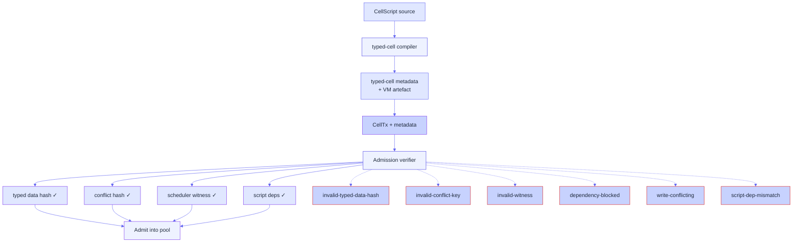

# CellScript & typed-cell metadata

CellScript is the language Myelin's application code is written in.
The vendored compiler under `cellscript/` is a fork of the upstream
CellScript project with one **added target profile**: `typed-cell`.
That profile is the compiler contract between application code and
runtime admission.

This page explains what `typed-cell` produces, what the runtime
verifies, and what happens to CellTxs that don't match the contract.

## What `typed-cell` emits

For every compiled program, the compiler emits:

```text
typed_cell_identity      -> typed Cell identity
typed_data_hash          -> hash of output data under declared type schema
conflict_keys            -> composite read/write keys (including composite keys)
scheduler_witness        -> canonical witness over CellTx + metadata
conflict_hash            -> hash(read_set, write_set, conflict_domains)
proof_obligations        -> things the verifier must check on replay
vm_artefact              -> the RISC-V ELF, or a script reference
```

This metadata is attached to every CellTx that goes through Myelin.
It is the only reason the scheduler can admit or reject a
transaction without re-running the VM.

## The runtime check

At admission time, the runtime verifies:

```text
declared typed data hash == hash(actual output data, declared type schema)
declared conflict hash   == hash(read set, write set, conflict domains)
scheduler witness        == canonical witness over CellTx + metadata
script deps              == referenced code Cells or compatible CKB dep group
```

If any of those fail, the CellTx is rejected with a reason code
listed below.



## Rejection taxonomy

Every rejection carries an explicit reason. The taxonomy:

| Code | When | Effect |
| --- | --- | --- |
| `invalid-typed-data-hash` | The declared typed data hash doesn't match `hash(actual output data, declared type schema)`. | Hard reject. CellTx is not eligible for re-submission. |
| `invalid-conflict-key` | The declared conflict keys can't be parsed or are inconsistent with the read/write sets. | Hard reject. |
| `invalid-witness` | The scheduler witness is malformed or doesn't commit to the CellTx. | Hard reject. |
| `dependency-blocked` | A referenced dep Cell or dep group isn't available. | Soft reject — retriable once the dep is available. |
| `write-conflicting` | The CellTx conflicts with an already-admitted CellTx on the same write domain. | Soft reject — RBF / replace-by-fee applies. |
| `script-dep-mismatch` | The referenced script deps don't match the declared `cell_deps`. | Hard reject. |

> [!NOTE]
> Hard rejects are *deterministically* dead. Soft rejects are
> candidates for re-submission once the underlying issue resolves.
> The CLI surfaces both in its `MyelinSchedulerReport`.

## Why typed-cell metadata exists at all

Without it, the scheduler would have to either:

1. **Re-run the VM at admission time** to learn the read/write sets.
   That's expensive, and it duplicates work the executor will do
   anyway.
2. **Trust the producer's claims** about what the CellTx reads and
   writes. That breaks the trustless admission property.

`typed-cell` is the middle path: the **compiler** knows the read/write
sets at compile time, commits to them in the metadata, and the
runtime can verify them with a hash. No VM replay at admission, no
producer trust.

## Why the conflict hash is composite

A single CellTx can read from multiple conflict domains and write to
multiple. The `conflict_hash` is `hash(read_set, write_set,
conflict_domains)` — concatenated and hashed together so any mutation
in either set changes the hash. The runtime checks:

- The declared `conflict_hash` matches the actual `(read_set,
  write_set, conflict_domains)` declared by the CellTx.
- The scheduler can therefore parallelise two CellTxs that share no
  element in any of the three sets.

This is how Myelin gets deterministic parallel scheduling without
replaying the VM. See [CellDAG scheduler](scheduler.md) for the
parallel-batches emission.

## Parity with the parent CellScript

The vendored `cellscript/` tree is a fork parented against
`../CellScript`. The script
`scripts/check_cellscript_parent_parity.py` compares the two trees
and surfaces any divergence — including the nested CellScript repos
that Myelin vendors as flat directories. Production gate runs this
script; if it surfaces unexpected divergences, the gate fails.

## What's deliberately *not* in the metadata

- The full input data — only the typed data hash. The runtime doesn't
  need the data itself at admission; it only needs to verify the
  commitment.
- The cycle count — that's measured at execution, not declared up
  front. The runtime may apply a `proof_obligation` cap, but it
  measures itself.
- The state root before/after — that's the executor's job, not the
  compiler's.

## What `proof_obligations` is for

`proof_obligations` is a list of declarative properties the executor
must check at replay. Examples:

- `cycle-budget <= max_cycles`
- `output_capacity_in >= output_capacity_out + fee`
- `dep_group_present(code_hash)`

This is the bridge between the compiler's static knowledge and the
runtime's dynamic checks. Adding a new obligation requires a
matching check in `myelin-exec`; until then, the obligation is
recorded but not enforced.

## Where to look next

- [Execution pipeline](exec-pipeline.md) — what runs after admission.
- [CellDAG scheduler](scheduler.md) — how the conflict hashes feed
  the DAG.
- [CKB-style projection](projection.md) — what survives projection.