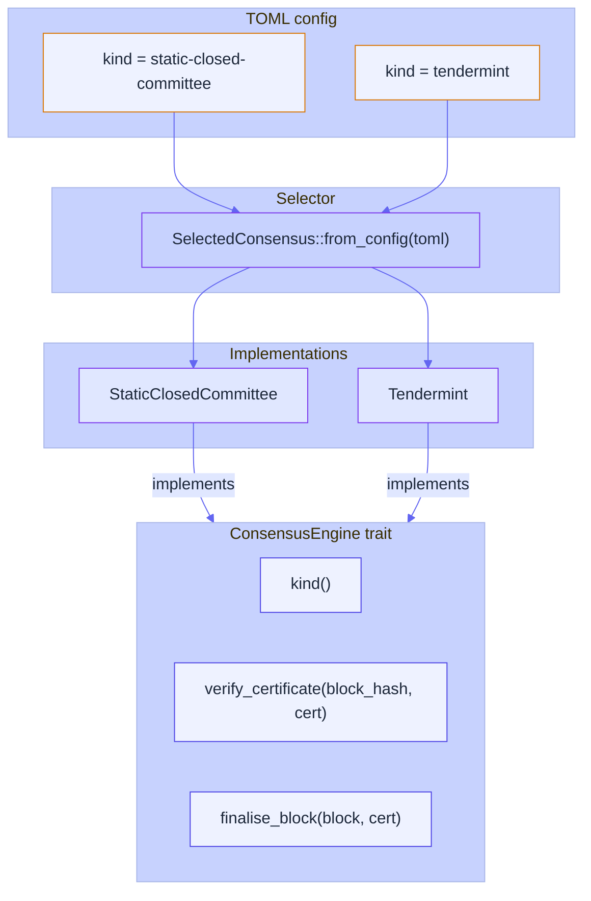
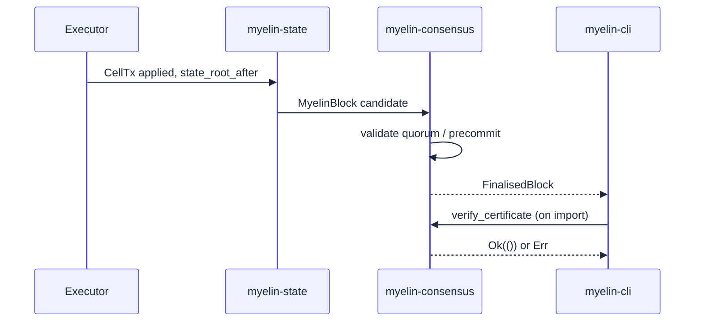

# Consensus engines

`myelin-consensus` is the crate that finalises Myelin blocks. It
exposes one trait, two implementations, and one config-driven
selector. This page covers what each engine does, when to pick which,
and how the choice stays behind the same trait so the rest of the
runtime doesn't care.

## The trait

```rust
pub trait ConsensusEngine {
    fn kind(&self) -> ConsensusKind;
    fn verify_certificate(
        &self,
        block_hash: [u8; 32],
        cert: &CommitteeCertificate,
    ) -> Result<()>;
    fn finalise_block(
        &self,
        block: MyelinBlock,
        cert: CommitteeCertificate,
    ) -> Result<FinalisedBlock>;
}
```

Two engines implement this trait:

- `StaticClosedCommittee` — a configured set of validators, any
  quorum-weight subset can finalise.
- `Tendermint` — a configured set of validators, a quorum-power
  precommit certificate finalises.

Both are constructed through `SelectedConsensus::from_config`,
which reads a TOML file. The rest of the runtime never knows which
engine is active.



## The MyelinBlock shape

Both engines operate on the same `MyelinBlock`:

```rust
pub struct MyelinBlock {
    pub version: u32,
    pub parent_hash: [u8; 32],
    pub number: u64,
    pub timestamp_ms: u64,
    pub consensus_kind: ConsensusKind,
    pub state_root_before: [u8; 32],
    pub state_root_after:  [u8; 32],
    pub ordered_cell_tx_commitments: Vec<[u8; 32]>,
    pub data_commitments:            Vec<[u8; 32]>,
    pub scheduler_commitment:        [u8; 32],
}
```

The block hash is a **canonical hash over the Molecule-shaped
serialised header plus all commitments**. Two properties:

- **Stability.** Same inputs → same hash, on every validator, every
  time.
- **Sensitivity.** Any field mutation → a different hash.

Tests must cover both. The production gate runs the canonical-hash
tests for both engines.

## Static closed committee

A static closed committee is configured from TOML:

```toml
kind = "static-closed-committee"

[static_committee]
quorum_weight = 2

[[static_committee.validators]]
id = "validator-0"
public_key = "0101010101010101010101010101010101010101010101010101010101010101"
weight = 1

[[static_committee.validators]]
id = "validator-1"
public_key = "0202020202020202020202020202020202020202020202020202020202020202"
weight = 1
```

A certificate is valid when the sum of signer weights is **at least**
`quorum_weight` and each signature verifies against the validator's
public key.

This is the simplest possible finality model: the committee is
known, the quorum is fixed, the cert is a list of signatures.

> [!NOTE]
> The static committee engine is the default for sessions and
> pressure testing. It is *not* a permissionless security claim.

## Tendermint-style weighted precommit

A Tendermint-style engine is configured from TOML:

```toml
kind = "tendermint"

[tendermint]
quorum_power = 2

[[tendermint.validators]]
id = "validator-0"
public_key = "0101010101010101010101010101010101010101010101010101010101010101"
weight = 1

[[tendermint.validators]]
id = "validator-1"
public_key = "0202020202020202020202020202020202020202020202020202020202020202"
weight = 1

[[tendermint.validators]]
id = "validator-2"
public_key = "0303030303030303030303030303030303030303030303030303030303030303"
weight = 1
```

A certificate is a list of `Precommit { validator_id, signature,
block_hash }` records. The certificate is valid when the sum of
signer weights is **strictly more than** `quorum_power` and every
signature verifies.

This model gives you the same property as static committee (a
quorum of weight/power signs the same `block_hash`), with the
Tendermint-style strict "more than 2/3" semantics — which is what
makes it BFT-equivalent under partial synchrony assumptions.

## How the two engines interact with the rest of the runtime



The block candidate is the same regardless of which engine is
configured. Only the certificate shape changes:

| Field | Static | Tendermint |
| --- | --- | --- |
| Certificate kind | `static-closed-committee` | `tendermint` |
| Signer set | Quorum weight or more | Strict majority of total power |
| Evidence shape | Signatures over `block_hash` | Precommits with `block_hash` |
| Trust model | Quorum of configured validators | Quorum of configured validators |

Both engines produce the same `block_hash` for the same inputs. The
session ID, CellTx commitments, scheduler commitment, and state
roots are identical between the two — only the certificate is
different. That's the point: the choice of finality stays behind
the trait.

## When to pick which

| Use case | Pick | Why |
| --- | --- | --- |
| **Session benchmarking** | Static closed committee | Simplest cert shape, fastest to set up. |
| **Pressure testing** | Static closed committee | Lets you iterate on the protocol without BFT concerns. |
| **Multi-validator demo** | Tendermint | More realistic BFT semantics; rotates validator responsibility. |
| **Pre-permissionless research** | Tendermint | Closer to the eventual "open committee" shape, while still being a known-set engine. |
| **Live public L2** | Neither yet | Both engines assume a known validator set. The court path is what would extend this to a permissionless claim. |

## What neither engine is

- **Neither is a Nakamoto PoW consensus.** Block finality is
  immediate on quorum signature; there is no probabilistic
  confirmation.
- **Neither is a permissionless entry path.** A new validator can
  only be added through configuration change, not through an
  on-chain action.
- **Neither is a slashing engine.** There is no stake to slash in
  the current design; the trust model is direct ("you trust the
  configured validators").

These are deliberate scope choices. See
[Claim ladder](../security/claim-ladder.md) for what would have to
be true to climb higher.

## Where to look next

- [L1 / L2 / off-chain interactions](../interactions/l1-l2-offchain.md)
  — where the committee certificate sits in the bigger picture.
- [Evidence paths](../security/evidence-paths.md) — what the
  committee certificate proves and what it doesn't.
- [Production gate](../operations/production-gate.md) — what gets
  tested for both engines.