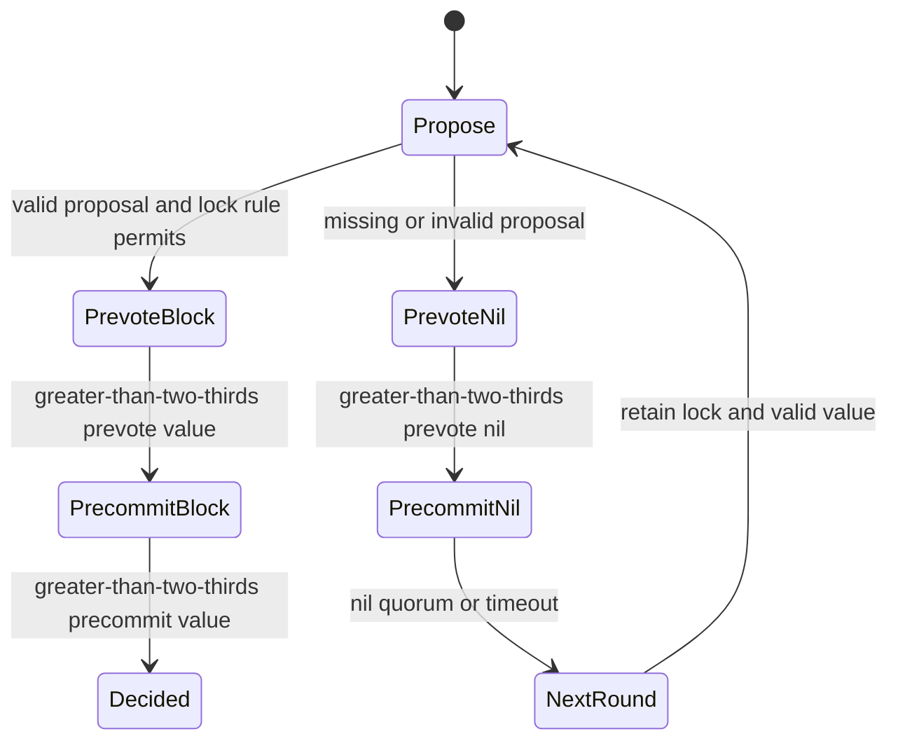

# Closed-validator finality

Myelin finalises finite-session `MyelinBlock`s with one of two configured engines:

- `static-closed-committee` — one weighted commit certificate;
- `tendermint` — deterministic proposer selection plus signed proposal,
  prevote, precommit, locking, nil votes, round changes, and a final
  precommit decision certificate.

Both use secp256k1 Schnorr signatures with distinct domains. They are
closed-validator mechanisms, not permissionless consensus protocols.

## Tendermint configuration

The quorum must be strictly greater than two thirds of total voting power.
For four equal validators the smallest safe quorum is three:

```toml
kind = "tendermint"

[tendermint]
quorum_power = 3

[[tendermint.validators]]
id = "validator-0"
public_key = "79be667ef9dcbbac55a06295ce870b07029bfcdb2dce28d959f2815b16f81798"
weight = 1

[[tendermint.validators]]
id = "validator-1"
public_key = "c6047f9441ed7d6d3045406e95c07cd85c778e4b8cef3ca7abac09b95c709ee5"
weight = 1

[[tendermint.validators]]
id = "validator-2"
public_key = "f9308a019258c31049344f85f89d5229b531c845836f99b08601f113bce036f9"
weight = 1

[[tendermint.validators]]
id = "validator-3"
public_key = "e493dbf1c10d80f3581e4904930b1404cc6c13900ee0758474fa94abe8c4cd13"
weight = 1
```

The old `weighted-precommit` config spelling is accepted only as a migration
alias. Reports emit the canonical `tendermint` name.

## Round state


```mermaid
stateDiagram-v2
    [*] --> Propose
    Propose --> PrevoteBlock: valid proposal and lock rule permits
    Propose --> PrevoteNil: missing or invalid proposal
    PrevoteBlock --> PrecommitBlock: greater-than-two-thirds prevote value
    PrevoteNil --> PrecommitNil: greater-than-two-thirds prevote nil
    PrecommitBlock --> Decided: greater-than-two-thirds precommit value
    PrecommitNil --> NextRound: nil quorum or timeout
    NextRound --> Propose: retain lock and valid value
```

`TendermintRoundState` is serializable and is the WAL boundary before signing
the next message. It retains `locked_value/locked_round` and
`valid_value/valid_round`, rejects proposal/vote equivocation, and verifies a
proposal's `valid_round` against retained prevote quorum evidence. Networking,
peer discovery, timeout scheduling, validator-set changes, and durable WAL I/O
are operator/runtime responsibilities outside the deterministic state machine.

`MyelinBlock` commits to session lineage, consensus kind, real pre/post state
roots, ordered raw txids, DA commitments, and the scheduler commitment. The two
engines must produce identical transaction and state fields for the same
workload; their certificate material differs.
