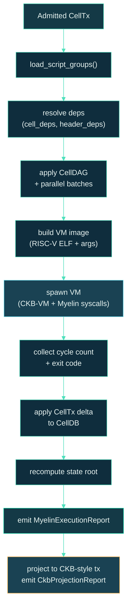

# Execution pipeline

`myelin-exec` is the crate that owns the CellTx shape, the script
groups, the VM/syscall glue, the CellDAG scheduler, and the
projection layer. This page walks through what happens to a CellTx
once it lands in the runtime.

## The flow inside `myelin-exec`



Each stage has a small, named function in the crate. None of them
touch the wall clock; all of them take their inputs by reference and
emit pure outputs.

## Script groups

A script **group** is the set of inputs and outputs that share the
same `type` script. CKB verifies script groups in parallel. Myelin
does the same — once the scheduler has built the CellDAG, the
executor can fan out by script group.

```text
script_group {
    type_script: Script,                  // shared type script for the group
    input_indices:  Vec<usize>,           // which inputs share this type
    output_indices: Vec<usize>,           // which outputs share this type
}
```

Two CellTxs that share no script groups and no read/write domains
can be executed in the same parallel batch. See
[CellDAG scheduler](scheduler.md).

## VM image construction

For each script group, the executor builds a VM image:

1. **Resolve the script binary** from the CellTx's `cell_deps[]`.
   The binary is a RISC-V ELF — usually a stripped `replayer`
   binary in the case of Teeworlds.
2. **Build the VM args** — the standard CKB VM contract:
   `-f <cell-deps-file>` to read the dep Cells from witness slot 0,
   `-i <input-index>` to pick which input this group is verifying,
   witness slots `1..n` for the script's data, and so on.
3. **Set the cycle limit** to the per-script-group cap (depends on
   the network's VM version).
4. **Wire the syscalls** — `LOAD_TRANSACTION`, `LOAD_CELL`,
   `LOAD_SCRIPT_HASH`, etc., all under Myelin's deterministic
   syscall surface.

The Teeworlds replayer, for instance, reads its game tape from
witness slot `1`, the map from slot `2`, and the config from slot
`3`. The executor's witness-wiring code is what makes this work
end-to-end.

## Syscall surface

Myelin exposes the CKB syscall set, plus a small Myelin-only
extension. The extension is what produces `myelin-native` profile
transitions (see [Semantic profiles](../concepts/semantic-profiles.md)).

| Category | Syscalls |
| --- | --- |
| **Transaction / cell** | `load_transaction`, `load_transaction_group`, `load_cell`, `load_cell_data`, `load_cell_by_field`, `load_input_by_field`, `load_cell_capacity`, `load_actual_type_witnesses` |
| **Script** | `load_script`, `load_script_hash`, `load_proof` |
| **Header** | `load_header`, `load_header_by_field`, `load_header_dep` |
| **VM control** | `vm_version`, `current_cycles`, `exec`, `spawn`, `pipe` |
| **Myelin-only** | `myelin_state_root`, `myelin_session_id`, `myelin_chunk_index` |

The Myelin-only syscalls carry no semantics on CKB; the projection
layer flags any CellTx that uses them with `semantic_profile =
"myelin-native"` and lists each syscall in `unsupported_features`.

> [!WARNING]
> Using Myelin-only syscalls deliberately means the CellTx cannot
> be projected to a CKB-style transaction. That's fine for
> engineering experiments; it is **not** fine for public CKB-alignment
> demos.

## `LOAD_TRANSACTION` is Molecule

The `load_transaction` syscall returns the Molecule-encoded
transaction bytes, both for the standard CKB layout and for
Myelin-extended layouts. Non-Molecule VM object ABI versions are
rejected at admission.

Concretely:

```text
myelin-extended LOAD_TRANSACTION  -> Molecule bytes, Myelin extended fields
ckb-strict      LOAD_TRANSACTION  -> Molecule bytes, CKB-only fields
```

The strict variant is the one every public demo should default to;
the extended variant exists so Myelin can carry its own typed-cell
metadata *into* the VM when needed.

## Execution report

Every CellTx or chunk produces a `MyelinExecutionReport`:

```rust
pub struct MyelinExecutionReport {
    pub accepted:            bool,
    pub vm_exit_code:        i8,
    pub cycles:              u64,
    pub consumed_cells:      Vec<OutPoint>,
    pub created_cells:       Vec<CellOutput>,
    pub read_refs:           Vec<OutPoint>,
    pub witness_hashes:      Vec<[u8; 32]>,
    pub script_deps:         Vec<CellDep>,
    pub conflict_hashes:     Vec<[u8; 32]>,
    pub typed_data_hashes:   Vec<[u8; 32]>,
    pub scheduler_report_hash: [u8; 32],
    pub state_root_before:   [u8; 32],
    pub state_root_after:    [u8; 32],
    pub semantic_profile:    SemanticProfile,
}
```

This is the executor's signed contract: `state_root_after` is the
result of applying `state_root_before` through the CellTx in this
exact VM context, with `cycles` and `vm_exit_code` measured.

## What's in a parallel batch

The scheduler emits `parallel_batches: Vec<Vec<CellTxId>>`. Two
CellTxs in the same batch are guaranteed to:

- share no script group,
- share no read set element,
- share no write set element.

The executor iterates batches in order. Within a batch, the order
is deterministic — `fee_density` then `wtxid` — so every validator
arrives at the same state root transition.

## The role of `state_root_before`

Every CellTx commits to a `state_root_before` in its
`MyelinExecutionReport`. The executor checks this against the current
state root at execution time. If they disagree, the CellTx is
rejected — this prevents stale CellTxs from applying on top of a
state the producer didn't see.

This is the equivalent of CKB's `since`-based time-lock protection,
but at the state-root level rather than the timestamp level.

## What's deliberately not in the executor

- **No consensus state.** The executor doesn't know about committee
  certificates, validator sets, or block numbers beyond what the
  block header carries. Those belong to `myelin-consensus`.
- **No mempool state.** The executor takes already-admitted
  CellTxs and runs them. Mempool logic lives in `myelin-mempool`.
- **No DA logic.** The executor emits CellDB deltas; DA manifests
  are emitted by `myelin-state` from those deltas.

Keeping these boundaries clean is what makes the executor auditable.

## Where to look next

- [CellDAG scheduler](scheduler.md) — what runs before the executor.
- [State & data availability](state.md) — what the executor's output
  feeds.
- [CKB-style projection](projection.md) — what runs after the
  executor on every chunk.