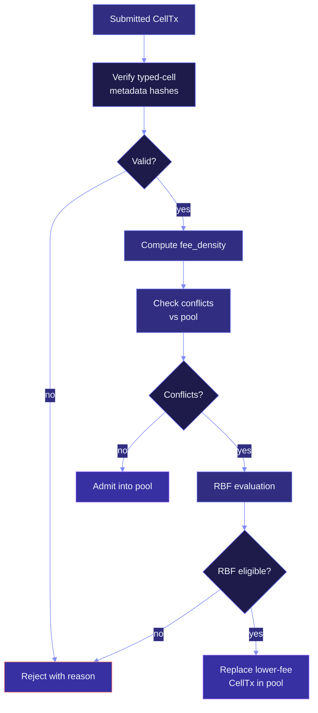

# Mempool & admission

`myelin-mempool` is the queue CellTxs sit in between "submitted by a
producer" and "admitted by the scheduler". It applies deterministic
admission rules — fee/cycle scoring, RBF, dependency tracking — so
that the scheduler's input set is consistent across all validators.

This page covers what the mempool accepts, what it rejects, and how
RBF works.

## What the mempool tracks

For every CellTx, the mempool tracks:

```text
tx_id                       -> [u8; 32], deterministic
typed-cell metadata         -> conflict hashes, scheduler witness, deps
fee                         -> capacity claimed by the producer
declared cycles             -> from proof_obligations
fee_density                 -> fee / max(declared_cycles, 1)
read_set / write_set        -> from typed-cell metadata
since                       -> state-root-before anchor
```

Everything the mempool needs comes from the typed-cell metadata. It
never inspects the script code, and it never runs the VM.

## Admission flow



## The rejection taxonomy

Every rejection has a deterministic reason code. These are the
**mempool-level** rejections; the scheduler has its own (see
[CellDAG scheduler](scheduler.md)).

| Reason | When | RBF? |
| --- | --- | --- |
| `invalid-typed-data-hash` | The declared typed data hash doesn't match `hash(actual output data, declared type schema)`. | No — hard reject. |
| `invalid-conflict-key` | Conflict keys malformed or inconsistent. | No — hard reject. |
| `invalid-witness` | Scheduler witness malformed. | No — hard reject. |
| `dependency-blocked` | A referenced dep isn't in the pool or state. | Yes — once the dep is available. |
| `fee-too-low` | `fee_density` is below the pool's minimum. | Yes — by raising the fee. |
| `write-conflicting` | A previously-admitted CellTx already writes the same element. | Yes — by raising the fee and RBFing. |
| `since-not-satisfied` | The CellTx's `since` field is ahead of the current state root anchor. | Yes — once the anchor advances. |

> [!TIP]
> Hard rejects are *deterministically* dead. The producer can't
> retry them with different parameters; they need a new CellTx
> with a corrected structure.

## Replace-by-fee (RBF)

When a CellTx conflicts with one already in the pool, the mempool
**may** replace the older one if the new one offers a strictly
higher `fee_density`. The rules:

```text
new.fee_density > old.fee_density + rbf_bump
AND
new.fee        > old.fee        + rbf_min_increase
```

The bumps are config-driven. The default bump is small enough that
ordinary retries can climb, large enough that griefing is
uneconomical.

RBF is **per-domain**. Two CellTxs that conflict on `A` cannot RBF
each other if they don't conflict on `B` — the domain granularity
matters. This is what lets multiple independent sessions share a
mempool without leaking fee pressure across them.

## Why the mempool is *deterministic*

Two properties:

1. **Same input, same pool.** Any validator receiving the same set
   of CellTxs in any order computes the same pool state and the
   same admission results.
2. **No wall-clock dependency.** There is no "CellTx expired after
   N seconds" rule. There is no "max age" rule. A CellTx stays in
   the pool until it's admitted or evicted by a higher-fee
   competitor.

This is what makes the mempool safe to replicate across the
committee — every validator arrives at the same batch ordering,
which means every validator arrives at the same state root.

## Dependency tracking

The mempool tracks **dep Cells** for every CellTx. If a dep Cell
isn't yet on-chain (or in the session state), the CellTx sits in a
`waiting_deps` sub-queue. Once the dep is available, the CellTx
moves to the active queue automatically.

This is how Myelin handles the equivalent of CKB's `cell_deps` model
without forcing every CellTx to commit at admission.

## How a CellTx exits the pool

A CellTx exits the pool in one of three ways:

1. **Admitted.** The scheduler includes it in a parallel batch, the
   executor runs it, and the state root updates. The CellTx is now
   *committed* — its `OutPoints` are in `consumed_cells`, its
   outputs are in `live_cells`.
2. **Evicted by RBF.** A higher-fee CellTx replaces it. The evicted
   CellTx is recorded in the eviction log.
3. **Evicted by reorganisation.** A committee reorganisation (rare
   under both finality engines) drops the CellTx. The CellTx is
   recorded in the eviction log.

The pool never silently forgets a CellTx. The eviction log is part
of the audit trail.

## What the mempool is *not*

- **Not a market.** There is no order book, no matching engine, no
  AMM logic. The mempool is just an admission queue.
- **Not a gossip layer.** The CLI drives the mempool; there is no
  P2P layer in the current kernel.
- **Not a fee oracle.** The pool reports its own state, but it does
  not estimate fees for clients. Fee estimation is the producer's
  job.

## Where to look next

- [CellDAG scheduler](scheduler.md) — what runs after admission.
- [Consensus engines](consensus.md) — how the batch is finalised.
- [L1 / L2 / off-chain interactions](../interactions/l1-l2-offchain.md)
  — the bigger picture.