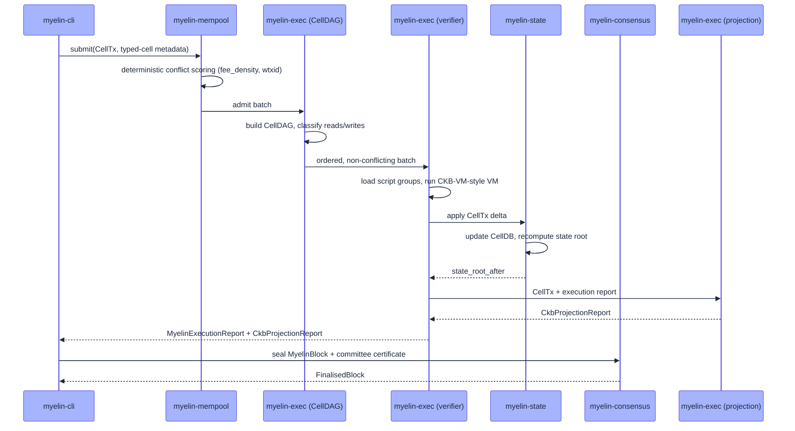

# System overview

Myelin is one runtime, four core crates, one CLI, and one vendored
compiler. This page puts them on a single diagram and explains the
control flow that turns a CellScript source file into a CKB-projected
chunk ready for the court path.

## The runtime spine

```mermaid
%%{init: {
  "theme": "base",
  "themeVariables": {
    "primaryColor": "#A5B4FC",
    "primaryTextColor": "#1E293B",
    "primaryBorderColor": "#4F46E5",
    "lineColor": "#6366F1",
    "secondaryColor": "#C7D2FE",
    "tertiaryColor": "#C7D2FE",
    "fontFamily": "Inter, system-ui, sans-serif"
  }
}}%%
flowchart LR
    subgraph SRC["Source"]
        A["CellScript<br/>source"]:::src
    end
    subgraph COMP["Compiler"]
        B["typed-cell<br/>metadata"]:::comp
        C["VM artefact<br/>(RISC-V ELF)"]:::comp
    end
    subgraph EXEC["myelin-exec"]
        D["CellTx<br/>(Molecule)"]:::exec
        E["CellDAG<br/>scheduler"]:::exec
        F["script groups<br/>+ VM glue"]:::exec
        G["execution<br/>report"]:::exec
    end
    subgraph STATE["myelin-state"]
        H["live / consumed<br/>Cell store"]:::state
        I["state root"]:::state
    end
    subgraph POOL["myelin-mempool"]
        J["admission queue<br/>(deterministic)"]:::pool
    end
    subgraph CONS["myelin-consensus"]
        K["committee<br/>certificate"]:::cons
        L["MyelinBlock"]:::cons
    end
    subgraph PROJ["Projection"]
        M["CkbProjectionReport"]:::proj
    end
    subgraph DA["DA"]
        N["DA manifest<br/>(Merkle SegmentProof)"]:::da
    end
    subgraph OUT["Outputs"]
        O["court bundle"]:::out
        P["settlement package"]:::out
        Q["anchor package"]:::out
    end

    A --> B
    A --> C
    B --> D
    C --> D
    D --> J
    J --> E
    E --> F
    F --> G
    F --> H
    H --> I
    I --> L
    D --> M
    G --> M
    I --> N
    L --> K
    M --> O
    N --> O
    N --> Q
    O --> P

    classDef src  fill:#C7D2FE,stroke:#6366F1,color:#1E293B;
    classDef comp fill:#A5B4FC,stroke:#4F46E5,color:#1E293B;
    classDef exec fill:#C7D2FE,stroke:#6366F1,color:#1E293B;
    classDef state fill:#C7D2FE,stroke:#4F46E5,color:#1E293B;
    classDef pool fill:#A5B4FC,stroke:#6366F1,color:#1E293B;
    classDef cons fill:#C7D2FE,stroke:#7C3AED,color:#1E293B;
    classDef proj fill:#C7D2FE,stroke:#7C3AED,color:#1E293B;
    classDef da   fill:#A5B4FC,stroke:#D97706,color:#1E293B;
    classDef out  fill:#C7D2FE,stroke:#D97706,color:#1E293B;
```



Every arrow is a real API call between crates. The spine is **acyclic
in the data-flow sense** — state only flows forward, and the only
back-edge is the state root, which the scheduler and execution use to
admit the *next* CellTx.

## What each crate owns

| Crate | Owns | Public surface |
| --- | --- | --- |
| `cellscript/` | The compiler that emits `typed-cell` metadata and the VM artefact. | A binary; a Rust library the CLI links to. |
| `myelin-exec` | CellTx, script groups, VM/syscall adapters, CellDAG scheduler, projection. | `CellTx`, `MyelinSchedulerReport`, `MyelinExecutionReport`, `CkbProjectionReport`. |
| `myelin-state` | Live/consumed/created Cell store, state root, DA segment proofs. | `CellDB`, `SegmentWriter`, `SegmentReader`, `SegmentProof`. |
| `myelin-mempool` | Admission queue, deterministic conflict scoring, RBF, dependency tracking. | `CellPool`, `AdmissionResult`. |
| `myelin-consensus` | The `ConsensusEngine` trait, two implementations, the `MyelinBlock` shape and its canonical hash. | `StaticClosedCommittee`, `Tendermint`, `SelectedConsensus::from_config`. |
| `myelin-cli` | Executable commands that produce and verify reports. | `celltx`, `committee`, `session`, `teeworlds`, `runtime` subcommands. |
| `myelin-core-utils`, `myelin-hashes`, `myelin-math` | Deterministic hot-path, hashing, integer and accumulator support. | Internal. |

## The data shape that everything speaks

Across crates, the canonical types are:

```rust
// myelin-exec
pub struct CellTx { /* Molecule-encoded fields */ }
pub struct MyelinSchedulerReport { /* scheduler output */ }
pub struct MyelinExecutionReport  { /* verifier output  */ }
pub struct CkbProjectionReport   { /* projection output */ }

// myelin-state
pub struct CellDB { /* live/consumed/created */ }
pub struct SegmentProof { /* DA Merkle proof */ }

// myelin-consensus
pub struct MyelinBlock {
    pub version: u32,
    pub parent_hash: [u8; 32],
    pub number: u64,
    pub timestamp_ms: u64,
    pub consensus_kind: ConsensusKind,
    pub state_root_before: [u8; 32],
    pub state_root_after:  [u8; 32],
    pub ordered_cell_tx_commitments: Vec<[u8; 32]>,
    pub data_commitments:            Vec<[u8; 32]>,
    pub scheduler_commitment:        [u8; 32],
}
```

The block hash is a canonical hash over the Molecule-shaped serialised
header plus all commitments. Tests must cover (a) hash stability for
the same input, and (b) hash change under any field mutation. That
contract is what makes finality evidence reproducible.

## What the four core crates do at runtime



The four core crates compose like a pipeline with no global state —
each step's output is the next step's input, and the block is the
final assembly. There is no daemon, no socket, no async runtime in
the spine itself; the CLI orchestrates the calls.

## Layering rules

To keep the kernel auditable, the dependency rules are:

```text
cellscript     -> [external compiler dep]
myelin-exec    -> myelin-hashes, myelin-math, myelin-core-utils
myelin-state   -> myelin-hashes, myelin-math, myelin-core-utils
myelin-mempool -> myelin-exec, myelin-hashes, myelin-core-utils
myelin-consensus -> myelin-exec, myelin-hashes, myelin-math
myelin-cli     -> myelin-exec, myelin-state, myelin-mempool, myelin-consensus
```

What the rules forbid:

- No crate may import the CKB client.
- No crate may import a wallet, RPC, or sync library.
- No crate may import a non-Molecule legacy serializer into the
  native execution graph.
- No crate may depend on `myelin-cli` (the CLI is a leaf).

These rules are enforced by the production gate's stale-surface
scan and dependency-inversion check.

## What lives outside the kernel

Three things deliberately live outside the kernel:

- The **CellScript vendored copy** (`cellscript/`). It's a fork
  parented against `../CellScript`; the parity script
  `scripts/check_cellscript_parent_parity.py` keeps it honest.
- The **website** (`website/`). It's a separate Astro project for
  marketing surface, not part of the kernel.
- The **scripts** (`scripts/`). Validation, parity checks, and
  production gates. They invoke the kernel as a library or a CLI,
  not the other way around.

## Where to look next

- [Execution pipeline](exec-pipeline.md) — the most important crate
  to understand first.
- [CKB-style projection](projection.md) — the credibility hinge.
- [Consensus engines](consensus.md) — where the finality choice
  actually lives.