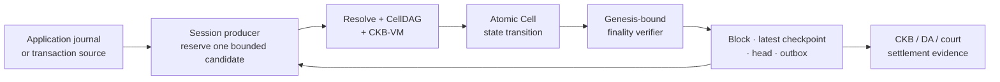

# Architecture overview

Myelin separates application intake, deterministic Cell execution, session
finality, durable storage, and CKB evidence. The
[canonical architecture](../MYELIN_ARCHITECTURE.md) defines the protocol and
trust rules; this page is the shorter map.

```mermaid
flowchart LR
    APP["Application journal<br/>or transaction source"] --> PROD["Session producer<br/>reserve one bounded candidate"]
    PROD --> EXEC["Resolve + CellDAG<br/>+ CKB-VM"]
    EXEC --> STATE["Atomic Cell<br/>state transition"]
    STATE --> FINAL["Genesis-bound<br/>finality verifier"]
    FINAL --> STORE["Block · latest checkpoint<br/>· head · outbox"]
    STORE --> EVID["CKB / DA / court<br/>settlement evidence"]
    STORE --> PROD
```

## Module ownership

| Module | Owns | Does not own |
| --- | --- | --- |
| External CellScript compiler + `myelin-cellscript-adapter` | source compilation, attestation, access templates | final conflict hashes or live Cell selection |
| `myelin-mempool` | admission, root binding, physical conflict and RBF rules | VM success or state mutation |
| `myelin-exec` + `myelin-state` | CellDAG ordering, `CkbStrict` script verification, atomic root-bound transitions | production timing or finality |
| `myelin-session-producer` | `Instant`, `Interval`, lazy `Open`, `Never`, reservations, count/byte caps | VM validity, finality, or durable head mutation |
| `myelin-consensus` | static committee, PoA, Tendermint proofs and module descriptors | application execution |
| `myelin-session` | canonical blocks, proof verification port, head advancement, recovery audit | a concrete consensus driver or database |
| `myelin-session-store-rocksdb` | schema, WAL, atomic block/checkpoint/head/outbox commit, durable queues | application event meaning |
| `myelin-session-runtime` | component wiring, service dependency order, health and writer gate | a public daemon or dynamic module loading |
| `myelin-ckb-adapter` | immutable CKB context and linked validation/node/commitment/finality receipts | CKB mining or an L1 court verdict |

## Layering rules

- New Cell transactions use version `0`.
- Producer OutPoints, scheduler bindings, and ordered block commitments use raw
  txid. Witness changes affect wtxid.
- The state resolver derives logical conflict hashes from authenticated Cells;
  compiler binding names are diagnostic labels.
- READ/READ work may run concurrently. Any pair containing WRITE is ordered.
- Physical double spends are rejected even when logical metadata says the work
  is independent.
- Script groups run in separate VM instances under one transaction cycle
  budget.
- State transitions require an exact pre-root and commit atomically.
- A session prepares one candidate from the durable head at a time.
- Genesis fixes the finality module and its configuration for the session.
- The pure projector stops at `wire-encoded`; higher stages require linked
  receipts for the exact transaction.

## Commit and recovery

The commit path verifies the exact canonical block and its genesis-bound proof,
then atomically writes the block, latest checkpoint, durable head, and outbox.
Only after that commit does the producer acknowledge its source reservation.

Recovery streams and audits the finalised block-and-proof chain, restores the
latest checkpoint, compares its root with the durable head, and opens writes
after every check succeeds. It does not replay every transaction during an
ordinary restart.

For the end-to-end sequence, continue with the
[session lifecycle](../interactions/session-flow.md).
