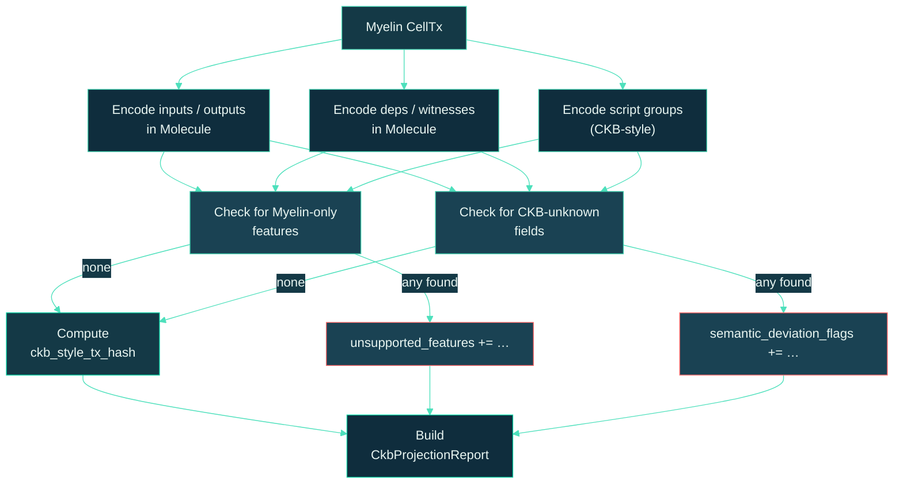

# CKB-style projection

Projection is the **credibility hinge** of Myelin. Every CellTx or
chunk goes through it, and the resulting `CkbProjectionReport` is
what tells the reader — and a future court verifier — whether the
transition is genuinely CKB-projectable.

This page covers what projection does, what it produces, and what
makes its output reproducible.

## What projection is

Projection is a function from a Myelin CellTx (or chunk) to a
`CkbProjectionReport`:

```text
project_celltx(myelin_celltx) -> CkbProjectionReport
project_chunk(chunk)         -> CkbProjectionReport
```

The function is **deterministic** and **pure**: same input → same
output, every time, on every machine. There is no wall-clock, no
random, no host state involved.

## What the projection report contains

```rust
pub struct CkbProjectionReport {
    pub projection_possible: bool,
    pub ckb_style_tx_hash:   Option<[u8; 32]>,
    pub cell_inputs:         Vec<OutPoint>,
    pub cell_outputs:        Vec<CellOutput>,
    pub cell_deps:           Vec<CellDep>,
    pub witnesses:           Vec<Vec<u8>>,
    pub script_groups:       Vec<ScriptGroup>,
    pub unsupported_features:          Vec<String>,
    pub semantic_deviation_flags:     Vec<String>,
}
```

The most important fields:

- **`projection_possible: bool`** — *could* this CellTx be encoded as
  a CKB-style transaction without changing semantics?
- **`ckb_style_tx_hash`** — the deterministic CKB tx hash for the
  projected bytes, if `projection_possible` is true.
- **`unsupported_features`** — explicit list of Myelin-only syscalls,
  metadata fields, or helpers that can't be projected.
- **`semantic_deviation_flags`** — explicit list of places where the
  Myelin CellTx carries Cell-Model-correct data that CKB can't
  currently encode.

A successful projection produces a `ckb_style_tx_hash` that equals
the CKB transaction hash for the same bytes. That's why Myelin uses
Molecule encoding everywhere — it's the only way to make that
equality hold.

## How projection works



## What counts as "Myelin-only"

The projection layer flags a CellTx as `myelin-native` when it uses:

- `myelin_state_root`
- `myelin_session_id`
- `myelin_chunk_index`
- Any Myelin-only helper metadata field that has no CKB analogue

When the projection layer flags a CellTx as `ckb-inspired-only`,
it's because the CellTx follows the Cell model correctly but
carries a feature CKB can't currently encode. Examples (real ones
that have come up during Myelin development):

- DA manifest segments beyond the Molecule tx bytes (e.g. external
  DA provider receipts that bind to a separate payload hash).
- Tendermint precommit signatures in the witness (CKB can carry
  signatures but doesn't have a Tendermint-style certificate type).
- Session-scoped context_deps that aren't `cell_deps`.

Each is recorded explicitly in the report so a reader knows exactly
what wouldn't survive projection.

## What makes the projection deterministic

Three things:

1. **Molecule everywhere.** Every CKB-style field is encoded with
   the CKB Molecule layout. The same bytes go in, the same bytes
   come out.
2. **Sorted field ordering.** When the projection builds a
   CKB-style script group or witness list, the order is sorted
   canonically. No "set ordering" variance across implementations.
3. **No external state.** The projection function reads the CellTx
   and the typed-cell metadata. Nothing else.

The result: any two implementations of the projection layer, given
the same input, produce the same `ckb_style_tx_hash`. The
production gate tests this with paired examples.

## How the projection report attaches to chunks

For the Teeworlds path, the same projection status attaches to
every bounded execution chunk. The CLI commands
`teeworlds inspect`, `teeworlds bench`, and `teeworlds
build-fixture` all emit a per-chunk projection report.

This means a Teeworlds demo doesn't just say "we ran 3 chunks";
it says "for each of the 3 chunks, here's whether it projects to a
CKB-style tx, and here's the hash of the projected bytes."

## What the projection report is *not*

- **Not a CKB submission.** `projection_possible: true` means a CKB
  verifier *could* process the projected bytes. It does not mean the
  bytes have been submitted to CKB. Submission is a separate step
  (see [L1 submission flow](../interactions/submission-flow.md)).
- **Not a security claim.** Projection says "this transition is
  Cell-shaped and CKB-compatible." It does not say "the transition
  is valid." Validity comes from the execution report.
- **Not a court verdict.** A successful projection is the
  *input shape* to a future court; it is not the verdict itself.

## The report is auditable

To audit a projection:

1. Take the input CellTx (with its typed-cell metadata).
2. Run `myelin-exec::projection::project_celltx` on it.
3. Compare the resulting `ckb_style_tx_hash`, the cell inputs,
   outputs, deps, witnesses, and the unsupported / deviation lists
   against the published report.

If anything differs, the projection is broken or the CellTx changed.
Either is grounds for rejecting the evidence.

## Where to look next

- [Semantic profiles](../concepts/semantic-profiles.md) — how the
  projection feeds the profile label.
- [Court path](../interactions/court-path.md) — how the projected
  bytes feed the future court.
- [L1 / L2 / off-chain interactions](../interactions/l1-l2-offchain.md)
  — the bigger picture.