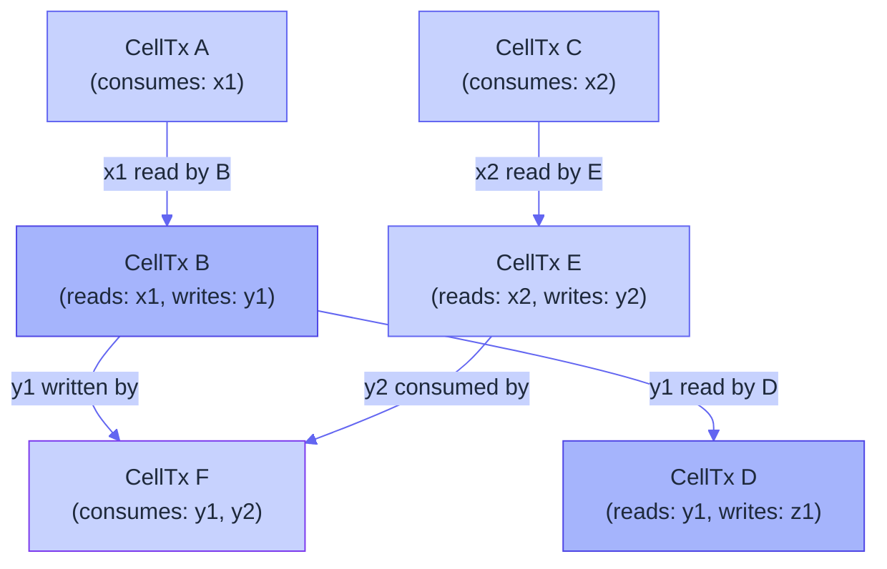
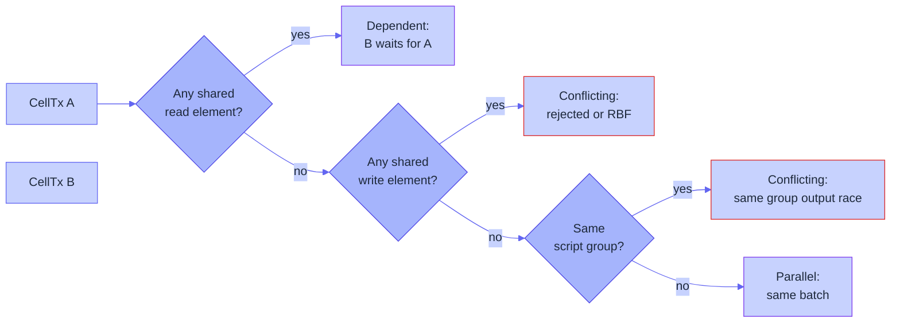

# CellDAG scheduler

The scheduler is the admission and audit component that turns an
unordered pool of CellTxs into an ordered, parallel-safe execution
plan. It is *not* an optimiser; it is a deterministic guard that
prevents two conflicting CellTxs from ever landing in the same
parallel batch.

This page explains what the scheduler reads, what it builds, and what
it emits.

## What the scheduler reads

For every admitted CellTx, the scheduler reads:

```text
input OutPoints
consumed Cells
created Cells
read-only referenced Cells (read_refs)
typed-cell conflict hashes
declared read/write conflict domains
```

These come from the typed-cell metadata and the CellTx itself. The
scheduler doesn't need to look at the script code.

## What the scheduler builds

It builds a **CellDAG** — a DAG whose nodes are CellTxs and whose
edges are explicit dependencies:



In this small example:

- **B must wait for A** because it reads `x1`.
- **D must wait for B** because it reads `y1` (which B creates).
- **E must wait for C** because it reads `x2`.
- **F must wait for both B and E** because it consumes `y1` and
  `y2`.

The scheduler's job is to compute these edges from the typed-cell
metadata, not by inspecting the VM.

## What the scheduler emits

```rust
pub struct MyelinSchedulerReport {
    pub accepted:            Vec<[u8; 32]>,
    pub rejected:            Vec<[u8; 32]>,
    pub dag_nodes:           Vec<SchedulerNode>,
    pub dag_edges:           Vec<SchedulerEdge>,
    pub conflict_domains:    Vec<ConflictDomain>,
    pub parallel_batches:    Vec<Vec<[u8; 32]>>,
    pub rejected_reasons:    Vec<RejectedReason>,
    pub report_hash:         [u8; 32],
}
```

The most important field is `parallel_batches`. Each batch is a list
of CellTx IDs that are safe to execute together. The executor
processes batches in order; within a batch, CellTxs run in
`fee_density` then `wtxid` order.

## Deterministic ordering

The scheduler's ordering rule is:

```text
primary:   fee_density (descending)
secondary: wtxid (lexicographic)
```

Why fee density and not raw fee? Because CellTxs carry cycle budgets
up front, so fee per cycle is a better proxy for value delivered per
VM resource consumed. Why `wtxid` as the tiebreaker? Because it's a
deterministic, content-derived ordering — every validator computes
the same batches.

There is no L1 consensus weighting in transaction priority. The
state-root before/after is the only thing the executor cares about;
the scheduler's order only governs *which* CellTxs land in which
batch.

## How two CellTxs are classified

For each pair of CellTxs, the scheduler decides:



A and B are:

- **Dependent** — if B reads something A writes (or vice versa).
  B waits for A in the DAG.
- **Conflicting** — if both write the same element. The second
  arrival is rejected with `write-conflicting` (RBF applies if the
  producer wants to retry).
- **Conflicting** — if both write to the same script group. The
  type-script semantics demand a single ordered writer per group
  per batch.
- **Parallel** — otherwise. They land in the same batch.

## Why dependency tracking matters

Without explicit dependency tracking, the executor would either:

- **Replay every CellTx serially**, throwing away all the parallelism
  benefit; or
- **Speculatively execute**, then re-execute on conflict — which
  complicates the cycle accounting and the state-root model.

Explicit dependency tracking is the middle path. The typed-cell
metadata already commits to the read/write sets at compile time, so
the scheduler doesn't need to discover them.

## What happens to a rejected CellTx

Rejected CellTxs are recorded in the `MyelinSchedulerReport` with an
explicit `RejectedReason`:

```text
invalid-typed-data-hash
invalid-conflict-key
invalid-witness
dependency-blocked
write-conflicting
script-dep-mismatch
```

The CLI surfaces these in the report. A future dashboard could
filter them; for now they're just JSON in the output.

## The scheduler is auditable

Two properties make the scheduler auditable end-to-end:

1. **Determinism**: the same set of CellTxs, fed in any order,
   produces the same `parallel_batches` and the same `report_hash`.
2. **Transparency**: every rejection has a reason, every dependency
   has an edge, every batch has a deterministic tiebreaker.

Both are tested in `myelin-exec` and surfaced through the CLI's
`runtime smoke` path.

## Where to look next

- [Execution pipeline](exec-pipeline.md) — what runs the batches.
- [State & data availability](state.md) — how the state root
  evolves across batches.
- [Mempool & admission](mempool.md) — what happens before the
  scheduler sees a CellTx.