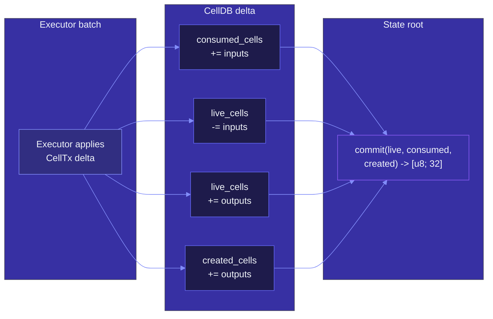
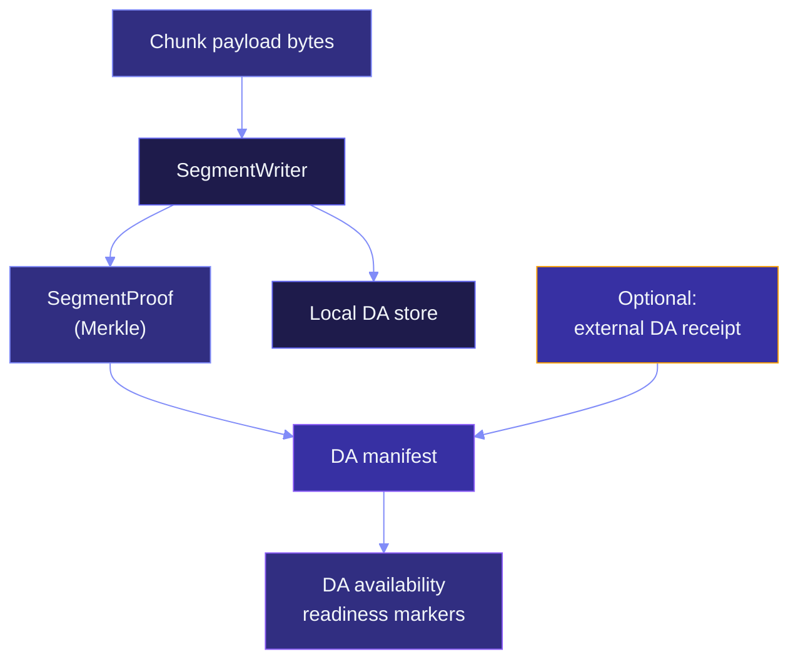

# State & data availability

`myelin-state` owns two things: the **live Cell set** (with its
commitment) and the **data availability** evidence that lets
external parties prove the chunk payload was published somewhere
they can fetch.

This page covers both: how the state root is computed, and how the
DA manifest proves — or fails to prove — that the chunk payload is
available to a future court.

## The live Cell set

Myelin stores three sub-sets:

```text
live_cells      -> Cells currently spendable inside the session
consumed_cells  -> OutPoints that have been spent in this session
created_cells   -> Cells created in this session but not yet spent
```

The state root is a 32-byte commitment over `(live_cells,
consumed_cells, created_cells)` using a canonical encoding. The
encoding is Molecule-compatible, so the same commitment can be
re-derived from the same Cell set on any validator.



## State root invariants

Three invariants the executor and the CellDB uphold together:

1. **Determinism.** The state root after a CellTx depends only on
   the state root before, the CellTx, and the VM context. No
   wall-clock, no random, no host state.
2. **Replacement, not mutation.** Cells are consumed and created;
   nothing mutates in place.
3. **Witnesses are external.** A witness can change the state root
   transition (e.g. a signature) but the witness itself is not in
   the live Cell set.

These three rules are what makes a CKB-VM-style verifier able to
replay a Myelin chunk and arrive at the same state root.

## The CellDB's storage shape

CellDB keeps:

```text
LiveCell   { out_point, output, block_id, tx_id, created_at }
SpendRecord { out_point, spent_at, spent_by }
```

LiveCell records are addressed by `(tx_id, output_index)`. SpendRecord
records are addressed by the spent `OutPoint`. Together they form
the auditable history of the session.

The state root is a **Merkle Patricia-style** commitment over the
live set; concrete structure is the `CellDB` API's choice and is
documented in code.

## What the state root is *not*

- **Not the same as a CKB block header.** The block header has
  more fields (proposals, uncles, etc.); Myelin's block only
  commits to the state root and the data commitments.
- **Not the same as a transaction hash.** The state root commits
  to the *set* of live Cells, not to a single transaction.
- **Not a proof of validity.** A state root alone says "this is the
  current set"; the proof of validity comes from the
  `MyelinExecutionReport` and the projection report.

## Data availability — the second job

`myelin-state` also handles DA. After a chunk is committed, the
runtime seals its payload bytes into a local segment store and
emits a DA manifest.



A DA manifest carries:

```text
schema_version
session_id
chunk_index
payload_hash        -> hash of the chunk payload bytes
segment_root        -> Merkle root of the DA segment tree
segment_proof       -> proof that the chunk payload is in the tree
external_da_receipt -> optional, signed by the external DA provider
da_availability     -> testnet_beta_ready | production_ready | local_only
l1_da_published     -> false (unless explicitly published to L1)
```

## The three readiness levels

`da_availability` has three levels:

| Level | What it requires |
| --- | --- |
| `local_only` | The chunk payload is sealed in the local DA store. Default after `da-manifest` with `--storage-dir`. |
| `testnet_beta_ready` | Plus a provider-signed receipt that binds to the same payload hash and segment root, with `service_level >= "testnet"`. |
| `production_ready` | Plus a production SLA receipt: `service_level = "production"`, retention ≥ 30 days, HTTPS retrieval endpoint, audit-log commitment. |

> [!IMPORTANT]
> `l1_da_published = false` is the default. The DA manifest alone is
> *not* evidence that the L1 has seen the chunk. The
> `da-anchor-package` and submit paths are what changes that.

## Segment proofs

A `SegmentProof` is a Merkle proof that a payload hash is included in
a segment tree. The tree is built by `SegmentWriter`; the proof is
verified by `SegmentReader`.

```text
SegmentProof {
    payload_hash:  [u8; 32],
    segment_root:  [u8; 32],
    proof_steps:   Vec<ProofStep>,
}
```

The proof steps are the standard Merkle sibling list. A court
verifier can check the proof with just `payload_hash` and
`segment_root` — no need to fetch the full segment tree.

## Why DA matters for the court path

The future CKB court path needs the chunk payload to replay the
chunk. Without DA, the court has nothing to verify against — the
state-root transition alone isn't enough to *dispute* a chunk; you
need the chunk payload itself.

That's why the `da-anchor-package` step exists: it converts the
verified DA manifest into a deterministic CKB-compatible anchor
CellTx package, which can be submitted to CKB. With L1 publication
*and* a working court verifier, a disputing party can:

1. Fetch the chunk payload from the anchor CellTx on L1.
2. Replay the chunk in CKB-VM with the same script deps.
3. Compare the resulting state root to the one the committee
   finalised.

If they disagree, the court verdict is "slash." If they agree, the
verdict is "accept." This is the shape Myelin is building toward.

## Operational evidence

The state crate also produces operational artefacts that the
submission readiness step aggregates:

- `--operator-custody-policy` (`myelin-operator-custody-policy-v1`):
  hardware-backed keys, dual-control signing, rotation drills,
  signing threshold.
- `--operator-runbook` (`myelin-operator-runbook-v1`): confirmation
  depth, stability requery, bounded retries, monitoring cadence,
  escalation contact.

Both files are schema-checked and bound into the `operational_policy`
commitment. Without them, `end_to_end_production_ready` stays
`false` even if everything else passes.

## Where to look next

- [L1 / L2 / off-chain interactions](../interactions/l1-l2-offchain.md)
  — the bigger picture that DA sits inside.
- [Data availability flow](../interactions/da-flow.md) — the
  step-by-step DA path.
- [Submission flow](../interactions/submission-flow.md) — how DA
  evidence reaches L1.