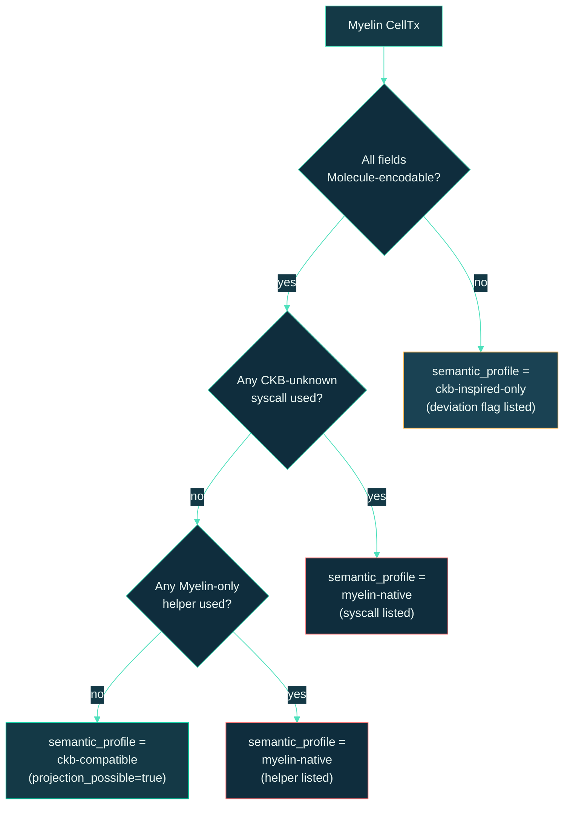

# Semantic profiles

A **semantic profile** is Myelin's honest label for *what a
transition means*. It tells the reader — and the projection layer —
whether the transition can be represented as a CKB-style transaction
without losing semantics.

The profile lives on every `MyelinExecutionReport` and
`CkbProjectionReport`. It is the field that prevents a Myelin demo
from over-claiming.

## The three profiles

```text
myelin-native        -> Myelin-only helper syscalls or metadata
ckb-compatible       -> projectable into a CKB-style transaction/context
ckb-inspired-only    -> follows the Cell model but has unsupported projection flags
```

### `ckb-compatible` — the default for public demos

A CellTx is `ckb-compatible` when *every* consumed Cell, produced
Cell, dep, witness, script group, and VM syscall can be encoded in a
CKB-style context **without changing semantics**.

The projection report for such a CellTx will have:

```json
{
  "projection_possible": true,
  "ckb_style_tx_hash":   "0x...",
  "unsupported_features": [],
  "semantic_deviation_flags": []
}
```

Public demos should default to this profile. If a demo can't produce
`projection_possible: true`, it isn't a CKB-isomorphism demo — it's
an experimental Myelin runtime demo, and the labels should reflect
that.

### `myelin-native` — engineering experiments

A CellTx is `myelin-native` when it relies on Myelin-only helper
syscalls or metadata that don't have a CKB-side equivalent. This is
fine for engineering experiments — and useful when Myelin is being
used as a generic finite-Cell ledger, not as a CKB-aligned session.

The projection report for such a CellTx will list every
Myelin-only syscall in `unsupported_features`. Public demos should
**not** default to this profile when claiming CKB-alignment.

### `ckb-inspired-only` — explicit deviation

A CellTx is `ckb-inspired-only` when it follows the Cell model
correctly but has a concrete feature that can't be projected onto CKB
today. The projection report lists the explicit deviation flags.

This profile is **not** a marketing profile. It is a label that says
"this transition is Cell-shaped, but if you tried to project it to
CKB, here's exactly what would break."

## How the profile is decided

The projection layer checks every field of the CellTx and every
syscall the chunk made against the CKB Molecule transaction layout
and the CKB-VM syscall surface:



## How the profile changes a Myelin claim

| Profile | Claim the runtime can make | What the reader sees |
| --- | --- | --- |
| `ckb-compatible` | "This transition is projectable into a CKB-style transaction/context." | `projection_possible: true`, empty deviation list. |
| `myelin-native` | "This transition ran in Myelin's deterministic VM. CKB projection is not currently possible." | `projection_possible: false`, list of Myelin-only syscalls/helpers. |
| `ckb-inspired-only` | "This transition is Cell-shaped, but specific features cannot be projected today." | `projection_possible: false`, list of deviation flags. |

## Practical guidance

- **For public demos**: target `ckb-compatible`. If a demo can't
  reach it, either simplify the workload or be explicit that the
  demo is exercising Myelin-as-a-runtime, not Myelin-as-an-L2.
- **For internal benchmarks**: any profile is fine, but the profile
  must be visible in the report. Don't bury it.
- **For disputes**: the projection report itself is the evidence.
  Anyone re-running the projection should arrive at the same
  `ckb_style_tx_hash` and the same list of unsupported features.
  This is why Myelin uses canonical Molecule encoding — the hash is
  deterministic.

## What the profile is *not*

- It is not a "trust level." Trust comes from the finality engine and
  the court path, not the profile.
- It is not a measure of complexity. A complex game session can be
  `ckb-compatible`; a trivial balance transfer can be
  `myelin-native`.
- It is not a runtime version. The profile is computed per
  transition, not per Myelin release.

## Where the profile is computed

In code: `myelin-exec::projection::project_celltx` — for each
Myelin CellTx or chunk, it walks the inputs/outputs/deps/witnesses,
encodes them under the CKB Molecule layout, computes the CKB tx
hash, and emits the report. The CLI's `celltx simple-report` calls
this on a trivial CellTx; the Teeworlds paths call it on every
bounded chunk.

See [CKB-style projection](../architecture/projection.md) for the
full report shape and the implementation walk-through.