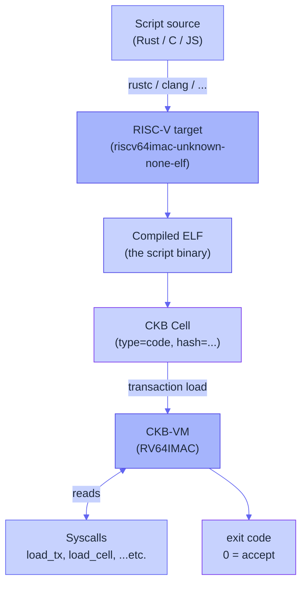

# What is CKB-VM?

CKB-VM is the virtual machine that runs every script on CKB. It is
**RISC-V-based**, deterministic, sandboxed, and has a small syscall
surface that scripts use to inspect the transaction they're
validating.

This page covers the architecture, the syscalls that matter for
Myelin, and the cycle accounting that gives CKB its predictable
resource model.

> [!NOTE]
> Material here follows the official
> [CKB-VM reference](https://docs.nervos.org/docs/ckb-fundamentals/ckb-vm)
> and the [VM Version History](https://docs.nervos.org/docs/script/vm-selection).

## RISC-V at the bottom

CKB-VM uses the [RISC-V](https://riscv.org/) instruction set. Concretely:

- The target is **RV64IMAC** (the standard 64-bit base + integer +
  multiply + atomic + compressed extensions), plus cryptographic
  extensions where the VM version enables them.
- Scripts can be compiled from any language that targets RISC-V —
  Rust, C, Go (with caveats), and JS via the JS-VM are all officially
  supported paths.
- The instruction set is mature, hardware-friendly, and has a stable
  ABI. CKB leans on RISC-V's modularity rather than inventing its
  own ISA.

## Determinism is the contract

CKB-VM is **deterministic** in the strong sense: the same script
binary, with the same input transaction and the same Cell deps,
produces the same exit code on every node on the network. That is
the only reason CKB can run *untrusted* code on the chain — every
node replays every script and they all have to agree.

What that means concretely:

- **No wall-clock access.** Scripts cannot read the block timestamp;
  time-dependent logic has to be parameterised.
- **No syscall for randomness.** Scripts can read chain-derived
  randomness (e.g. via the `current_epoch_hash` family), but not a
  free-running RNG.
- **No host IO.** Scripts cannot open files or sockets; the only
  inputs are the transaction, the loaded Cells, and the witnesses.
- **No floating-point uncertainty traps.** The VM flags
  non-deterministic FP usage so the network never disagrees.

Myelin carries this discipline off-chain. If a Myelin CellTx fails
the determinism check at admission time, it gets rejected before it
ever reaches the VM. See [Mempool & admission](../architecture/mempool.md).

## The syscall surface

Scripts don't read the transaction directly — they call **syscalls**.
The main ones:

| Syscall | What it returns |
| --- | --- |
| `load_transaction` | The Molecule-encoded transaction bytes (or sub-fields). |
| `load_script` | The script being currently executed (so a script can read its own `args`). |
| `load_script_hash` | Hash of the executing script. |
| `load_cell` / `load_cell_data` / `load_cell_by_field` | Live or dep Cell data, indexed by OutPoint or position. |
| `load_input_by_field` / `load_cell_by_field` | Specific fields of an input/output Cell. |
| `load_header` / `load_header_by_field` | Block headers (for header-dep transactions). |
| `exec` | Spawn a child Cell from a `cell_dep`, with isolation. |
| `spawn` / `pipe` | IPC between parent and child Cells. |
| `vm_version` | The active VM version (so a script can branch behaviour). |
| `current_cycles` | Read remaining cycle budget. |
| `debug_print` *(disabled in some VM versions)* | Optional logging. |

Myelin runs the same syscall surface for `semantic_profile =
"ckb-compatible"`. The Teeworlds replayer uses
`LOAD_TRANSACTION` against the Molecule-encoded transaction bytes and
reads witnesses from the witness slots.

## Cycle accounting

Every executed instruction costs a certain number of cycles. The VM
enforces a hard limit per script group, and a separate limit per
transaction. Scripts can read their remaining budget with
`current_cycles` and reject early if they're approaching the limit.

The key cycle numbers Myelin reports:

- `MyelinExecutionReport.cycles` — total cycles burned by the chunk
  or CellTx.
- VM version's per-script-group limit (depends on the network).
- VM version's per-transaction limit.

A Myelin CellTx that exceeds the per-tx limit is rejected before the
block is sealed. A chunk that runs into its budget mid-execution must
be split.

## VM versions

CKB has introduced several CKB-VM versions over time, each adding
performance, security fixes, or new RISC-V extensions. The current
network runs the latest VM version enabled by the active hard fork;
older versions remain valid for backward compatibility.

Myelin's `vm_profile` field reports which profile the chunk was
verified under — for example `ckb-strict-basic` is the conservative
profile that exercises only syscalls the CKB mainnet guarantees.
This is the profile every public Myelin demo should default to.

> [!TIP]
> See [VM Selection](https://docs.nervos.org/docs/script/vm-selection)
> for the official list of VM versions and the features each one
> enables.

## Why Myelin chose CKB-VM as its substrate

Three reasons:

1. **It is already proven at the L1.** Every existing CKB script
   that runs in production today already runs in CKB-VM. Myelin
   doesn't have to defend a new VM.
2. **The Cell-Model/Syscall pair matches Myelin's needs.** A Myelin
   chunk is a CellTx with Cell deps and witnesses; that's exactly
   the input shape CKB-VM is built around.
3. **The court path becomes trivial.** If a disputed chunk can be
   encoded as a CKB transaction with the right Cell deps, the
   existing CKB-VM verifier *is* the court. No new VM to audit.

## Further reading

- [CKB-VM official page](https://docs.nervos.org/docs/ckb-fundamentals/ckb-vm)
- [RFC: CKB-VM](https://github.com/nervosnetwork/rfcs)
- [Script intro](https://docs.nervos.org/docs/script/intro-to-script)
- [Rust script quick start](https://docs.nervos.org/docs/script/rust/rust-quick-start)
- [Debugging scripts](https://docs.nervos.org/docs/script/rust/rust-debug)