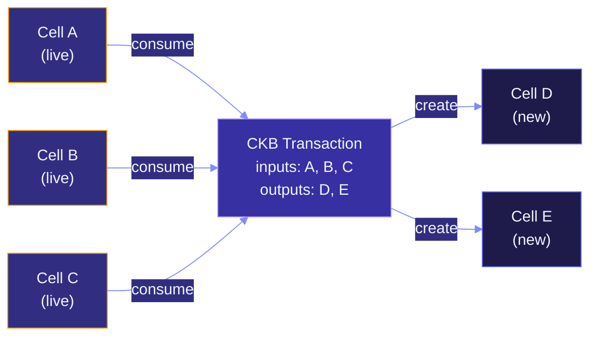

# What is CKB?

CKB is the base-layer proof-of-work blockchain of the Nervos network.
What makes it different from most L1s is its **state model**: instead
of accounts and contract storage, it uses **Cells**.

This page covers the Cell Model, the script system, and the parts of
CKB's design that Myelin inherits.

> [!NOTE]
> This page follows the official Nervos CKB documentation as its source
> of truth. See the [CKB documentation map](https://docs.nervos.org/llms.txt)
> and the [Cell Model reference](https://docs.nervos.org/docs/ckb-fundamentals/cell-model)
> for primary material.

## The Cell Model

A **Cell** is the atomic unit of state. It is not an account, and it
is not a smart-contract storage slot. It is closer to a UTXO, but it
can carry arbitrary data and run scripts.

A Cell has four fields:

```text
Cell {
    capacity:  u64,                // storage + value budget (in shannons)
    data:      bytes,              // arbitrary user data
    lock:      Script,             // controls who can spend it
    type_:     Option<Script>,     // optional: enforces state rules
}
```

The `capacity` field is interesting: it is *both* the value locked in
the Cell and the storage budget. You must reserve enough capacity to
cover the on-chain storage cost of `data` plus the cost of `lock` and
`type` scripts.

## Transactions consume and create Cells

State changes happen by **replacing** Cells. A CKB transaction:

1. Lists `inputs` — OutPoints pointing to live Cells to consume.
2. Lists `outputs` — new Cell definitions to create.
3. Carries `cell_deps` — references to code Cells and dep groups.
4. Carries `witnesses` — off-chain provided data (signatures, args).



After the transaction is committed:

- A, B, C are **dead** (spent).
- D, E are **live** (newly created).
- There is no "in-place" state mutation; the world simply moved on.

## Lock scripts vs type scripts

Two kinds of scripts can run on a Cell:

| Script | When it runs | What it checks |
| --- | --- | --- |
| **Lock script** | When the Cell is consumed (spent) | "Is this transaction authorised to spend this Cell?" — typically signature verification. |
| **Type script** | When the transaction is committed, for every output Cell whose `type` matches | "Does this Cell's data obey the schema defined by this script?" |

So a Cell with a `lock` but no `type` is a plain owned value/data Cell.
A Cell with both is a **typed Cell**: the type script enforces rules
across the *set* of Cells sharing that type, e.g. an xUDT Cell whose
balance and total supply are validated together.

> [!TIP]
> Myelin inherits this distinction directly. Its scheduler and
> projection layer treat lock and type scripts as first-class, and
> each chunk's CellTx can carry both kinds.

## Molecule serialization

CKB uses [Molecule](https://github.com/nervosnetwork/molecule) for all
on-chain serialization. Molecule is a schemaless, deterministic,
zero-copy binary format tied to a schema definition language.

Myelin uses the same format. Specifically:

- `OutPoint`, `Script`, `CellInput`, `CellOutput`, `CellDep`, and
  `CellTx` use CKB Molecule payload layouts.
- `VersionedEnvelope` is a Molecule-compatible table.
- The `LOAD_TRANSACTION` syscall uses Molecule transaction bytes.

> [!IMPORTANT]
> This is **not** a stylistic choice — it's the only way Myelin can
> produce a CellTx hash that equals the CKB transaction hash for the
> same bytes. That equality is what makes single-chunk court
> verification possible.

## Why CKB doesn't have an account model

An account model says "this address has this balance, and this
contract has this storage." A Cell model says "these live Cells exist
right now; this transaction replaces some of them."

The Cell model is structurally better for:

- **Parallel execution** — independent Cell groups can be verified in
  parallel because they don't share mutable storage.
- **Explicit dependencies** — every read and every write is named
  up-front in the transaction, not implicit in storage access patterns.
- **Native typed assets** — xUDT, Spore, and any user-defined asset
  are just Cells with a type script.

Myelin keeps all three properties off-chain.

## What Myelin takes from CKB

| CKB concept | Myelin equivalent |
| --- | --- |
| Cell | `MyelinCellState.live_cells` / `created_cells` |
| Transaction | `CellTx` (Molecule-encoded) |
| Block | `MyelinBlock` with state-root-before/after |
| Lock script | Script group in CellTx |
| Type script | Script group in CellTx |
| Witness | `CellTx.witnesses[]` |
| Cell dep | `CellTx.cell_deps[]` |
| Block hash | Deterministic canonical hash over header + commitments |
| Finality | Nakamoto PoW on L1, but Myelin uses static committee / Tendermint |

Myelin does **not** take: the PoW consensus, the RPC API, the node
software, the address format, or the wallet format. Those are L1
concerns. Myelin only needs the parts that make off-chain Cell
execution projectable to a CKB-VM-style verifier on the L1.

## Further reading

- [CKB documentation map](https://docs.nervos.org/llms.txt)
- [Cell Model reference](https://docs.nervos.org/docs/ckb-fundamentals/cell-model)
- [Cell structure](https://docs.nervos.org/docs/tech-explanation/cell)
- [Transaction structure](https://docs.nervos.org/docs/tech-explanation/transaction)
- [Lock script](https://docs.nervos.org/docs/tech-explanation/lock-script)
- [Type script](https://docs.nervos.org/docs/tech-explanation/type-script)