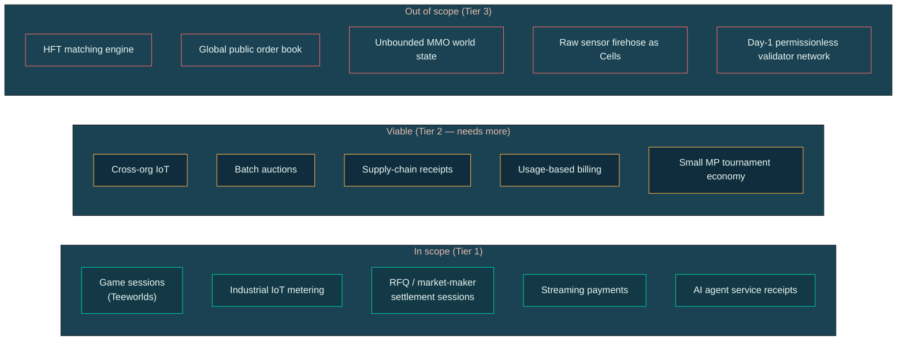

# What is Myelin?

Myelin is an experimental **CKB-isomorphic session runtime** for
finite Cell execution. It runs high-throughput Cell transitions
off-chain, keeps them finite and typed, and emits evidence that can
be projected toward CKB-style transaction contexts — with a future
court path that lets a single disputed chunk be adjudicated by a
CKB-VM-style verifier on the L1.

This page explains the positioning, what Myelin deliberately is not,
and the claim ladder that any Myelin evidence has to climb.

## The short version

```text
Myelin is a CKB-style isomorphic session runtime: a finite off-chain
Cell ledger with typed conflict scheduling, deterministic VM
verification, and a future CKB-style court path for disputed chunks.
```

A more careful wording for public demos:

```text
Myelin currently uses selectable closed-validator finality for session
benchmarking and pressure testing. The CKB-style projection and future
court path is what keeps it aligned with CKB semantics.
```

Both phrasings matter. The first is what Myelin **aims** to be; the
second is what it **is** today.

## What Myelin is

| Property | What it means in Myelin |
| --- | --- |
| **CKB-isomorphic** | Same Cell mental model, same Molecule encoding, same syscall surface. |
| **Finite Cell session** | State is a finite set of Cells inside one session; no unbounded global state. |
| **Typed conflict scheduling** | CellDAG scheduler uses typed conflict hashes + read/write domains, not fee markets. |
| **Deterministic CKB-VM verification** | Scripts run in a RISC-V-based VM with the same determinism contract as CKB. |
| **Selectable finality** | Static closed committee *or* Tendermint-style weighted precommit, chosen per session. |
| **CKB-style projection** | Every chunk ships a `CkbProjectionReport` showing whether it's projectable. |
| **Single-chunk court path** | One disputed chunk is CKB-VM-verifiable on the L1; interactive bisection is a fallback. |
| **Reference workload** | The Teeworlds-on-CKB replayer is the canonical pressure test. |

## What Myelin is *not*

These are claims about the design, not missing benchmarks — the
protocol surface makes them structurally out of scope:

- **Not a CKB full-node fork.** Myelin does not import or sync the
  CKB client. It re-implements the parts of CKB it needs (Cell,
  CellTx, VM, syscalls) in its own workspace.
- **Not a new L1.** Myelin does not run its own consensus on a
  independent network. Finality is a closed committee or Tendermint
  BFT — explicitly not Nakamoto PoW.
- **Not a permissionless L2 today.** The static-committee and
  Tendermint engines both assume a known validator set. Until the
  L1 court path is implemented *and* exercised, Myelin should not be
  marketed as permissionless L2 security.
- **Not a general smart-contract platform.** Myelin optimises for
  bounded sessions that produce challengeable settlement artefacts,
  not for arbitrary on-chain dApps.
- **Not a microsecond matching engine.** Sub-millisecond matching,
  FPGA paths, and global public order books are outside the design.

The full positioning case (with use-case tiers) lives in the upstream
`MYELIN_USE_CASE_POSITIONING.md`. The TL;DR:



## The claim ladder

Every Myelin artefact has to climb a four-tier claim ladder. The
ladder is deliberate: each tier requires a specific report to exist
and to verify.

```text
no projection report      -> designed to stay close to CKB semantics
successful projection     -> projectable into a CKB-style transaction/context
court bundle              -> executable disputed-chunk input shape
future exercised court    -> CKB-aligned adjudication path
```

Read [Claim ladder](../security/claim-ladder.md) for the exact
artifacts that establish each tier and what would have to be true
for Myelin to advertise a higher one.

## How Myelin compares to other L2 patterns

| Dimension | Optimistic rollup | ZK rollup | Sidechain | **Myelin (today)** | **Myelin (target)** |
| --- | --- | --- | --- | --- | --- |
| Validity model | Fraud proof | Validity proof | Independent consensus | Closed committee | Single-chunk CKB court |
| Dispute granularity | Instruction-level bisection | Per-tx validity | N/A | Whole chunk | Whole chunk |
| Asset custody | L1 bridge | L1 bridge | L1 bridge | L1 Cell lock + commit | Same |
| Finality | L1 finality + challenge period | L1 finality + proof time | Sidechain finality | Committee certificate | Court-verified |
| CKB-style projection | N/A (EVM-shaped) | N/A (EVM-shaped) | Optional | Yes, every chunk | Yes |
| Open permissionless | Yes | Yes | Yes | No | Planned |

Myelin optimises for *bounded, challengeable* settlement artifacts,
not for global public ordering. If your problem is "I need to settle
10k game sessions per second and challenge a disputed frame on CKB
later," Myelin is structurally appropriate. If your problem is "I
need a global order book with permissionless validators," it isn't.

## A note on maturity

Myelin's current evidence boundary is honest about what is and isn't
proven:

- ✅ A simple CellTx runs through Myelin's CKB-strict VM path and
  produces a CKB projection report with no deviation flags.
- ✅ The Teeworlds replayer binary runs end-to-end through the VM
  probe.
- ✅ Both finality engines (static committee, Tendermint) produce the
  same session ID, CellTx commitments, scheduler commitment, and
  state roots on a single-validator or quorum-validator fixture.
- ✅ The CKB devnet smoke test deploys DA-anchor and settlement
  CellScript carrier verifiers and proves live type-script execution
  on the parent CKB devnet.
- ⚠ The single-chunk CKB court verifier is *not yet implemented* on
  mainnet — the bundle is a self-contained, deterministic input
  ready for one.
- ⚠ Permissionless validator entry is not part of the current
  design.

That boundary is explicit on purpose. See
[Evidence paths](../security/evidence-paths.md) for the full inventory.