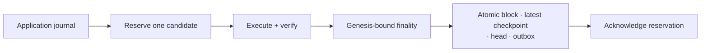

# What is Myelin?

Myelin is an experimental, CKB-aligned runtime for finite off-chain Cell
sessions. It executes version-0 Cell transactions, resolves conflicts from
authenticated Cell state, verifies script groups in CKB-VM, and commits an
ordered session history under a configured closed-validator module.

It is not a CKB full node, a new L1, or a finished permissionless L2.
Myelin-finalised means that the operators fixed in session genesis accepted and
durably stored one exact block. It does not mean finalised on CKB.

## The short version

```text
application transactions
  -> one bounded candidate
  -> CKB-VM verification and atomic state transition
  -> genesis-bound closed-validator finality
  -> durable block, latest checkpoint, head, and outbox
  -> optional CKB evidence stages for the exact transaction
```

## What the runtime provides

| Property | What it means |
| --- | --- |
| Finite Cell state | Each transition consumes and creates concrete Cells under an exact pre-state root. |
| Raw and witness identity | Producer OutPoints and block ordering use raw txid; witnesses affect wtxid. |
| State-resolved conflicts | The scheduler derives logical conflict hashes from authenticated Cells and validated type-script declarations. |
| CKB-VM verification | Session and court paths use `CkbStrict`; script groups have separate VM instances and one shared transaction cycle budget. |
| Atomic state change | A stale pre-root, failed script, double spend, or failed descendant leaves the state unchanged. |
| Closed-validator finality | Genesis selects static committee, rotating PoA, or Tendermint from a compiled catalogue. |
| Continuous production | `Instant`, `Interval`, lazy `Open`, and `Never` close bounded batches; one candidate runs at a time. |
| Durable recovery | RocksDB restores the latest checkpoint and audits the finalised block-and-proof chain before reopening writes. |
| Staged CKB evidence | Canonical wire encoding is the first stage; higher claims require linked adapter receipts. |

## Finite work, continuous service

An application can run for years without creating one endless execution. It
journals work in finite epochs and lets the producer reserve one bounded batch
from the current durable head.


```mermaid
flowchart LR
    J["Application journal"] --> P["Reserve one candidate"]
    P --> V["Execute + verify"]
    V --> F["Genesis-bound finality"]
    F --> C["Atomic block · latest checkpoint<br/>· head · outbox"]
    C --> A["Acknowledge reservation"]
```

The next candidate waits for the previous commit. Myelin does not build
speculative descendants or rebase a candidate chain. A failed commit or orderly
shutdown releases the reservation. Source acknowledgement follows the durable
head advance and has its own reconciliation path.

On restart, Myelin streams and audits parent hashes, heights, state roots,
timestamps, module commitments, and finality proofs. It restores the latest
checkpoint, checks the restored root against the durable head, and then opens
the writer. Ordinary recovery does not re-execute every historical transaction;
full replay is a future deep-audit mode.

## What “CKB-aligned” permits Myelin to claim

The pure projector produces canonical CKB Molecule bytes and the CKB raw
transaction hash. That earns the `wire-encoded` stage only.

```text
wire-encoded
  -> context-resolved
  -> consensus-validated
  -> scripts-verified
  -> node-accepted
  -> committed
  -> configured-depth finality
```

Each arrow requires a linked `myelin-ckb-adapter` receipt for the exact
transaction. Node acceptance is not commitment. A configured confirmation
depth is operational evidence, not irreversible finality. A devnet exercise is
not a public-testnet court verdict.

## What Myelin does not provide

- No CKB node sync, mempool, mining, or Nakamoto consensus.
- No open validator admission or permissionless finality.
- No hot-swapping the finality module inside a session.
- No deployed L1 court or finished dispute economics.
- No guarantee that every application event belongs in a Cell transaction.
- No application-specific game, market, IoT, or asset vocabulary in the core.

Application adapters decide which events to journal and how to interpret them.
The Myelin core receives ordered Cell transactions and enforces execution,
state, finality, storage, and evidence rules.

## Current evidence boundary

The workspace tests typed Cell execution, physical and logical conflict rules,
atomic state roots, all three closed-validator modules, producer policies,
checkpoint recovery, outbox handling, and the staged CKB receipt chain. Parent
CKB devnet and public-testnet rehearsals support only the exact transactions and
receipt stages recorded in their evidence bundles.

Read next:

- [Session lifecycle](../interactions/session-flow.md)
- [Closed-validator finality](../architecture/consensus.md)
- [Claim ladder](../security/claim-ladder.md)
- [CKB evidence paths](../security/evidence-paths.md)
