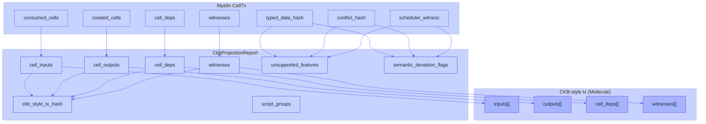

# Anatomy of a Myelin CellTx

A Myelin CellTx is the unit of state change. It is structurally a CKB
transaction, with extra Myelin-side metadata attached so the scheduler
and consensus layers can reason about it deterministically. This page
walks through what each field does and why Myelin needs its own copy
of some of them.

## The shape

```rust
pub struct MyelinCellState {
    pub live_cells:     Vec<LiveCell>,
    pub consumed_cells: Vec<OutPoint>,
    pub created_cells:  Vec<CellOutput>,
    pub cell_deps:      Vec<CellDep>,
    pub context_deps:   Vec<ContextDep>,
    pub witnesses:      Vec<Vec<u8>>,
    pub state_root:     [u8; 32],
}
```

A Myelin CellTx is the transition from `state_root_before` to
`state_root_after`, with everything above as the witness for the
transition. There is no global mutable state outside this Cell set —
that is the entire point of staying close to CKB.

## The CKB side

These fields are exactly the CKB transaction shape. They live in
`myelin-exec` and are encoded using Molecule-compatible tables:

| Field | CKB equivalent | What it carries |
| --- | --- | --- |
| `consumed_cells` | `inputs[].previous_output` | OutPoints referencing live Cells. |
| `created_cells` | `outputs[]` | New `CellOutput { capacity, lock, type, data }`. |
| `cell_deps` | `cell_deps[]` | Code Cells or dep-group Cells. |
| `witnesses` | `witnesses[]` | Signatures, arguments, off-chain data slots. |

> [!NOTE]
> Myelin does **not** reuse the CKB client's wire format — it uses the
> same **shape**, the same **semantics**, and the same **Molecule**
> encoding so a projection layer can wrap it as a CKB tx.

## The Myelin side

These fields are what make a CellTx *admittable* on Myelin without
trusting the producer:

| Field | Why Myelin needs it |
| --- | --- |
| `context_deps` | Session-scoped dependencies that aren't necessarily CKB `cell_deps`. |
| `state_root` | The local 32-byte commitment used to anchor the transition into a block. |
| `semantic_profile` | `ckb-compatible` / `myelin-native` / `ckb-inspired-only` — drives projection decisions. |
| `typed_data_hash` | Hash of `CellOutput.data` under the declared `type` schema. |
| `conflict_hash` | Hash of `(read_set, write_set, conflict_domains)`. |
| `scheduler_witness` | Canonical witness over the CellTx + metadata; required for admission. |
| `proof_obligations` | Things the verifier must check on replay (cycle limits, dep presence, etc.). |

The scheduler rejects CellTxs whose `typed_data_hash` doesn't match the
actual output data, whose `conflict_hash` doesn't cover the declared
read/write sets, or whose `scheduler_witness` is malformed. See
[CellDAG scheduler](../architecture/scheduler.md) for the rejection
taxonomy.

## Projection — what it actually does

A projection takes a Myelin CellTx and answers: *"Could this be
represented as a CKB transaction without changing semantics?"* The
output is a `CkbProjectionReport`:

```rust
pub struct CkbProjectionReport {
    pub projection_possible: bool,
    pub ckb_style_tx_hash:   Option<[u8; 32]>,
    pub cell_inputs:         Vec<OutPoint>,
    pub cell_outputs:        Vec<CellOutput>,
    pub cell_deps:           Vec<CellDep>,
    pub witnesses:           Vec<Vec<u8>>,
    pub script_groups:       Vec<ScriptGroup>,
    pub unsupported_features:          Vec<String>,
    pub semantic_deviation_flags:     Vec<String>,
}
```

`projection_possible: true` means every consumed Cell, produced Cell,
dep, witness, script group, and VM syscall in the Myelin CellTx can be
encoded in a CKB-style context **without losing semantics**. If it's
`false`, the report explicitly lists what couldn't be projected.



The projection layer is the credibility hinge: every serious demo
should pair the execution report with the projection report, so the
reader can see whether the CellTx is genuinely CKB-projectable or
explicitly carries deviation flags.

## Why both layers exist

If Myelin only produced execution reports, every claim about
"CKB-alignment" would be hand-waved. If Myelin only produced
projection reports, there'd be nothing to *run* off-chain. Keeping
both means:

- the **execution report** answers *"did the VM accept this?"*
- the **projection report** answers *"can this be replayed on CKB
  without changing meaning?"*

The two together produce the evidence Myelin's claim ladder is built
on. See [Claim ladder](../security/claim-ladder.md).

## What's not in a CellTx

A CellTx is deliberately small. It does **not** contain:

- The full Cell set — only the consumed and created Cells.
- Block headers — only the state root, which is enough to anchor it
  into a block.
- Validator signatures — those go on the **block certificate**, not
  on the individual CellTx.
- DA chunks — those go on the **DA manifest**, addressed by the chunk
  payload hash.

This keeps the CellTx itself small enough to fit inside a court bundle
and verifiable in a CKB-VM-style court verifier without breaking the
VM cycle budget.