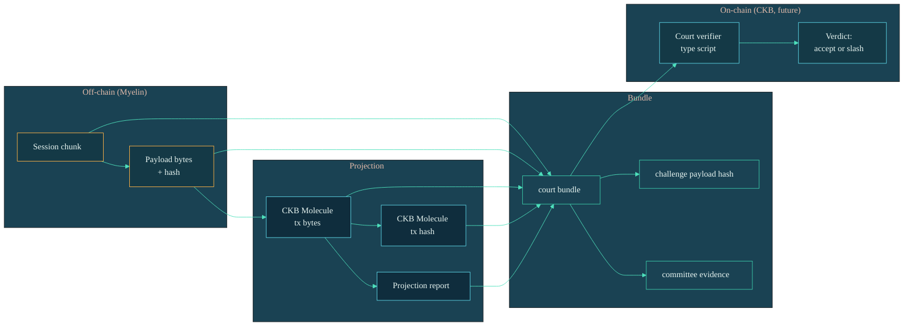

# First run

This page walks the shortest end-to-end path through Myelin: compile a
CellScript, build a CellTx, verify it, project it, finalise a block,
emit evidence. The whole sequence should take a few minutes on a modern
laptop.

## What you'll produce

By the end of this page, you'll have produced, on disk:

| Artefact | Where | What it proves |
| --- | --- | --- |
| `simple-report.json` | `reports/` | A Myelin CellTx → execution report with a CKB projection report attached. |
| `session-open.json` | `reports/` | A static-committee session open fixture with deterministic block hash. |
| `session-commit.json` | `reports/` | The same session, finalised by a committee certificate. |
| `session-court-bundle.json` | `reports/` | One disputed chunk packaged as a self-contained CKB court-input bundle. |
| `session-da-manifest.json` | `reports/` | A DA manifest with a Merkle `SegmentProof` for the chunk payload. |

Every one of these files is a JSON report with explicit
`semantic_profile`, `ckb_projection_possible`, and (where relevant)
`l1_court_implemented` flags. You can grep for those flags to see the
*actual* claim level each artefact carries.

## Step 1 — A trivial CellTx report

```bash
cargo run -p myelin-cli -- celltx simple-report
```

You'll get a JSON report like:

```json
{
  "semantic_profile": "ckb-compatible",
  "ckb_projection_possible": true,
  "execution": {
    "accepted": true,
    "vm_exit_code": 0,
    "cycles": 1527,
    "consumed_cells": ["0x...outpoint..."],
    "created_cells":  ["0x...new cell..."],
    "state_root_before": "0x0000...0000",
    "state_root_after":  "0x9c1a...e2f4"
  },
  "projection": {
    "projection_possible": true,
    "ckb_style_tx_hash": "0x...deterministic CKB tx hash...",
    "cell_inputs":  ["..."],
    "cell_outputs": ["..."],
    "cell_deps":    ["..."],
    "witnesses":    ["..."],
    "unsupported_features": [],
    "semantic_deviation_flags": []
  }
}
```

> [!NOTE]
> `unsupported_features: []` and `semantic_deviation_flags: []` are the
> evidence that this CellTx is projectable into a CKB-style
> transaction/context **without** losing semantics.

## Step 2 — Open a session

```bash
cargo run -p myelin-cli -- session open-fixture \
  --consensus static-closed-committee \
  --out reports/session-open.json
```

This:

1. Generates a deterministic session ID from the config.
2. Commits to the initial state root (`state_root_before`).
3. Emits a `MyelinBlock` candidate with a canonical header hash.

## Step 3 — Commit a chunk and finalise the block

```bash
cargo run -p myelin-cli -- session commit-fixture \
  --session reports/session-open.json \
  --out reports/session-commit.json
```

This produces a `MyelinBlock` with a static-committee certificate that
matches the same `block_hash` the open fixture advertised. The
certificate carries quorum signatures from the configured validators.

To use Tendermint-style finality instead, pass
`--consensus tendermint` to both `open-fixture` and `commit-fixture`.
The block hash and CellTx commitments stay identical — only the
certificate shape changes.

## Step 4 — Build a court bundle

```bash
cargo run -p myelin-cli -- session court-bundle \
  --session reports/session-commit.json \
  --chunk-index 0 \
  --out reports/session-court-bundle.json

cargo run -p myelin-cli -- session verify-court-bundle \
  --bundle reports/session-court-bundle.json \
  --out reports/session-court-verify.json
```

The `court-bundle` artefact is a self-contained input to the future CKB
court path:



The verify command recomputes every hash in the bundle from its
embedded bytes — payload, Molecule tx, projection, challenge payload,
signatures — and asserts the committee certificate carries quorum
weight. If `valid: true`, you have a self-contained, deterministic
input that a CKB-VM court verifier *could* consume.

## Step 5 — DA manifest

```bash
cargo run -p myelin-cli -- session da-manifest \
  --bundle reports/session-court-bundle.json \
  --storage-dir reports/session-da-store \
  --out reports/session-da-manifest.json

cargo run -p myelin-cli -- session verify-da-manifest \
  --manifest reports/session-da-manifest.json \
  --bundle reports/session-court-bundle.json \
  --storage-dir reports/session-da-store \
  --out reports/session-da-verify.json
```

The manifest emits a Merkle `SegmentProof` for the exact Molecule
transaction bytes the court needs to replay the chunk. With
`--storage-dir`, it seals the chunk into a local DA store; with
`--external-da-receipt <file>`, it can additionally bind a
provider-signed receipt.

> [!IMPORTANT]
> By default, this path keeps `l1_da_published = false`. It is
> **local-only DA evidence** unless a signed external receipt (with
> `service_level = "production"`, retention ≥ 30 days, HTTPS endpoint,
> audit-log commitment) is bound into the manifest.

## Where the production gate comes in

Once the steps above work, run the full local gate:

```bash
scripts/myelin_production_gate.sh
```

That script stitches together formatting, lint, workspace tests,
runtime smoke, **both** consensus engines' session paths, dependency
and stale-surface scans, and the Teeworlds acceptance gate. See
[Production gate](../operations/production-gate.md) for what it
actually exercises.