# Myelin

**A CKB-isomorphic session runtime for finite Cell execution.**

Myelin runs high-throughput Cell transitions off-chain, keeps them finite and
typed, and emits evidence that can be projected toward CKB-style transaction
contexts — with a future court path that lets a single disputed chunk be
adjudicated by a CKB-VM-style verifier on the L1.

[Get started :material-rocket-launch:](getting-started/index.md){ .md-button .md-button--primary }
[Read the architecture :material-graph-outline:](architecture/overview.md){ .md-button }
[GitHub :fontawesome-brands-github:](https://github.com/Myelin-Labs/Myelin){ .md-button }

-   :fontawesome-brands-github:{ .lg .middle } **Repository**

    ---

    [`Myelin-Labs/Myelin`](https://github.com/Myelin-Labs/Myelin) — source, issues, CI, releases.

-   :material-book-open-page-variant-outline:{ .lg .middle } **License**

    ---

    MIT. See [`LICENSE`](https://github.com/Myelin-Labs/Myelin/blob/main/LICENSE) for the full text.

-   :material-bug-outline:{ .lg .middle } **Report an issue**

    ---

    Found a bug or a docs error? [Open an issue](https://github.com/Myelin-Labs/Myelin/issues/new) — please include the page URL and the exact command / code that misbehaved.

-   :material-rocket-launch-outline:{ .lg .middle } **Deploy this site**

    ---

    This site auto-deploys to GitHub Pages from `main` via `.github/workflows/pages.yml`. Configure in **Settings → Pages → Source: GitHub Actions**.

## What Myelin actually is

Myelin is **not** a CKB full-node fork, **not** a new L1, and **not yet** a
finished permissionless L2. It is a *protocol seed* that keeps the execution,
state, evidence, and session-finality pieces needed to test the shape of an
off-chain Cell ledger that still respects CKB's mental model.

-   :material-cube-outline:{ .lg .middle } **Cell-native state**

    ---

    State is a finite Cell set. There is no global account store and no
    mutable contract storage hidden behind an address. Every transition
    consumes and creates Cells.

-   :material-cpu-64-bit:{ .lg .middle } **Deterministic CKB-VM execution**

    ---

    Scripts run in a RISC-V based VM (CKB-VM plus a small Myelin-only
    syscall extension), so the same binary produces the same state root on
    every validator.

-   :material-graph:{ .lg .middle } **Typed conflict scheduling**

    ---

    The CellDAG scheduler uses typed conflict hashes and read/write
    domains to admit transactions, parallelise independent ones, and
    reject anything that cannot be reasoned about statically.

-   :material-shield-check-outline:{ .lg .middle } **CKB-style projection**

    ---

    Every CellTx or chunk produces a projection report — either
    `ckb_projection_possible = true`, or an explicit list of unsupported
    features and semantic deviation flags.

-   :material-scale-balance:{ .lg .middle } **Single-chunk court path**

    ---

    One disputed chunk is CKB-VM-verifiable on the L1; interactive
    bisection is a fallback design, not the bootstrap assumption.

-   :material-gamepad-variant-outline:{ .lg .middle } **Reference workload**

    ---

    The first pressure workload is xxuejie's
    [Teeworlds-on-CKB](https://github.com/xxuejie/ckb-teeworlds-demo)
    replayer, which gives Myelin a real, deterministic, CKB-style game
    session to drive.

## How it relates to CKB

CKB is the **semantic reference** for Myelin. Same vocabulary (Cell, CellTx,
witness, dep group, script group), same execution environment (CKB-VM +
RISC-V), and the same projection layer at the boundary. The differences are
about **where** work happens, not **what** work means:

| Aspect | CKB (L1) | Myelin (off-chain session) |
| --- | --- | --- |
| Where state lives | Every full node | Finite session set |
| Block finality | Nakamoto PoW consensus | Selectable: static committee or Tendermint-style BFT |
| Throughput target | ~1 block / tens of seconds | Many chunks / second inside one session |
| Execution | CKB-VM, fully on-chain | CKB-VM-style, deterministic, off-chain |
| Dispute path | Replay on chain | Single-chunk court bundle → CKB-VM verifier on L1 |
| Asset custody | CKB Cells natively | Locked Cells at session open, settled on close |

## A first look at the runtime spine

```mermaid
%%{init: {
  "theme": "base",
  "themeVariables": {
    "primaryColor": "#EEF2FF",
    "primaryTextColor": "#1E293B",
    "primaryBorderColor": "#4F46E5",
    "lineColor": "#6366F1",
    "secondaryColor": "#E0E7FF",
    "tertiaryColor": "#C7D2FE",
    "fontFamily": "Inter, system-ui, sans-serif",
    "fontSize": "14px"
  },
  "flowchart": { "curve": "basis", "padding": 12 }
}}%%
flowchart LR
    A["CellScript source"]:::source
    B["typed-cell metadata<br/>+ VM artefact"]:::artefact
    C["CellTx<br/>(Myelin)"]:::tx
    D["CellDAG<br/>scheduler"]:::sched
    E["Deterministic<br/>VM verification"]:::vm
    F["Session Cell<br/>state root"]:::state
    G["Evidence bundle<br/>(projection, DA,<br/>court, settle)"]:::evidence

    A --> B --> C --> D --> E --> F --> G
    F --> C

    classDef source   fill:#EEF2FF,stroke:#4F46E5,color:#1E293B;
    classDef artefact fill:#E0E7FF,stroke:#6366F1,color:#1E293B;
    classDef tx       fill:#C7D2FE,stroke:#4F46E5,color:#1E293B;
    classDef sched    fill:#E0E7FF,stroke:#6366F1,color:#1E293B;
    classDef vm       fill:#EEF2FF,stroke:#4F46E5,color:#1E293B;
    classDef state    fill:#C7D2FE,stroke:#6366F1,color:#1E293B;
    classDef evidence fill:#E0E7FF,stroke:#7C3AED,color:#1E293B;
```

Every box on this spine is a real crate in the workspace — `cellscript`,
`myelin-exec`, `myelin-mempool`, `myelin-state`, `myelin-consensus`,
`myelin-cli`. The next pages break it apart.

## Where to go next

-   :material-book-open-variant: **New to Myelin?**

    ---

    Read [What is CKB?](concepts/what-is-ckb.md) and [What is Myelin?](concepts/what-is-myelin.md) first. They assume nothing.

-   :material-tools: **Want to run it?**

    ---

    Skip to [Install the toolchain](getting-started/install.md), then
    [First run](getting-started/first-run.md) for the shortest path to a
    CKB-projected CellTx report.

-   :material-graph-outline: **Want to understand the design?**

    ---

    The [System overview](architecture/overview.md) is the architectural
    truth of the project. Pair it with the [L1 / L2 / off-chain
    interactions](interactions/l1-l2-offchain.md) diagram.

-   :material-shield-alert-outline: **Skeptical about the security claim?**

    ---

    Read the [Claim ladder](security/claim-ladder.md) first. It is
    deliberately explicit about what is and isn't a permissionless
    guarantee today.

