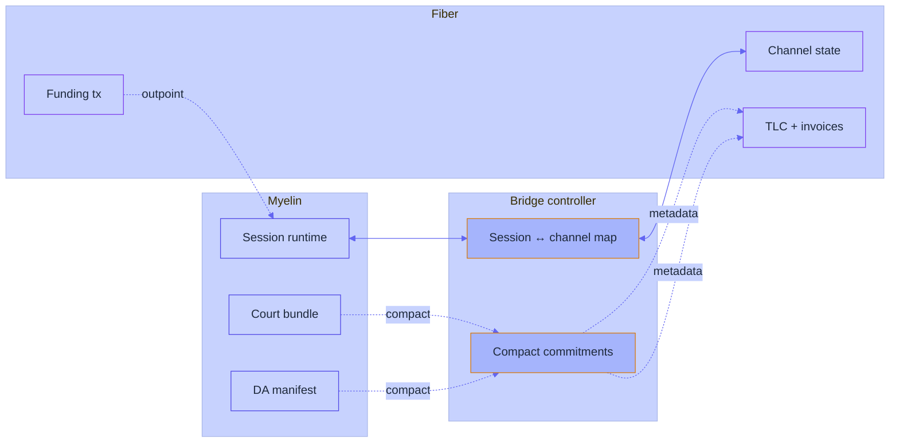
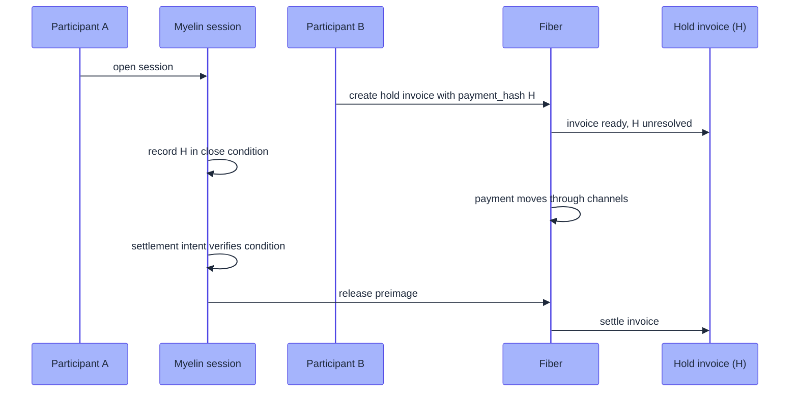

# Fiber Network bridge

[Fiber Network](https://github.com/nervosnetwork/fiber) is the
Nervos CKB payment-channel network. It's the natural off-chain
payment fabric for CKB assets, and it's the most concrete
integration target for Myelin because it speaks the same Cell
mental model and runs on the same VM.

This page covers the recommended bridge boundary between Myelin
sessions and Fiber channels — what works today, what's stubbed for
the future, and the design rules that keep the two systems from
leaking semantics into each other.

> [!NOTE]
> The Myelin-Fiber bridge is **not yet implemented** as a
> first-party crate. This page documents the design that the
> bridge should follow, derived from
> `docs/myelin-fiber-l2-bridge-plan.md`. The boundary is concrete
> enough that the bridge can be built today against existing
> Fiber RPCs.

## Why a bridge, not a merger

Two systems with very different jobs:

| Concern | Myelin | Fiber |
| --- | --- | --- |
| **State shape** | Finite Cell session set | Channel state + HTLCs |
| **Execution** | CKB-VM-style verifier for typed scripts | TLC (Time-Locked Contracts) with simpler execution |
| **Finality** | Static committee / Tendermint BFT | Off-chain channel updates, on-chain only on dispute |
| **Throughput target** | Many chunks/second inside one session | Many payments/second inside one channel |
| **Dispute path** | Single-chunk court bundle → CKB-VM verifier on L1 | Timelock + commitment + revocation on L1 |

Merging them would mean picking one finality model and one state
shape, and would compromise both. A bridge keeps each system
optimised for its own job.

## The recommended boundary

The boundary is a **standalone bridge controller** that:

```text
Myelin session runtime   <->   bridge controller   <->   Fiber node
```

The controller:

- Calls Myelin CLI/session APIs to produce deterministic session
  artefacts.
- Calls Fiber JSON-RPC APIs to open channels, submit funding
  transactions, create invoices, settle invoices, send payments.
- Maintains an explicit mapping between `session_id`, Fiber
  `channel_id`, Fiber channel outpoint, payment hash, payment
  preimage, DA root, and court bundle hash.
- Carries only compact Myelin commitments through Fiber payment
  metadata.
- Leaves full court bundles, DA payloads, and settlement packages
  in Myelin's artefact store or an external DA provider.



The bridge is the *only* component that knows about both systems.
Myelin never imports Fiber types; Fiber never imports Myelin types.

## Strongest hook: external funding

Fiber's external funding flow is the most concrete integration
hook. The expected flow:

```text
Myelin bridge controller
  -> Fiber open_channel_with_external_funding
  -> Fiber returns channel_id and final unsigned funding tx
  -> external wallet/signing policy fills witnesses only
  -> Fiber submit_signed_funding_tx
  -> bridge records channel_id and funding outpoint in Myelin session metadata
```

The critical rule:

> The signed Fiber funding transaction must preserve the raw
> transaction structure returned by Fiber. The signer may fill
> witnesses, but must not rebuild or modify inputs, outputs,
> outputs data, or cell deps.

Consequences:

- Myelin can reference a Fiber funding transaction or channel
  outpoint as an **escrow-like session input**.
- Myelin cannot replace Fiber's funding transaction with a
  Myelin-generated DA anchor or settlement transaction after
  Fiber has negotiated it.
- Any Myelin commitment that must be bound to a Fiber channel
  should be known before funding negotiation, or should be bound
  later through payment metadata, session reports, or a separate
  CKB carrier transaction.

## Payment-hash bridge

A second viable hook is a **shared payment hash or preimage**:

```text
participant A opens or joins a Myelin session
participant B creates a Fiber hold invoice with payment_hash H
Myelin session records H as part of the payment-bound close condition
Fiber payment moves through channels while H remains unresolved
Myelin settlement intent verifies the session-side condition
bridge releases the preimage to settle the Fiber invoice
```



This gives useful prototype-level atomicity between Myelin session
progress and Fiber payment settlement.

> [!WARNING]
> This is **not**, by itself, custody-grade trustlessness. The
> bridge can still become a policy and liveness dependency unless
> the preimage release and dispute path are later enforced by
> deployed CKB scripts.

## Expiry handling is mandatory

Fiber TLC expiries and Myelin challenge windows must be mapped
conservatively. The bridge must **never** release value on one
side after the other side's challenge or refund route has become
unsafe.

Concretely:

```text
challenge_window_ms < fiber_tlc_expiry_ms - safety_margin
```

A reasonable starting `safety_margin` is the round-trip time of a
dispute path on the slower side, plus the finality confirmation
depth on the CKB chain.

## Compact commitment metadata

Fiber payments can carry custom records. These records are
suitable for **compact** Myelin commitments — a 32-byte session
hash, a 32-byte DA root, a 32-byte court bundle hash — but **not**
full Myelin artefacts.

What goes through Fiber payment metadata:

```text
myelin_session_id      : [u8; 32]
myelin_da_root         : [u8; 32]   // optional
myelin_court_hash      : [u8; 32]   // optional
myelin_block_height    : u64        // optional
```

What **never** goes through Fiber:

- Full court bundles.
- Full DA payloads.
- Settlement packages.
- Committee certificates.

Those stay in Myelin's artefact store or an external DA provider.
The bridge only carries compact commitments over Fiber.

## Cross-chain hub precedent

Fiber already has a cross-chain hub precedent for binding payment
flows through a shared preimage and careful expiry budgeting.
That pattern is the model the Myelin bridge should follow.

## What the bridge is NOT

- **Not a custodian.** The bridge doesn't hold user funds; Fiber
  channels and Myelin locked Cells hold user funds.
- **Not a sequencer.** Myelin doesn't order payments; Fiber does.
- **Not a permissionless entry point.** The bridge today assumes
  both Myelin and Fiber are running with a known operator set.
- **Not a court.** The bridge doesn't adjudicate disputes; the
  CKB court verifier (future) does.

## Open questions

- **How does the bridge handle committee rotation?** A static
  committee change in Myelin shouldn't strand open Fiber
  channels.
- **What happens when a Fiber channel closes mid-session?** The
  bridge should map the channel-close event to a Myelin
  settlement-intent kind.
- **How are fees denominated?** Today, Myelin fees are
  capacity-based; Fiber fees are off-chain. The bridge needs a
  clear policy for translating.

These are real questions for any future implementation.

## Where to go next

- [Session lifecycle](../interactions/session-flow.md) — what a
  Myelin session actually is.
- [Data availability flow](../interactions/da-flow.md) — what
  stays off-chain and what gets published.
- [Pattern: streaming payments](../patterns/streaming-payments.md) —
  the most natural Fiber + Myelin use case.