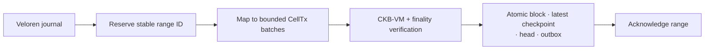
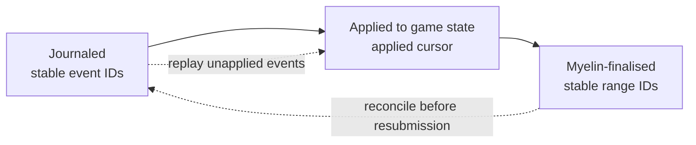

# Veloren research fork

Veloren is an open-source multiplayer voxel RPG written in Rust. Its persistent
world, inventory changes, uneven event rate, and multiplayer server make it a
useful workload for continuous Myelin sessions. Rust-to-Rust integration avoids
an FFI layer, and direct access to the server source permits durable journal and
crash-recovery instrumentation.

> [!IMPORTANT]
> This integration lives in an
> [independent research fork](https://git.avato.online/arthur/veloren). It is
> not affiliated with or endorsed by the upstream Veloren project. Upstream
> [does not want association with cryptocurrency or NFTs](https://veloren.net/joinus/).

## What the adapter records

The fork selects authoritative events with durable game meaning, including
important inventory and asset changes. Movement, render frames, physics ticks,
and other transient activity stay on the normal game path.

The adapter owns:

- event selection and canonical game-event encoding;
- stable event and sequence-range IDs;
- the journaled and game-applied cursors;
- mapping events into ordered Cell transactions;
- wallet UX and any game-specific asset rules.

Myelin never parses hit, tick, inventory, character, equipment, or other
Veloren-specific types.

## Production profile

The current profile uses lazy `Open` production:

```text
first event       -> open a 100 ms window
1,024 events      -> close early at the application event cap
idle application  -> no window and no empty block
```

At closure, the adapter reserves one stable sequence range. The bridge may
split that range into several CellTx blocks, but Myelin prepares one candidate
at a time from the durable head. The next candidate waits for the previous
proof verification and atomic commit.



## Crash recovery

The bridge tracks three positions:



Two crash windows need different repairs:

1. **Journal append succeeded; game mutation did not.** Recovery replays the
   journaled-but-unapplied events in order and deduplicates them by stable event
   ID.
2. **Myelin commit succeeded; the local finalised cursor did not advance.**
   Recovery reads the durable Myelin head, matches the committed range ID,
   advances the local cursor, and does not resubmit the range.

The game loop does not wait for finality. The application journal may queue
completed epochs up to a configured backlog cap; Myelin still processes one
candidate at a time. When the backlog cap is reached, the application has to
pause economic effects, continue without them, or stop the session according to
its own policy.

## Ownership by layer

| Layer | Scope |
| --- | --- |
| Veloren-derived fork | game events, inventories, equipment, and player-facing mechanics |
| Spore/DOB integration | persistent object identity, ownership, and asset representation |
| Myelin | ordered execution, state history, closed-validator finality, durable recovery |
| Fiber / CKB contracts | payment, escrow, and enforceable settlement |

Spore/DOB-backed equipment would be an application integration. It is not a
Myelin core feature.

## Possible follow-up work

The independent fork may explore Spore/DOB-backed game objects, tokenised
equipment, and NFTs. Application contracts could cover equipment rental,
collateralised borrowing, marketplace escrow, revenue-sharing for crafted
items, or conditional transfer after an in-game milestone.

These ideas do not change the Myelin protocol. The fork defines the game and
asset rules; Myelin orders and verifies finite Cell transitions; Fiber or CKB
contracts handle payment and enforceable settlement.

For the general runtime sequence, see [Session lifecycle](../interactions/session-flow.md).
For the longer engineering narrative, see
[From bounded sessions to continuous operation](../releases/nervos-talk-pluggable-session-chain.md).
