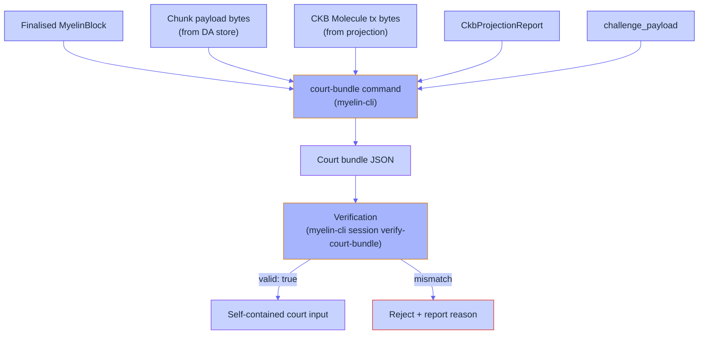
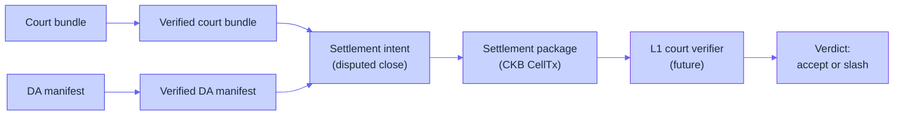

# Court path

The court path is the part of Myelin that turns a finalised Myelin
block into an **adjudicable artefact**. When a participant disputes
a chunk, the dispute package is a self-contained input that a CKB-VM
verifier can replay — and the verdict is deterministic.

This page walks the court path: bundle construction, bundle
verification, and the future L1 court verifier.

## Why single-chunk first

Two dispute shapes exist:

```text
single-chunk verification
  -> one chunk is CKB-VM-verifiable; the verdict is accept or slash

interactive bisection
  -> the disputer and the producer walk the chunk down to a
     specific instruction; the verdict is accept or slash
```

Myelin designs for **single-chunk** first. The reason: a chunk is
the unit of CKB-VM-style verification. It's already small enough to
fit in a court bundle, already deterministic, and already bound to a
known set of script deps. Bisection is a fallback design that
introduces a multi-round protocol on top — useful if the CKB-VM
verifier can't replay a full chunk, but not the bootstrap
assumption.

## What the court bundle contains

```text
chunk_payload              -> the exact chunk bytes the producer submitted
chunk_payload_hash         -> hash(payload)
ckb_molecule_tx_bytes      -> Molecule-encoded CKB tx (projected)
ckb_molecule_tx_hash       -> hash(molecule_tx)
projection_report          -> CkbProjectionReport for the chunk
challenge_payload          -> canonical bytes for challenge signing
challenge_payload_hash     -> hash(challenge_payload)
scheduler_report_hash      -> the scheduler's report hash from session commit
committee_certificate      -> static-closed-committee or Tendermint cert
l1_court_implemented       -> false (deterministic input ready for one)
```

The bundle is **self-contained**. Anyone holding it can:

1. Verify `chunk_payload_hash == hash(chunk_payload)`.
2. Verify `ckb_molecule_tx_hash == hash(ckb_molecule_tx_bytes)`.
3. Re-run the projection layer on `chunk_payload` and verify it
   matches `projection_report`.
4. Verify `challenge_payload_hash` against the canonical bytes.
5. Verify the committee certificate carries quorum weight over
   `challenge_payload_hash`.
6. Replay the chunk in CKB-VM, using `ckb_molecule_tx_bytes` as the
   transaction input, and check the resulting state root against
   the finalised block.

If step 6 is run on L1 (the future court verifier type script), the
verdict is on-chain. If it's run off-chain, the verdict is a
document the disputer submits to whichever venue accepts it.

## Bundle construction



## The verification step

`myelin-cli session verify-court-bundle` re-computes everything from
the bundle:

```bash
cargo run -p myelin-cli -- session verify-court-bundle \
  --bundle reports/session-court-bundle.json \
  --out reports/session-court-verify.json
```

The verifier checks (currently 16 distinct assertions):

```text
- vm_profile                       -> matches declared profile
- spawn/ipc requirement            -> consistent with vm_profile
- payload_hash                     -> matches chunk_payload
- molecule_tx_hash                 -> matches ckb_molecule_tx_bytes
- projection_hashes                -> matches projection_report
- challenge_payload_hash           -> matches challenge_payload
- signature_hashes                 -> matches committee evidence
- signer_ids                       -> committee certificates are valid
- committee certificate            -> quorum weight present
- court_verifiable                 -> single-chunk verification possible
- semantic_profile                 -> declared profile matches payload
- ckb_projection_possible          -> matches projection report
- unsupported_features             -> listed correctly
- semantic_deviation_flags         -> listed correctly
- l1_court_implemented             -> false (explicit)
- challenge_window_consistent     -> with settlement intent if present
```

A bundle that passes all 16 checks is `valid: true`. Anything
else is a precise failure mode.

## Why the bundle is future-proof

Three properties:

1. **Molecule encoding throughout.** The CKB tx bytes are Molecule;
   the chunk payload bytes are the exact bytes that produced the
   state root; the committee cert signs canonical bytes.
2. **No live L1 calls.** The bundle doesn't query the chain. It
   can be produced and verified offline, archived, and replayed
   later.
3. **No Myelin-only fields.** Everything in the bundle maps to
   either a CKB field or an explicit deviation flag.

When the CKB court verifier is implemented and deployed, it
consumes a `verifiable_court_bundle` of exactly this shape. No
back-compat work needed for already-produced bundles.

## From court bundle to settlement intent

A bundle on its own is just evidence. The settlement flow binds it
to a *decision*:



The settlement intent carries:

```text
kind                  -> "disputed-close"
session_id            -> [u8; 32]
chunk_index           -> u64
court_bundle_hash     -> hash of the verified court bundle
da_manifest_hash      -> hash of the verified DA manifest
challenge_window_ms   -> elapsed since dispute opened
current_time_ms       -> producer's current time (caller-supplied)
court_economics       -> operator-defined slash / reward policy
l1_da_published       -> false (explicit)
l1_court_implemented  -> false (explicit)
```

The `court_economics` policy is locally checkable:

```text
participant/escrow binding
locally signature-verified DA committee availability evidence
challenge timing
minimum dispute bond
slash/reward basis points
refund/remainder balance
deadline-only settlement
required DA evidence
```

An optional `--court-economics-deployment-evidence` file binds a
checked CKB court verifier deployment (audited source/report
hashes + the exact disputed-close economics commitment) before
`production_ready` can be true. Without it, the intent stays at
the testnet-beta level.

## Where the boundary is honest

Two flags that stay false until the corresponding work is done:

- `l1_da_published = false` — until a real DA anchor CellTx is
  committed on CKB mainnet/testnet with `outputs_data[0]` and
  `outputs[0].type.args` matching the carrier payload.
- `l1_court_implemented = false` — until a CKB court verifier
  type script is deployed on mainnet that can replay the bundle
  and emit accept / slash.

The boundary is reported explicitly because anyone who reads the
settlement intent should know whether the L1 court path is *ready*
or *intended*. The Myelin kernel can produce all the inputs today;
the L1 court path is what closes the loop.

## What's not in the court path

- **No off-chain arbitration venue.** The court path is designed
  for L1 adjudication. If you want a different venue, you can
  treat the bundle as off-chain evidence, but the protocol doesn't
  prescribe how that venue interprets it.
- **No automatic slashing.** The court verifier emits a verdict;
  whoever consumes the verdict decides what to do with it.
- **No bisection.** Single-chunk only. Bisection is a fallback
  design for the day when a chunk doesn't fit a CKB-VM-style
  verifier — that's not the day today.

## Where to go next

- [L1 / L2 / off-chain interactions](l1-l2-offchain.md) — the
  bigger picture.
- [L1 submission flow](submission-flow.md) — from package to L1
  inclusion.
- [Evidence paths](../security/evidence-paths.md) — what the
  court bundle actually proves.