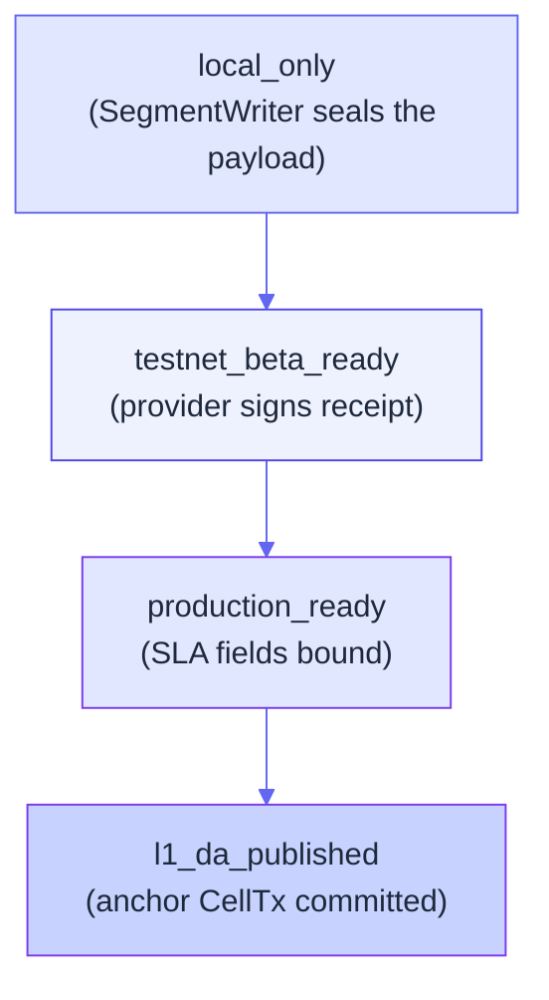
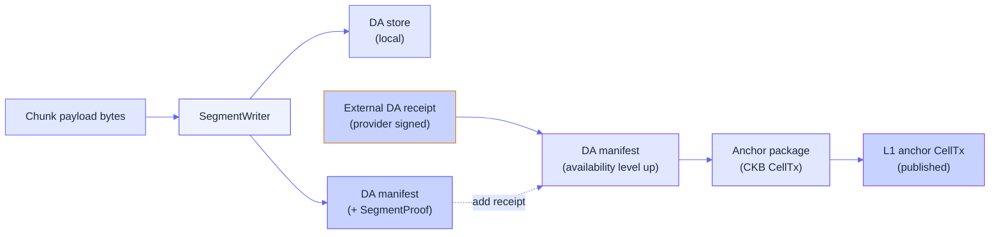

# Data availability flow

Data availability (DA) is the part of Myelin that proves a chunk
payload is **fetchable** by anyone who needs to verify or dispute it.
Without DA, the court path has nothing to replay.

This page walks the full DA flow: from chunk sealing to local store
to external receipt to anchor package to L1 publication.

## Why DA matters

Imagine a finalised Myelin block commits to a state root, but
nobody can fetch the chunk payload that produced it. The state
root alone isn't enough to dispute — the disputer needs to *replay*
the chunk in a CKB-VM-style verifier and compare results.

DA is what makes "I can fetch the payload" a verifiable claim
instead of a hand-wave. The DA manifest is the receipt; the
`SegmentProof` is the cryptographic proof; the external DA receipt
is the operator attestation; the anchor package is the L1-anchored
proof-of-publication.

## The DA ladder

```text
local_only           -> chunk sealed in local DA store
testnet_beta_ready   -> + provider-signed external DA receipt
production_ready     -> + production SLA: retention >= 30 days,
                        HTTPS retrieval endpoint, audit-log commitment
l1_da_published      -> + DA anchor CellTx committed on CKB
```



The four levels are **cumulative**. `production_ready` implies
`testnet_beta_ready` implies `local_only`. `l1_da_published` is the
last step and is independent of the other three — it's a separate
claim that the L1 has seen an anchor CellTx.

## The DA manifest

A DA manifest carries:

```rust
pub struct DaManifest {
    pub schema_version: String,
    pub session_id: [u8; 32],
    pub chunk_index: u64,
    pub payload_hash: [u8; 32],
    pub segment_root: [u8; 32],
    pub segment_proof: SegmentProof,
    pub external_da_receipt: Option<ExternalDaReceipt>,
    pub da_availability: DaAvailability,
    pub l1_da_published: bool,
}
```

The `payload_hash` is the chunk payload's content hash. The
`segment_root` is the Merkle root of the segment tree the local
store maintains. The `segment_proof` proves the payload is in the
tree.

## The flow



## Step 1 — Local sealing

```bash
cargo run -p myelin-cli -- session da-manifest \
  --bundle reports/session-court-bundle.json \
  --storage-dir reports/session-da-store \
  --out reports/session-da-manifest.json
```

This:

1. Reads `chunk_payload` from the court bundle.
2. Hashes it to `payload_hash`.
3. Appends it to the segment tree via `SegmentWriter`.
4. Computes the `segment_proof` (Merkle sibling list) and
   `segment_root`.
5. Emits the DA manifest with `da_availability = "local_only"` and
   `l1_da_published = false`.

The local store can be reused across many chunks; the manifest
identifies its segment by `payload_hash`.

## Step 2 — External DA receipt (optional)

For `testnet_beta_ready`, attach a provider-signed receipt:

```bash
cargo run -p myelin-cli -- session da-manifest \
  --bundle reports/session-court-bundle.json \
  --storage-dir reports/session-da-store \
  --external-da-receipt reports/external-da-receipt.json \
  --out reports/session-da-manifest.json
```

The receipt must use the schema `myelin-external-da-receipt-v2`,
bind to the same `payload_hash` and `segment_root`, and carry a
provider-recoverable secp256k1 signature over the receipt fields.

For `production_ready`, the receipt must additionally carry:

```text
service_level       = "production"
retention_window    >= 30 days
retrieval_endpoint  -> HTTPS URL with documented retrieval procedure
audit_log_commitment -> 32-byte commitment to the operator's audit log
```

These fields are hashed into the DA availability commitment.

## Step 3 — Anchor package

```bash
cargo run -p myelin-cli -- session da-anchor-package \
  --manifest reports/session-da-manifest.json \
  --bundle reports/session-court-bundle.json \
  --out reports/session-da-anchor-package.json
```

The anchor package converts the verified manifest into a
deterministic CKB-compatible CellTx package:

- The package carries the Molecule-encoded CellTx bytes.
- The package carries the same CellTx commitments the session
  commit fixture advertised.
- The package includes the projection report.

It still keeps `l1_da_publication_implemented = false`. The anchor
package is the *deterministic* input to the L1 submission step; the
publication claim only flips when the CellTx is actually committed.

## Step 4 — Submission to CKB

```bash
cargo run -p myelin-cli -- session submit-da-anchor-package \
  --package reports/session-da-anchor-package.json \
  --dry-run \
  --out reports/session-da-anchor-submit.json
```

The `submit-da-anchor-package` step builds the CKB
`send_transaction` JSON-RPC request and (in dry-run mode) shows you
exactly what would be sent. Drop `--dry-run` to actually submit.

The full submission readiness chain runs after submission:

```mermaid
%%{init: {
  "theme": "base",
  "themeVariables": {
    "primaryColor": "#EEF2FF",
    "primaryTextColor": "#1E293B",
    "primaryBorderColor": "#4F46E5",
    "lineColor": "#6366F1",
    "secondaryColor": "#E0E7FF",
    "tertiaryColor": "#C7D2FE"
  }
}}%%
flowchart LR
    A["Submitted CellTx"]:::in
    B["verify-submission-context<br/>(inputs live + deps available)"]:::step
    C["verify-submission-economics<br/>(fee meets floor + rate policy)"]:::step
    D["verify-submission-inclusion<br/>(get_transaction -> committed)"]:::step
    E["verify-submission-stability<br/>(block hash unchanged)"]:::step
    F["verify-submission-finality<br/>(confirmation depth reached)"]:::step
    G["verify-submission-readiness<br/>(all five agree)"]:::step

    A --> B --> C --> D --> E --> F --> G

    classDef in   fill:#E0E7FF,stroke:#6366F1,color:#1E293B;
    classDef step fill:#EEF2FF,stroke:#4F46E5,color:#1E293B;
```



Only when all five steps agree on the same CKB transaction hash and
block identity does `verify-submission-readiness` emit
`production_submission_ready = true`.

## Why each step exists

- **Context** — catches missing or spent input cells *before* live
  submission. Saves you from a wasted tx.
- **Economics** — verifies the implied fee meets the configured
  absolute floor, fee-rate policy, and (optional) maximum-fee
  policy. Saves you from overpaying or under-paying.
- **Inclusion** — confirms CKB `get_transaction` reports the
  transaction as `committed` with a real block hash. This is the
  first moment the L1 has actually seen your CellTx.
- **Stability** — re-queries the committed transaction; requires
  block hash and block number to be unchanged. Detects reorgs.
- **Finality** — queries `get_tip_header` and requires the committed
  inclusion to reach the configured confirmation depth (default 6).

The chain is deliberately conservative: each step can be configured
separately, and the final readiness report aggregates them.

## The production boundary

Three things keep `production_ready` false until they're *all*
done:

1. **External DA production SLA receipt** with retention ≥ 30 days,
   HTTPS endpoint, audit-log commitment.
2. **Canonical threshold-lock enforcement** — verified authority
   Cell with the declared threshold-lock args.
3. **Deployed CKB court economics** — checked mainnet deployment
   evidence for the court verifier.

If any one of these is missing, the readiness report lists it as a
production blocker. The submission can still go through — it just
can't claim `production_ready`.

## Where to look next

- [L1 / L2 / off-chain interactions](l1-l2-offchain.md) — the bigger
  picture.
- [Court path](court-path.md) — how DA feeds the dispute resolution.
- [Evidence paths](../security/evidence-paths.md) — what the DA
  manifest actually proves.