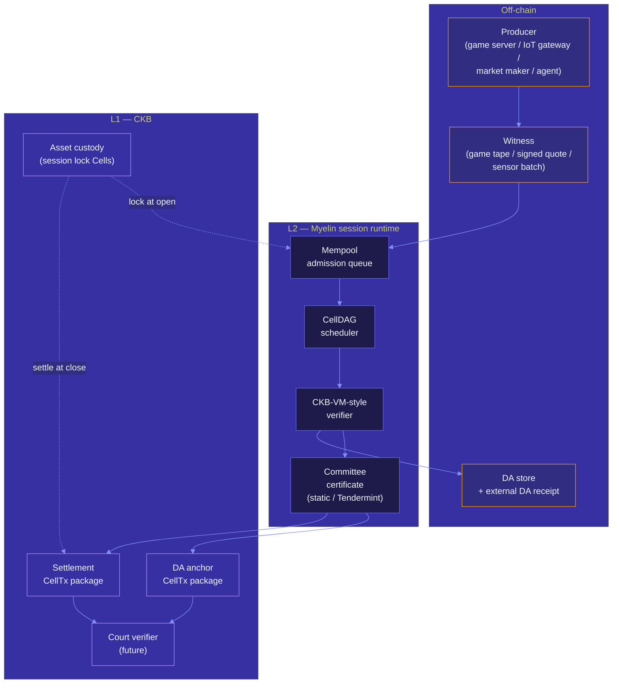

# L1 / L2 / off-chain interactions

Myelin is not one layer — it's a bridge across three layers. This
section is the visual map of those layers and the protocols that
move work between them.

## What "L1", "L2", "off-chain" mean here

For Myelin, the three layers mean very specific things:

L1 **CKB mainnet / testnet / devnet.** The
Nervos CKB proof-of-work chain. Where the long-lived asset custody
lives, where the future court verifier lives, and where any
"submitted" piece of evidence ends up.

L2 **Myelin session runtime.** A bounded
finite-Cell ledger with deterministic CKB-VM-style execution, a
CellDAG scheduler, and a selectable finality engine. Where
high-throughput transitions happen.

Off-chain **Producers, witnesses, and
data availability.** The producers that submit CellTxs, the
witnesses (e.g. game tape, signed quotes, sensor batches), and the
DA store / external DA provider that holds the chunk payloads.

The dotted arrows are *long-lived custody flows* (session open and
session close). The solid arrows are *evidence flows* (CellTx,
execution, projection, DA, submission).

## Pages in this section

-   [The three-layer model](l1-l2-offchain.md)

    ---

    The full picture: who owns what, who computes what, who can
    dispute what, and what the future court path looks like.

-   [Session lifecycle](session-flow.md)

    ---

    Open → commit → DA → court → settle, step by step, with the
    artefacts at each step.

-   [Court path](court-path.md)

    ---

    What happens when a chunk is disputed: bundle construction,
    bundle verification, and the future CKB-VM court verifier.

-   [Data availability flow](da-flow.md)

    ---

    DA manifest, segment proof, local store, external receipt,
    anchor package, and the readiness ladder.

-   [L1 submission flow](submission-flow.md)

    ---

    From a verified evidence package to a CKB RPC submission, with
    the context / economics / inclusion / stability / finality
    readiness chain.

## Reading order

If you're new to Myelin:

1. [The three-layer model](l1-l2-offchain.md) — get the picture.
2. [Session lifecycle](session-flow.md) — see one full cycle.
3. The other three pages are deep dives by topic.

If you're auditing Myelin against another L2:

1. [The three-layer model](l1-l2-offchain.md) — compare to your model.
2. [Court path](court-path.md) — read this carefully. The court
   shape is what makes Myelin "CKB-aligned" rather than "yet
   another sidechain."
3. [Data availability flow](da-flow.md) and [L1 submission
   flow](submission-flow.md) — the rest of the credibility hinges.