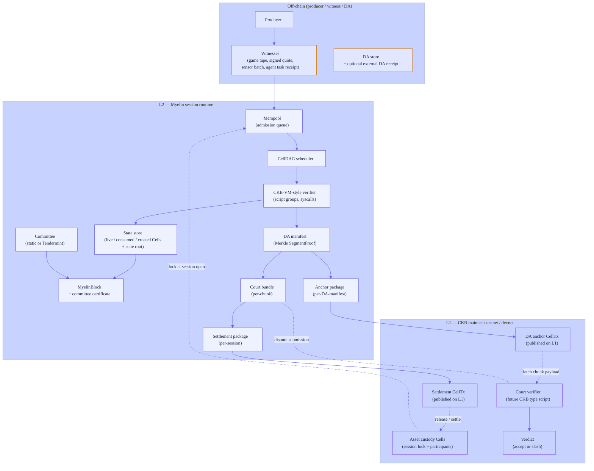
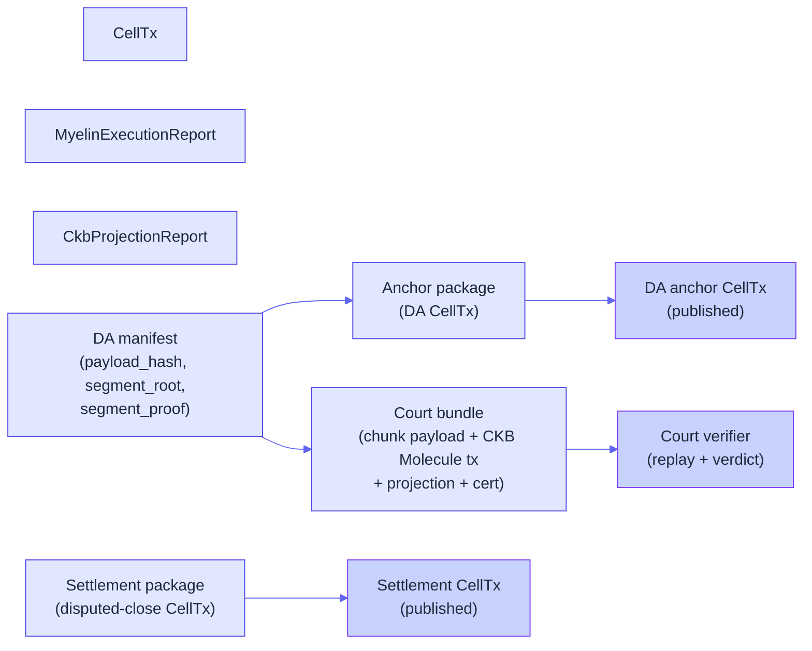

# The three-layer model

This page is the single diagram you should print and pin to the wall.
It shows who owns what, who computes what, who can dispute what, and
how the future court path fits in. Every other page in this section
zooms into one part of this picture.

## The full picture

The three layers are colour-coded:

- Off-chain — orange. Producer,
  witnesses, DA store, external DA provider.
- L2 (Myelin) — teal. Mempool,
  scheduler, verifier, state, committee, block, evidence packages.
- L1 (CKB) — cyan. Asset custody, DA
  anchor CellTx, settlement CellTx, future court verifier.

## Who owns what

| Concern | Owner | Where it lives |
| --- | --- | --- |
| **Long-lived asset custody** | Producer + participants | CKB Cells (L1) |
| **In-session state** | Myelin runtime | `myelin-state` (L2) |
| **Finality of Myelin blocks** | Committee (configured set) | `myelin-consensus` (L2) |
| **Chunk payload availability** | DA store + external DA provider | Off-chain, with anchor CellTx (L1) |
| **Dispute resolution** | Future CKB court verifier | L1 type script |

## Who computes what

| Computation | Layer | What it produces |
| --- | --- | --- |
| CellTx execution | L2 (verifier) | `MyelinExecutionReport` (cycles, state root transition) |
| CKB-style projection | L2 (verifier) | `CkbProjectionReport` (with `ckb_style_tx_hash`) |
| Block finality | L2 (committee) | `FinalisedBlock` with committee certificate |
| DA sealing | L2 (`myelin-state`) | DA manifest with `SegmentProof` |
| Anchor package | L2 (CLI) | CKB-compatible CellTx package with `l1_da_published = false` |
| Settlement package | L2 (CLI) | CKB-compatible CellTx package for disputed close |
| Court verification | L1 (future) | Accept / slash verdict |

## Who can dispute what

A dispute happens when **any participant** believes a finalised
Myelin block contains an invalid state-root transition. To dispute:

1. **Fetch** the disputed chunk payload from the DA store, or from
   the DA anchor CellTx on L1.
2. **Replay** the chunk in a CKB-VM-style verifier (off-chain, or on
   the future L1 court type script).
3. **Compare** the computed `state_root_after` against the one in
   the finalised block.

If they disagree, the disputer submits the **court bundle** to the
L1 court verifier. The court replays the chunk, and the verdict is
either "accept" (the committee was right, dispute bond refunded) or
"slash" (the committee was wrong, dispute bond awarded, committee
bond slashed).

The exact economics are in
[Settlement package](../interactions/submission-flow.md) — but the
shape is the same: deterministic replay, deterministic verdict.

## Where each piece lives across the layers

Solid arrows: produced on L2, optionally published to L1. Dotted
arrows: an L1 verifier reads the L2 artefact from the published
package.

## Why this matters

Three patterns come up over and over in Myelin docs:

1. **L1 is custody and court, not real-time execution.** The CKB
   chain is where the assets live and where disputes are resolved.
   It is not where the high-throughput work happens.
2. **L2 is finite, not infinite.** Every Myelin session has an
   open, a sequence of finalised blocks, and a close. There is no
   "always-on global state." This is what makes the CellDAG and
   the state root meaningful.
3. **Off-chain is what carries the bulk data.** Game tapes, signed
   quotes, sensor batches, agent task receipts — none of these
   belong on-chain by default. They live in the DA store, with an
   anchor CellTx on L1 to prove their availability.

That three-layer split is what makes Myelin a *CKB-aligned* session
runtime rather than a CKB re-implementation or a generic
sidechain.

## What's not in the picture

- **No P2P layer.** The current Myelin kernel is a single-process
  runtime driven by the CLI. The committee is a configured set; it
  is not a gossip network.
- **No wallet.** Wallets are L1 concerns. Myelin talks to CKB
  through the JSON-RPC; it doesn't manage keys beyond committee
  validator keys.
- **No public RPC.** The CKB node provides the public RPC; Myelin
  consumes it.

## Where to go next

- [Session lifecycle](session-flow.md) — see one full session walk
  through the layers.
- [Court path](court-path.md) — the dispute-resolution deep dive.
- [Claim ladder](../security/claim-ladder.md) — what each piece of
  evidence actually proves about the L2.