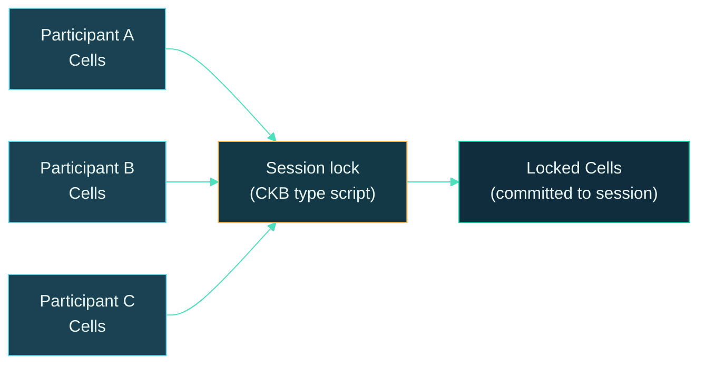
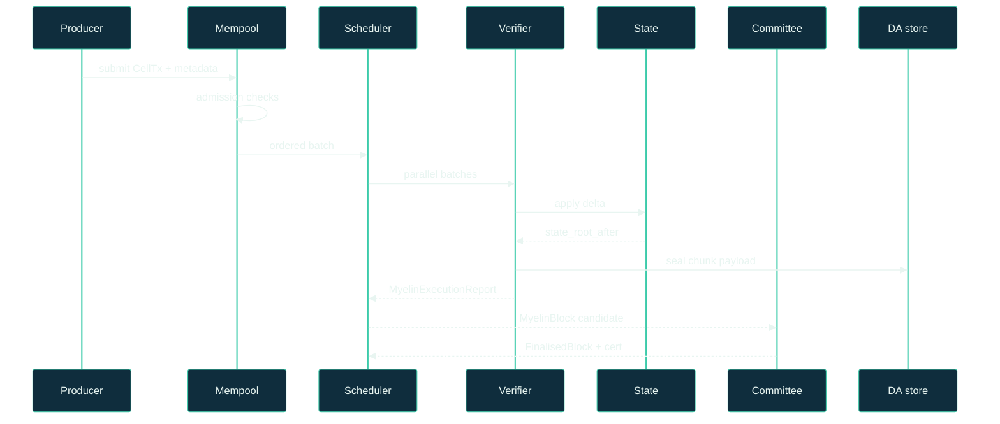
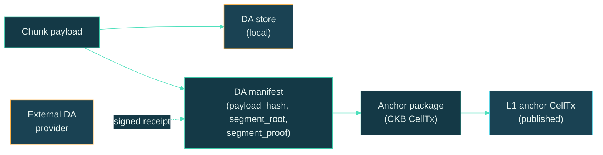
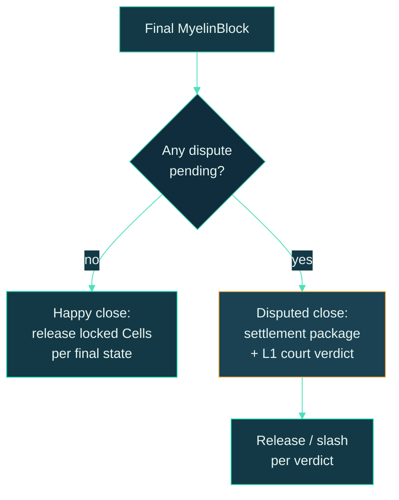

# Session lifecycle

A Myelin **session** is the bounded context in which off-chain Cell
execution happens. Every session has an open, a sequence of finalised
blocks, an optional dispute, and a close. This page walks the full
lifecycle once.

## The five phases

```text
asset custody     -> canonical CKB-style Cells
session entry     -> lock or commit Cells into a session
fast path         -> static-committee Myelin session runtime
DA path           -> publish chunk commitments
court path        -> one disputed chunk is CKB-VM-style verifiable
exit path         -> final state unlocks or materialises Cells
```

These phases correspond to the CLI commands listed in
[CLI reference](../operations/cli.md). This page is the conceptual
view; the CLI reference is the operational view.

## Phase 1 — Asset custody

The session's participants bring CKB Cells into the session. The
cells are *not* consumed; they're **locked** under a session lock
script whose args commit to the session ID and the committee.



The lock script is the CKB-side anchor of the session. Its args
bind it to the session ID; its type script (if any) enforces
participant-set rules.

## Phase 2 — Session entry

A session is opened with a config that fixes:

```text
session_id           -> [u8; 32], deterministic from config
participants        -> participant set + weights
committee            -> validator set + weights
max_chunk_bytes      -> chunk size limit
max_cycles           -> per-chunk cycle budget
```

The CLI's `session open-fixture` produces a JSON report with the
initial state root (`state_root_before = empty-set commit`) and a
`MyelinBlock` candidate.

## Phase 3 — Fast path (off-chain execution)

Inside the session, the runtime runs chunks in the order the
scheduler decides. Each chunk:

1. Is admitted by the mempool (typed-cell metadata verified, RBF
   rules applied).
2. Is scheduled into a parallel batch by the CellDAG.
3. Is verified by the CKB-VM-style verifier.
4. Updates the live Cell set and recomputes the state root.
5. Is sealed into the local DA store with a `SegmentProof`.
6. Is wrapped into a `MyelinBlock` candidate.
7. Is finalised by the committee certificate.



The fast path runs entirely off-chain. The L1 sees nothing — no
CellTx, no state-root, no committee certificate. The only thing
the L1 will eventually see is the asset custody lock and the
settlement package.

## Phase 4 — DA path

After each chunk is finalised, the DA manifest records:

```text
payload_hash         -> hash of the chunk payload bytes
segment_root         -> Merkle root of the segment tree
segment_proof        -> proof of inclusion in the segment tree
external_da_receipt  -> optional, signed by the external DA provider
da_availability      -> local_only | testnet_beta_ready | production_ready
l1_da_published      -> false (default)
```

The DA manifest is the *input* to the future anchor package. With
an external DA provider's signed receipt, it can climb to
`production_ready`. Without it, it stays `local_only`.



For the deepest dive on DA, see [Data availability
flow](da-flow.md).

## Phase 5 — Court path (only if disputed)

If no participant disputes a finalised chunk, this phase is empty.
If a participant disputes, they construct a **court bundle**:

```text
chunk_payload_bytes        -> the actual chunk bytes
chunk_payload_hash         -> hash(payload)
ckb_molecule_tx_bytes      -> Molecule-encoded CKB tx
ckb_molecule_tx_hash       -> hash(molecule_tx)
projection_report          -> CkbProjectionReport for the chunk
challenge_payload_hash     -> hash(chunk_payload || molecule_tx || projection)
committee_evidence         -> signatures over challenge_payload_hash
```

The court bundle is self-contained: anyone holding it can replay
the chunk in a CKB-VM-style verifier and verify the committee's
verdict.

> [!NOTE]
> The CKB court verifier (the type script that would actually
> adjudicate disputes on L1) is **not yet implemented**. The court
> bundle is the deterministic input shape *for* that verifier — so
> when one is implemented and deployed, no back-compat changes are
> needed for existing bundles.

## Phase 6 — Exit path

When the session closes, the participants settle the locked Cells.
There are two paths:



For the deepest dive on submission, see [L1 submission
flow](submission-flow.md).

## A full lifecycle, in one timeline

```mermaid
%%{init: {
  "theme": "base",
  "themeVariables": {
    "primaryColor": "#0F2D3D",
    "primaryTextColor": "#E8F5F1",
    "primaryBorderColor": "#3CCBAA",
    "lineColor": "#4EE0BC",
    "secondaryColor": "#143946",
    "tertiaryColor": "#1A4253"
  }
}}%%
gantt
    title Session lifecycle
    dateFormat X
    axisFormat %s

    section L1 (CKB)
    Asset custody lock    :l1a, 0, 1
    Final settlement      :l1b, 14, 1

    section L2 (Myelin)
    Session open          :l2a, 1, 1
    Chunk 0 (fast path)   :l2b, 2, 3
    Chunk 1 (fast path)   :l2c, 5, 3
    Chunk 2 (fast path)   :l2d, 8, 3
    DA anchor package     :l2e, 11, 1
    Settlement intent     :l2f, 12, 1
    Settlement package    :l2g, 13, 1

    section Off-chain
    Witnesses (tape / quote / batch) :offa, 0, 14
    DA store sealing                  :offb, 2, 9
```



## CLI mapping

Each phase has a CLI command. The full list is in
[CLI reference](../operations/cli.md); the short version:

| Phase | Command |
| --- | --- |
| Asset custody | (off-chain CKB tx, not a Myelin command) |
| Session open | `myelin-cli session open-fixture` |
| Fast path chunks | `myelin-cli runtime smoke` (or per-chunk CLI) |
| DA manifest | `myelin-cli session da-manifest` |
| Anchor package | `myelin-cli session da-anchor-package` |
| Court bundle | `myelin-cli session court-bundle` |
| Settlement intent | `myelin-cli session settlement-intent` |
| Settlement package | `myelin-cli session settlement-package` |
| L1 submission | `myelin-cli session submit-settlement-package` |

> [!TIP]
> For the shortest end-to-end demo, see
> [First run](../getting-started/first-run.md). That page walks
> the whole lifecycle in five commands.

## What's deliberately simple in the demo

The session lifecycle above is the *full* shape. The CLI's first-run
demo runs a **two-validator static committee** with **no
permissionless validator entry**, **no live external DA provider**,
and **no L1 court verifier**. Those pieces are intentionally left
for the production gate (which exercises them with mock CKB RPC
servers) and the future CKB court implementation.

The boundary is honest on purpose: see
[Claim ladder](../security/claim-ladder.md).

## Where to go next

- [Court path](court-path.md) — the dispute deep dive.
- [Data availability flow](da-flow.md) — the DA ladder.
- [L1 submission flow](submission-flow.md) — from packages to
  on-chain inclusion.