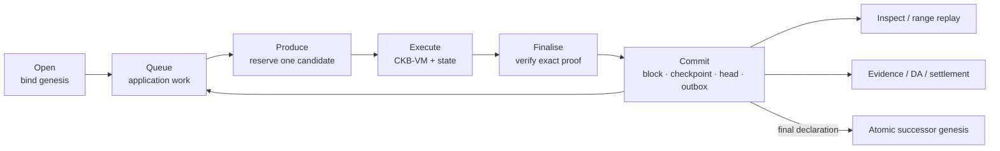
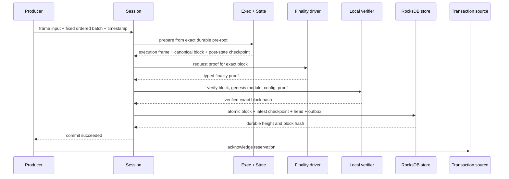
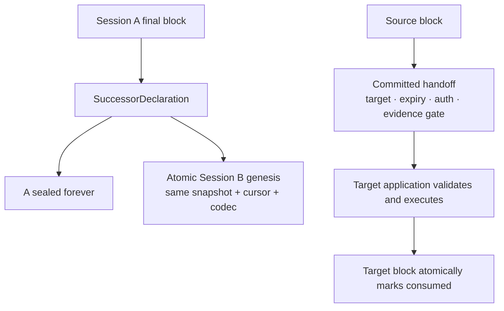

# Session lifecycle

A Myelin session turns a sequence of finite Cell transitions into one durable
history. The application can stay online for a long time; Myelin still handles
one bounded candidate from the current durable head at a time.

*Myelin-finalised* means accepted by the closed-validator module fixed in
session genesis and committed to the session store. It does not mean finalised
on CKB.

## Lifecycle at a glance


```mermaid
flowchart LR
    O["Open<br/>bind genesis"] --> Q["Queue<br/>application work"]
    Q --> P["Produce<br/>reserve one candidate"]
    P --> V["Execute<br/>CKB-VM + state"]
    V --> F["Finalise<br/>verify exact proof"]
    F --> C["Commit<br/>block · checkpoint · head · outbox"]
    C --> I["Inspect / range replay"]
    C --> Q
    C --> E["Evidence / DA / settlement"]
    C -->|"final declaration"| N["Atomic successor genesis"]
```

## 1. Open the session

Session genesis fixes the values needed to interpret every later block:

```text
session identity
initial Cell state root
application program, input schema, state codec, time and entropy policies
strict VM capability and resource envelope
court and handoff-policy commitments
consensus kind and canonical validator/authority configuration
compiled module descriptor and commitment
proof, message, and WAL schema versions
initial input position, logical time, and timestamp floor
optional predecessor reference
```

The consensus module comes from a closed compiled catalogue: static committee,
proof of authority, or Tendermint. A restart with another module, validator
configuration, or WAL schema is rejected.

Funding is optional. `myelin-session-escrow` may attach funds only after a
linked `myelin-ckb-adapter` receipt chain verifies the exact CKB opening
transaction at the configured depth and before the start deadline. An opened
off-chain session alone is not proof that CKB funds were locked.

## 2. Queue work and close a candidate

Applications own their event journals and decide which events become Cell
transactions. Completed epochs may wait in that journal up to an
application-defined backlog cap. Myelin does not treat queued epochs as a chain
of speculative blocks.

`myelin-session-producer` supports four automatic policies plus manual
production:

| Policy | When it closes a batch |
| --- | --- |
| `Instant` | work becomes available; reserve one capped selection immediately |
| `Interval` | inspect the source on a fixed cadence; empty blocks require operator opt-in |
| `Open` | first work opens a collection window; deadline or count/byte cap closes it |
| `Never` | automatic production is off; a caller requests source-selected or exact work |

Automatic and manual requests share one writer. One session has at most one
candidate in flight. The producer waits for the commit result before selecting
the next batch from the durable head.

The transaction source reserves selected work while finality runs. A failed
commit or orderly shutdown releases the reservation. After the durable head
advances, the producer asks the source to acknowledge it; acknowledgement and
the session-store commit are separate durability domains, so a failed
acknowledgement requires source reconciliation before retry.

## 3. Execute, finalise, and commit


```mermaid
sequenceDiagram
    participant P as Producer
    participant S as Session
    participant X as Exec + State
    participant D as Finality driver
    participant V as Local verifier
    participant R as RocksDB store
    participant Q as Transaction source

    P->>S: frame input + fixed ordered batch + timestamp
    S->>X: prepare from exact durable pre-root
    X-->>S: execution frame + canonical block + post-state checkpoint
    S->>D: request proof for exact block
    D-->>S: typed finality proof
    S->>V: verify block, genesis module, config, proof
    V-->>S: verified exact block hash
    S->>R: atomic block + latest checkpoint + head + outbox
    R-->>S: durable height and block hash
    S-->>P: commit succeeded
    P->>Q: acknowledge reservation
```

Execution resolves concrete Cells, rejects physical double spends, derives
logical conflict hashes from authenticated state, orders READ/WRITE conflicts,
and runs every script group in `CkbStrict`. All groups share one transaction
cycle budget. Any script failure, stale pre-root, or failed dependency aborts
the transition.

The finality driver may choose a signer or gather votes, but its success report
does not advance the session. The local verifier checks the proof against the
exact canonical block and the module configuration fixed by genesis.

RocksDB commits the block, latest checkpoint, durable head, outbox, successor,
and handoff changes in one transaction. Rolling checkpoints avoid copying a
full state snapshot into every historical block record.

Every frame starts at the head's exact input position and logical time. It
commits the canonical input bytes, pre/post roots, ordered raw txids, and
measured resource use. `InspectPort` operates on an immutable snapshot; it has
no route to block preparation, outbox insertion, or durable mutation.

## 4. Restart and recover

On restart, Myelin:

1. loads genesis and checks the module/configuration/schema commitments;
2. streams and audits the finalised block-and-proof chain;
3. verifies height, parent, state-root, timestamp, module, and proof links;
4. restores the latest state checkpoint;
5. compares the restored executor root with the durable head;
6. reopens the writer only after every check succeeds.

Ordinary recovery does not re-execute the full transaction history. A bounded
range replay selects the newest retained checkpoint before the requested start,
reexecutes warm-up and requested frames, rechecks finality and frame linkage,
and returns a `RangeReplayReceipt`. If the required checkpoint was pruned, the
request falls back to an earlier retained checkpoint or genesis; it never
pretends that a later snapshot proves an earlier range.

Evidence outbox topics use a committed stage descriptor. The worker collects
one stage, locally verifies its exact evidence, then appends it with a revision
CAS. A skipped stage, wrong previous receipt, changed verifier identity, or
forged payload is rejected. The outbox is acknowledged only after the terminal
stage; a crash after the terminal CAS resumes by acknowledging the complete
record rather than inventing another receipt.

Application journals have their own recovery protocol. The
[Veloren research fork](../integrations/veloren-research-fork.md), for example,
tracks journaled, game-applied, and Myelin-finalised positions separately and
reconciles them with stable event and range IDs.

## 5. Produce DA and CKB evidence

A finalised session block can feed DA, court-bundle, settlement, and CKB
submission workflows. Each workflow earns only the claim supported by its
receipts.

```text
wire-encoded
  -> context-resolved
  -> consensus-validated
  -> scripts-verified
  -> node-accepted
  -> committed
  -> configured-depth finality
```

The pure projector stops at canonical CKB Molecule bytes and the raw CKB
transaction hash. Context, scripts, node acceptance, commitment, and depth need
a linked `myelin-ckb-adapter` receipt chain for the exact transaction. Node
acceptance is not commitment, and configured depth is not irreversible
finality.

DA manifests bind sealed segment roots and availability evidence. A local
segment is local evidence. Production availability claims need the configured
provider and probe receipts.

## 6. Close or dispute

`myelin-session-escrow` can construct cooperative, timeout, or evidence-bound
exit packages from the latest finalised checkpoint. Construction does not prove
that CKB accepted or committed the exit. Witness collection, submission,
inclusion, commitment, and configured-depth checks are later stages.

A court bundle packages the exact disputed chunk and verification inputs. The
repository does not ship a deployed L1 court or finished dispute economics, so
a verified local bundle is not an on-chain verdict.

## 7. Continue elsewhere

Successor sessions and handoffs solve different problems:


```mermaid
flowchart TB
    A["Session A final block"] --> D["SuccessorDeclaration"]
    D --> S["A sealed forever"]
    D --> G["Atomic Session B genesis<br/>same snapshot + cursor + codec"]

    X["Source block"] --> H["Committed handoff<br/>target · expiry · auth · evidence gate"]
    H --> T["Target application validates and executes"]
    T --> C["Target block atomically marks consumed"]
```

A successor preserves one state lineage and permits exactly one continuation.
A handoff preserves separate histories: it carries a bounded payload from a
finalised source block into a matching target or intake policy. Expiry and the
minimum receipt stage are checked again inside the target commit transaction.
The target executor sees the exact authorization and payload under its
genesis-bound program; the built-in application-neutral Cell executor rejects
handoffs.

## CLI mapping

| Stage | Command family |
| --- | --- |
| Open and commit a fixture | `myelin-cli session open-fixture`, `commit-fixture` |
| Exercise runtime wiring | `myelin-cli runtime smoke` |
| Build and verify court evidence | `myelin-cli session court-bundle`, `verify-court-bundle` |
| Build DA evidence | `myelin-cli session da-manifest`, `da-anchor-package` |
| Build settlement evidence | `myelin-cli session settlement-intent`, `settlement-package` |
| Submit to a CKB RPC endpoint | `myelin-cli session submit-*` |
| Inspect durable lineage | `myelin-cli session lineage-status` |
| Inspect an evidence receipt ladder | `myelin-cli session evidence-status` |
| Inspect handoff expiry and consumption | `myelin-cli session handoff-status` |

For exact flags and report schemas, see the [CLI reference](../operations/cli.md).
For the shortest local exercise, see [First run](../getting-started/first-run.md).
