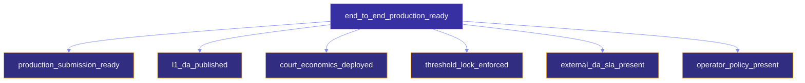

# L1 submission flow

This page is the operational counterpart to [Data availability
flow](da-flow.md). It walks through what happens after the evidence
packages exist: building the CKB JSON-RPC request, submitting it,
and the five-step readiness chain that proves the submission was
actually accepted by the chain.

## What "submit to L1" actually means

Three kinds of CellTx can be submitted to CKB:

```text
DA anchor CellTx     -> binds the DA manifest to an L1-anchored cell
settlement CellTx    -> binds the settlement intent to a disputed close
carrier CellTx       -> for devnet smoke only; binds a 160-byte payload
```

Each one goes through the same five-step readiness chain. The
*content* differs; the *protocol* is the same.

## The five-step readiness chain

```mermaid
%%{init: {
  "theme": "base",
  "themeVariables": {
    "primaryColor": "#1E1B4B",
    "primaryTextColor": "#F1F5F9",
    "primaryBorderColor": "#6366F1",
    "lineColor": "#818CF8",
    "secondaryColor": "#312E81",
    "tertiaryColor": "#3730A3"
  }
}}%%
flowchart LR
    A["Submit<br/>(send_transaction)"]:::in
    B["Context<br/>(inputs live)"]:::step
    C["Economics<br/>(fee policy)"]:::step
    D["Inclusion<br/>(committed)"]:::step
    E["Stability<br/>(no reorg)"]:::step
    F["Finality<br/>(confirmation depth)"]:::step
    G["Readiness<br/>(aggregate)"]:::out

    A --> B --> C --> D --> E --> F --> G
    G --> H["production_submission_ready"]:::verdict

    classDef in      fill:#312E81,stroke:#818CF8,color:#F1F5F9;
    classDef step    fill:#1E1B4B,stroke:#6366F1,color:#F1F5F9;
    classDef out     fill:#312E81,stroke:#8B5CF6,color:#F1F5F9;
    classDef verdict fill:#3730A3,stroke:#A78BFA,color:#F1F5F9;
```



Each step is a separate CLI subcommand. They run sequentially and
each takes the previous step's report as input.

## Step 1 — Submission

```bash
cargo run -p myelin-cli -- session submit-settlement-package \
  --package reports/session-settlement-package.json \
  --dry-run \
  --out reports/session-settlement-submit.json
```

The submit command:

1. Builds the CKB `send_transaction` JSON-RPC payload.
2. In dry-run mode: writes the payload, doesn't talk to the chain.
3. In live mode: POSTs to the configured RPC URL, captures the
   transaction hash from the response.

The submit report carries the exact request bytes that were (or
would have been) sent.

## Step 2 — Context

```bash
cargo run -p myelin-cli -- session verify-submission-context \
  --submission reports/session-settlement-submit.json \
  --rpc-url http://127.0.0.1:8114 \
  --out reports/session-settlement-context.json
```

The context verifier:

1. Extracts the input OutPoints from the submitted transaction.
2. Calls `get_live_cell` for each one.
3. Checks that every input is live and that every dep reference is
   resolvable.

A failure here means the transaction *will fail on-chain*. This is
the cheap pre-flight check.

## Step 3 — Economics

```bash
cargo run -p myelin-cli -- session verify-submission-economics \
  --submission reports/session-settlement-submit.json \
  --rpc-url http://127.0.0.1:8114 \
  --min-fee-shannons 1 \
  --min-fee-rate-shannons-per-kb 1000 \
  --max-fee-shannons 1000 \
  --out reports/session-settlement-economics.json
```

The economics verifier:

1. Queries live input capacity from `get_live_cell`.
2. Sums output capacity from the submitted CellTx.
3. Computes `fee = sum(input_capacity) - sum(output_capacity)`.
4. Requires `fee >= min-fee-shannons` and
   `fee_rate >= min-fee-rate-shannons-per-kb`.
5. If `max-fee-shannons` is set, requires `fee <= max-fee-shannons`.

This is the moment where you find out if you underpaid or
overpaid.

## Step 4 — Inclusion

```bash
cargo run -p myelin-cli -- session verify-submission-inclusion \
  --submission reports/session-settlement-submit.json \
  --rpc-url http://127.0.0.1:8114 \
  --min-status committed \
  --out reports/session-settlement-inclusion.json
```

The inclusion verifier:

1. Calls `get_transaction` for the submitted hash.
2. Requires `tx_status.status == "committed"`.
3. Captures the block hash and block number.

For **carrier** submissions (devnet smoke), it additionally
verifies `outputs_data[0]` matches the declared carrier payload and
`outputs[0].type.args` matches the expected data-hash + identity
layout.

This is the first moment the L1 has actually accepted the CellTx.

## Step 5 — Stability

```bash
cargo run -p myelin-cli -- session verify-submission-stability \
  --inclusion reports/session-settlement-inclusion.json \
  --rpc-url http://127.0.0.1:8114 \
  --out reports/session-settlement-stability.json
```

The stability verifier:

1. Re-queries `get_transaction` for the submitted hash.
2. Requires the block hash and block number to be unchanged.
3. Rejects if any inconsistency is found.

This catches reorgs.

## Step 6 — Finality

```bash
cargo run -p myelin-cli -- session verify-submission-finality \
  --inclusion reports/session-settlement-inclusion.json \
  --rpc-url http://127.0.0.1:8114 \
  --min-confirmations 6 \
  --out reports/session-settlement-finality.json
```

The finality verifier:

1. Calls `get_tip_header` for the current chain tip.
2. Computes `confirmations = tip.number - committed_block.number`.
3. Requires `confirmations >= min-confirmations`.

## Step 7 — Aggregate readiness

```bash
cargo run -p myelin-cli -- session verify-submission-readiness \
  --context   reports/session-settlement-context.json \
  --economics reports/session-settlement-economics.json \
  --inclusion reports/session-settlement-inclusion.json \
  --stability reports/session-settlement-stability.json \
  --finality  reports/session-settlement-finality.json \
  --out reports/session-settlement-readiness.json
```

The aggregate readiness report combines all five steps:

```text
production_submission_ready        -> bool, true if all five agree
final_l1_script_submission_ready   -> bool, true if final-script evidence passes
end_to_end_production_ready        -> bool, true if everything passes
end_to_end_production_blockers     -> Vec<String>, list of missing pieces
```

The aggregate only emits `production_submission_ready = true` when:

- Every step ran successfully.
- Every step agrees on the **same CKB transaction hash**.
- Every step agrees on the **same committed block identity**.
- The finality confirmation depth is met.

If anything is missing or disagrees, the blockers list spells out
exactly what.

## The production boundary



`end_to_end_production_ready` requires **all six** of the lower
flags. `production_submission_ready` alone is not enough — it only
covers the submission itself. The full claim needs DA publication,
deployed court economics, threshold-lock enforcement, the external
DA SLA, and a typed operator policy.

> [!IMPORTANT]
> The aggregate stays `false` until the corresponding pieces are
> actually present and verified. Don't market
> `production_submission_ready` as a "the chain saw our CellTx"
> full claim; it only says "the chain saw our CellTx."

## Where this runs

In normal usage, the production gate runs all five steps with mock
CKB RPC servers — proving the **request construction** without
hitting a real chain. The devnet smoke (`scripts/myelin_ckb_devnet_smoke.sh`)
runs the same steps against a live parent CKB devnet.

For the devnet path specifically, two extra pieces of evidence are
required:

1. The DA-anchor and settlement CellScript carrier verifiers must
   be deployed on the devnet.
2. The compact-payload carriers (160 bytes each) must match the
   declared `type.args` (`ckb_data_hash(carrier_payload) ||
   identity_hash`).

A tampered carrier is rejected by CKB script verification. The
devnet smoke asserts this rejection.

## Where to look next

- [The three-layer model](l1-l2-offchain.md) — the bigger picture.
- [Court path](court-path.md) — what happens when a submitted
  settlement is disputed.
- [Production gate](../operations/production-gate.md) — what the
  gate covers end-to-end.