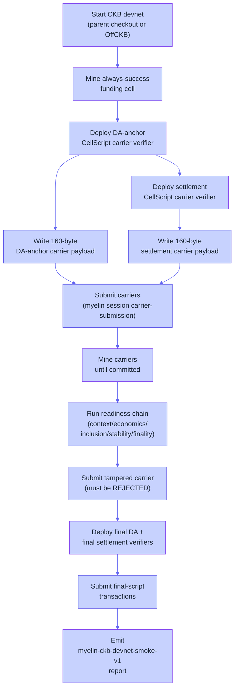
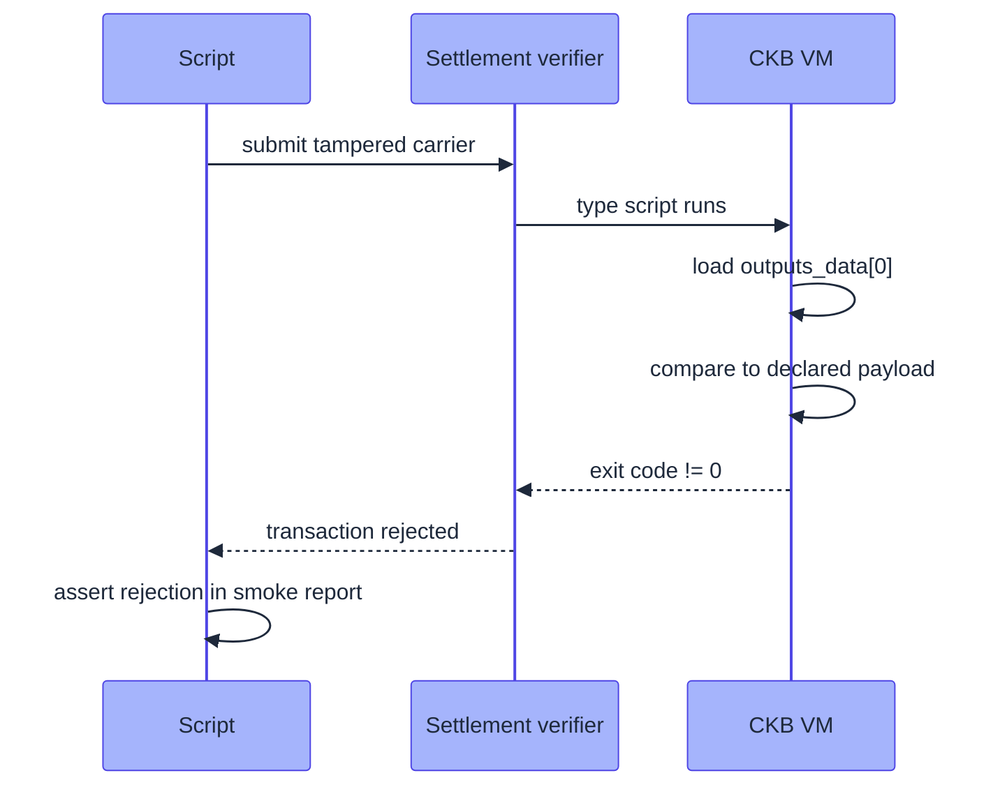

# Local CKB devnet smoke

`scripts/myelin_ckb_devnet_smoke.sh` is the live-chain counterpart
to the production gate. It starts a parent CKB devnet, deploys
CellScript carrier verifiers, submits real carriers, and verifies
that the chain actually accepts (or rejects) the right transactions.

This page walks through what it does and what it proves.

## What "live CKB devnet" means here

A CKB devnet is a local Nervos CKB node running in testnet mode.
It exposes a JSON-RPC endpoint on `127.0.0.1:8114` by default. The
devnet is a real CKB chain — it has the same consensus, same VM,
same scripts as mainnet — but with zero economic value and a
configurable genesis.

For the Myelin smoke, the devnet is started from the parent
`../ckb` checkout (or via OffCKB). It mines an "always success"
funding cell, deploys the carrier verifiers, and waits for blocks.

## The script's flow



## The two carrier verifiers

Two CellScript carrier verifiers are deployed:

```text
DA-anchor carrier verifier:
  - type script args: ckb_data_hash(carrier_payload) || carrier_identity_hash
  - outputs[0].type  : must match the carrier verifier
  - outputs_data[0]  : must equal carrier_payload
  - carrier_identity_hash = DA manifest hash

Settlement carrier verifier:
  - type script args: ckb_data_hash(carrier_payload) || carrier_identity_hash
  - outputs[0].type  : must match the settlement verifier
  - outputs_data[0]  : must equal carrier_payload
  - carrier_identity_hash = settlement intent hash
```

Each carrier carries a **160-byte compact payload** and uses
`data2` for both CellScript verifier type scripts.

The settlement carrier is funded from the DA carrier's change
output — proving the live Cell-replacement chain works end-to-end.

## What the readiness chain checks

After submission, the script runs the same five-step readiness
chain documented in [L1 submission
flow](../interactions/submission-flow.md):

```text
verify-submission-context      -> get_live_cell for inputs and deps
verify-submission-economics    -> input capacity, output capacity, fee
verify-submission-inclusion    -> get_transaction committed
verify-submission-stability    -> re-query, block identity unchanged
verify-submission-finality     -> confirmation depth reached
verify-submission-readiness    -> aggregate all five
```

For carrier submissions specifically, the **inclusion** verifier
additionally asserts:

```text
outputs_data[0]            == declared carrier payload
outputs[0].type.args       == expected data-hash + identity layout
```

This is what catches tampered carriers even after `get_transaction`
returns `committed`.

## The tampered-carrier rejection

After the valid carriers are committed, the script submits a
**tampered compact payload** under the settlement verifier. The
expected behaviour:



If the tampered carrier is accepted, the script fails — that's a
real protocol bug, not a flaky test.

## Final-script strictness

After the compact-payload carriers pass, the script deploys the
**final** DA and final settlement CellScript verifiers. These are
stricter:

```text
final DA verifier            -> stricter than carrier DA verifier
final settlement verifier   -> must consume a one-use authority Cell
                                 checks final DA publication as read-only CellDep
                                 rejects same-type inputs
                                 rejects duplicate same-type group outputs
                                 rejects any second output in the same tx
                                 using the same deployed code hash/hash type
```

The transaction-local singleton creation + cross-transaction
replay protection (through the consumed authority Cell) is the
**current CKB-compatible anti-replay model**.

The script additionally deploys secp256k1 threshold signatures and
deterministic threshold-lock args. Final-script submission requires
the consumed authority Cell to use those declared lock args and
exposes an `authority_threshold_lock_deployment_checked` readiness
marker when the live lock code dep plus final DA and authority
cells all match.

Without `--threshold-lock-deployment-evidence`, the package-level
authority stays `ckb_enforceable = false`. With checked mainnet
deployment evidence, it can flip to `production_ready`.

## Court economics deployment

Settlement intents carry a recomputable `court_economics` policy
commitment over:

```text
participant/escrow binding
locally signature-verified DA committee availability evidence
challenge timing
minimum dispute bond
slash/reward basis points
refund/remainder balance
deadline-only settlement
required DA evidence
```

This makes disputed-close economics locally checkable. An optional
`--court-economics-deployment-evidence` file binds a checked CKB
court verifier deployment (audited source/report hashes + the
exact disputed-close economics commitment) before
`production_ready` can be true.

Without it, the intent stays at the testnet-beta level.

## The report

The script emits `myelin-ckb-devnet-smoke-v1`, which proves:

```text
devnet CKB acceptance            -> true
deployed compact-payload type-script execution -> true
final-script strict readiness    -> true
live rejection of mismatched carrier data -> true
live rejection of competing final-settlement output probe -> true
```

The report also records the actual block hashes, transaction
hashes, type-args, and outputs_data for every committed and
rejected carrier. Anyone holding the report can re-query the devnet
RPC and verify the same evidence.

## What this smoke does NOT prove

- **Not permissionless validator entry.** The smoke runs the
  static-committee path; Tendermint is in the production gate but
  the smoke uses static.
- **Not production DA.** External DA SLA receipts are out of scope
  here; the smoke runs the local-only DA path with `l1_da_published`
  flipped by the live CellTx.
- **Not mainnet.** The devnet is a local node. Mainnet submission
  is a separate decision.

## Running it yourself

```bash
# Start a CKB devnet (via OffCKB or parent ../ckb)
offckb start  # or: cd ../ckb && target/release/ckb run --testnet --tmp

# Run the smoke
scripts/myelin_ckb_devnet_smoke.sh
```

The script exits non-zero on any failure. The output report is
written to `reports/myelin-ckb-devnet-smoke-v1.json` (or wherever
the script is configured to write).

## Where to go next

- [L1 submission flow](../interactions/submission-flow.md) — the
  five-step readiness chain in detail.
- [Production gate](production-gate.md) — the local gate this
  smoke complements.
- [Claim ladder](../security/claim-ladder.md) — what the devnet
  smoke actually proves about Myelin's claim level.