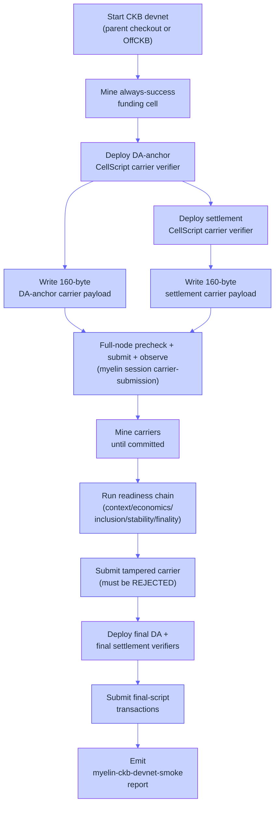
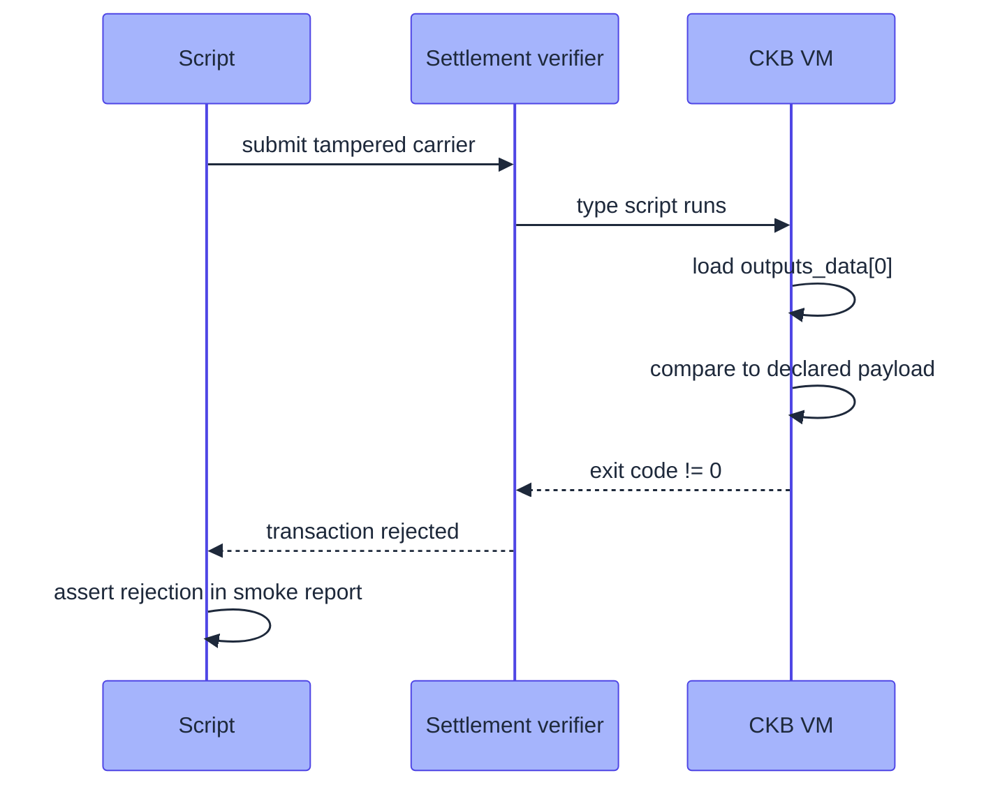

# Local CKB devnet smoke

`scripts/myelin_ckb_devnet_smoke.sh` is the live-chain counterpart
to the production gate. It starts a parent CKB devnet, deploys
four exact upstream CellScript v0.22.0 verifier artifacts, submits real transitions, and verifies
that the chain actually accepts (or rejects) the right transactions.

This page walks through what it does and what it proves.

## What "live CKB devnet" means here

A CKB devnet is a local Nervos CKB node using a configurable integration specification.
It exposes a JSON-RPC endpoint on `127.0.0.1:8114` by default. The
It runs the real CKB node and VM implementation, but its genesis,
consensus parameters, built-in Cells, mining, and economics are not
mainnet evidence.

For the Myelin smoke, the devnet is started from the parent
`../ckb` checkout (or via OffCKB). It mines an "always success"
funding cell, deploys the carrier verifiers, and waits for blocks.

## The script's flow


```mermaid
%%{init: {
  "theme": "base",
  "themeVariables": {
    "primaryColor": "#A5B4FC",
    "primaryTextColor": "#1E293B",
    "primaryBorderColor": "#4F46E5",
    "lineColor": "#6366F1",
    "secondaryColor": "#C7D2FE",
    "tertiaryColor": "#C7D2FE"
  }
}}%%
flowchart TB
    A["Start CKB devnet<br/>(parent checkout or OffCKB)"]:::dev
    B["Mine always-success<br/>funding cell"]:::dev
    C["Deploy DA-anchor<br/>CellScript carrier verifier"]:::dev
    D["Deploy settlement<br/>CellScript carrier verifier"]:::dev
    E["Write 160-byte<br/>DA-anchor carrier payload"]:::sm
    F["Write 160-byte<br/>settlement carrier payload"]:::sm
    G["Full-node precheck + submit + observe<br/>(myelin session carrier-submission)"]:::sm
    H["Mine carriers<br/>until committed"]:::dev
    I["Run readiness chain<br/>(context/economics/<br/>inclusion/stability/finality)"]:::sm
    J["Submit tampered carrier<br/>(must be REJECTED)"]:::sm
    K["Deploy final DA +<br/>final settlement verifiers"]:::dev
    L["Submit final-script<br/>transactions"]:::sm
    M["Emit<br/>myelin-ckb-devnet-smoke<br/>report"]:::out

    A --> B --> C --> D
    C --> E
    D --> F
    E --> G
    F --> G
    G --> H --> I
    I --> J
    J --> K --> L --> M

    classDef dev fill:#C7D2FE,stroke:#7C3AED,color:#1E293B;
    classDef sm  fill:#C7D2FE,stroke:#4F46E5,color:#1E293B;
    classDef out fill:#C7D2FE,stroke:#7C3AED,color:#1E293B;
```

## The two carrier verifiers

Two CellScript carrier verifiers are deployed:

```text
DA-anchor carrier verifier:
  - type script args: ckb_data_hash(carrier_payload) || carrier_identity_hash
  - outputs[0].type  : must match the carrier verifier
  - outputs_data[0]  : must equal carrier_payload
  - carrier_identity_hash = DA manifest hash

Settlement carrier verifier:
  - type script args: ckb_data_hash(carrier_payload) || carrier_identity_hash
  - outputs[0].type  : must match the settlement verifier
  - outputs_data[0]  : must equal carrier_payload
  - carrier_identity_hash = settlement intent hash
```

Each carrier carries a **160-byte compact payload** and uses
`data2` for both CellScript verifier type scripts.

The settlement carrier is funded from the DA carrier's change
output — proving the live Cell-replacement chain works end-to-end.

## What the readiness chain checks

After submission, the script runs the same five-step readiness
chain documented in [L1 submission
flow](../interactions/submission-flow.md):

```text
verify-submission-context      -> get_live_cell for inputs and deps
verify-submission-economics    -> input capacity, output capacity, fee
verify-submission-inclusion    -> get_transaction committed
verify-submission-stability    -> re-query, block identity unchanged
verify-submission-finality     -> confirmation depth reached
verify-submission-readiness    -> aggregate all five
```

For carrier submissions specifically, the **inclusion** verifier
additionally asserts:

```text
outputs_data[0]            == declared carrier payload
outputs[0].type.args       == expected data-hash + identity layout
```

This is what catches tampered carriers even after `get_transaction`
returns `committed`.

## The tampered-carrier rejection

After the valid carriers are committed, the script submits a
**tampered compact payload** under the settlement verifier. The
expected behaviour:


```mermaid
%%{init: {
  "theme": "base",
  "themeVariables": {
    "primaryColor": "#A5B4FC",
    "primaryTextColor": "#1E293B",
    "primaryBorderColor": "#4F46E5",
    "lineColor": "#6366F1",
    "secondaryColor": "#C7D2FE",
    "tertiaryColor": "#C7D2FE"
  }
}}%%
sequenceDiagram
    participant S as Script
    participant V as Settlement verifier
    participant C as CKB VM

    S->>V: submit tampered carrier
    V->>C: type script runs
    C->>C: load outputs_data[0]
    C->>C: compare to declared payload
    C-->>V: exit code != 0
    V-->>S: transaction rejected
    S->>S: assert rejection in smoke report
```

If the tampered carrier is accepted, the script fails — that's a
real protocol bug, not a flaky test.

## Final-script strictness

After the compact-payload carriers pass, the script deploys the
**final** DA and final settlement CellScript verifiers. These are
stricter:

```text
final DA verifier            -> stricter than carrier DA verifier
final settlement verifier   -> must consume a one-use authority Cell
                                 checks final DA publication as read-only CellDep
                                 rejects same-type inputs
                                 rejects duplicate same-type group outputs
                                 rejects any second output in the same tx
                                 using the same deployed code hash/hash type
```

The transaction-local singleton creation + cross-transaction
replay protection (through the consumed authority Cell) is the
**current CKB-compatible anti-replay model**.

The script resolves the exact `ckb-system-scripts` 0.6.0 multisig-v2 binary
from the locked CellScript toolchain, verifies its data hash, and injects that
binary plus an ordered secp-data/multisig-v2 DepGroup into the parent CKB
integration genesis. Session final DA and final settlement locks use
`hash_type=data1`.

After the node starts, the smoke derives checked deployment evidence from the
live genesis Cells, binds it into the Session package, and requires
`ckb_enforceable = true` for the devnet authority without claiming public
testnet or production readiness. The final settlement consumes the canonical
multisig-v2 authority Cell, verifies the 2-of-3 witness, and exposes an
`authority_threshold_lock_deployment_checked` marker only after the live lock
DepGroup, final DA Cell, and authority Cell all match.

## Court economics deployment

Settlement intents carry a recomputable `court_economics` policy
commitment over:

```text
participant/escrow binding
locally signature-verified DA committee availability evidence
challenge timing
minimum dispute bond
slash/reward basis points
refund/remainder balance
deadline-only settlement
required DA evidence
```

This makes disputed-close economics locally checkable. An optional
`--court-economics-deployment-evidence` file binds a checked CKB
court verifier deployment (audited source/report hashes + the
exact disputed-close economics commitment) before
`production_ready` can be true.

Without it, the intent stays at the testnet-beta level.

## The report

The script emits `myelin-ckb-devnet-smoke`, which proves:

```text
devnet CKB acceptance            -> true
deployed compact-payload type-script execution -> true
final-script strict readiness    -> true
live rejection of mismatched carrier data -> true
live rejection of competing final-settlement output probe -> true
```

The report also records the actual block hashes, transaction
hashes, type args, and output data for every committed and rejected
transition. Re-query requires preserving the ephemeral devnet data
directory; the report alone remains an audit artifact, not a durable
public-chain locator.

## What this smoke does NOT prove

- **Not permissionless validator entry.** The smoke runs the
  static-committee path; Tendermint is in the production gate but
  the smoke uses static.
- **Not production DA.** External DA SLA receipts are out of scope.
  Submission acceptance is reported separately; `l1_da_published`
  is not inferred from mempool admission.
- **Not mainnet.** The devnet is a local node. Mainnet submission
  is a separate decision.

## Running it yourself

```bash
# Normally run through the production gate, which reproduces CellScript first.
RUN_TEEWORLDS=0 scripts/myelin_production_gate.sh
```

The script exits non-zero on any failure. The output report is
written beneath its temporary `WORKDIR` (or the explicitly configured
`REPORT` path).

## Where to go next

- [L1 submission flow](../interactions/submission-flow.md) — the
  five-step readiness chain in detail.
- [Production gate](production-gate.md) — the local gate this
  smoke complements.
- [Claim ladder](../security/claim-ladder.md) — what the devnet
  smoke actually proves about Myelin's claim level.
