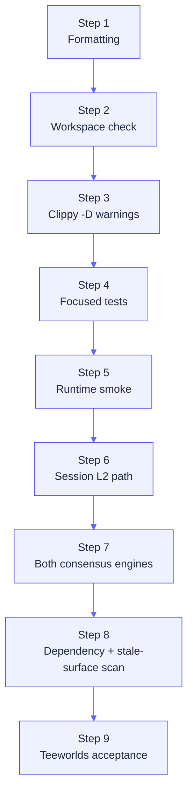

# Production gate

`scripts/myelin_production_gate.sh` is the top-level local release
gate for Myelin. It runs formatting, lint, workspace tests, runtime
smoke, both consensus engines' session paths, dependency and
stale-surface scans, and the Teeworlds acceptance gate. This page
walks through what each step does and what it's checking for.

## Running it

```bash
scripts/myelin_production_gate.sh
```

The script writes its outputs to `reports/`. It exits non-zero on
any failure. Each step writes a JSON file with what it measured
and what it asserted.

## What the gate covers



The order matters: each later step assumes the earlier ones
passed. If you want to debug a single step, every subcommand it
runs is also runnable in isolation from the CLI.

## Step 1 — Formatting

```bash
cargo fmt --all --check
```

`cargo fmt` is the Rust formatter. `--check` makes it exit non-zero
if any file would be reformatted. The gate doesn't auto-fix;
auto-fix is your job.

## Step 2 — Workspace check

```bash
cargo check --locked --workspace --all-targets
```

`--locked` keeps the lockfile honest (no surprise dependency
upgrades during a gate). `--all-targets` includes tests, benches,
and examples — not just the library code.

## Step 3 — Clippy

```bash
cargo clippy --locked --workspace --all-targets -- -D warnings
```

Clippy is Rust's lint suite. `-D warnings` makes any warning a
hard error. This is the gate that catches "looks fine but smells
wrong" code.

## Step 4 — Focused tests

```bash
cargo test --locked \
  -p myelin-hashes \
  -p myelin-math \
  -p myelin-exec \
  -p myelin-consensus \
  -p myelin-state \
  -p myelin-mempool \
  -p myelin-cli
```

These crates are the kernel. The gate runs their tests
sequentially and asserts each one passes. The `--locked` flag
keeps the dependency graph stable.

## Step 5 — Runtime smoke

```bash
cargo run -p myelin-cli -- runtime smoke
```

The smoke command exercises the runtime spine: a small CellTx
batch through mempool → scheduler → verifier → state. It asserts
the resulting state root matches what was advertised and the
projection report has no deviation flags.

## Step 6 — Session L2 path

The gate runs the full session lifecycle for one open / commit /
court / DA / settlement / package sequence. The exact commands:

```text
session open-fixture           (both consensus engines)
session commit-fixture
session court-bundle
session verify-court-bundle
session da-manifest
session verify-da-manifest
session da-anchor-package
session verify-da-anchor-package
session submit-da-anchor-package  (dry-run)
session verify-submission-context
session verify-submission-economics
session verify-submission-inclusion
session verify-submission-stability
session verify-submission-finality
session verify-submission-readiness
session settlement-intent
session verify-settlement-intent
session settlement-package
session verify-settlement-package
session submit-settlement-package  (dry-run)
(plus the matching submission readiness chain for settlement)
```

Each step asserts the previous step's report hash. A break in
the chain is a hard gate failure.

## Step 7 — Both consensus engines

Step 6 runs once per consensus engine. The gate asserts:

- Same `session_id`.
- Same `ordered_cell_tx_commitments`.
- Same `scheduler_commitment`.
- Same `state_root_before` / `state_root_after`.
- Different `consensus_kind` and different certificate shape.

This is the proof that the trait abstraction actually works: the
choice of finality doesn't leak into the rest of the runtime.

## Step 8 — Dependency and stale-surface scan

Two checks:

```text
scripts/check_cellscript_parent_parity.py
scripts/myelin_stale_surface_scan.sh        # (if present)
```

The first compares the vendored `cellscript/` tree against the
parent `../CellScript` checkout. Any unexpected divergence fails
the gate.

The second scans the kernel for legacy vocabulary, old branding,
or any code paths that don't fit the current protocol shape.

## Step 9 — Teeworlds acceptance

```bash
scripts/myelin_teeworlds_acceptance.sh
```

The narrower Teeworlds acceptance gate. It:

1. Regenerates the scripted tape.
2. Invokes xxuejie's fixture builder.
3. Runs Myelin `teeworlds build-fixture`, `vm-probe`, `court-bundle`,
   and `verify-court-bundle`.
4. Asserts every JSON output is `ckb-compatible`,
   `projection_possible: true`, `vm_profile: ckb-strict-basic`,
   `court_verifiable: true`, and finalised by the static committee.

If the cloned Teeworlds repo is missing, this step is skipped with
a warning (not a failure). To run it, follow the
[install steps](../getting-started/install.md#4-optional-local-ckb-devnet-for-live-smoke-tests)
for the Teeworlds checkout.

## What the gate produces

The gate leaves behind a directory of JSON reports. Each one is
auditable on its own:

```text
reports/
├── simple-report.json
├── session-open.json
├── session-open-tendermint.json
├── session-commit.json
├── session-commit-tendermint.json
├── session-court-bundle.json
├── session-court-verify.json
├── session-da-manifest.json
├── session-da-verify.json
├── session-da-anchor-package.json
├── session-da-anchor-verify.json
├── session-da-anchor-submit.json
├── session-da-anchor-context.json
├── session-da-anchor-economics.json
├── session-da-anchor-inclusion.json
├── session-da-anchor-stability.json
├── session-da-anchor-finality.json
├── session-da-anchor-readiness.json
├── session-settlement-intent.json
├── session-settlement-verify.json
├── session-settlement-package.json
├── session-settlement-package-verify.json
├── session-settlement-submit.json
├── session-settlement-context.json
├── session-settlement-economics.json
├── session-settlement-inclusion.json
├── session-settlement-stability.json
├── session-settlement-finality.json
└── session-settlement-readiness.json
```

For the Teeworlds path (if the cloned repo is present):

```text
reports/
├── teeworlds-build-fixture.json
├── teeworlds-vm-probe.json
├── teeworlds-court-bundle.json
├── teeworlds-court-bundle-verify.json
└── teeworlds-doctor.json
```

## What the gate does *not* do

- **Doesn't run a live CKB devnet.** For that, see
  [Local CKB devnet smoke](devnet-smoke.md).
- **Doesn't submit to mainnet.** All submission steps run as
  dry-run; only the request construction is verified.
- **Doesn't test permissionless validator entry.** Both finality
  engines are configured; no stake / slash / identity work is
  asserted.

These boundaries are deliberate. The gate proves "the kernel
runs end-to-end and produces consistent reports." Beyond that, the
live chain evidence is its own path.

## Where to go next

- [CLI reference](cli.md) — what each subcommand takes and emits.
- [Local CKB devnet smoke](devnet-smoke.md) — the live chain path.