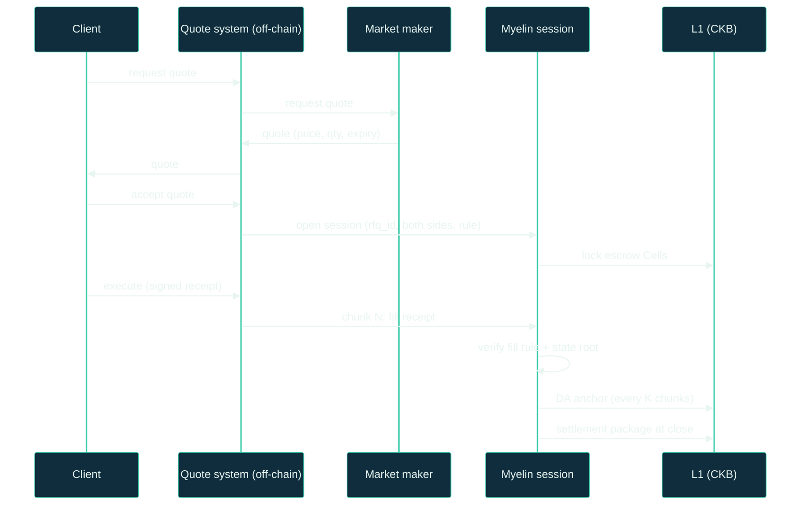

# Pattern: RFQ / market-maker settlement

**Shape.** Off-chain quote negotiation, signed receipts,
deterministic settlement rule. The Myelin session is the
post-trade settlement layer; the quote negotiation happens outside
it.

## Why this fits Myelin

A request-for-quote (RFQ) workflow with market-maker settlement
has a clear shape:

```text
- bilateral or limited-multi-party negotiation
- signed receipts (the quote, the accept, the confirm)
- deterministic settlement rule (e.g. fill at the agreed price)
- dispute path (one filled receipt is challengeable)
```

The Myelin session handles the **settlement side**:

- The session opens when the RFQ is agreed.
- Each filled receipt becomes a chunk CellTx.
- The settlement rule (e.g. "fill at price P if executed within
  time T") runs deterministically in the CKB-VM-style verifier.
- A disputed fill is a court bundle ready for single-chunk
  verification.

## The session shape

```text
session_id          -> rfq_id || counterparty_set_hash
participants        -> [client, market_maker]
escrow              -> pre-funded Cells from both sides
max_chunk_bytes     : ~64 KB (one receipt + audit data)
max_cycles          : VM budget per fill-rule script
```



## What a chunk looks like

A chunk represents one fill against the agreed quote. Inside:

```text
witness[0]          -> signature from the executor (client or MM)
witness[1]          -> fill receipt (qty, price, venue, timestamp)
witness[2]          -> prior chunk's state root
witness[3]          -> audit trail (signed order, signed accept)
```

The fill-rule script:

1. Verifies the executor's signature.
2. Verifies the fill receipt against the original quote.
3. Checks the timestamp is within the quote's expiry.
4. Updates the session state (e.g. fill count, average price).
5. Emits the execution report.

## Conflict domain keying

```text
conflict_key("rfq/{rfq_id}/receipt/{receipt_id}")
```

This prevents double-counting of the same receipt and isolates
fills across RFQs.

## Determinism of the fill rule

The fill rule is encoded as a CellScript type script. Because the
rule is deterministic:

- Given the same fill receipt, the same state root transition.
- Given the same state root, the same settlement CellTx.
- A court can replay the chunk in CKB-VM and compare.

This is what makes RFQ settlement Myelin-appropriate: the dispute
is *always* answerable.

## A reference implementation sketch

```rust
use myelin_exec::celltx::{CellTx, CellTxBuilder};

fn build_fill_chunk(
    rfq_id: [u8; 32],
    receipt_id: [u8; 32],
    fill_receipt: Vec<u8>,
    executor_signature: [u8; 64],
    audit_trail: Vec<u8>,
) -> CellTx {
    CellTxBuilder::new()
        .witnesses(vec![
            executor_signature.to_vec(),
            fill_receipt,
            prior_state_root,
            audit_trail,
        ])
        .cell_deps(vec![fill_rule_script_dep()])
        .build()
        .expect("RFQ fill chunk CellTx build")
}
```

The `fill_rule_script_dep()` references the CellScript type
script that encodes the fill rule.

## What disputes look like

A dispute is always one of:

| Dispute | What the court checks |
| --- | --- |
| **Wrong fill price** | The fill receipt's price matches the agreed quote's price. |
| **Stale fill** | The fill timestamp is within the quote's expiry. |
| **Wrong qty** | The fill qty is at most the quote's qty. |
| **Wrong venue** | The fill venue is one the quote permitted. |
| **Double-counted** | The receipt_id is unique within the session. |

Each one is a deterministic check that the CKB-VM-style verifier
can run. The court bundle is the input; the verdict is the output.

## The honesty boundary

Myelin can produce:

- ✅ The fill-rule script that runs deterministically.
- ✅ Per-fill CellTx reports with projection status.
- ✅ A court bundle for any disputed fill.

Myelin does **not** ship:

- The quote system — that's a separate component (often a
  matching engine or a bilateral API).
- The order-routing layer.
- The market data.

If you have a quote system already, Myelin slots in as the
settlement layer. If you don't, Myelin won't build one for you.

## Where the boundary is honest

For market-maker settlement specifically, three things matter:

1. **Quote freshness.** The quote must be fresh when the fill
   happens. The fill-rule script enforces this.
2. **Fill audit.** Every fill carries an audit trail that the
   dispute path can replay.
3. **Counterparty risk.** The pre-funded escrow mitigates
   counterparty risk for the agreed size; the court path handles
   disputed fills.

Myelin optimises for cases where all three are clear.

## Where to go next

- [Pattern: streaming payments](streaming-payments.md) — a
  similar shape with a different content.
- [Court path](../interactions/court-path.md) — the dispute deep
  dive.
- [Fiber Network bridge](../integrations/fiber.md) — for the
  case where the market-maker settlement runs over Fiber.